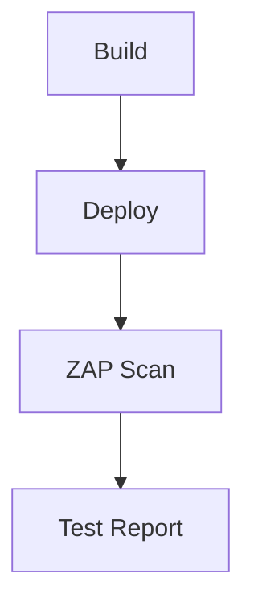
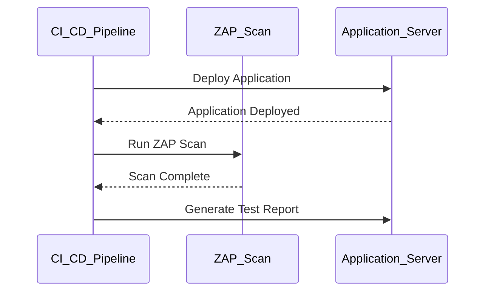

## Introduction to Dynamic Application Security Testing (DAST)

Dynamic Application Security Testing (DAST) is a method of testing that involves analyzing the behavior of a running application to identify security vulnerabilities. This type of testing is performed against a live system, typically in a staging or production environment. DAST tools simulate attacks on the application to check for vulnerabilities such as SQL injection, cross-site scripting (XSS), and others. One of the most widely used open-source DAST tools is the OWASP Zed Attack Proxy (ZAP).

### OWASP Zed Attack Proxy (ZAP)

OWASP ZAP is a powerful and widely used tool for identifying security issues in web applications. It can be used for scanning both web applications and APIs through dynamic analysis. ZAP is designed to be flexible and can be integrated into various environments, including continuous integration and deployment (CI/CD) pipelines.

#### Why Use ZAP?

- **Open Source**: ZAP is free and open-source, making it accessible to a wide range of users.
- **Flexibility**: It supports a variety of testing scenarios, including manual testing, automated testing, and integration with CI/CD pipelines.
- **Extensive Features**: ZAP offers a wide range of features, including active and passive scanning, session management, and support for various authentication mechanisms.

### Integrating ZAP into CI/CD Pipelines

To integrate ZAP into a CI/CD pipeline, you can use the official Docker image provided by OWASP. This allows you to run ZAP scans as part of your automated build process. Here’s how you can set up ZAP in your CI/CD pipeline:

#### Step 1: Define the Stage

First, you need to define a stage in your CI/CD pipeline where the ZAP scan will be executed. This stage should run after the application has been deployed to the test environment. This ensures that the application is up and running before the scan begins.

```yaml
stages:
  - build
  - deploy
  - test
```

In this example, the `test` stage will run after the `deploy` stage.

#### Step 2: Add Dependency

Ensure that the ZAP scan stage depends on the deployment stage being completed. This can be done using the `needs` keyword in your CI/CD configuration.

```yaml
stages:
  - build
  - deploy
  - test

deploy:
  stage: deploy
  script:
    - echo "Deploying application..."

zap-scan:
  stage: test
  needs: ["deploy"]
  script:
    - echo "Running ZAP scan..."
```

#### Step 3: Use the Official Docker Image

The official Docker image for ZAP can be found at `owasp/zap2docker-stable`. You can use this image to run ZAP scans in your pipeline.

```yaml
zap-scan:
  stage: test
  needs: ["deploy"]
  services:
    - name: owasp/zap2docker-stable
      alias: zap
  script:
    - zap-baseline.py -t http://localhost:8080 -r report.html
```

In this example, the `zap-baseline.py` script is used to perform a baseline scan of the application running on `http://localhost:8080`.

### Configuring the ZAP Scan

The main part of the ZAP scan is configuring the script that will run the scan. The `zap-baseline.py` script is a commonly used tool for performing baseline scans with ZAP. Here’s a detailed breakdown of how to configure and run the scan:

#### Baseline Scan

A baseline scan is a basic scan that identifies security issues passively. This means that ZAP will analyze the application without actively injecting malicious payloads. This type of scan is useful for quickly identifying potential vulnerabilities.

```bash
zap-baseline.py -t http://localhost:8080 -r report.html
```

- `-t`: Specifies the target URL of the application.
- `-r`: Specifies the output report file.

### Real-World Examples

Let’s consider a recent real-world example where DAST was used to identify a critical vulnerability. In 2021, a major e-commerce platform was found to have a SQL injection vulnerability in their search functionality. This vulnerability was identified using a DAST tool similar to ZAP.

#### Example Vulnerability: SQL Injection

SQL injection is a common vulnerability where an attacker can inject malicious SQL queries into an application’s database. This can lead to unauthorized access to sensitive data or even complete control of the database.

```sql
SELECT * FROM users WHERE username = '$username' AND password = '$password';
```

If `$username` and `$password` are not properly sanitized, an attacker can inject SQL code to bypass authentication.

#### How to Prevent SQL Injection

To prevent SQL injection, you should use parameterized queries or prepared statements. Here’s an example of how to securely handle user input in a database query:

```python
import sqlite3

def get_user(username, password):
    conn = sqlite3.connect('database.db')
    cursor = conn.cursor()
    
    # Using parameterized query
    cursor.execute("SELECT * FROM users WHERE username = ? AND password = ?", (username, password))
    user = cursor.fetchone()
    
    conn.close()
    return user
```

### Detailed Example: Running ZAP Scan

Let’s walk through a detailed example of setting up and running a ZAP scan in a CI/CD pipeline.

#### Step 1: Define the CI/CD Configuration

Here’s a complete example of a `.gitlab-ci.yml` file that defines the stages and integrates ZAP:

```yaml
stages:
  - build
  - deploy
  - test

build:
  stage: build
  script:
    - echo "Building application..."

deploy:
  stage: deploy
  script:
    - echo "Deploying application..."

zap-scan:
  stage: test
  needs: ["deploy"]
  services:
    - name: owasp/zap2docker-stable
      alias: zap
  script:
    - zap-baseline.py -t http://localhost:8080 -r report.html
```

#### Step 2: Run the ZAP Scan

When the pipeline runs, the `zap-scan` job will execute after the `deploy` job completes. The ZAP scan will be performed against the application running on `http://localhost:8080`, and the results will be saved in `report.html`.

### Common Pitfalls and Best Practices

#### Common Pitfalls

- **Incomplete Coverage**: Ensure that the ZAP scan covers all parts of the application, including different endpoints and user roles.
- **False Positives**: ZAP may generate false positives. Review the scan results carefully to distinguish between actual vulnerabilities and false positives.
- **Configuration Errors**: Incorrect configuration of ZAP can lead to incomplete or inaccurate scans. Always review the ZAP configuration and ensure it matches your application’s requirements.

#### Best Practices

- **Regular Scans**: Perform regular DAST scans as part of your CI/CD pipeline to catch vulnerabilities early.
- **Automated Remediation**: Integrate automated remediation steps into your pipeline to address vulnerabilities identified by DAST.
- **Security Training**: Provide security training to developers to ensure they understand common vulnerabilities and how to prevent them.

### How to Prevent / Defend

#### Detection

To detect vulnerabilities identified by DAST, review the scan reports generated by ZAP. These reports provide detailed information about the vulnerabilities found, including the affected endpoints and the types of vulnerabilities.

#### Prevention

To prevent vulnerabilities, follow these best practices:

- **Secure Coding Practices**: Implement secure coding practices, such as input validation, parameterized queries, and proper error handling.
- **Regular Updates**: Keep your application and dependencies up to date to mitigate known vulnerabilities.
- **Security Testing**: Regularly perform security testing, including both static and dynamic analysis, to identify and address vulnerabilities.

#### Secure Code Fix

Here’s an example of how to fix a vulnerability identified by ZAP:

##### Vulnerable Code

```python
import sqlite3

def get_user(username, password):
    conn = sqlite3.connect('database.db')
    cursor = conn.cursor()
    
    # Insecure query
    cursor.execute(f"SELECT * FROM users WHERE username = '{username}' AND password = '{password}'")
    user = cursor.fetchone()
    
    conn.close()
    return user
```

##### Fixed Code

```python
import sqlite3

def get_user(username, password):
    conn = sqlite3.connect('database.db')
    cursor = conn.cursor()
    
    # Using parameterized query
    cursor.execute("SELECT * FROM users WHERE username = ? AND password = ?", (username, password))
    user = cursor.fetchone()
    
    conn.close()
    return user
```

### Conclusion

Integrating DAST tools like ZAP into your CI/CD pipeline is essential for identifying and addressing security vulnerabilities early in the development cycle. By following best practices and regularly reviewing scan results, you can significantly improve the security of your web applications.

### Practice Labs

For hands-on practice with integrating DAST into CI/CD pipelines, consider the following labs:

- **PortSwigger Web Security Academy**: Offers interactive labs for learning web security concepts, including DAST.
- **OWASP Juice Shop**: A deliberately insecure web application for practicing security testing.
- **DVWA (Damn Vulnerable Web Application)**: Another intentionally vulnerable web application for security testing.

These labs provide practical experience in identifying and fixing vulnerabilities using DAST tools like ZAP.

### Mermaid Diagrams

#### CI/CD Pipeline with ZAP Scan



This diagram illustrates the flow of a CI/CD pipeline that includes a ZAP scan after deployment.

#### ZAP Scan Process



This sequence diagram shows the process of running a ZAP scan as part of a CI/CD pipeline.

By following these detailed steps and best practices, you can effectively integrate DAST into your CI/CD pipeline to enhance the security of your web applications.

---
<!-- nav -->
[[02-Introduction to Dynamic Application Security Testing (DAST) Part 2|Introduction to Dynamic Application Security Testing (DAST) Part 2]] | [[DevSecOps/DevSecOps Bootcamp/05-Application Security Testing/10-Secure Continuous Deployment & DAST/Configure Automated DAST Scans in CICD Pipeline/00-Overview|Overview]] | [[04-Introduction to Secure Continuous Deployment and Dynamic Application Security Testing (DAST) Part 1|Introduction to Secure Continuous Deployment and Dynamic Application Security Testing (DAST) Part 1]]
