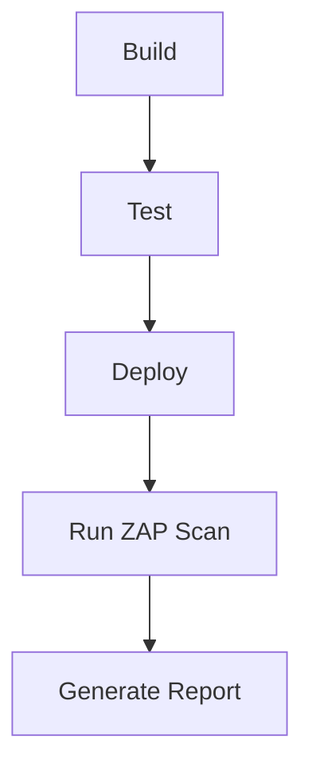
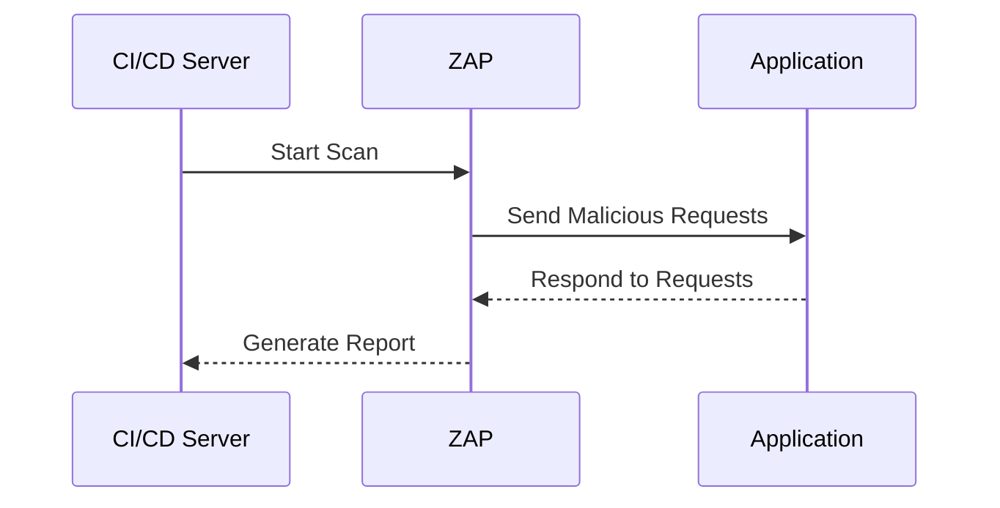

## Introduction to Secure Continuous Deployment and Dynamic Application Security Testing (DAST)

Dynamic Application Security Testing (DAST) is a critical component of modern DevSecOps practices. It involves automated tools that simulate attacks on a live application to identify vulnerabilities. This chapter will delve into configuring automated DAST scans within a Continuous Integration/Continuous Deployment (CI/CD) pipeline using OWASP Zed Attack Proxy (ZAP).

### Background Theory

#### What is DAST?

Dynamic Application Security Testing (DAST) is a type of security testing performed on a running instance of an application. Unlike Static Application Security Testing (SAST), which analyzes the source code, DAST simulates real-world attacks to find vulnerabilities such as SQL injection, cross-site scripting (XSS), and others.

#### Why Use DAST?

DAST is essential because it helps identify vulnerabilities that might not be caught by static analysis alone. By simulating actual attacks, DAST provides a more comprehensive view of the application's security posture. This is particularly important in a DevSecOps environment where continuous integration and deployment are standard practices.

#### How Does DAST Work?

DAST tools interact with the application through its user interface, sending various types of malicious inputs to test for vulnerabilities. These tools typically include features such as:

- **Automated Scanning**: Tools like ZAP can automatically scan an application for known vulnerabilities.
- **Customizable Policies**: Users can define specific policies to tailor the scanning process to their application's needs.
- **Reporting**: Detailed reports are generated to help developers understand and address the identified issues.

### Configuring Automated DAST Scans in CI/CD Pipeline

To integrate DAST into your CI/CD pipeline, you need to configure the pipeline to run DAST scans after each deployment. This ensures that your application remains secure throughout its development lifecycle.

#### Setting Up ZAP in Your Pipeline

OWASP ZAP is a popular open-source DAST tool. To set it up in your CI/CD pipeline, follow these steps:

1. **Install ZAP**: Ensure ZAP is installed on your CI/CD server. You can install it via package managers like `apt` or `brew`.

    ```bash
    sudo apt-get update
    sudo apt-get install zaproxy
    ```

2. **Configure ZAP Script**: Create a script to automate the ZAP scanning process. This script should start ZAP, configure it, and run the scan.

    ```bash
    #!/bin/bash
    zap.sh -cmd -port 8080 -config api.key=your_api_key -addoninstall owasp-zap-api-python -addoninstall owasp-zap-baseline -addoninstall owasp-zap-dast -script zap_baseline.py -url http://localhost:8080/
    ```

3. **Integrate with CI/CD Pipeline**: Add the ZAP script to your CI/CD pipeline. This can be done using a `.gitlab-ci.yml` file for GitLab pipelines.

    ```yaml
    stages:
      - build
      - test
      - deploy

    build:
      stage: build
      script:
        - docker build -t myapp .

    test:
      stage: test
      script:
        - ./zap.sh

    deploy:
      stage: deploy
      script:
        - docker push myapp
        - kubectl apply -f deployment.yaml
    ```

### Running Baseline vs Full Scans

In the provided transcript, the lecturer mentions running both baseline and full scans. Understanding the difference between these two types of scans is crucial.

#### Baseline Scan

A baseline scan is a quick scan that checks for common vulnerabilities. It is useful for initial assessments but may miss some deeper issues.

```bash
# Baseline Scan Script
zap.sh -cmd -port 8080 -config api.key=your_api_key -addoninstall owasp-zap-api-python -addoninstall owasp-zap-baseline -script zap_baseline.py -url http://localhost:8080/
```

#### Full Scan

A full scan is a more thorough scan that checks for a wider range of vulnerabilities. It takes longer but provides a more comprehensive assessment.

```bash
# Full Scan Script
zap.sh -cmd -port  8080 -config api.key=your_api_key -addoninstall owasp-zap-api-python -addoninstall owasp-zap-full-scan -script zap_full_scan.py -url http://localhost:8080/
```

### Example: Running Full Scans Instead of Baseline Scans

Let's walk through an example of how to switch from a baseline scan to a full scan in your CI/CD pipeline.

1. **Modify the Script**: Change the script to run a full scan instead of a baseline scan.

    ```bash
    # Original Baseline Scan Script
    zap.sh -cmd -port 8080 -config api.key=your_api_key -addoninstall owasp-zap-api-python -addoninstall owasp-zap-baseline -script zap_baseline.py -url http://localhost:8080/

    # Modified Full Scan Script
    zap.sh -cmd -port 8080 -config api.key=your_api_key -addoninstall owasp-zap-api-python -addoninstall owasp-zap-full-scan -script zap_full_scan.py -url http://localhost:8080/
    ```

2. **Update the Report Name**: Rename the report to ensure consistency regardless of the scan type.

    ```bash
    # Original Report Name
    zap.sh -cmd -port 8080 -config api.key=your_api_key -addoninstall owasp-zap-api-python -addoninstall owasp-zap-baseline -script zap_baseline.py -reportname zap_baseline_report.xml -url http://localhost:8080/

    # Updated Report Name
    zap.sh -cmd -port 8080 -config api.key=your_api_key -addoninstall owasp-zap-api-python -addoninstall owasp-zap-full-scan -script zap_full_scan.py -reportname zap.xml -url http://localhost:8080/
    ```

3. **Commit Changes**: Commit the changes to your repository to trigger the new pipeline.

    ```bash
    git add .
    git commit -m "Switch to full ZAP scan"
    git push origin main
    ```

### Handling Pipeline Failures Due to Disk Space

One common issue in CI/CD pipelines is running out of disk space, especially during image builds. To mitigate this, regularly clean up old images and ensure sufficient disk space.

1. **Check Disk Space**: Regularly check the disk space on your CI/CD server.

    ```bash
    df -h
    ```

2. **Clean Up Old Images**: Remove old Docker images to free up space.

    ```bash
    docker system prune -a
    ```

### Real-World Examples and Recent Breaches

Recent breaches often highlight the importance of DAST. For example, the Capital One breach in 2019 exposed sensitive customer data due to misconfigured web applications. A regular DAST scan could have helped identify and mitigate such vulnerabilities.

### How to Prevent / Defend

#### Detection

Regular DAST scans can help detect vulnerabilities. Ensure that your CI/CD pipeline includes automated DAST scans to catch issues early.

#### Prevention

1. **Secure Coding Practices**: Follow secure coding guidelines to minimize vulnerabilities.
2. **Configuration Hardening**: Harden your application's configurations to reduce attack surfaces.
3. **Regular Updates**: Keep your dependencies and frameworks up-to-date to patch known vulnerabilities.

#### Secure-Coding Fixes

Compare the vulnerable code with the secure version:

**Vulnerable Code:**
```python
@app.route('/login', methods=['POST'])
def login():
    username = request.form['username']
    password = request.form['password']
    if authenticate(username, password):
        return "Login successful"
    else:
        return "Login failed"
```

**Secure Code:**
```python
@app.route('/login', methods=['POST'])
def login():
    username = request.form.get('username')
    password = request.form.get('password')
    if authenticate(username, password):
        return "Login successful"
    else:
        return "Login failed", 401
```

### Complete Example: Full HTTP Request and Response

Here’s a complete example of a full HTTP request and response for a DAST scan:

**HTTP Request:**
```http
POST /zap/scan HTTP/1.1
Host: localhost:8080
Content-Type: application/json
Authorization: ApiKey your_api_key

{
  "url": "http://localhost:8080",
  "scanType": "full"
}
```

**HTTP Response:**
```http
HTTP/1.1 200 OK
Content-Type: application/json

{
  "status": "success",
  "message": "Scan started successfully",
  "scanId": "12345"
}
```

### Mermaid Diagrams

#### Pipeline Topology



#### Sequence Diagram



### Practice Labs

For hands-on practice with DAST in CI/CD pipelines, consider the following labs:

- **PortSwigger Web Security Academy**: Offers interactive labs to practice DAST techniques.
- **OWASP Juice Shop**: A deliberately insecure web application for practicing security testing.
- **DVWA (Damn Vulnerable Web Application)**: Another intentionally vulnerable web application for learning security testing.

By integrating DAST into your CI/CD pipeline, you can ensure that your application remains secure throughout its development lifecycle. Regular scans and secure coding practices are key to maintaining a robust security posture.

---
<!-- nav -->
[[04-Introduction to Secure Continuous Deployment and Dynamic Application Security Testing (DAST) Part 1|Introduction to Secure Continuous Deployment and Dynamic Application Security Testing (DAST) Part 1]] | [[DevSecOps/DevSecOps Bootcamp/05-Application Security Testing/10-Secure Continuous Deployment & DAST/Configure Automated DAST Scans in CICD Pipeline/00-Overview|Overview]] | [[06-Introduction to Secure Continuous Deployment and Dynamic Application Security Testing (DAST) Part 3|Introduction to Secure Continuous Deployment and Dynamic Application Security Testing (DAST) Part 3]]
