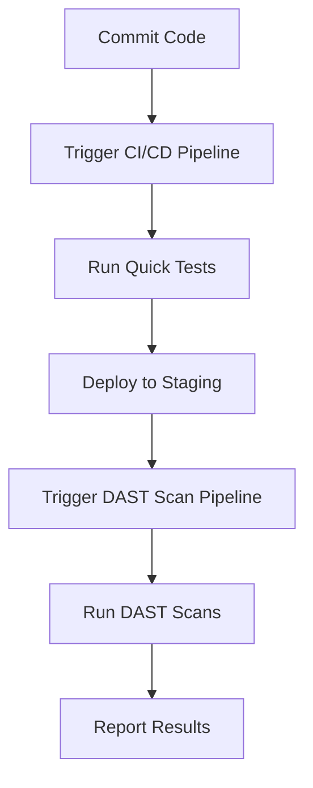

## Introduction to Secure Continuous Deployment and Dynamic Application Security Testing (DAST)

In the realm of DevSecOps, ensuring the security of applications throughout their development lifecycle is paramount. One critical aspect of this process is integrating Dynamic Application Security Testing (DAST) into the Continuous Integration and Continuous Deployment (CI/CD) pipeline. DAST tools simulate attacks on a live application to identify vulnerabilities, making them an essential component of a robust security strategy.

### What is DAST?

Dynamic Application Security Testing (DAST) is a type of security testing that involves simulating attacks on a live application to identify security vulnerabilities. Unlike Static Application Security Testing (SAST), which analyzes the source code, DAST focuses on the runtime behavior of the application. This makes DAST particularly effective at identifying issues such as SQL injection, cross-site scripting (XSS), and other runtime vulnerabilities.

### Why Use DAST in CI/CD?

Integrating DAST into the CI/CD pipeline offers several benefits:

1. **Early Detection**: By running DAST during the development phase, teams can catch and address security issues early, reducing the cost and complexity of fixing them later.
2. **Continuous Security**: Regular DAST scans ensure that new vulnerabilities are identified and addressed promptly, maintaining a high level of security throughout the application's lifecycle.
3. **Developer Feedback**: DAST results provide immediate feedback to developers, helping them understand and fix security issues as they arise.

### How Does DAST Work?

DAST tools typically work by sending various types of malicious input to the application and observing the responses. This process helps identify vulnerabilities such as:

- **SQL Injection**: Where an attacker injects SQL code into input fields to manipulate database queries.
- **Cross-Site Scripting (XSS)**: Where an attacker injects malicious scripts into web pages viewed by other users.
- **Command Injection**: Where an attacker injects commands into input fields to execute arbitrary code on the server.

### Example of a Real-World DAST Scenario

Consider the case of a recent breach involving a popular e-commerce platform. An attacker exploited a SQL injection vulnerability to gain unauthorized access to the database, stealing sensitive customer information. A DAST tool could have identified this vulnerability by simulating SQL injection attacks and alerting the development team to the issue.

### Configuring Automated DAST Scans in CI/CD Pipeline

To effectively integrate DAST into the CI/CD pipeline, it is crucial to configure automated scans that do not disrupt the developer workflow. This section will cover the steps and considerations involved in setting up DAST scans in a CI/CD pipeline.

#### Step-by-Step Configuration

1. **Choose a DAST Tool**: Select a DAST tool that suits your application's needs. Popular choices include OWASP ZAP, Burp Suite, and Acunetix.
2. **Set Up the CI/CD Pipeline**: Ensure that your CI/CD pipeline is configured to support automated testing. Tools like Jenkins, GitLab CI, and CircleCI are commonly used for this purpose.
3. **Create Separate Pipelines for Long-Running Jobs**: To avoid slowing down the developer workflow, create separate pipelines for long-running DAST scans.



#### Example Configuration Using Jenkins

Here is an example of how to configure a Jenkins pipeline to run DAST scans:

```yaml
pipeline {
    agent any

    stages {
        stage('Build') {
            steps {
                sh 'mvn clean install'
            }
        }
        stage('Quick Tests') {
            steps {
                sh 'mvn test'
            }
        }
        stage('Deploy to Staging') {
            steps {
                sh 'kubectl apply -f staging-deployment.yaml'
            }
        }
        stage('DAST Scan') {
            steps {
                script {
                    def dastScan = build job: 'DAST-Scan-Pipeline', parameters: [
                        string(name: 'APP_URL', value: 'http://staging.example.com')
                    ]
                    echo "DAST Scan Results: ${dastScan.result}"
                }
            }
        }
    }
}
```

### Handling Long-Running DAST Scans

Long-running DAST scans can significantly slow down the CI/CD pipeline if not managed properly. To mitigate this, it is recommended to run these scans in a separate pipeline that does not block the main development workflow.

#### Example of a Separate DAST Scan Pipeline

Here is an example of a separate pipeline for DAST scans:

```yaml
pipeline {
    agent any

    stages {
        stage('DAST Scan') {
            steps {
                sh 'zap-baseline.py -t http://staging.example.com -r report.html'
            }
        }
        stage('Report Results') {
            steps {
                archiveArtifacts artifacts: 'report.html', allowEmptyArchive: true
            }
        }
    }
}
```

### Comparing Baseline and Full DAST Scans

When configuring DAST scans, it is important to distinguish between baseline and full scans. Baseline scans are quicker and less comprehensive, while full scans are more thorough and time-consuming.

#### Example of Baseline vs. Full Scan Results

Here is an example of how to compare the results of a baseline and full DAST scan:

```yaml
pipeline {
    agent any

    stages {
        stage('Baseline Scan') {
            steps {
                sh 'zap-baseline.py -t http://staging.example.com -r baseline-report.html'
            }
        }
        stage('Full Scan') {
            steps {
                sh 'zap-full-scan.py -t http://staging.example.com -r full-report.html'
            }
        }
        stage('Compare Results') {
            steps {
                sh 'diff baseline-report.html full-report.html > comparison-report.html'
            }
        }
    }
}
```

### Common Pitfalls and How to Avoid Them

#### 1. False Positives

False positives are common in DAST scans, leading to unnecessary alerts and wasted time. To minimize false positives:

- **Configure the DAST Tool**: Adjust the tool's settings to reduce false positives.
- **Review Alerts**: Manually review alerts to confirm their validity.

#### 2. Performance Impact

Long-running DAST scans can impact the performance of the CI/CD pipeline. To mitigate this:

- **Use Separate Pipelines**: Run long-running scans in a separate pipeline.
- **Schedule Scans**: Schedule DAST scans during off-peak hours to minimize impact.

### How to Prevent / Defend Against DAST Vulnerabilities

#### 1. Secure Coding Practices

Implement secure coding practices to prevent common vulnerabilities:

- **Input Validation**: Validate all user inputs to prevent injection attacks.
- **Output Encoding**: Encode outputs to prevent XSS attacks.

#### 2. Configuration Hardening

Harden the application's configuration to reduce the attack surface:

- **Disable Unnecessary Features**: Disable features that are not required.
- **Limit Permissions**: Limit permissions to the minimum necessary.

#### 3. Regular Security Audits

Conduct regular security audits to identify and address vulnerabilities:

- **Automated Scans**: Use automated tools like DAST and SAST.
- **Manual Reviews**: Conduct manual reviews of critical components.

### Real-World Examples and Recent CVEs

#### 1. CVE-2021-21972

This CVE involved a SQL injection vulnerability in a popular CMS. A DAST tool could have identified this vulnerability by simulating SQL injection attacks.

#### 2. CVE-2022-22965

This CVE involved a remote code execution vulnerability in a web application framework. A DAST tool could have identified this vulnerability by simulating command injection attacks.

### Conclusion

Integrating DAST into the CI/CD pipeline is a critical step in ensuring the security of applications throughout their development lifecycle. By following the steps outlined in this chapter, teams can effectively configure and manage DAST scans to identify and address vulnerabilities early in the development process.

### Practice Labs

For hands-on experience with DAST in CI/CD pipelines, consider the following labs:

- **PortSwigger Web Security Academy**: Offers interactive labs for learning and practicing web security techniques.
- **OWASP Juice Shop**: A deliberately insecure web application for practicing security testing.
- **DVWA (Damn Vulnerable Web Application)**: A PHP/MySQL web application that is intentionally vulnerable for educational purposes.

By combining theoretical knowledge with practical experience, teams can build a robust security strategy that integrates DAST into their CI/CD pipelines effectively.

---
<!-- nav -->
[[05-Introduction to Secure Continuous Deployment and Dynamic Application Security Testing (DAST) Part 2|Introduction to Secure Continuous Deployment and Dynamic Application Security Testing (DAST) Part 2]] | [[DevSecOps/DevSecOps Bootcamp/05-Application Security Testing/10-Secure Continuous Deployment & DAST/Configure Automated DAST Scans in CICD Pipeline/00-Overview|Overview]] | [[07-Introduction to Secure Continuous Deployment and Dynamic Application Security Testing (DAST)|Introduction to Secure Continuous Deployment and Dynamic Application Security Testing (DAST)]]
