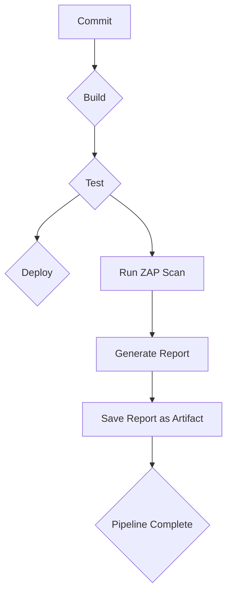
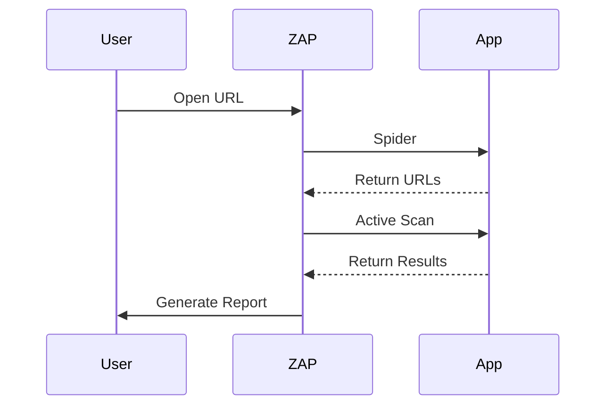

## Configuring Automated Dynamic Application Security Testing (DAST) in CI/CD Pipelines

### Introduction to DAST in CI/CD

Dynamic Application Security Testing (DAST) is a crucial component of modern DevSecOps practices. It involves testing a live application to identify security vulnerabilities by simulating attacks against the running system. Integrating DAST into your Continuous Integration/Continuous Deployment (CI/CD) pipeline ensures that security checks are performed automatically and consistently throughout the development lifecycle.

### Why Integrate DAST into CI/CD?

Integrating DAST into your CI/CD pipeline offers several benefits:

1. **Early Detection**: Identifies security issues early in the development process, reducing the cost and effort required to fix them.
2. **Consistency**: Ensures that security checks are performed consistently across all builds and deployments.
3. **Automated Reporting**: Provides automated reports that can be easily shared with stakeholders.
4. **Compliance**: Helps meet regulatory requirements by ensuring that security checks are part of the standard development process.

### Setting Up DAST in CI/CD

To integrate DAST into your CI/CD pipeline, you need to configure the necessary steps in your build and deployment scripts. This typically involves setting up a DAST tool, configuring it to scan your application, and integrating the results into your pipeline.

#### Example: Using OWASP ZAP in a CI/CD Pipeline

OWASP Zed Attack Proxy (ZAP) is a popular open-source DAST tool. Below is a detailed example of how to configure ZAP in a CI/CD pipeline using GitLab CI/CD.

### Step-by-Step Configuration

1. **Install ZAP**:
   First, ensure that ZAP is installed and available in your CI/CD environment. You can install it using Docker or package managers depending on your setup.

2. **Configure ZAP Scan**:
   Create a `.gitlab-ci.yml` file to define the CI/CD pipeline. Here’s an example configuration:

```yaml
stages:
  - test
  - deploy

zap_scan:
  stage: test
  image: owasp/zap2docker-weekly
  script:
    - zap-cli open http://localhost:8080
    - zap-cli spider http://localhost:8080
    - zap-cli active-scan http://localhost:8080
    - zap-cli report -o zap_report.html
  artifacts:
    paths:
      - zap_report.html
  allow_failure: true
```

This configuration does the following:

- Defines a `test` stage.
- Uses the `owasp/zap2docker-weekly` Docker image.
- Opens ZAP and scans the application at `http://localhost:8080`.
- Generates a report and saves it as `zap_report.html`.
- Configures the report as an artifact to be saved after the job completes.
- Allows the job to fail without stopping the pipeline.

### Understanding the Script Commands

- **`zap-cli open http://localhost:8080`**: Opens the target URL in ZAP.
- **`zap-cli spider http://localhost:8080`**: Spiders the application to discover URLs.
- **`zap-cli active-scan http://localhost:8080`**: Performs an active scan on the discovered URLs.
- **`zap-cli report -o zap_report.html`**: Generates a report and saves it as `zap_report.html`.

### Handling Job Failures

The `allow_failure: true` directive ensures that the pipeline continues even if the ZAP scan fails. This is important because you want to capture and review the results even if there are security issues.

### Exporting Report as an Artifact

The `artifacts` section specifies that the `zap_report.html` file should be saved as an artifact. This allows you to access the report after the pipeline completes.

### Example of Full HTTP Request and Response

Here is an example of a full HTTP request and response during a ZAP scan:

```http
GET / HTTP/1.1
Host: localhost:8080
User-Agent: Mozilla/5.0 (Windows NT 10.0; Win64; x64) AppleWebKit/537.36 (KHTML, like Gecko) Chrome/91.0.4472.124 Safari/537.36
Accept: text/html,application/xhtml+xml,application/xml;q=0.9,image/webp,*/*;q=0.8
Accept-Language: en-US,en;q=0.5
Accept-Encoding: gzip, deflate
Connection: keep-alive

HTTP/1.1 200 OK
Date: Mon, 01 Aug 2022 12:00:00 GMT
Server: Apache/2.4.41 (Ubuntu)
Content-Type: text/html; charset=UTF-8
Content-Length: 1234
Keep-Alive: timeout=5, max=100
Connection: Keep-Alive

<!DOCTYPE html>
<html>
<head>
<title>Home Page</title>
</head>
<body>
<h1>Welcome to the Home Page</h1>
</body>
</html>
```

### Analyzing the Report

After the pipeline runs, you can view the `zap_report.html` file to analyze the results. The report will contain details about any security issues found, including:

- **Critical Issues**: High-severity vulnerabilities that require immediate attention.
- **High-Level Issues**: Significant vulnerabilities that should be addressed promptly.
- **Warning-Level Issues**: Lower-severity issues that may still pose risks.

### Real-World Examples and Recent Breaches

Recent breaches and CVEs often highlight the importance of DAST. For example:

- **CVE-2021-44228 (Log4Shell)**: A critical vulnerability in the Log4j library that could be exploited through HTTP requests. DAST tools can help identify such vulnerabilities by simulating attacks.
- **SolarWinds Supply Chain Attack**: This attack involved malicious code being inserted into SolarWinds software updates. DAST can help detect such malicious code by scanning the application for suspicious patterns.

### How to Prevent / Defend

#### Detecting Vulnerabilities

- **Regular Scans**: Run DAST scans regularly as part of your CI/CD pipeline.
- **Automated Alerts**: Set up alerts to notify developers and security teams when vulnerabilities are detected.
- **Code Reviews**: Conduct regular code reviews to ensure that security best practices are followed.

#### Preventing Vulnerabilities

- **Secure Coding Practices**: Follow secure coding guidelines to avoid common vulnerabilities.
- **Input Validation**: Validate all user inputs to prevent injection attacks.
- **Security Headers**: Ensure that security headers like Content Security Policy (CSP) are properly configured.

#### Secure Code Fixes

Here is an example of a vulnerable code snippet and its secure version:

**Vulnerable Code**:
```python
from flask import Flask, request

app = Flask(__name__)

@app.route('/')
def index():
    return request.args.get('query', '')

if __name__ == '__main__':
    app.run()
```

**Secure Code**:
```python
from flask import Flask, request

app = Flask(__name__)

@app.route('/')
def index():
    query = request.args.get('query', '')
    if query:
        # Perform input validation
        if not query.isalnum():
            return "Invalid input"
    return query

if __name__ == '__main__':
    app.run()
```

### Mermaid Diagrams

#### CI/CD Pipeline with DAST



#### ZAP Scan Sequence Diagram



### Common Pitfalls

- **False Positives**: DAST tools can sometimes generate false positives. It’s important to manually verify the results.
- **Configuration Errors**: Incorrect configuration of DAST tools can lead to incomplete or inaccurate scans.
- **Performance Impact**: Running DAST scans can impact the performance of your application. Ensure that scans are run in a controlled environment.

### Hands-On Labs

For hands-on practice with DAST in CI/CD pipelines, consider the following labs:

- **PortSwigger Web Security Academy**: Offers interactive labs to practice web security techniques.
- **OWASP Juice Shop**: A deliberately insecure web application for practicing security testing.
- **DVWA (Damn Vulnerable Web Application)**: Another intentionally vulnerable web application for security testing.

### Conclusion

Integrating DAST into your CI/CD pipeline is essential for maintaining the security of your applications. By automating security checks, you can catch vulnerabilities early and ensure that your applications are secure throughout the development lifecycle.

---
<!-- nav -->
[[07-Introduction to Secure Continuous Deployment and Dynamic Application Security Testing (DAST)|Introduction to Secure Continuous Deployment and Dynamic Application Security Testing (DAST)]] | [[DevSecOps/DevSecOps Bootcamp/05-Application Security Testing/10-Secure Continuous Deployment & DAST/Configure Automated DAST Scans in CICD Pipeline/00-Overview|Overview]] | [[09-Configuring Automated Dynamic Application Security Testing (DAST) in CICD Pipelines Part 2|Configuring Automated Dynamic Application Security Testing (DAST) in CICD Pipelines Part 2]]
