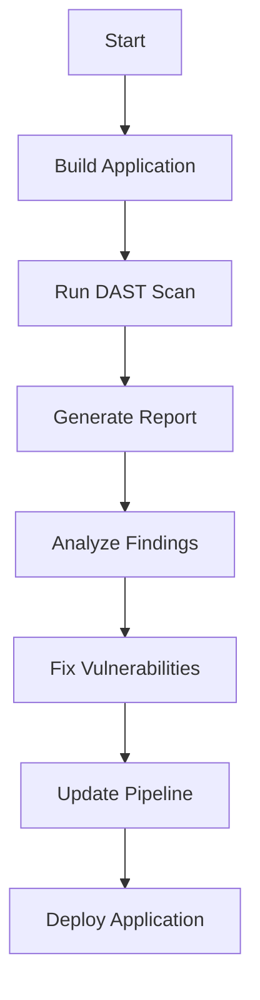

## Configuring Automated Dynamic Application Security Testing (DAST) in CI/CD Pipelines

### Introduction to DAST and CI/CD Integration

Dynamic Application Security Testing (DAST) is a type of security testing that simulates real-world attacks against a live application to identify vulnerabilities. Unlike Static Application Security Testing (SAST), which analyzes the source code, DAST focuses on the runtime behavior of the application. Integrating DAST into a Continuous Integration/Continuous Deployment (CI/CD) pipeline allows organizations to automatically test their applications for security vulnerabilities at various stages of development and deployment.

### Configuring DAST Tools in CI/CD Pipelines

To effectively integrate DAST into a CI/CD pipeline, several steps are necessary:

1. **Selecting a DAST Tool**: Choose a DAST tool that fits your organization's needs. Popular tools include OWASP ZAP (Zed Attack Proxy), Burp Suite, and Arachni. These tools can be configured to run automated scans during the CI/CD process.

2. **Setting Up the Pipeline**: Ensure that the CI/CD pipeline is configured to trigger DAST scans at appropriate points, such as after building the application or before deploying it to production.

3. **Configuring Scan Parameters**: Define the parameters for the DAST scans, including the target URL, scan scope, and severity thresholds. This ensures that the scans are comprehensive and relevant to the application being tested.

4. **Handling Scan Results**: Determine how to handle the results of the DAST scans. This includes setting up alerts for critical vulnerabilities and integrating the results into a centralized security management system like DefectDojo.

### Example Configuration Using OWASP ZAP

Let's walk through an example using OWASP ZAP to configure DAST scans in a CI/CD pipeline.

#### Step 1: Install OWASP ZAP

First, install OWASP ZAP on your CI/CD server. You can download the latest version from the OWASP ZAP website.

```bash
wget https://github.com/zaproxy/zaproxy/releases/download/2.11.1/ZAP_2.11.1_Linux.tar.gz
tar xvf ZAP_2.11.1_Linux.tar.gz
cd zap-2.11.1-linux/
```

#### Step 2: Create a ZAP Script

Create a script to automate the DAST scan using ZAP. This script will start ZAP, configure the scan, and generate a report.

```bash
#!/bin/bash

# Start ZAP in daemon mode
./zap.sh -daemon

# Wait for ZAP to start
sleep 10

# Set the target URL
TARGET_URL="http://localhost:8080"

# Start the spider
curl "http://localhost:8080/JSON/spider/action/scan/?url=$TARGET_URL"

# Wait for the spider to finish
sleep 60

# Start the active scan
curl "http://localhost:8080/JSON/ascan/action/scan/?url=$TARGET_URL"

# Wait for the active scan to finish
sleep 120

# Generate the report
curl "http://localhost:8080/OTHER/core/other/jsonreport/?formMethod=GET&templateName=Default&inScopeOnly=true&truncationLength=0&truncationString=...&showSuppressed=false&reportFileName=report.json"

# Stop ZAP
curl "http://localhost:8080/JSON/core/action/shutdown/"
```

#### Step 3: Integrate the Script into the CI/CD Pipeline

Integrate the above script into your CI/CD pipeline. For example, if you are using Jenkins, you can add a build step to execute the script.

```yaml
pipeline {
    agent any
    stages {
        stage('Build') {
            steps {
                sh 'mvn clean package'
            }
        }
        stage('Test') {
            steps {
                sh './run-zap-scan.sh'
            }
        }
    }
}
```

### Handling Scan Results

The DAST scan results need to be handled appropriately. This includes analyzing the findings, fixing the identified vulnerabilities, and updating the pipeline to reflect these changes.

#### Analyzing Findings

When the DAST scan completes, review the generated report. The report will list various security issues found during the scan, such as cross-domain JavaScript source file inclusion and missing Content Security Policy (CSP) headers.

#### Fixing Identified Vulnerabilities

For each identified vulnerability, determine the root cause and apply the necessary fixes. Here are some common vulnerabilities and their fixes:

##### Cross-Domain JavaScript Source File Inclusion

Cross-domain JavaScript source file inclusion occurs when a web application loads external JavaScript files from untrusted domains. This can lead to Cross-Site Scripting (XSS) attacks.

**Vulnerable Code:**

```html
<script src="https://untrusted-domain.com/script.js"></script>
```

**Fixed Code:**

```html
<script src="/trusted-script.js"></script>
```

Ensure that all external scripts are loaded from trusted sources.

##### Missing Content Security Policy (CSP)

Content Security Policy (CSP) is a security feature that helps prevent Cross-Site Scripting (XSS) and other code injection attacks. It specifies which sources of content are allowed to be executed in the context of a web page.

**Vulnerable Code:**

```http
HTTP/1.1 200 OK
Content-Type: text/html
```

**Fixed Code:**

```http
HTTP/1.1 200 OK
Content-Type: text/html
Content-Security-Policy: default-src 'self'; script-src 'self' https://trusted-domain.com;
```

Add the `Content-Security-Policy` header to your HTTP responses to restrict the sources of content that can be loaded.

### How to Prevent / Defend Against DAST Vulnerabilities

#### Detection

Regularly run DAST scans as part of your CI/CD pipeline to detect security vulnerabilities early in the development cycle. Use tools like OWASP ZAP, Burp Suite, and Arachni to perform comprehensive scans.

#### Prevention

1. **Code Reviews**: Conduct regular code reviews to ensure that security best practices are followed.
2. **Security Training**: Train developers on security best practices and common vulnerabilities.
3. **Secure Coding Practices**: Implement secure coding practices, such as input validation, output encoding, and proper error handling.
4. **Use Security Headers**: Add security headers like `Content-Security-Policy`, `X-Frame-Options`, and `X-Content-Type-Options` to your HTTP responses.
5. **Automate Security Testing**: Integrate DAST and SAST tools into your CI/CD pipeline to automate security testing.

#### Secure-Coding Fixes

Here are some secure-coding fixes for common vulnerabilities:

##### Cross-Domain JavaScript Source File Inclusion

**Vulnerable Code:**

```html
<script src="https://untrusted-domain.com/script.js"></script>
```

**Fixed Code:**

```html
<script src="/trusted-script.js"></script>
```

Ensure that all external scripts are loaded from trusted sources.

##### Missing Content Security Policy (CSP)

**Vulnerable Code:**

```http
HTTP/1.1 200 OK
Content-Type: text/html
```

**Fixed Code:**

```http
HTTP/1.1 200 OK
Content-Type: text/html
Content-Security-Policy: default-src 'self'; script-src 'self' https://trusted-domain.com;
```

Add the `Content-Security-Policy` header to your HTTP responses to restrict the sources of content that can be loaded.

### Real-World Examples

#### Recent CVEs and Breaches

Several recent CVEs and breaches highlight the importance of DAST in securing web applications:

- **CVE-2021-44228 (Log4Shell)**: A critical vulnerability in the Apache Log4j library that allowed attackers to execute arbitrary code. Regular DAST scans could have detected this vulnerability early.
- **SolarWinds Supply Chain Attack**: A sophisticated supply chain attack that compromised SolarWinds Orion software. DAST scans could have helped detect malicious code injected into the software.

### Mermaid Diagrams

#### DAST Scan Workflow

A mermaid diagram can help visualize the workflow of a DAST scan in a CI/CD pipeline.



### Conclusion

Integrating DAST into a CI/CD pipeline is crucial for ensuring the security of web applications. By automating DAST scans, organizations can detect and fix vulnerabilities early in the development cycle, reducing the risk of security breaches. Regularly reviewing and updating the pipeline to incorporate new security measures is essential for maintaining a secure application environment.

### Practice Labs

For hands-on practice with DAST in CI/CD pipelines, consider the following labs:

- **PortSwigger Web Security Academy**: Offers interactive labs to practice web security techniques, including DAST.
- **OWASP Juice Shop**: A deliberately insecure web application for practicing web security skills.
- **DVWA (Damn Vulnerable Web Application)**: A PHP/MySQL web application that is riddled with vulnerabilities for educational purposes.

These labs provide practical experience in configuring and running DAST scans in a CI/CD pipeline, helping to reinforce the concepts learned in this chapter.

---
<!-- nav -->
[[08-Configuring Automated Dynamic Application Security Testing (DAST) in CICD Pipelines Part 1|Configuring Automated Dynamic Application Security Testing (DAST) in CICD Pipelines Part 1]] | [[DevSecOps/DevSecOps Bootcamp/05-Application Security Testing/10-Secure Continuous Deployment & DAST/Configure Automated DAST Scans in CICD Pipeline/00-Overview|Overview]] | [[10-Configuring Automated Dynamic Application Security Testing (DAST) in CICD Pipelines|Configuring Automated Dynamic Application Security Testing (DAST) in CICD Pipelines]]
