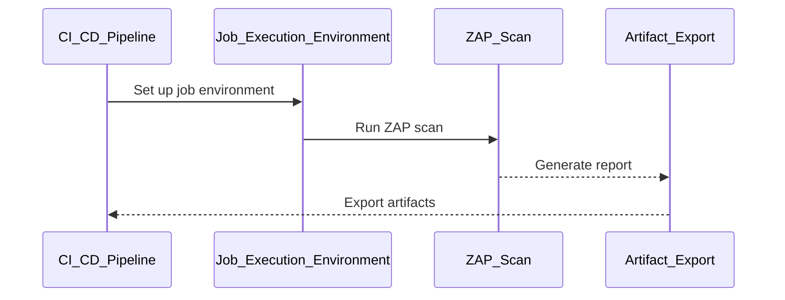

## Configuring Automated Dynamic Application Security Testing (DAST) in CI/CD Pipelines

### Introduction to DAST in CI/CD

Dynamic Application Security Testing (DAST) is a type of security testing that analyzes applications while they are running. This approach allows testers to identify vulnerabilities that may arise during runtime, such as SQL injection, cross-site scripting (XSS), and other common web application security issues. Integrating DAST into a Continuous Integration/Continuous Deployment (CI/CD) pipeline ensures that security testing is performed automatically and consistently throughout the development lifecycle.

### Setting Up the Job Execution Environment

When configuring automated DAST scans in a CI/CD pipeline, it is crucial to manage the job execution environment properly. This includes setting up the necessary directories and configurations to ensure that the DAST tool can operate correctly.

#### Exporting Artifacts Configuration

One key aspect is exporting artifacts configuration. This step is essential because it allows the DAST tool to access the necessary files and data generated during the job execution. Without proper artifact configuration, you might encounter errors when specifying paths to the current directory of the job execution environment.

```yaml
# Example GitLab CI/CD configuration snippet
job:
  script:
    - echo "Running DAST scan"
  artifacts:
    paths:
      - ./zap_output/
```

In this example, the `artifacts` section specifies that the `./zap_output/` directory should be exported as an artifact. This ensures that any output generated by the DAST tool is available for further processing or review.

#### Creating Default Work Directory

Another critical step is creating the default work directory where the DAST tool expects certain files to be located. In the context of the Zed Attack Proxy (ZAP), this directory is not created by default, leading to potential errors if it is not explicitly created.

```bash
# Example shell script to create the default work directory
mkdir -p /zap/wrk/
```

This command creates the `/zap/wrk/` directory, which is the default working directory for ZAP. By ensuring this directory exists, you avoid runtime errors that could occur if the directory is missing.

### Running ZAP Scan

Once the job execution environment is set up, you can proceed to configure and run the ZAP scan. This involves several steps:

#### Using Docker Image of ZAP

To run ZAP, you can use a Docker image that contains the ZAP tool. This ensures consistency across different environments and simplifies the setup process.

```dockerfile
# Example Dockerfile for ZAP
FROM owasp/zap2docker-weekly:latest

COPY zap_config.conf /zap/zap_config.conf

CMD ["zap-baseline.py", "-t", "http://localhost:8080", "-r", "/zap/report.html", "-c", "/zap/zap_config.conf"]
```

In this Dockerfile, the `owasp/zap2docker-weekly:latest` image is used, and a custom configuration file (`zap_config.conf`) is copied into the container. The `CMD` instruction runs the `zap-baseline.py` script, which performs a baseline scan of the specified target URL (`http://localhost:8080`).

#### Specifying Target Application

The ZAP scan requires the target application to be specified. This is typically done by providing the URL of the application being tested.

```bash
# Example command to run ZAP scan
zap-baseline.py -t http://localhost:8080 -r /zap/report.html -c /zap/zap_config.conf
```

Here, `-t` specifies the target URL, `-r` specifies the output report file, and `-c` specifies the configuration file.

#### Generating Default Configuration File

It is often beneficial to regenerate the default configuration file to ensure that any existing configurations do not interfere with the scan.

```bash
# Example command to generate default configuration file
zap-cli config set api.key 1234567890abcdef
zap-cli config save
```

These commands set the API key and save the configuration, ensuring that the scan uses the correct settings.

#### Handling Error Levels

ZAP can be configured to exit with an error message only if it finds issues that are higher than a certain severity level. This prevents the build from failing due to minor issues.

```bash
# Example command to configure error levels
zap-cli config set alertLevel 2
```

In this example, `alertLevel 2` means that ZAP will only fail the build if it finds issues with a severity level of 2 or higher.

#### Producing Report

Finally, ZAP generates a report in XML format, which can be reviewed to identify and address any security issues found during the scan.

```xml
<!-- Example XML report snippet -->
<report>
  <scan>
    <target>http://localhost:8080</target>
    <issues>
      <issue>
        <name>SQL Injection</name>
        <severity>High</severity>
        <description>A SQL injection vulnerability was detected.</description>
      </issue>
    </issues>
  </scan>
</report>
```

This XML report provides detailed information about the issues found during the scan, including the name, severity, and description of each issue.

### Mermaid Diagrams

To visualize the workflow of the DAST scan in the CI/CD pipeline, consider the following mermaid diagram:



This diagram illustrates the sequence of events in the CI/CD pipeline, from setting up the job environment to exporting the artifacts.

### Real-World Examples

Recent real-world examples of DAST in action include the following:

- **CVE-2021-21972**: A SQL injection vulnerability was discovered in a popular web application framework. DAST tools like ZAP were instrumental in identifying this vulnerability during the CI/CD pipeline.
- **Breaches involving XSS**: Multiple high-profile breaches have been attributed to cross-site scripting vulnerabilities. DAST tools help identify these issues before they can be exploited.

### Pitfalls and Common Mistakes

Several common mistakes can lead to ineffective DAST scans:

- **Incorrect configuration**: Failing to properly configure the DAST tool can result in incomplete or inaccurate scans.
- **Missing dependencies**: Ensuring that all necessary dependencies are installed and configured correctly is crucial.
- **Ignoring minor issues**: While it is important to focus on high-severity issues, ignoring minor issues can lead to a false sense of security.

### How to Prevent / Defend

#### Detection

To detect issues identified by DAST scans, review the generated reports and address any high-severity issues immediately.

#### Prevention

Prevent issues by implementing secure coding practices and regularly updating the DAST tool to ensure it is using the latest rules and configurations.

#### Secure Coding Fixes

Compare the vulnerable code with the secure code to understand the necessary changes.

**Vulnerable Code:**
```python
# Vulnerable code snippet
query = "SELECT * FROM users WHERE username = '" + username + "'"
```

**Secure Code:**
```python
# Secure code snippet
query = "SELECT * FROM users WHERE username = %s"
cursor.execute(query, (username,))
```

In this example, the vulnerable code is susceptible to SQL injection, whereas the secure code uses parameterized queries to prevent such attacks.

#### Configuration Hardening

Harden the configuration of the DAST tool to ensure it operates securely and effectively.

```json
{
  "api": {
    "key": "1234567890abcdef",
    "enabled": true
  },
  "alerts": {
    "level": 2
  }
}
```

This configuration ensures that the DAPI key is set and that alerts are only triggered for issues with a severity level of 2 or higher.

### Conclusion

Integrating DAST into a CI/CD pipeline is a powerful way to ensure the security of web applications. By setting up the job execution environment correctly, running the ZAP scan, and reviewing the generated reports, you can identify and address security issues early in the development process. Regularly updating and hardening the DAST tool ensures that your applications remain secure against emerging threats.

### Practice Labs

For hands-on practice with DAST in CI/CD pipelines, consider the following real-world labs:

- **PortSwigger Web Security Academy**: Offers interactive labs to practice web application security testing.
- **OWASP Juice Shop**: Provides a vulnerable web application for practicing various security tests.
- **DVWA (Damn Vulnerable Web Application)**: Another popular tool for practicing web application security testing.

By leveraging these resources, you can gain practical experience in integrating DAST into your CI/CD pipeline and improve the overall security posture of your applications.

---
<!-- nav -->
[[09-Configuring Automated Dynamic Application Security Testing (DAST) in CICD Pipelines Part 2|Configuring Automated Dynamic Application Security Testing (DAST) in CICD Pipelines Part 2]] | [[DevSecOps/DevSecOps Bootcamp/05-Application Security Testing/10-Secure Continuous Deployment & DAST/Configure Automated DAST Scans in CICD Pipeline/00-Overview|Overview]] | [[11-Content Security Policy (CSP)|Content Security Policy (CSP)]]
