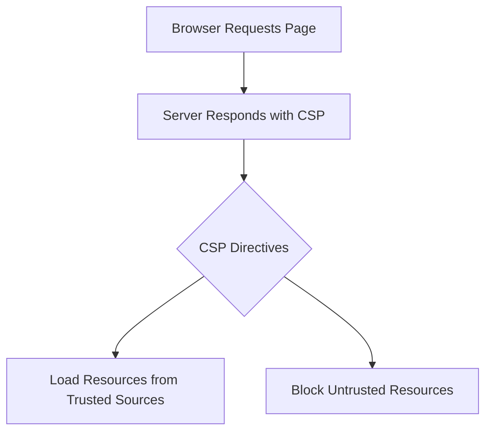

## Content Security Policy (CSP)

### Introduction to Content Security Policy (CSP)

Content Security Policy (CSP) is a security measure implemented via HTTP headers that allows web developers to specify which sources of content are permitted to load within a web page. This mechanism helps mitigate various types of attacks, including Cross-Site Scripting (XSS) and data injection attacks. By defining a set of trusted sources, CSP restricts the execution of potentially malicious scripts and other resources, thereby enhancing the overall security posture of a web application.

### Why Use CSP?

The primary reason for implementing CSP is to protect against XSS attacks. XSS vulnerabilities occur when an attacker injects malicious scripts into a web page viewed by other users. These scripts can steal sensitive data, perform actions on behalf of the user, or even deface the website. CSP helps prevent such attacks by specifying which domains are allowed to serve scripts and other resources.

### How CSP Works

CSP operates by setting specific directives within the `Content-Security-Policy` HTTP header. These directives define the allowed sources of content, such as scripts, stylesheets, images, and more. When a browser loads a web page, it checks the CSP header and enforces the specified rules. If a resource is loaded from an unauthorized source, the browser will block it, thus preventing potential security issues.

#### Example of a Basic CSP Header

```http
HTTP/1.1 200 OK
Content-Type: text/html; charset=UTF-8
Content-Security-Policy: default-src 'self'; script-src 'self' https://trustedscripts.example.com; style-src 'self' https://trustedstyles.example.com;

<!DOCTYPE html>
<html>
<head>
    <title>Example Page</title>
    <link rel="stylesheet" href="https://trustedstyles.example.com/styles.css">
</head>
<body>
    <script src="https://trustedscripts.example.com/script.js"></script>
</body>
</html>
```

In this example:
- `default-src 'self'`: Allows resources to be loaded only from the same origin as the web page.
- `script-src 'self' https://trustedscripts.example.com`: Permits scripts to be loaded from the same origin and from `https://trustedscripts.example.com`.
- `style-src 'self' https://trustedstyles.example.com`: Allows stylesheets to be loaded from the same origin and from `https://trustedstyles.example.com`.

### Directives in CSP

CSP supports several directives that control different types of content:

- **`default-src`**: Default directive for all content types.
- **`script-src`**: Specifies allowed sources for scripts.
- **`style-src`**: Specifies allowed sources for stylesheets.
- **`img-src`**: Specifies allowed sources for images.
- **`frame-src`**: Specifies allowed sources for frames.
- **`connect-src`**: Specifies allowed sources for XMLHttpRequest, WebSocket, etc.
- **`font-src`**: Specifies allowed sources for fonts.
- **`media-src`**: Specifies allowed sources for media elements like `<audio>` and `<video>`.

### Real-World Examples and Recent Breaches

One notable example of a breach that could have been mitigated by CSP is the Magecart attack. Magecart attackers injected malicious scripts into e-commerce websites to steal credit card information. Implementing a strict CSP could have prevented these scripts from executing.

Another example is the Capital One breach in 2019, where an attacker exploited a misconfigured server to access sensitive customer data. While CSP alone would not have prevented this breach, it could have helped mitigate the impact by restricting the execution of unauthorized scripts.

### Common Pitfalls and Best Practices

When implementing CSP, it is crucial to avoid common pitfalls:

- **Overly Restrictive Policies**: Starting with overly restrictive policies can break legitimate functionality. Begin with a less restrictive policy and gradually tighten it.
- **Missing Directives**: Ensure all necessary directives are included. Missing a directive can leave your application vulnerable.
- **Dynamic Content**: Handle dynamic content carefully. CSP may need to be adjusted for dynamically generated content.

### How to Prevent / Defend

#### Detection

To detect CSP violations, monitor browser console logs and network requests. Modern browsers provide tools to inspect CSP violations. Additionally, logging CSP violations can help identify potential security issues.

#### Prevention

1. **Implement Strict CSP**: Start with a basic policy and gradually tighten it.
2. **Use Nonce or Hashes**: For inline scripts and styles, use nonces or hashes to allow them securely.
3. **Regular Audits**: Regularly audit your CSP to ensure it remains effective and does not break legitimate functionality.

#### Secure Code Fix

Here’s an example of a vulnerable CSP policy and its secure counterpart:

**Vulnerable CSP Policy**

```http
HTTP/1.1 200 OK
Content-Type: text/html; charset=UTF-8
Content-Security-Policy: default-src *;

<!DOCTYPE html>
<html>
<head>
    <title>Vulnerable Page</title>
    <script src="https://malicious.example.com/script.js"></script>
</head>
<body>
    <h1>Welcome to the Vulnerable Page</h1>
</body>
</html>
```

**Secure CSP Policy**

```http
HTTP/1.1 200 OK
Content-Type: text/html; charset=UTF-8
Content-Security-Policy: default-src 'self'; script-src 'self' https://trustedscripts.example.com;

<!DOCTYPE html>
<html>
<head>
    <title>Secure Page</title>
    <script src="https://trustedscripts.example.com/script.js"></script>
</head>
<body>
    <h1>Welcome to the Secure Page</h1>
</body>
</html>
```

### Configuration Hardening

To further harden your CSP configuration:

- **Report-Only Mode**: Use `Content-Security-Policy-Report-Only` to test changes without blocking content.
- **Reporting API**: Utilize the Reporting API to log CSP violations to a server for analysis.

### Mermaid Diagrams

#### CSP Flow Diagram



### Hands-On Labs

For practical experience with CSP, consider the following labs:

- **PortSwigger Web Security Academy**: Offers interactive labs on CSP and other web security topics.
- **OWASP Juice Shop**: Provides a vulnerable web application for practicing CSP implementation.

By thoroughly understanding and implementing CSP, you can significantly enhance the security of your web applications and protect against various types of attacks.

---
<!-- nav -->
[[10-Configuring Automated Dynamic Application Security Testing (DAST) in CICD Pipelines|Configuring Automated Dynamic Application Security Testing (DAST) in CICD Pipelines]] | [[DevSecOps/DevSecOps Bootcamp/05-Application Security Testing/10-Secure Continuous Deployment & DAST/Configure Automated DAST Scans in CICD Pipeline/00-Overview|Overview]] | [[12-Secure Continuous Deployment & Dynamic Application Security Testing (DAST)|Secure Continuous Deployment & Dynamic Application Security Testing (DAST)]]
