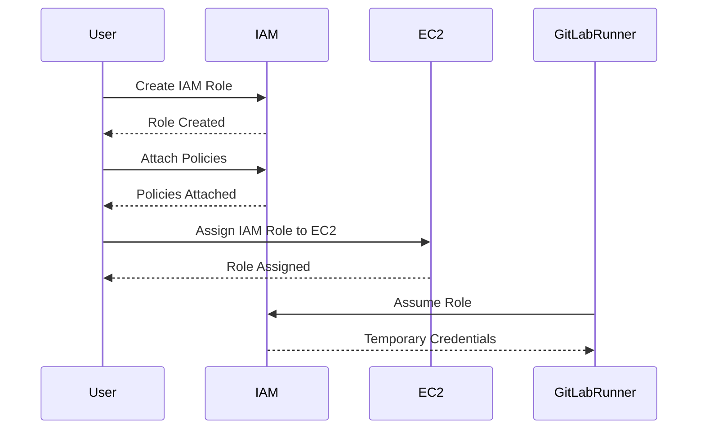

## Secure Access to AWS with IAM Roles and Short-Lived Credentials

### Introduction to IAM Roles and Short-Lived Credentials

In the context of DevSecOps, ensuring secure access to AWS resources is paramount. One of the most effective methods to achieve this is through the use of IAM roles and short-lived credentials. This approach not only enhances security but also simplifies the management of access control within your infrastructure.

#### What are IAM Roles?

IAM roles are a type of AWS Identity and Access Management (IAM) entity that you can use to delegate permissions to entities that need to perform actions in your account. These roles are particularly useful for granting temporary access to AWS resources, such as EC2 instances, Lambda functions, and other AWS services.

**Why Use IAM Roles?**

- **Temporary Access**: IAM roles provide temporary access to resources, reducing the risk associated with long-term static credentials.
- **Fine-Grained Control**: You can define specific permissions for each role, allowing you to grant only the necessary access required for a particular task.
- **Centralized Management**: IAM roles can be managed centrally, making it easier to update permissions across multiple resources.

#### What are Short-Lived Credentials?

Short-lived credentials are temporary access keys that are valid for a limited time period. They are generated dynamically and are typically used in conjunction with IAM roles to provide temporary access to AWS resources.

**Why Use Short-Lived Credentials?**

- **Reduced Exposure Time**: Short-lived credentials minimize the window of opportunity for unauthorized access.
- **Auditability**: Temporary credentials make it easier to track and audit access to resources.
- **Compliance**: Many compliance standards require the use of short-lived credentials to reduce the risk of credential exposure.

### Creating an IAM Role for GitLab Runner

To demonstrate the use of IAM roles and short-lived credentials, let's walk through the process of creating an IAM role for a GitLab Runner instance.

#### Step-by-Step Process

1. **Navigate to IAM Console**:
   - Log in to the AWS Management Console.
   - Navigate to the IAM service.

2. **Create a New Role**:
   - Click on "Roles" in the left-hand menu.
   - Click on "Create role".
   - Select "EC2" as the trusted entity type.
   - Click "Next: Permissions".

3. **Attach Policies**:
   - Search for and attach the necessary policies to the role. For example, if your GitLab Runner needs to interact with Amazon S3, you might attach the `AmazonS3FullAccess` policy.
   - Click "Next: Tags" to add any tags you want to apply to the role.

4. **Add Tags (Optional)**:
   - Add any tags you want to associate with the role.
   - Click "Next: Review".

5. **Review and Create**:
   - Review the role details.
   - Enter a name for the role, such as `GitLabRunnerRole`.
   - Click "Create role".

#### Example Code Block

```bash
# Create an IAM role for EC2 instances
aws iam create-role --role-name GitLabRunnerRole --assume-role-policy-document file://trust-policy.json

# Attach a policy to the role
aws iam attach-role-policy --role-name GitLabRunnerRole --policy-arn arn:aws:iam::aws:policy/AmazonS3FullAccess
```

#### Trust Policy

The trust policy defines which entities are allowed to assume the role. In this case, we allow EC2 instances to assume the role.

```json
{
  "Version": "2012-10-17",
  "Statement": [
    {
      "Effect": "Allow",
      "Principal": {
        "Service": "ec2.amazonaws.com"
      },
      "Action": "sts:AssumeRole"
    }
  ]
}
```

### Assigning the IAM Role to the GitLab Runner Instance

Once the IAM role is created, you need to assign it to the EC2 instance running the GitLab Runner.

#### Step-by-Step Process

1. **Navigate to EC2 Console**:
   - Go to the EC2 dashboard in the AWS Management Console.
   - Select the instance running the GitLab Runner.

2. **Assign the IAM Role**:
   - Click on "Actions" > "Security" > "Modify IAM role".
   - Select the IAM role you created (`GitLabRunnerRole`).
   - Click "Apply".

#### Example Code Block

```bash
# Modify the IAM role for an EC2 instance
aws ec2 modify-instance-attribute --instance-id i-0123456789abcdef0 --iam-instance-profile Name=GitLabRunnerRole
```

### Removing Static Credentials

After assigning the IAM role to the GitLab Runner instance, you can remove the static credentials from your environment.

#### Step-by-Step Process

1. **Remove Static Credentials**:
   - Go to the GitLab project settings.
   - Navigate to the "Variables" section.
   - Remove the `AWS_ACCESS_KEY_ID` and `AWS_SECRET_ACCESS_KEY` variables.

2. **Delete GitLab User (Optional)**:
   - If you no longer need the GitLab user associated with these credentials, you can delete it.

#### Example Code Block

```bash
# Remove static credentials from GitLab variables
curl --request DELETE --header "PRIVATE-TOKEN: <your_access_token>" "https://gitlab.example.com/api/v4/projects/<project_id>/variables/AWS_ACCESS_KEY_ID"

curl --request DELETE --header "PRIVATE-TOKEN: <your_access_token>" "https://gitlab.example.com/api/v4/projects/<project_id>/variables/AWS_SECRET_ACCESS_KEY"
```

### Verifying the Pipeline

Finally, verify that the pipeline continues to function correctly without the static credentials.

#### Step-by-Step Process

1. **Run the Pipeline**:
   - Trigger the pipeline in GitLab.
   - Ensure that the `build image` job runs successfully on the GitLab Runner server.

2. **Check Logs**:
   - Review the logs to confirm that the GitLab Runner is using the IAM role and short-lived credentials to access AWS resources.

#### Example Code Block

```bash
# Run the pipeline in GitLab
curl --request POST --header "PRIVATE-TOKEN: <your_access_token>" "https://gitlab.example.com/api/v4/projects/<project_id>/pipeline"
```

### Mermaid Diagrams

#### IAM Role Assignment Diagram



### Real-World Examples

#### Recent Breaches and CVEs

One notable breach involving AWS credentials occurred in 2021, where a misconfigured S3 bucket exposed sensitive data due to improper IAM role permissions. This highlights the importance of using IAM roles and short-lived credentials to minimize the risk of unauthorized access.

### Pitfalls and Common Mistakes

#### Overly Permissive Policies

One common mistake is attaching overly permissive policies to IAM roles. This can lead to unnecessary exposure of resources and increase the risk of unauthorized access.

#### Example of Overly Permissive Policy

```json
{
  "Version": "2012-10-17",
  "Statement": [
    {
      "Effect": "Allow",
      "Action": "*",
      "Resource": "*"
    }
  ]
}
```

#### How to Prevent / Defend

##### Detection

- **Monitor IAM Activity**: Use AWS CloudTrail to monitor IAM activity and detect any unauthorized changes to roles and policies.
- **Regular Audits**: Conduct regular audits of IAM roles and policies to ensure they remain aligned with least privilege principles.

##### Prevention

- **Least Privilege Principle**: Always follow the principle of least privilege when defining IAM roles and policies.
- **Use Managed Policies**: Whenever possible, use AWS-managed policies instead of custom policies to reduce the risk of errors.

##### Secure Coding Fixes

**Vulnerable Code**

```json
{
  "Version": "2012-10-17",
  "Statement": [
    {
      "Effect": "Allow",
      "Action": "*",
      "Resource": "*"
    }
  ]
}
```

**Secure Code**

```json
{
  "Version": "2012-10-17",
  "Statement": [
    {
      "Effect": "Allow",
      "Action": [
        "s3:GetObject",
        "s3:PutObject"
      ],
      "Resource": "arn:aws:s3:::my-bucket/*"
    }
  ]
}
```

### Configuration Hardening

#### IAM Role Configuration

Ensure that IAM roles are configured with the minimum necessary permissions and that they are assigned only to the required resources.

#### Example IAM Role Configuration

```json
{
  "Version": "2012-10-17",
  "Statement": [
    {
      "Effect": "Allow",
      "Action": [
        "s3:GetObject",
        "s3:PutObject"
      ],
      "Resource": "arn:aws:s3:::my-bucket/*"
    }
  ]
}
```

### Hands-On Labs

For practical experience with securing continuous deployment and DAST using IAM roles and short-lived credentials, consider the following labs:

- **PortSwigger Web Security Academy**: Offers hands-on labs to practice secure coding and deployment practices.
- **OWASP Juice Shop**: A deliberately insecure web application for practicing security testing and penetration testing.
- **DVWA (Damn Vulnerable Web Application)**: Another popular web application for learning web security.

These labs provide a controlled environment to experiment with different security configurations and understand the implications of various security decisions.

### Conclusion

By leveraging IAM roles and short-lived credentials, you can significantly enhance the security of your AWS resources and streamline the management of access control. Following best practices and conducting regular audits will help ensure that your infrastructure remains secure and compliant with industry standards.

---
<!-- nav -->
[[DevSecOps/DevSecOps Bootcamp/05-Application Security Testing/10-Secure Continuous Deployment & DAST/Secure Access to AWS with IAM Roles Short Lived Credentials/02-Introduction to Secure Continuous Deployment and Dynamic Application Security Testing (DAST)|Introduction to Secure Continuous Deployment and Dynamic Application Security Testing (DAST)]] | [[DevSecOps/DevSecOps Bootcamp/05-Application Security Testing/10-Secure Continuous Deployment & DAST/Secure Access to AWS with IAM Roles Short Lived Credentials/00-Overview|Overview]] | [[04-Secure Continuous Deployment & DAST with AWS IAM Roles for Short-Lived Credentials|Secure Continuous Deployment & DAST with AWS IAM Roles for Short-Lived Credentials]]
