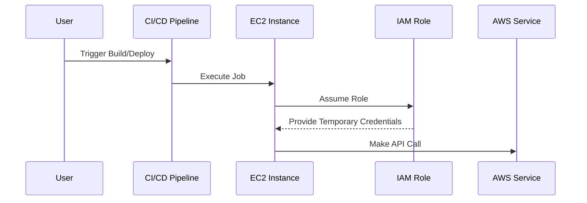

## Secure Continuous Deployment & DAST with AWS IAM Roles for Short-Lived Credentials

### Introduction to Secure Continuous Deployment

Continuous Deployment (CD) is a practice in DevOps where code changes are automatically tested, built, and deployed to production environments. This process aims to minimize manual intervention and reduce the time between development and deployment. However, integrating CD with cloud services like AWS requires careful management of access credentials to ensure security and compliance.

### Eliminating the Need for Static Credentials

Traditionally, pipelines require static AWS credentials (Access Key ID and Secret Access Key) to interact with AWS services. These credentials are often stored in environment variables or configuration files, posing significant security risks. If these credentials are compromised, an attacker could gain unauthorized access to your AWS resources.

#### Why Eliminate Static Credentials?

- **Security Risks**: Static credentials can be stolen through various means such as misconfigured IAM policies, insecure storage, or phishing attacks.
- **Compliance Issues**: Many regulatory frameworks mandate strict controls over access credentials. Using short-lived credentials helps meet these requirements.
- **Operational Efficiency**: Managing and rotating static credentials can be cumbersome. Short-lived credentials simplify this process.

### AWS IAM Roles for Short-Lived Credentials

AWS Identity and Access Management (IAM) roles provide a mechanism to grant temporary, limited-duration permissions to AWS resources. By using IAM roles, you can eliminate the need for static credentials in your CI/CD pipelines.

#### What Are IAM Roles?

IAM roles are similar to IAM users but are designed to be assumed by AWS resources rather than individuals. A role can be assigned to an EC2 instance, Lambda function, or other AWS services. When a resource assumes a role, it gains the permissions defined by the role’s policy.

#### How IAM Roles Work

When an EC2 instance is launched with an IAM role attached, AWS stores the role credentials as part of the instance metadata. Applications running on the instance can retrieve these credentials to make API calls to AWS services.



### Self-Hosted GitLab Runner on EC2

In the context of continuous deployment, a self-hosted GitLab runner can be deployed on an EC2 instance. This setup allows the runner to execute jobs that interact with AWS services.

#### Setting Up the EC2 Instance with IAM Role

To set up an EC2 instance with an IAM role:

1. **Create an IAM Role**:
   - Navigate to the IAM console.
   - Create a new role.
   - Select `EC2` as the trusted entity.
   - Attach the necessary policies (e.g., `AmazonEC2ContainerRegistryPowerUser` for ECR).

2. **Launch EC2 Instance**:
   - In the EC2 console, launch a new instance.
   - During the launch process, select the IAM role created in step 1.

3. **Install GitLab Runner**:
   - SSH into the EC2 instance.
   - Install GitLab Runner and register it with your GitLab instance.

```bash
# SSH into the EC2 instance
ssh -i <path_to_key_pair> ec2-user@<public_dns>

# Install GitLab Runner
curl -L https://packages.gitlab.com/install/repositories/runner/gitlab-runner/script.rpm.sh | sudo bash
sudo yum install gitlab-runner

# Register GitLab Runner
sudo gitlab-runner register --non-interactive \
  --url https://gitlab.example.com/ \
  --registration-token <token> \
  --executor shell \
  --description "My EC2 Runner" \
  --tag-list "ec2,aws"
```

### Example: Deploying to Amazon ECR

Let’s walk through an example of deploying a Docker image to Amazon Elastic Container Registry (ECR) using IAM roles.

#### Step 1: Create an IAM Role for ECR

1. **Create IAM Role**:
   - Name: `ECRDeploymentRole`
   - Trusted Entity: `EC2`
   - Policies: `AmazonEC2ContainerRegistryPowerUser`

2. **Attach Role to EC2 Instance**:
   - Launch an EC2 instance and attach the `ECRDeploymentRole`.

#### Step 2: Configure GitLab CI/CD Pipeline

1. **GitLab CI/CD Configuration**:
   - Create a `.gitlab-ci.yml` file in your repository.

```yaml
stages:
  - build
  - deploy

variables:
  DOCKER_DRIVER: overlay2

build:
  stage: build
  script:
    - docker build -t $CI_REGISTRY_IMAGE:$CI_COMMIT_REF_SLUG .
    - docker login -u $CI_REGISTRY_USER -p $CI_REGISTRY_PASSWORD $CI_REGISTRY
    - docker push $CI_REGISTRY_IMAGE:$CI_COMMIT_REF_SLUG

deploy:
  stage: deploy
  script:
    - aws ecr get-login-password --region us-east-1 | docker login --username AWS --password-stdin $AWS_ACCOUNT_ID.dkr.ecr.us-east-1.amazonaws.com
    - docker tag $CI_REGISTRY_IMAGE:$CI_COMMIT_REF_SLUG $AWS_ACCOUNT_ID.dkr.ecr.us-east-1.amazonaws.com/myapp:$CI_COMMIT_REF_SLUG
    - docker push $AWS_ACCOUNT_ID.dkr.ecr.us-east-1.amazonaws.com/myapp:$CI_COMMIT_REF_SLUG
```

2. **Environment Variables**:
   - Ensure `AWS_ACCOUNT_ID` is set as an environment variable in your GitLab project settings.

#### Step 3: Run the Pipeline

Trigger the pipeline from the GitLab UI or via a webhook. The pipeline will build the Docker image and push it to both the GitLab registry and Amazon ECR.

### Pitfalls and Best Practices

#### Common Pitfalls

- **Incorrect IAM Policies**: Ensure the IAM role has the minimum necessary permissions.
- **Expired Credentials**: IAM roles provide temporary credentials that expire after a certain period. Ensure your pipeline can handle credential expiration.
- **Misconfigured EC2 Instances**: Ensure the EC2 instance is correctly configured with the IAM role.

#### Best Practices

- **Least Privilege Principle**: Assign the least privilege necessary for the task.
- **Regular Audits**: Regularly review IAM roles and policies to ensure they remain secure.
- **Use IAM Roles for Service Accounts**: For Kubernetes clusters, use IAM roles for service accounts to manage permissions.

### Real-World Examples and Recent Breaches

#### Example: AWS Misconfiguration Leads to Data Exposure

In 2021, a misconfigured IAM role allowed unauthorized access to sensitive data stored in S3 buckets. The breach occurred due to overly permissive IAM policies attached to EC2 instances.

- **Impact**: Sensitive data was exposed to the public internet.
- **Mitigation**: Implement strict IAM policies and regularly audit IAM roles.

### How to Prevent / Defend

#### Detection

- **CloudTrail**: Enable AWS CloudTrail to log API calls made by IAM roles.
- **GuardDuty**: Use AWS GuardDuty to monitor for unusual activity related to IAM roles.

#### Prevention

- **IAM Policies**: Ensure IAM policies are least privileged.
- **Rotation**: Rotate IAM roles periodically to mitigate the risk of compromised credentials.

#### Secure Coding Fixes

Compare the vulnerable and secure versions of IAM policies:

**Vulnerable Policy**:
```json
{
    "Version": "2012-10-17",
    "Statement": [
        {
            "Effect": "Allow",
            "Action": "*",
            "Resource": "*"
        }
    ]
}
```

**Secure Policy**:
```json
{
    "Version": "2012-10-17",
    "Statement": [
        {
            "Effect": "Allow",
            "Action": [
                "ecr:GetAuthorizationToken",
                "ecr:BatchCheckLayerAvailability",
                "ecr:GetDownloadUrlForLayer",
                "ecr:BatchGetImage",
                "ecr:InitiateLayerUpload",
                "ecr:UploadLayerPart",
                "ecr:CompleteLayerUpload",
                "ecr:PutImage"
            ],
            "Resource": "*"
        }
    ]
}
```

### Conclusion

Using AWS IAM roles for short-lived credentials significantly enhances the security of your CI/CD pipelines. By eliminating the need for static credentials, you reduce the risk of unauthorized access and comply with regulatory requirements. Regular audits and strict IAM policies further reinforce the security of your cloud infrastructure.

### Hands-On Labs

For practical experience with secure continuous deployment and DAST using AWS IAM roles, consider the following labs:

- **PortSwigger Web Security Academy**: Focuses on web application security but includes modules on secure CI/CD practices.
- **OWASP Juice Shop**: A deliberately insecure web application for practicing security testing and CI/CD integration.
- **DVWA (Damn Vulnerable Web Application)**: Another web application for learning security testing and integrating secure CI/CD practices.

These labs provide real-world scenarios to apply the concepts learned in this chapter.

---
<!-- nav -->
[[03-Secure Access to AWS with IAM Roles and Short-Lived Credentials|Secure Access to AWS with IAM Roles and Short-Lived Credentials]] | [[DevSecOps/DevSecOps Bootcamp/05-Application Security Testing/10-Secure Continuous Deployment & DAST/Secure Access to AWS with IAM Roles Short Lived Credentials/00-Overview|Overview]] | [[05-Secure Continuous Deployment & DAST with IAM Roles and Short-Lived Credentials Part 1|Secure Continuous Deployment & DAST with IAM Roles and Short-Lived Credentials Part 1]]
