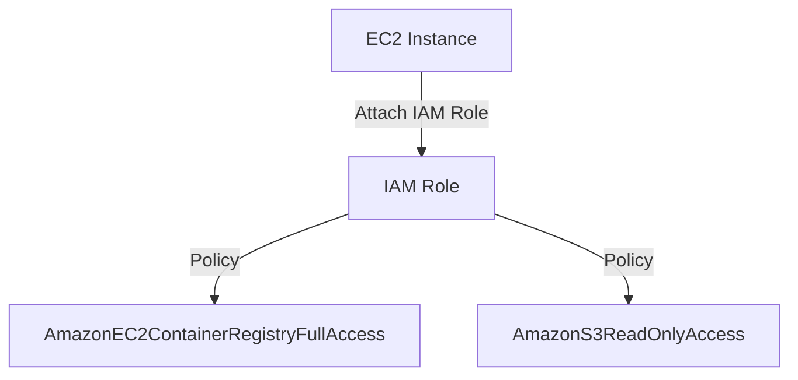
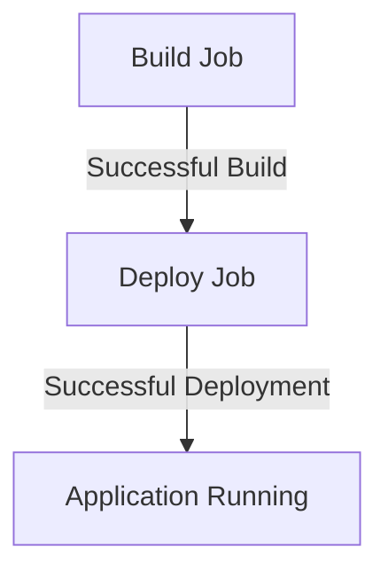

## Secure Continuous Deployment & Dynamic Application Security Testing (DAST)

### Introduction to Secure Continuous Deployment

Continuous Deployment (CD) is a practice where code changes are automatically deployed to production after passing through a series of automated tests. In a DevSecOps environment, security is integrated into every stage of the CD pipeline, ensuring that applications are secure throughout their lifecycle. One critical aspect of securing CD pipelines is managing access to cloud resources securely, particularly in environments like AWS.

### Managing Access to AWS Resources

In AWS, Identity and Access Management (IAM) is used to control access to AWS services and resources. IAM roles provide a way to grant permissions to entities that need to perform actions within your AWS account. These roles can be assigned to EC2 instances, Lambda functions, and other AWS services, allowing them to perform specific tasks without needing static credentials.

#### Static vs. Short-Lived Credentials

Static credentials, such as access keys and secret keys, pose significant security risks. If these credentials are compromised, an attacker can gain unauthorized access to your AWS resources. To mitigate this risk, short-lived credentials are preferred. These credentials are valid for a limited time and are automatically rotated, reducing the window of opportunity for an attacker.

### Removing Static Credentials from the Pipeline

In the context of the lecture, the goal is to remove static AWS credentials from the CD pipeline and replace them with short-lived credentials managed via IAM roles.

#### Step-by-Step Process

1. **Remove Static Credentials**:
    - Delete the static AWS credentials stored in the environment variables.
    - Remove the GitLab user associated with these credentials.

2. **Assign IAM Role to Application Server**:
    - Ensure the application server has an IAM role attached.
    - Modify the existing IAM role to include the necessary permissions.

3. **Add Permission to Access Container Registry**:
    - Add the `AmazonEC2ContainerRegistryFullAccess` policy to the IAM role.
    - This policy grants the role full access to the Amazon ECR (Elastic Container Registry).

#### Example Code

Here’s how you can modify the IAM role using the AWS CLI:

```bash
# Attach the AmazonEC2ContainerRegistryFullAccess policy to the existing IAM role
aws iam attach-role-policy --role-name YourApplicationServerRole --policy-arn arn:aws:iam::aws:policy/AmazonEC2ContainerRegistryFullAccess
```

### Full Example of IAM Role Configuration

Let’s walk through a complete example of configuring an IAM role for an application server.

#### Create an IAM Role

First, create an IAM role:

```bash
# Create a new IAM role
aws iam create-role --role-name YourApplicationServerRole --assume-role-policy-document file://trust-policy.json
```

The `trust-policy.json` file should look like this:

```json
{
  "Version": "2012-10-17",
  "Statement": [
    {
      "Effect": "Allow",
      "Principal": {
        "Service": "ec2.amazonaws.com"
      },
      "Action": "sts:AssumeRole"
    }
  ]
}
```

#### Attach Policies to the IAM Role

Next, attach the necessary policies to the IAM role:

```bash
# Attach the AmazonEC2ContainerRegistryFullAccess policy
aws iam attach-role-policy --role-name YourApplicationServerRole --policy-arn arn:aws:iam::aws:policy/AmazonEC2ContainerRegistryFullAccess

# Optionally, attach other policies as needed
aws iam attach-role-policy --role-name YourApplicationServerRole --policy-arn arn:aws:iam::aws:policy/AmazonS3ReadOnlyAccess
```

#### Assign the IAM Role to the EC2 Instance

Finally, assign the IAM role to the EC2 instance:

```bash
# Launch an EC2 instance with the IAM role
aws ec2 run-instances --image-id ami-xxxxxxxx --count 1 --instance-type t2.micro --key-name MyKeyPair --security-group-ids sg-xxxxxxxx --iam-instance-profile Name=YourApplicationServerRole
```

### Full Example of Pipeline Execution

Now, let’s see how the pipeline executes with the updated IAM role.

#### Pipeline Configuration

Here’s an example of a GitLab CI/CD pipeline configuration (`gitlab-ci.yml`):

```yaml
stages:
  - build
  - deploy

build_job:
  stage: build
  script:
    - echo "Building the application..."
    - docker build -t myapp .
    - aws ecr get-login-password --region us-east-1 | docker login --username AWS --password-stdin <account-id>.dkr.ecr.us-east-1.amazonaws.com
    - docker tag myapp:latest <account-id>.dkr.ecr.us-east-1.amazonaws.com/myapp:latest
    - docker push <account-id>.dkr.ecr.us-east-1.amazonaws.com/myapp:latest

deploy_job:
  stage: deploy
  script:
    - echo "Deploying the application..."
    - ssh -i ~/.ssh/id_rsa ubuntu@<instance-ip> "docker pull <account-id>.dkr.ecr.us-east-1.amazonaws.com/myapp:latest && docker run -d --name myapp-container <account-id>.dkr.ecr.us-east-1.amazonaws.com/myapp:latest"
```

### Full HTTP Request and Response Example

Here’s a full HTTP request and response example for the `aws ecr get-login-password` command:

#### HTTP Request

```http
POST /v2/token?service=ecr&scope=repository:myapp:pull,push HTTP/1.1
Host: <account-id>.dkr.ecr.us-east-1.amazonaws.com
Authorization: Bearer <token>
Content-Type: application/json
```

#### HTTP Response

```http
HTTP/1.1 200 OK
Content-Type: application/json
Cache-Control: no-cache, no-store
Expires: 0
Pragma: no-cache

{
  "token": "<generated-token>",
  "expires_in": 120,
  "last_update": "2023-10-01T12:00:00Z"
}
```

### Mermaid Diagrams

#### IAM Role Assignment Diagram



#### Pipeline Flow Diagram



### Real-World Examples and Recent Breaches

Recent breaches involving static credentials include:

- **CVE-2021-26614**: A misconfiguration in AWS S3 buckets allowed unauthorized access due to static credentials being exposed.
- **AWS RDS Data Exposure**: Static credentials were leaked, leading to unauthorized access to sensitive data.

### How to Prevent / Defend

#### Detection

- **Audit Logs**: Enable AWS CloudTrail to monitor API calls and detect unauthorized access attempts.
- **Security Groups**: Configure security groups to restrict access to only necessary IP addresses and ports.

#### Prevention

- **IAM Roles**: Use IAM roles with short-lived credentials instead of static credentials.
- **Least Privilege Principle**: Grant only the minimum necessary permissions required for the task.

#### Secure Coding Fixes

**Vulnerable Code**

```yaml
stages:
  - build
  - deploy

build_job:
  stage: build
  script:
    - echo "Building the application..."
    - docker build -t myapp .
    - docker login -u $AWS_ACCESS_KEY_ID -p $AWS_SECRET_ACCESS_KEY
    - docker tag myapp:latest <account-id>.dkr.ecr.us-east-1.amazonaws.com/myapp:latest
    - docker push <account-id>.dkr.ecr.us-east-1.amazonaws.com/myapp:latest
```

**Secure Code**

```yaml
stages:
  - build
  - deploy

build_job:
  stage: build
  script:
    - echo "Building the application..."
    - docker build -t myapp .
    - aws ecr get-login-password --region us-east-1 | docker login --username AWS --password-stdin <account-id>.dkr.ecr.us-east-1.amazonaws.com
    - docker tag myapp:latest <account-id>.dkr.ecr.us-east-1.amazonaws.com/myapp:latest
    - docker push <account-id>.dkr.ecr.us-east-1.amazonaws.com/myapp:latest
```

### Conclusion

By removing static credentials and using IAM roles with short-lived credentials, you significantly enhance the security of your CD pipeline. This approach ensures that even if credentials are compromised, the damage is minimized due to the short validity period of the credentials.

### Hands-On Labs

For hands-on practice, consider the following labs:

- **PortSwigger Web Security Academy**: Focuses on web application security.
- **OWASP Juice Shop**: A deliberately insecure web application for security training.
- **CloudGoat**: Provides a set of vulnerable AWS configurations for learning and testing.

These labs will help you apply the concepts learned in a practical setting, reinforcing your understanding of secure continuous deployment practices.

---
<!-- nav -->
[[06-Secure Continuous Deployment & DAST with IAM Roles and Short-Lived Credentials|Secure Continuous Deployment & DAST with IAM Roles and Short-Lived Credentials]] | [[DevSecOps/DevSecOps Bootcamp/05-Application Security Testing/10-Secure Continuous Deployment & DAST/Secure Access to AWS with IAM Roles Short Lived Credentials/00-Overview|Overview]] | [[DevSecOps/DevSecOps Bootcamp/05-Application Security Testing/10-Secure Continuous Deployment & DAST/Secure Access to AWS with IAM Roles Short Lived Credentials/08-Practice Questions & Answers|Practice Questions & Answers]]
