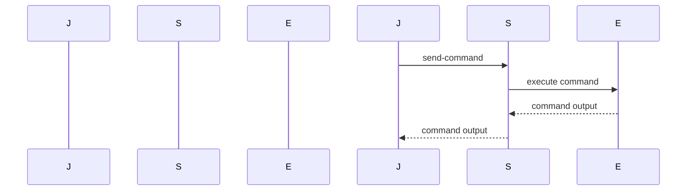

## Secure Continuous Deployment to Server Using SSM

### Background Theory

Continuous Deployment (CD) is an extension of Continuous Integration (CI) that automatically deploys code changes to production after passing through automated tests. In the context of DevSecOps, ensuring that the deployment process is secure is paramount. One way to achieve this is by using AWS Systems Manager (SSM) to manage and execute commands on EC2 instances securely.

### Understanding SSM

AWS Systems Manager (SSM) is a service that helps you automate operational tasks such as managing configuration, patching, and maintaining compliance across your Amazon EC2 instances. SSM provides a secure and reliable way to run commands on your managed instances.

#### Key Concepts

- **Managed Instances**: These are EC2 instances that have the SSM Agent installed and are registered with SSM.
- **Run Command**: This feature allows you to run commands on one or more managed instances.
- **Session Manager**: This feature enables you to start a session with a managed instance without needing direct SSH access.

### Setting Up the Environment

To set up a secure continuous deployment pipeline using SSM, you need to ensure that your EC2 instances are properly configured and that the necessary permissions are in place.

#### Step-by-Step Setup

1. **Install SSM Agent**:
    - Ensure that the SSM Agent is installed on your EC2 instances. This agent communicates with the SSM service to receive and execute commands.

2. **Register Instances with SSM**:
    - Register your EC2 instances with SSM. This can be done via the AWS Management Console or programmatically using the AWS SDK.

3. **Configure IAM Roles**:
    - Create an IAM role that grants the necessary permissions to the SSM service. This role should allow the SSM service to execute commands on your instances.

### Executing Commands with SSM

In the given transcript, the goal is to execute a series of commands on an EC2 instance using SSM. Specifically, the commands involve logging into an Amazon Elastic Container Registry (ECR) and pulling a Docker image.

#### Example Commands

```bash
export AWS_ACCESS_KEY_ID=your_access_key_id
export AWS_SECRET_ACCESS_KEY=your_secret_access_key
export AWS_DEFAULT_REGION=your_region
aws ecr get-login-password --region your_region | docker login --username AWS --password-stdin https://your_account_id.dkr.ecr.your_region.amazonaws.com
```

These commands need to be executed on the remote EC2 instance. To achieve this using SSM, you can use the `aws ssm send-command` CLI command.

#### Full Example

```bash
# Export environment variables
export AWS_ACCESS_KEY_ID=your_access_key_id
export AWS_SECRET_ACCESS_KEY=your_secret_access_key
export AWS_DEFAULT_REGION=your_region

# Send the command to the EC2 instance
aws ssm send-command \
    --instance-ids i-0123456789abcdef0 \
    --document-name "AWS-RunShellScript" \
    --parameters '{"commands":["export AWS_ACCESS_KEY_ID=$AWS_ACCESS_KEY_ID","export AWS_SECRET_ACCESS_KEY=$AWS_SECRET_ACCESS_KEY","export AWS_DEFAULT_REGION=$AWS_DEFAULT_REGION","aws ecr get-login-password --region $AWS_DEFAULT_REGION | docker login --username AWS --password-stdin https://$AWS_ACCOUNT_ID.dkr.ecr.$AWS_DEFAULT_REGION.amazonaws.com"]}'
```

### Diagramming the Process

A mermaid diagram can help visualize the process:



### Pitfalls and Common Mistakes

1. **Incorrect Permissions**: Ensure that the IAM role attached to the EC2 instance has the necessary permissions to execute SSM commands.
2. **Environment Variable Leakage**: Be cautious when exporting sensitive information like access keys. Ensure that these variables are not exposed in logs or other outputs.
3. **Command Execution Errors**: Verify that the commands being executed are correct and that the environment on the EC2 instance is properly configured.

### How to Prevent / Defend

#### Detection

- **Logging and Monitoring**: Enable detailed logging for SSM commands and monitor for any unauthorized or suspicious activity.
- **Audit Trails**: Use AWS CloudTrail to track API calls made to SSM and other services.

#### Prevention

- **IAM Role Configuration**: Ensure that the IAM role attached to the EC2 instance has the minimum necessary permissions.
- **Secure Environment Variables**: Use AWS Secrets Manager or Parameter Store to securely store and retrieve sensitive information like access keys.

#### Secure Code Fix

Here’s an example of how to securely handle environment variables using AWS Secrets Manager:

```yaml
# Jenkinsfile
pipeline {
    agent any
    stages {
        stage('Deploy') {
            steps {
                script {
                    def secrets = loadSecrets()
                    sh """
                        export AWS_ACCESS_KEY_ID=${secrets.AWS_ACCESS_KEY_ID}
                        export AWS_SECRET_ACCESS_KEY=${secrets.AWS_SECRET_ACCESS_KEY}
                        export AWS_DEFAULT_REGION=${secrets.AWS_DEFAULT_REGION}
                        aws ecr get-login-password --region ${secrets.AWS_DEFAULT_REGION} | docker login --username AWS --password-stdin https://${secrets.AWS_ACCOUNT_ID}.dkr.ecr.${secrets.AWS_DEFAULT_REGION}.amazonaws.com
                    """
                }
            }
        }
    }
}

def loadSecrets() {
    def secretsManager = new com.amazonaws.services.secretsmanager.AWSSecretsManagerClientBuilder.defaultClient()
    def secretValue = secretsManager.getSecretValue(secretId: 'my-secret')
    return readJSON text: secretValue.secretString
}
```

### Real-World Examples

#### Recent Breaches

- **CVE-2021-44228 (Log4j)**: This vulnerability could potentially be exploited if insecure logging practices are used in the deployment pipeline. Ensure that all logging is secure and does not expose sensitive information.

#### Secure Practices

- **Use Parameter Store**: Store sensitive information like access keys in AWS Systems Manager Parameter Store and retrieve them securely during deployment.
- **Automated Testing**: Implement automated testing to ensure that the deployment process is secure and that all necessary checks are performed.

### Conclusion

By leveraging AWS Systems Manager for secure continuous deployment, you can ensure that your deployment process is both efficient and secure. Proper setup, execution, and monitoring are crucial to maintaining a robust and secure deployment pipeline.

### Practice Labs

For hands-on practice, consider the following labs:

- **PortSwigger Web Security Academy**: Focuses on web application security but also covers secure deployment practices.
- **OWASP Juice Shop**: A deliberately insecure web application for security training.
- **CloudGoat**: Provides a series of labs to learn about securing AWS environments.

These labs will help you gain practical experience in implementing secure continuous deployment practices.

---
<!-- nav -->
[[DevSecOps/DevSecOps Bootcamp/05-Application Security Testing/10-Secure Continuous Deployment & DAST/Secure Continuous Deployment to Server using SSM/01-Secure Continuous Deployment to Server Using AWS Systems Manager (SSM)|Secure Continuous Deployment to Server Using AWS Systems Manager (SSM)]] | [[DevSecOps/DevSecOps Bootcamp/05-Application Security Testing/10-Secure Continuous Deployment & DAST/Secure Continuous Deployment to Server using SSM/00-Overview|Overview]] | [[03-Secure Continuous Deployment to Server Using SSM Part 2|Secure Continuous Deployment to Server Using SSM Part 2]]
