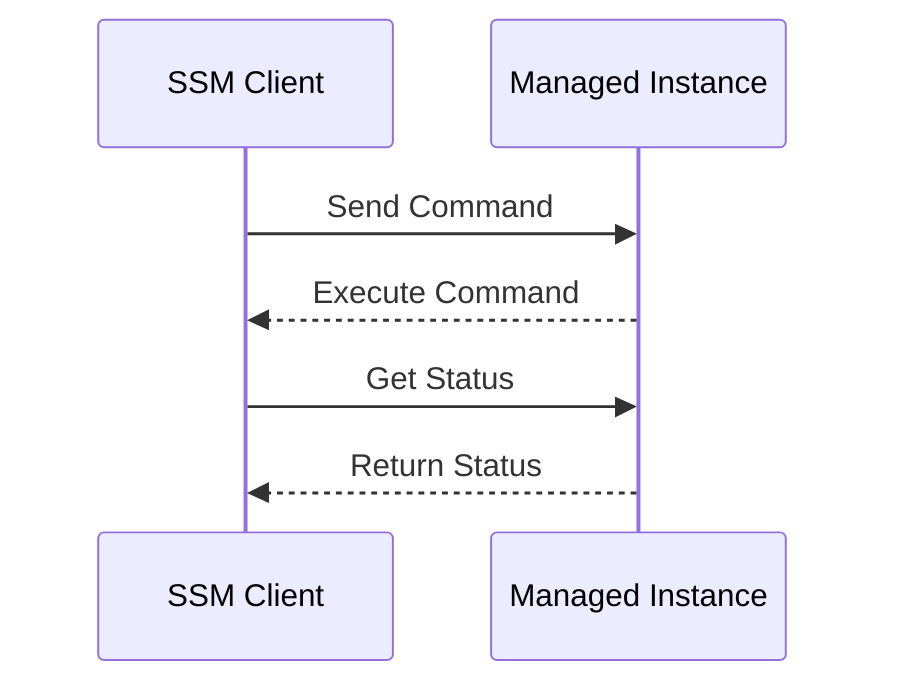

## Secure Continuous Deployment to Server Using SSM

### Background Theory

Secure Continuous Deployment (SCD) is a practice that combines continuous integration (CI) and continuous delivery (CD) with security controls to ensure that applications are deployed securely and efficiently. One of the key tools used in SCD is AWS Systems Manager (SSM), which provides a suite of capabilities to manage and automate tasks across your infrastructure.

AWS Systems Manager (SSM) allows you to remotely execute commands on managed instances, such as EC2 instances, on-premises servers, and virtual machines. This capability is crucial for automating deployment processes, ensuring that updates and configurations are applied consistently and securely.

### Problem Context

In the context of deploying applications continuously, one common challenge is ensuring that commands executed via SSM complete successfully before proceeding to the next steps. This is particularly important when dealing with multi-command sequences, such as logging into an instance, pulling a Docker image, and starting a container.

The problem arises when the SSM command execution does not provide immediate feedback about the completion status. Without proper handling, subsequent commands might start before the previous ones have finished, leading to inconsistent states or errors.

### Solution Overview

To address this issue, a common approach is to introduce a delay (sleep) between command executions to allow time for the previous command to complete. This ensures that the system has enough time to process the command and return the correct status.

### Detailed Explanation

#### Command Execution Flow

When using SSM to execute commands on an EC2 instance, the typical flow involves:

1. **Sending the Command**: The SSM client sends a command to the managed instance.
2. **Command Execution**: The instance executes the command.
3. **Status Check**: The client checks the status of the command execution.

This process can be visualized using a mermaid diagram:



#### Multi-Command Execution

When executing multiple commands sequentially, it is essential to ensure that each command completes before the next one starts. This can be achieved by introducing a delay between commands.

For example, consider the following sequence of commands:

1. Log into the instance.
2. Pull a Docker image.
3. Start a Docker container.

Without proper handling, these commands might overlap, leading to inconsistent states. To avoid this, we can introduce a delay between each command.

### Complete Example

Let's walk through a complete example of how to execute these commands using SSM with appropriate delays.

#### Step 1: Log into the Instance

First, we log into the instance using SSH. This command might look like:

```bash
ssh -i /path/to/key.pem ec2-user@<instance-ip>
```

#### Step 2: Pull a Docker Image

Next, we pull a Docker image. This command might look like:

```bash
docker pull <image-name>:<tag>
```

#### Step 3: Start a Docker Container

Finally, we start a Docker container. This command might look like:

```bash
docker run -d --name <container-name> <image-name>:<tag>
```

### Implementing Delays

To ensure that each command completes before the next one starts, we can introduce a delay using the `sleep` command. Here’s how the complete sequence would look:

```bash
ssh -i /path/to/key.pem ec2-user@<instance-ip>
sleep 10
docker pull <image-name>:<tag>
sleep 10
docker run -d --name <container-name> <image-name>:<tag>
```

### Full SSM Command Execution

To execute these commands via SSM, we can use the `aws ssm send-command` command. Here’s an example:

```bash
aws ssm send-command \
  --instance-ids <instance-id> \
  --document-name "AWS-RunShellScript" \
  --parameters '{"commands":["ssh -i /path/to/key.pem ec2-user@<instance-ip>", "sleep 10", "docker pull <image-name>:<tag>", "sleep 10", "docker run -d --name <container-name> <image-name>:<tag>"]}'
```

### Handling Command Output

When executing commands via SSM, it is crucial to handle the output correctly. The output includes standard output (stdout), standard error (stderr), and the exit status of the command.

Here’s an example of the full HTTP request and response for an SSM command execution:

```http
POST / HTTP/1.1
Host: ssm.amazonaws.com
Content-Type: application/x-amz-json-1.1
X-Amz-Target: AmazonSSM.SendCommand

{
  "InstanceIds": ["<instance-id>"],
  "DocumentName": "AWS-RunShellScript",
  "Parameters": {
    "commands": [
      "ssh -i /path/to/key.pem ec2-user@<instance-ip>",
      "sleep 10",
      "docker pull <image-name>:<tag>",
      "sleep 10",
      "docker run -d --name <container-name> <image-name>:<tag>"
    ]
  }
}
```

Response:

```http
HTTP/1.1 200 OK
Content-Type: application/x-amz-json-1.1

{
  "Command": {
    "CommandId": "<command-id>",
    "DocumentName": "AWS-RunShellScript",
    "Parameters": {
      "commands": [
        "ssh -i /path/to/key.pem ec2-user@<instance-ip>",
        "sleep 10",
        "docker pull <image-name>:<tag>",
        "sleep 10",
        "docker run -d --name <container-name> <image-name>:<tag>"
      ]
    },
    "Status": "Success",
    "StandardOutputContent": "Login succeeded\nPulling image...\nContainer started with ID: <container-id>",
    "StandardErrorContent": "Warning: Some issues occurred during execution"
  }
}
```

### Pitfalls and Common Mistakes

1. **Insufficient Delay**: Not providing enough time for commands to complete can lead to inconsistent states.
2. **Incorrect Command Order**: Executing commands in the wrong order can cause errors or unexpected behavior.
3. **Ignoring Errors**: Failing to check the standard error output can hide critical issues.

### How to Prevent / Defend

#### Detection

To detect issues with command execution, you can monitor the standard error output and the exit status of the commands. Tools like AWS CloudWatch can be used to log and alert on errors.

#### Prevention

1. **Use Proper Delays**: Ensure that sufficient delays are introduced between commands to allow for completion.
2. **Check Exit Status**: Always check the exit status of commands to ensure they completed successfully.
3. **Logging and Monitoring**: Use logging and monitoring tools to track command execution and detect issues.

#### Secure Coding Fixes

Here’s an example of how to implement secure coding practices:

**Vulnerable Code:**

```bash
ssh -i /path/to/key.pem ec2-user@<instance-ip>
docker pull <image-name>:<tag>
docker run -d --name <container-name> <image-name>:<tag>
```

**Secure Code:**

```bash
ssh -i /path/to/key.pem ec2-user@<instance-ip>
sleep 10
docker pull <image-name>:<tag>
sleep 10
docker run -d --name <container-name> <image-name>:<tag>
```

### Real-World Examples

#### Recent CVEs and Breaches

One recent example of a breach related to improper command execution is the Log4j vulnerability (CVE-2021-44228). In this case, attackers exploited a flaw in the logging mechanism to execute arbitrary commands on affected systems. Ensuring proper command execution and monitoring can help mitigate such risks.

### Hands-On Labs

For hands-on practice with Secure Continuous Deployment and SSM, consider the following labs:

- **PortSwigger Web Security Academy**: Offers modules on secure deployment practices.
- **OWASP Juice Shop**: Provides a vulnerable web application for practicing secure deployment techniques.
- **CloudGoat**: A cloud security training platform that includes scenarios for secure deployment using SSM.

These labs will help you gain practical experience in implementing secure continuous deployment practices using SSM.

### Conclusion

By understanding the principles of secure continuous deployment and the role of SSM in managing command execution, you can ensure that your deployments are both efficient and secure. Proper handling of command sequences, including the introduction of delays and thorough monitoring, is crucial for maintaining consistent and reliable systems.

---
<!-- nav -->
[[03-Secure Continuous Deployment to Server Using SSM Part 2|Secure Continuous Deployment to Server Using SSM Part 2]] | [[DevSecOps/DevSecOps Bootcamp/05-Application Security Testing/10-Secure Continuous Deployment & DAST/Secure Continuous Deployment to Server using SSM/00-Overview|Overview]] | [[05-Secure Continuous Deployment to Server Using SSM Part 4|Secure Continuous Deployment to Server Using SSM Part 4]]
