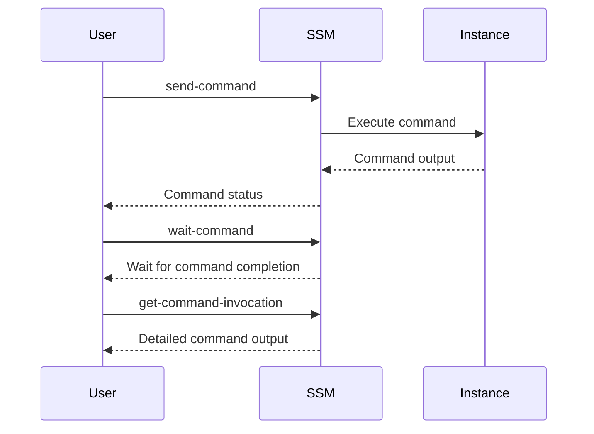

## Secure Continuous Deployment to Server Using SSM

### Introduction to Secure Continuous Deployment

Secure Continuous Deployment (SCD) is a critical aspect of modern DevSecOps practices. It ensures that software deployments are automated, consistent, and secure. In this context, we will focus on using AWS Systems Manager (SSM) for secure continuous deployment to servers. SSM provides a suite of tools that help manage and configure your instances at scale, ensuring that deployments are both efficient and secure.

### Overview of SSM Commands

AWS Systems Manager (SSM) offers several commands to manage and deploy applications securely. Two key commands are `send-command` and `wait-command`. These commands are used to execute scripts or commands on managed instances and to wait for the completion of these commands, respectively.

#### `send-command`

The `send-command` command is used to execute a specific command or script on one or more managed instances. This command is essential for deploying applications or performing maintenance tasks remotely. Here’s an example of how to use `send-command`:

```bash
aws ssm send-command \
    --document-name "AWS-RunShellScript" \
    --instance-ids "i-0123456789abcdef0" \
    --comment "Deploy application" \
    --parameters '{"commands":["cd /path/to/app && ./deploy.sh"]}'
```

This command sends a shell script (`./deploy.sh`) to the specified instance (`i-0123456789abcdef0`). The script is executed in the `/path/to/app` directory.

#### `wait-command`

The `wait-command` command is used to wait for the completion of a previously sent command. This is particularly useful when you want to ensure that a command has completed successfully before proceeding with further actions. Here’s an example of how to use `wait-command`:

```bash
aws ssm wait-command \
    --command-id "command-id-0123456789abcdef0"
```

This command waits for the completion of the command with the specified ID (`command-id-0123456789abcdef0`).

### Precision and Timing in Command Execution

One of the advantages of using `wait-command` is that it provides precise control over the timing of command execution. Unlike other methods that might require manual intervention to check the status of a command, `wait-command` automatically waits until the command completes. This ensures that subsequent steps in your deployment process are only executed after the previous command has finished.

However, there are some downsides to using `wait-command`, particularly related to error handling and precision.

### Error Handling with `wait-command`

One of the main disadvantages of using `wait-command` is its limited error handling capabilities. When a command fails, `wait-command` will return a failure status, but it will not provide detailed information about the failure. This can make it difficult to diagnose and resolve issues.

Let’s consider an example where a command fails due to incorrect information being passed:

```bash
aws ssm send-command \
    --document-name "AWS-RunShellScript" \
    --instance-ids "i-0123456789abcdef0" \
    --comment "Deploy application" \
    --parameters '{"commands":["cd /path/to/app && ./deploy.sh wrong-info"]}'
```

If the command fails due to the incorrect information (`wrong-info`), `wait-command` will return a failure status without providing detailed information about the failure:

```bash
aws ssm wait-command \
    --command-id "command-id-0123456789abcdef0"
```

In this case, `wait-command` will return a failure status, but it will not provide the exact reason for the failure.

### Detailed Error Handling with `get-command-invocation`

To overcome the limitations of `wait-command`, you can use the `get-command-invocation` command to retrieve detailed information about the command execution. This command provides a comprehensive view of the command’s output, including any errors that occurred during execution.

Here’s an example of how to use `get-command-invocation`:

```bash
aws ssm get-command-invocation \
    --command-id "command-id-0123456789abcdef0" \
    --instance-id "i-0123456789abcdef0"
```

This command retrieves the detailed output of the command with the specified ID (`command-id-0123456789abcdef0`) on the specified instance (`i-0123456789abcdef0`). The output includes the standard output, standard error, and exit code of the command.

### Comparison of `wait-command` and `get-command-invocation`

To illustrate the difference between `wait-command` and `get-command-invocation`, let’s consider a scenario where a command fails due to incorrect information being passed.

#### Using `wait-command`

When using `wait-command`, the output will be minimal and will not provide detailed information about the failure:

```bash
aws ssm wait-command \
    --command-id "command-id-0123456789abcdef0"
```

Output:
```
{
    "CommandId": "command-id-0123456789abcdef0",
    "Status": "Failed"
}
```

#### Using `get-command-invocation`

When using `get-command-invocation`, the output will provide detailed information about the failure:

```bash
aws ssm get-command-invocation \
    --command-id "command-id-0123456789abcdef0" \
    --instance-id "i-0123456789abcdef0"
```

Output:
```
{
    "CommandId": "command-id-0123456789abcdef0",
    "InstanceId": "i-0123456789abcdef0",
    "Comment": "Deploy application",
    "DocumentName": "AWS-RunShellScript",
    "StandardOutputContent": "",
    "StandardErrorContent": "Error: wrong-info is not a valid parameter\n",
    "ExitCode": 1,
    "Status": "Failed"
}
```

As you can see, `get-command-invocation` provides detailed information about the failure, including the standard error content and the exit code.

### How to Prevent / Defend

To ensure that your deployments are secure and reliable, it is important to implement proper error handling and logging mechanisms. Here are some best practices:

1. **Use `get-command-invocation` for detailed error handling**: Always use `get-command-invocation` to retrieve detailed information about command execution. This will help you diagnose and resolve issues more effectively.

2. **Implement logging and monitoring**: Ensure that all command executions are logged and monitored. This will help you track the status of your deployments and identify any issues that arise.

3. **Validate input parameters**: Before executing a command, validate all input parameters to ensure that they are correct and valid. This will help prevent errors caused by incorrect information being passed.

4. **Use secure coding practices**: Follow secure coding practices to ensure that your scripts and commands are secure. This includes using parameterized queries, validating user input, and avoiding hard-coded credentials.

5. **Regularly review and update your deployment scripts**: Regularly review and update your deployment scripts to ensure that they are secure and up-to-date. This will help you stay ahead of potential security vulnerabilities.

### Real-World Examples

To illustrate the importance of proper error handling and logging, let’s consider a recent real-world example involving a security breach.

#### Example: CVE-2021-3929

CVE-2021-3929 is a security vulnerability in the Jenkins CI/CD platform that allows attackers to execute arbitrary commands on the server. This vulnerability was exploited by attackers to gain unauthorized access to Jenkins servers and execute malicious commands.

In this case, proper error handling and logging would have helped detect and mitigate the attack. By using `get-command-invocation` to retrieve detailed information about command execution, administrators could have identified the malicious commands and taken appropriate action to prevent further damage.

### Conclusion

Secure Continuous Deployment using AWS Systems Manager (SSM) is a powerful tool for managing and deploying applications securely. While `wait-command` provides precise control over the timing of command execution, it has limitations in terms of error handling. To overcome these limitations, it is recommended to use `get-command-invocation` to retrieve detailed information about command execution. By implementing proper error handling and logging mechanisms, you can ensure that your deployments are secure and reliable.

### Practice Labs

For hands-on practice with SSM and secure continuous deployment, consider the following labs:

- **PortSwigger Web Security Academy**: Offers a variety of labs focused on web application security, including secure continuous deployment.
- **OWASP Juice Shop**: A deliberately insecure web application for security training, which can be used to practice secure deployment techniques.
- **CloudGoat**: A set of labs focused on AWS security, including secure continuous deployment using SSM.

By completing these labs, you can gain practical experience with secure continuous deployment and improve your skills in DevSecOps.

### Diagrams

#### Mermaid Diagram: SSM Command Execution Flow



This diagram illustrates the flow of command execution using SSM, including the use of `send-command`, `wait-command`, and `get-command-invocation`.

### Summary

In summary, secure continuous deployment using AWS Systems Manager (SSM) is a critical aspect of modern DevSecOps practices. By understanding the nuances of `send-command`, `wait-command`, and `get-command-invocation`, you can ensure that your deployments are secure and reliable. Proper error handling and logging mechanisms are essential for detecting and mitigating potential security vulnerabilities. By following best practices and completing hands-on labs, you can gain the skills and knowledge needed to implement secure continuous deployment effectively.

---
<!-- nav -->
[[04-Secure Continuous Deployment to Server Using SSM Part 3|Secure Continuous Deployment to Server Using SSM Part 3]] | [[DevSecOps/DevSecOps Bootcamp/05-Application Security Testing/10-Secure Continuous Deployment & DAST/Secure Continuous Deployment to Server using SSM/00-Overview|Overview]] | [[06-Secure Continuous Deployment to Server Using SSM Part 5|Secure Continuous Deployment to Server Using SSM Part 5]]
