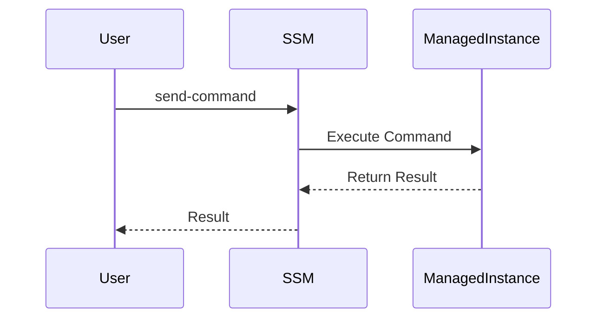
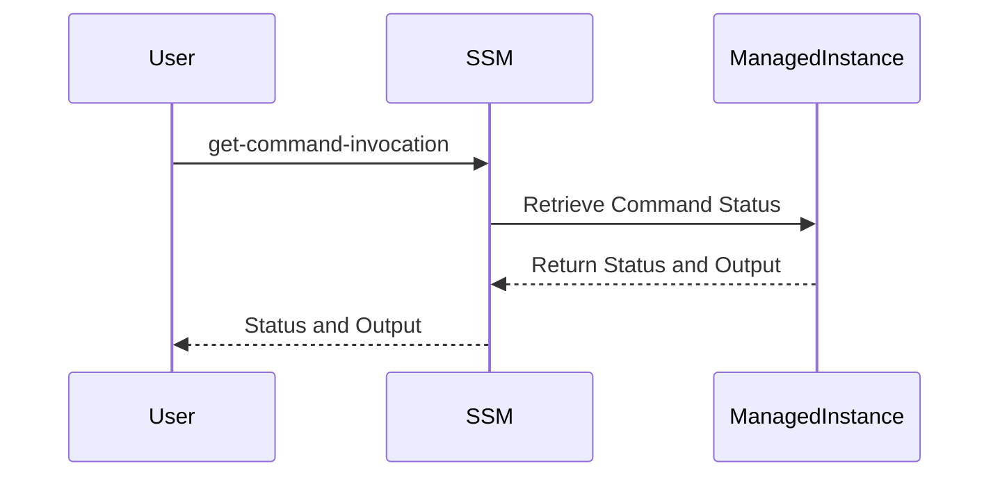

## Secure Continuous Deployment to Server Using SSM

### Introduction to Secure Continuous Deployment

Secure Continuous Deployment (SCD) is a critical aspect of modern DevSecOps practices. It ensures that applications are deployed securely and efficiently to production environments. One of the key tools used in this process is AWS Systems Manager (SSM), which provides a suite of capabilities to manage and deploy applications across various environments securely.

### Understanding SSM Commands

AWS Systems Manager (SSM) allows you to run commands on your managed instances. These commands can be used to automate tasks such as installing software, updating configurations, and performing health checks. Two important commands in this context are `send-command` and `get-command-invocation`.

#### `send-command`

The `send-command` command is used to execute a specific action on a managed instance. This could be anything from running a script to executing a system update. The command can be configured to fail the build if the execution is not successful.



#### `get-command-invocation`

The `get-command-invocation` command retrieves the status and output of a previously executed command. This is useful for monitoring the success or failure of a command and retrieving any output generated during its execution.



### Comparison Between `send-command` and `sleep` Command Execution

When deciding between using `send-command` and `sleep` for continuous deployment, it's essential to understand the implications of each approach.

#### `send-command`

- **Purpose**: Executes a specific command on a managed instance.
- **Failure Handling**: Can be configured to fail the build if the command execution is not successful.
- **Output**: Returns the output of the command execution.

#### `sleep` Command

- **Purpose**: Pauses the execution for a specified duration.
- **Failure Handling**: Does not inherently handle failures; the job is treated as successful regardless of the command's outcome.
- **Output**: Returns the output of the command execution.

### Example Usage

Let's consider an example where we use both `send-command` and `sleep` to deploy an application to an EC2 instance.

#### Using `send-command`

```bash
aws ssm send-command \
    --instance-ids i-1234567890abcdef0 \
    --document-name "AWS-RunShellScript" \
    --parameters '{"commands":["echo Hello World"]}' \
    --output json
```

This command will execute the `echo Hello World` command on the specified EC2 instance and return the result.

#### Using `sleep`

```bash
sleep 5
```

This command simply pauses the execution for 5 seconds.

### Security Improvements with SSM

Using SSM for deployment offers significant security improvements over traditional methods like SSH.

#### Traditional SSH Method

In the past, developers often used SSH to access and manage servers directly. This method has several drawbacks:

- **Authentication**: Relies on SSH keys or passwords, which can be compromised.
- **Authorization**: Limited control over what actions can be performed once access is granted.
- **Logging**: Minimal logging and auditing capabilities.

#### SSM Authentication and Authorization

SSM uses AWS Identity and Access Management (IAM) to authenticate and authorize requests. This means:

- **Authentication**: Uses IAM roles and policies to ensure only authorized users can execute commands.
- **Authorization**: Granular control over what actions can be performed on managed instances.
- **Logging**: Detailed logging and auditing capabilities provided by AWS CloudTrail.

### Real-World Examples

#### Recent Breaches

One notable breach involving SSH access occurred in 2021, where attackers gained unauthorized access to a company's servers by exploiting weak SSH credentials. This highlights the importance of using more secure methods like SSM for server management.

#### Secure Deployment Example

Consider a scenario where a company deploys a web application to an EC2 instance using SSM. The deployment process includes the following steps:

1. **Authenticate**: Use IAM roles to authenticate the deployment user.
2. **Authorize**: Ensure the user has the necessary permissions to execute commands on the EC2 instance.
3. **Deploy**: Use `send-command` to execute the deployment script on the EC2 instance.
4. **Monitor**: Use `get-command-invocation` to monitor the deployment process and retrieve any output.

### How to Prevent / Defend

#### Detection

To detect potential security issues during deployment, you can:

- **Monitor Logs**: Use AWS CloudTrail to monitor all API calls made to SSM.
- **Audit**: Regularly audit IAM roles and policies to ensure they are correctly configured.

#### Prevention

To prevent security issues during deployment, you can:

- **Use IAM Roles**: Ensure that only authorized users can execute commands on managed instances.
- **Configure SSM Policies**: Use SSM policies to restrict the types of commands that can be executed.
- **Enable Encryption**: Use encryption for data in transit and at rest.

#### Secure Coding Fixes

Here is an example of a vulnerable deployment script and its secure counterpart:

**Vulnerable Script**

```bash
ssh user@server "cd /path/to/app && git pull && npm install && npm start"
```

**Secure Script**

```bash
aws ssm send-command \
    --instance-ids i-1234567890abcdef0 \
    --document-name "AWS-RunShellScript" \
    --parameters '{"commands":["cd /path/to/app", "git pull", "npm install", "npm start"]}' \
    --output json
```

### Conclusion

Secure Continuous Deployment using SSM is a robust and secure method for deploying applications to production environments. By leveraging AWS's built-in mechanisms for authentication and authorization, you can significantly improve the security of your deployment process. Always ensure that you monitor and audit your deployment processes to detect and prevent potential security issues.

### Practice Labs

For hands-on practice with secure continuous deployment using SSM, consider the following labs:

- **PortSwigger Web Security Academy**: Offers exercises on secure deployment practices.
- **OWASP Juice Shop**: Provides a vulnerable web application for practicing secure deployment techniques.
- **CloudGoat**: A lab environment for practicing cloud security, including secure deployment using SSM.

By following these guidelines and practicing with real-world scenarios, you can master the art of secure continuous deployment using SSM.

---
<!-- nav -->
[[05-Secure Continuous Deployment to Server Using SSM Part 4|Secure Continuous Deployment to Server Using SSM Part 4]] | [[DevSecOps/DevSecOps Bootcamp/05-Application Security Testing/10-Secure Continuous Deployment & DAST/Secure Continuous Deployment to Server using SSM/00-Overview|Overview]] | [[07-Secure Continuous Deployment to Server Using SSM|Secure Continuous Deployment to Server Using SSM]]
