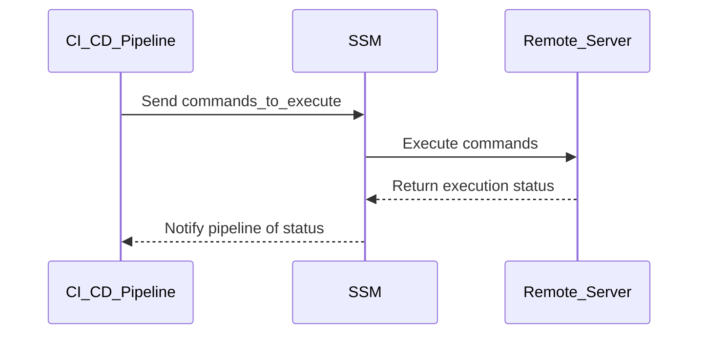

## Secure Continuous Deployment to Server Using SSM

### Introduction to Secure Continuous Deployment

Continuous deployment (CD) is an essential practice in modern software development, enabling teams to release new features and updates to production environments quickly and reliably. However, ensuring that this process remains secure is critical to preventing unauthorized access and potential vulnerabilities. In this section, we will explore how to securely deploy applications to servers using AWS Systems Manager (SSM).

### Setting Up Commands for Deployment

When deploying applications, especially through continuous integration and continuous deployment (CI/CD) pipelines, it is crucial to manage the commands that will be executed on the remote server. One effective way to handle this is by saving the commands into a shell variable. This approach helps in maintaining a clean and manageable script, especially when dealing with multiple commands.

#### Shell Variable for Commands

Let's define a shell variable named `commands_to_execute` that will store the commands to be executed on the remote server. This variable will hold a series of commands, including Docker operations, which are commonly used in containerized environments.

```bash
commands_to_execute="docker pull <image_name>:<tag>; \
                     docker rm -f <container_name> || true; \
                     docker run -d --name <container_name> <image_name>:<tag>"
```

In this example, the commands are chained together using semicolons (`;`). Each command is executed sequentially, and the `|| true` ensures that the script continues even if a command fails.

### Chaining Commands with Dependencies

To ensure that each command is executed only if the previous one succeeds, we can use the `&&` operator. This operator checks the exit status of the preceding command and proceeds only if it is successful.

```bash
commands_to_execute="docker pull <image_name>:<tag> && \
                     docker rm -f <container_name> && \
                     docker run -d --name <container_name> <image_name>:<tag>"
```

Here, the `docker pull` command will be executed first. If it succeeds, the `docker rm` command will be executed. If both succeed, the `docker run` command will be executed.

### Handling Command Combinations

Sometimes, commands need to be combined in more complex ways, such as using `||` to provide fallback options. For instance, if a command fails, we might want to return a success status to avoid breaking the entire script.

```bash
commands_to_execute="docker pull <image_name>:<tag> && \
                     (docker rm -f <container_name> || true) && \
                     docker run -d --name <container_name> <image_name>:<tag>"
```

In this example, the `docker rm` command is enclosed in parentheses and followed by `|| true`. This ensures that if the `docker rm` command fails, the script will continue without interruption.

### Full Example with Docker Commands

Let's put together a complete example of a deployment script using Docker commands:

```bash
commands_to_execute="docker pull myapp:latest && \
                     (docker rm -f myapp_container || true) && \
                     docker run -d --name myapp_container myapp:latest"
```

This script will:
1. Pull the latest version of the Docker image.
2. Remove the existing container if it exists.
3. Run a new container with the updated image.

### Secure Execution Using AWS SSM

AWS Systems Manager (SSM) provides a secure way to execute commands on managed instances. We can use the `aws ssm send-command` command to execute the `commands_to_execute` variable on a remote server.

```bash
aws ssm send-command \
    --instance-ids <instance_id> \
    --document-name "AWS-RunShellScript" \
    --parameters '{"commands":["'"$commands_to_execute"'"]}' \
    --output json
```

This command sends the `commands_to_execute` to the specified instance ID and executes it using the `AWS-RunShellScript` document.

### Diagram of the Deployment Process

A mermaid diagram can help visualize the deployment process:



### Real-World Examples and CVEs

Recent breaches and CVEs highlight the importance of secure deployment practices. For example, CVE-2021-20225 involved a vulnerability in Docker that allowed attackers to escalate privileges and gain control of the host system. Ensuring that your deployment scripts are secure and that your environment is hardened against such vulnerabilities is crucial.

### How to Prevent / Defend

#### Detection

To detect potential issues during deployment, you can use tools like AWS CloudTrail to monitor API calls made to SSM and other services. Additionally, setting up logging and monitoring for your CI/CD pipeline can help identify any anomalies or unauthorized activities.

#### Prevention

1. **Secure Configuration**: Ensure that your SSM configurations are secure. Use IAM roles and policies to restrict access to SSM and other AWS services.
   
2. **Secure Coding Practices**: Follow secure coding practices when writing deployment scripts. Avoid hardcoding sensitive information and use environment variables or secrets management solutions.

3. **Validation and Testing**: Validate the commands before execution and test them in a controlled environment to ensure they behave as expected.

4. **Hardening**: Harden your Docker images and containers by following best practices such as using non-root users, removing unnecessary packages, and applying security patches.

### Complete Example with Raw HTTP Messages

While the primary focus here is on the command execution via SSM, it's worth noting that similar principles apply to HTTP-based deployments. Here’s an example of a full HTTP request and response for a hypothetical deployment API:

```http
POST /deployments HTTP/1.1
Host: api.example.com
Content-Type: application/json
Authorization: Bearer <access_token>

{
  "commands": [
    "docker pull myapp:latest",
    "docker rm -f myapp_container || true",
    "docker run -d --name myapp_container myapp:latest"
  ]
}
```

Response:

```http
HTTP/1.1 200 OK
Content-Type: application/json

{
  "status": "success",
  "message": "Deployment commands executed successfully"
}
```

### Common Pitfalls and Best Practices

#### Pitfalls

1. **Hardcoding Sensitive Information**: Avoid hardcoding sensitive information such as passwords or access tokens in your scripts.
2. **Ignoring Exit Codes**: Always check the exit codes of commands to ensure that they have executed successfully.
3. **Overly Permissive Permissions**: Ensure that your deployment scripts and environment have the minimum necessary permissions.

#### Best Practices

1. **Use Environment Variables**: Store sensitive information in environment variables or use secrets management solutions.
2. **Validate Inputs**: Validate all inputs to your deployment scripts to prevent injection attacks.
3. **Monitor and Log**: Monitor and log all deployment activities to detect any suspicious behavior.

### Hands-On Labs

For practical experience with secure continuous deployment, consider the following labs:

- **PortSwigger Web Security Academy**: Offers modules on secure coding and deployment practices.
- **OWASP Juice Shop**: Provides a vulnerable web application for practicing secure deployment techniques.
- **CloudGoat**: A cloud security training platform that includes scenarios for securing AWS services, including SSM.

By following these guidelines and best practices, you can ensure that your continuous deployment processes are secure and reliable.

---
<!-- nav -->
[[06-Secure Continuous Deployment to Server Using SSM Part 5|Secure Continuous Deployment to Server Using SSM Part 5]] | [[DevSecOps/DevSecOps Bootcamp/05-Application Security Testing/10-Secure Continuous Deployment & DAST/Secure Continuous Deployment to Server using SSM/00-Overview|Overview]] | [[DevSecOps/DevSecOps Bootcamp/05-Application Security Testing/10-Secure Continuous Deployment & DAST/Secure Continuous Deployment to Server using SSM/08-Practice Questions & Answers|Practice Questions & Answers]]
