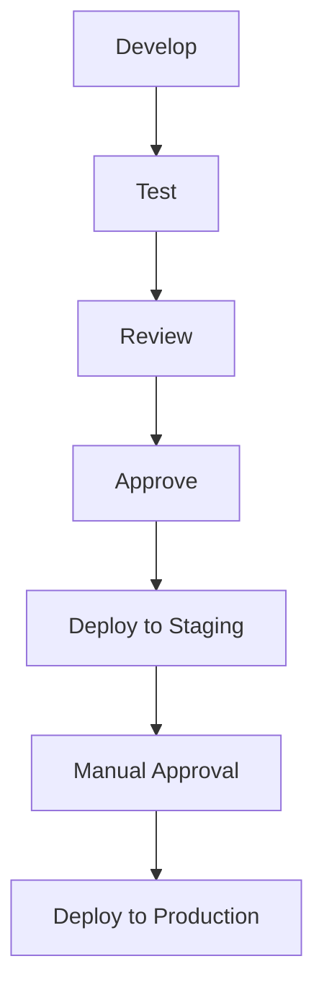
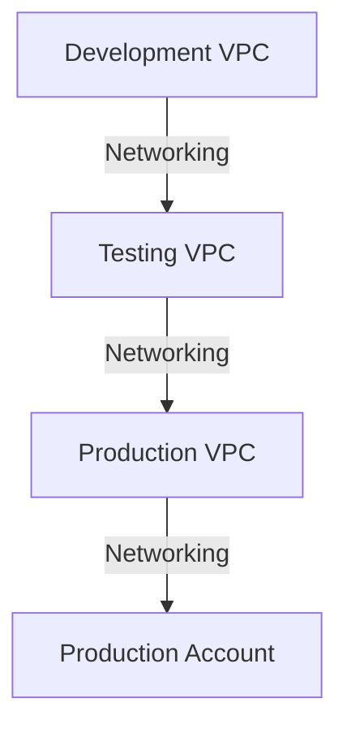
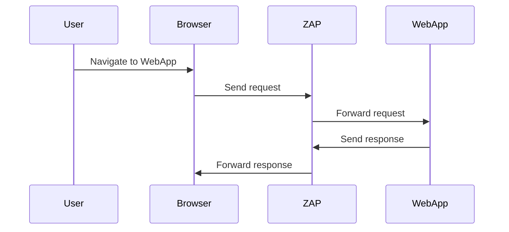

## Secure Continuous Deployment & Dynamic Application Security Testing (DAST)

### Introduction to Continuous Deployment

Continuous Deployment (CD) is an extension of Continuous Integration (CI) where the software is automatically deployed to the production environment after passing through various stages of testing and approval. This process ensures that the software is always in a deployable state and can be released to users at any time. However, the deployment process itself must be secure to prevent unauthorized access and ensure the integrity of the application.

### Manual Deployment to Production

In many organizations, the final step of deploying to the production environment is often done manually. This is due to the critical nature of the production environment and the potential risks associated with automatic deployments. The manual step allows for human oversight and decision-making, ensuring that the deployment is safe and appropriate.

#### Example Scenario

Consider a scenario where a new feature is being deployed to a web application. After the feature passes through the CI pipeline, including unit tests, integration tests, and static analysis, the final step is to deploy it to the production environment. This deployment is typically done manually by a system administrator or a designated team member.



### Isolation of Environments

To ensure the security and stability of the production environment, it is crucial to isolate it from other environments such as development and testing. This isolation can be achieved using different Virtual Private Clouds (VPCs) or even separate AWS accounts.

#### Example Configuration

Suppose we have a web application hosted on AWS. The development and testing environments are in one VPC, while the production environment is in a completely separate VPC. Additionally, the production environment might be in a different AWS account altogether.



### Manual Trigger for Deployment

The deployment to the production environment is often configured to require a manual trigger. This ensures that the deployment does not happen automatically and requires explicit approval from a human operator.

#### Example Configuration

Let's consider a deployment pipeline using Jenkins. The pipeline includes stages for building, testing, and deploying to staging. The final stage for deploying to production is configured to require a manual trigger.

```yaml
pipeline {
    agent any
    stages {
        stage('Build') {
            steps {
                sh 'make build'
            }
        }
        stage('Test') {
            steps {
                sh 'make test'
            }
        }
        stage('Deploy to Staging') {
            steps {
                sh 'make deploy-staging'
            }
        }
        stage('Deploy to Production') {
            when {
                expression { currentBuild.rawBuild.getUpstreamBuilds().isEmpty() }
            }
            steps {
                input message: 'Approve deployment to production?', parameters: [[$class: 'BooleanParameterDefinition', defaultValue: false, description: '', name: 'Approve']]
                sh 'make deploy-production'
            }
        }
    }
}
```

### Dynamic Application Security Testing (DAST)

Dynamic Application Security Testing (DAST) is a type of security testing that involves testing the application while it is running. DAST tools simulate attacks on the application to identify vulnerabilities and weaknesses. This type of testing is particularly useful for identifying security issues that may arise during runtime.

#### Example Tool: OWASP ZAP

One popular DAST tool is OWASP ZAP (Zed Attack Proxy). ZAP is an open-source tool that can be used to find security vulnerabilities in web applications. It works by intercepting HTTP(S) traffic between the user and the web application, allowing it to analyze the traffic and identify potential security issues.

##### Example Configuration

Let's configure ZAP to test a web application. First, we need to start ZAP and set up the proxy settings in our browser to route traffic through ZAP.



Next, we can use ZAP to scan the web application for vulnerabilities. ZAP provides a variety of scanning options, including active and passive scanning.

```bash
zap-cli --port 8080 quick-scan http://example.com
```

### Common Pitfalls and How to Prevent Them

#### Pitfall: Automated Deployments Without Proper Testing

Automating deployments without proper testing can lead to security vulnerabilities being introduced into the production environment. It is crucial to ensure that all automated deployments go through thorough testing and validation.

**How to Prevent:**

- **Implement Comprehensive Testing:** Ensure that all automated deployments go through comprehensive testing, including unit tests, integration tests, and security tests.
- **Use DAST Tools:** Integrate DAST tools into the CI/CD pipeline to automatically test the application for security vulnerabilities.

#### Example Vulnerability: CVE-2021-21972

CVE-2021-21972 is a vulnerability in the Jenkins CI/CD platform that allows attackers to execute arbitrary code on the Jenkins server. This vulnerability was introduced due to insufficient validation of user input.

**Secure Code Fix:**

```java
// Vulnerable code
public void handleRequest(HttpServletRequest request) {
    String param = request.getParameter("cmd");
    Runtime.getRuntime().exec(param);
}

// Secure code
public void handleRequest(HttpServletRequest request) {
    String param = request.getParameter("cmd");
    if (param != null && !param.isEmpty()) {
        // Validate input
        if (param.matches("[a-zA-Z0-9]+")) {
            Runtime.getRuntime().exec(param);
        } else {
            throw new IllegalArgumentException("Invalid command");
        }
    }
}
```

### Real-World Example: Capital One Data Breach

In 2019, Capital One suffered a data breach where sensitive customer information was exposed. The breach was caused by a misconfigured web application firewall (WAF) that allowed an attacker to access the data. This incident highlights the importance of proper configuration and testing of security controls.

**Detection and Prevention:**

- **Regular Security Audits:** Conduct regular security audits to identify and mitigate potential vulnerabilities.
- **Proper Configuration Management:** Ensure that all security controls, such as WAFs, are properly configured and tested.

### Hands-On Labs

For hands-on practice with DAST and secure continuous deployment, consider the following labs:

- **PortSwigger Web Security Academy:** Offers a variety of labs focused on web application security, including DAST.
- **OWASP Juice Shop:** A deliberately insecure web application for practicing security testing.
- **DVWA (Damn Vulnerable Web Application):** Another intentionally vulnerable web application for learning security testing techniques.

By following these guidelines and practices, you can ensure that your continuous deployment process is both efficient and secure, protecting your application from potential vulnerabilities and attacks.

---
<!-- nav -->
[[DevSecOps/DevSecOps Bootcamp/05-Application Security Testing/10-Secure Continuous Deployment & DAST/Understand Dynamic Application Security Testing DAST/00-Overview|Overview]] | [[02-Understanding Dynamic Application Security Testing (DAST) Part 1|Understanding Dynamic Application Security Testing (DAST) Part 1]]
