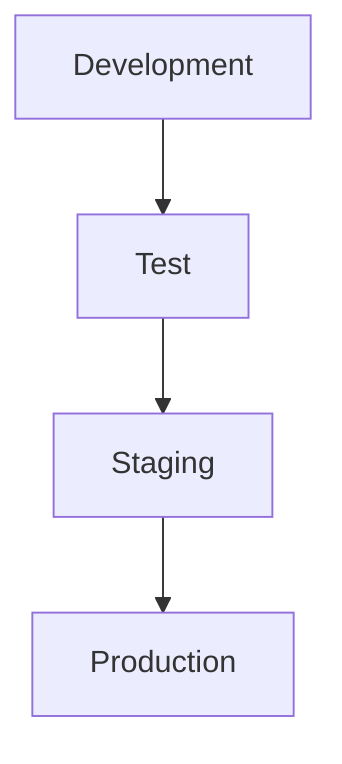

## Understanding Dynamic Application Security Testing (DAST)

Dynamic Application Security Testing (DAST) is a crucial component of the DevSecOps pipeline, designed to identify security vulnerabilities in applications during runtime. This method involves simulating attacks on a live application to detect potential security weaknesses. One popular tool for DAST is OWASP Zed Attack Proxy (ZAP), which can be integrated into continuous deployment pipelines to ensure that applications are secure before reaching production.

### What is DAST?

Dynamic Application Security Testing (DAST) is a type of security testing performed on a running application. Unlike Static Application Security Testing (SAST), which analyzes the source code, DAST focuses on the behavior of the application in a live environment. This approach allows testers to identify vulnerabilities that might arise due to runtime conditions, such as input validation errors, SQL injection, cross-site scripting (XSS), and others.

#### Why Use DAST?

DAST is essential because it provides a real-time view of how an application behaves under various attack scenarios. By simulating actual attacks, DAST helps identify vulnerabilities that might not be apparent through static analysis alone. This is particularly important in the context of DevSecOps, where the goal is to integrate security practices throughout the software development lifecycle.

### OWASP Zed Attack Proxy (ZAP)

OWASP Zed Attack Proxy (ZAP) is an open-source web application security scanner that can be used for DAST. ZAP is designed to help developers and security professionals find security vulnerabilities in web applications. It supports both manual and automated scanning modes and can be integrated into continuous integration/continuous deployment (CI/CD) pipelines.

#### How ZAP Works

ZAP operates by intercepting HTTP(S) traffic between the client and the server. It can be configured to automatically scan the application for known vulnerabilities or to perform custom scans based on specific rules. ZAP supports various types of attacks, including:

- **SQL Injection**: Exploiting vulnerabilities in database queries.
- **Cross-Site Scripting (XSS)**: Injecting malicious scripts into web pages viewed by other users.
- **Cross-Site Request Forgery (CSRF)**: Forcing authenticated users to execute unwanted actions.
- **Sensitive Data Exposure**: Identifying unprotected sensitive data.

#### Integrating ZAP into the DevSecOps Pipeline

In a typical DevSecOps pipeline, applications are deployed in stages, starting from development to testing and finally to production. Each stage includes various types of testing to ensure the application is functioning correctly and securely.



1. **Development Stage**: At this stage, the application is deployed to a local or development environment. Basic functionality and unit tests are performed to ensure the application works as intended.
2. **Test Stage**: The application is deployed to a test environment where more comprehensive testing is conducted. This includes functional testing, performance testing, and DAST using tools like ZAP.
3. **Staging Stage**: Before moving to production, the application is deployed to a staging environment. Here, additional testing is performed to ensure that the application does not break existing features and that new features work as expected.
4. **Production Stage**: After passing all previous stages, the application is deployed to the production environment.

### Automating DAST in the Pipeline

To automate DAST in the pipeline, ZAP can be integrated using scripts or CI/CD tools. Below is an example of how to set up ZAP for automated DAST in a CI/CD pipeline.

#### Example: Setting Up ZAP in a CI/CD Pipeline

1. **Install ZAP**: Ensure ZAP is installed and available in your CI/CD environment.
2. **Configure ZAP**: Set up ZAP to target the application URL.
3. **Run Automated Scans**: Use ZAP's API to initiate automated scans.

Here is a sample script to integrate ZAP into a CI/CD pipeline:

```bash
#!/bin/bash

# Start ZAP in daemon mode
zap.sh -daemon

# Wait for ZAP to start
sleep 10

# Target the application URL
curl "http://localhost:8080/JSON/core/action/accessUrl/?url=http://your-application-url"

# Run the spider
curl "http://localhost:8080/JSON/spider/action/scan/?url=http://your-application-url&recursive=true"

# Wait for the spider to finish
sleep 60

# Run the active scan
curl "http://localhost:8080/JSON/ascan/action/scan/?url=http://your-application-url&recursive=true"

# Wait for the active scan to finish
sleep 120

# Get the report
curl "http://localhost:8080/JSON/core/view/alerts/"

# Stop ZAP
curl "http://localhost:8080/JSON/core/action/shutdown/"
```

### Real-World Examples and Recent CVEs

#### Example: CVE-2021-21972

CVE-2021-21972 is a critical vulnerability found in Apache Struts, a popular Java framework. This vulnerability allowed attackers to execute arbitrary code on the server. DAST tools like ZAP could have detected this vulnerability by simulating attacks and identifying the presence of unsafe deserialization.

#### Example: CVE-2022-22965

CVE-2022-22965 is a vulnerability in Log4j, a widely used logging library. This vulnerability allowed attackers to execute arbitrary code by injecting malicious log messages. DAST tools could have identified this vulnerability by simulating log injection attacks.

### Common Pitfalls and Best Practices

#### Common Pitfalls

1. **False Positives/Negatives**: DAST tools may generate false positives or negatives, leading to incorrect conclusions about the application's security.
2. **Configuration Issues**: Improper configuration of DAST tools can result in incomplete or inaccurate scans.
3. **Performance Impact**: Running DAST scans can impact the performance of the application, especially in high-load environments.

#### Best Practices

1. **Regular Updates**: Keep DAST tools updated to ensure they can detect the latest vulnerabilities.
2. **Proper Configuration**: Configure DAST tools according to the application's specific requirements.
3. **Automated Integration**: Integrate DAST into the CI/CD pipeline to ensure regular and consistent security testing.

### How to Prevent / Defend

#### Detection

To detect vulnerabilities using DAST, integrate tools like ZAP into the CI/CD pipeline and run regular scans. Analyze the results to identify and prioritize vulnerabilities for remediation.

#### Prevention

To prevent vulnerabilities, follow these steps:

1. **Secure Coding Practices**: Implement secure coding practices to minimize the likelihood of introducing vulnerabilities.
2. **Regular Audits**: Conduct regular security audits and penetration testing to identify and mitigate vulnerabilities.
3. **Patch Management**: Keep all dependencies and libraries up-to-date to ensure they are patched against known vulnerabilities.

#### Secure Code Fix

Below is an example of a vulnerable code snippet and its secure counterpart:

**Vulnerable Code:**
```java
public String logMessage(String message) {
    logger.info(message);
    return "Logged successfully";
}
```

**Secure Code:**
```java
public String logMessage(String message) {
    if (message != null && !message.isEmpty()) {
        logger.info(message.replaceAll("[^a-zA-Z0-9 ]", ""));
    }
    return "Logged successfully";
}
```

### Conclusion

Dynamic Application Security Testing (DAST) is a vital component of the DevSecOps pipeline, helping to identify and mitigate security vulnerabilities in live applications. Tools like OWASP Zed Attack Proxy (ZAP) can be effectively integrated into CI/CD pipelines to ensure that applications are secure before reaching production. By following best practices and integrating DAST into the development process, organizations can significantly enhance their application security posture.

### Hands-On Labs

For hands-on practice with DAST, consider the following resources:

- **PortSwigger Web Security Academy**: Offers interactive labs to learn and practice web security techniques.
- **OWASP Juice Shop**: A deliberately insecure web application for practicing web security skills.
- **DVWA (Damn Vulnerable Web Application)**: A PHP/MySQL web application that is riddled with vulnerabilities for educational purposes.
- **WebGoat**: An interactive, gamified training application for learning about web application security.

These resources provide practical experience in identifying and mitigating security vulnerabilities using DAST tools like ZAP.

---
<!-- nav -->
[[DevSecOps/DevSecOps Bootcamp/05-Application Security Testing/10-Secure Continuous Deployment & DAST/Understand Dynamic Application Security Testing DAST/01-Secure Continuous Deployment & Dynamic Application Security Testing (DAST)|Secure Continuous Deployment & Dynamic Application Security Testing (DAST)]] | [[DevSecOps/DevSecOps Bootcamp/05-Application Security Testing/10-Secure Continuous Deployment & DAST/Understand Dynamic Application Security Testing DAST/00-Overview|Overview]] | [[03-Understanding Dynamic Application Security Testing (DAST) Part 2|Understanding Dynamic Application Security Testing (DAST) Part 2]]
