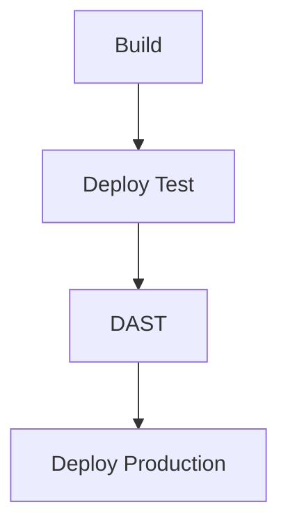

## Understanding Dynamic Application Security Testing (DAST)

Dynamic Application Security Testing (DAST) is a crucial component of modern DevSecOps practices. It involves testing an application while it is running to identify vulnerabilities and security weaknesses. This approach is particularly effective because it simulates real-world attacks and provides insights into how an application behaves under various conditions. In this section, we will delve into the details of integrating DAST into a continuous deployment pipeline, including configuration, execution, and handling of critical issues.

### Background Theory

#### What is DAST?

Dynamic Application Security Testing (DAST) is a type of security testing performed on a running application. Unlike Static Application Security Testing (SAST), which analyzes the source code, DAST focuses on the behavior of the application during runtime. This makes DAST particularly useful for identifying vulnerabilities that might not be apparent from the source code alone.

#### Why Use DAST?

DAST is essential for several reasons:

1. **Real-World Simulations**: DAST simulates actual attacks, providing a more accurate representation of potential security threats.
2. **Behavioral Analysis**: By testing the application in a live environment, DAST can uncover issues related to runtime behavior, such as race conditions or timing attacks.
3. **Comprehensive Coverage**: DAST can detect vulnerabilities that might be missed by SAST, especially those related to configuration or deployment issues.

### Integrating DAST into a Continuous Deployment Pipeline

To effectively integrate DAST into a continuous deployment pipeline, we need to consider several key aspects:

1. **Pipeline Structure**: Define the stages of your deployment pipeline.
2. **DAST Configuration**: Set up DAST jobs within the pipeline.
3. **Handling Critical Issues**: Implement mechanisms to halt the pipeline if critical issues are detected.

#### Pipeline Structure

A typical deployment pipeline consists of several stages, such as build, test, and deploy. For our purposes, we will focus on a simplified pipeline with the following stages:

1. **Build**: Compile and package the application.
2. **Deploy Test**: Deploy the application to a test environment.
3. **DAST**: Perform dynamic security testing on the deployed application.
4. **Deploy Production**: Deploy the application to the production environment.

Let's visualize this pipeline using a `mermaid` diagram:



#### DAST Configuration

To configure DAST in our pipeline, we will use a popular tool like OWASP ZAP (Zed Attack Proxy). ZAP is an open-source web application security scanner that can be integrated into CI/CD pipelines.

Here’s how to set up a DAST job using ZAP:

1. **Install ZAP**: Ensure ZAP is installed and available in your pipeline environment.
2. **Configure ZAP Job**: Add a job to your pipeline that runs ZAP against the deployed application.

For example, using a Jenkins pipeline, the configuration might look like this:

```groovy
pipeline {
    agent any
    stages {
        stage('Build') {
            steps {
                // Build steps
            }
        }
        stage('Deploy Test') {
            steps {
                // Deploy to test environment
            }
        }
        stage('DAST') {
            steps {
                script {
                    def zap = tool 'OWASP-ZAP'
                    sh "${zap}/zap.sh -cmd -quickurl http://test-server-url"
                }
            }
        }
        stage('Deploy Production') {
            steps {
                // Deploy to production environment
            }
        }
    }
}
```

In this example, the `DAST` stage runs ZAP against the deployed application at `http://test-server-url`.

#### Handling Critical Issues

One of the most important aspects of integrating DAST into a continuous deployment pipeline is ensuring that critical issues halt the pipeline. This prevents vulnerable code from being deployed to production.

To achieve this, we can configure our pipeline to check the results of the DAST scan and fail the pipeline if any critical issues are found.

For example, using Jenkins, we can add a post-build action to check the ZAP report:

```groovy
pipeline {
    agent any
    stages {
        stage('Build') {
            steps {
                // Build steps
            }
        }
        stage('Deploy Test') {
            steps {
                // Deploy to test environment
            }
        }
        stage('DAST') {
            steps {
                script {
                    def zap = tool 'OWASP-ZAP'
                    sh "${zap}/zap.sh -cmd -quickurl http://test-server-url"
                }
            }
        }
    }
    post {
        always {
            script {
                def zapReport = readFile 'zap-report.html'
                if (zapReport.contains('Critical')) {
                    error 'Critical issues found in DAST report.'
                }
            }
        }
    }
}
```

In this example, the pipeline checks the ZAP report for any mentions of "Critical" issues and fails the pipeline if any are found.

### Real-World Examples

#### Recent CVEs and Breaches

DAST has been instrumental in identifying and mitigating vulnerabilities in real-world applications. Here are a few recent examples:

1. **CVE-2021-21972**: This vulnerability was discovered in the Apache Log4j library, which is widely used in Java applications. DAST tools were able to identify and exploit this vulnerability, leading to widespread security updates.
2. **SolarWinds Supply Chain Attack**: This attack involved the compromise of SolarWinds software, which was then distributed to customers. DAST could have helped identify the malicious code inserted into the software.

### Common Pitfalls and Best Practices

#### Common Pitfalls

1. **False Positives**: DAST tools can sometimes generate false positives, leading to unnecessary work for developers.
2. **Performance Impact**: Running DAST can slow down the deployment process, especially if the tests are resource-intensive.
3. **Configuration Complexity**: Configuring DAST tools can be complex, requiring expertise in both security and automation.

#### Best Practices

1. **Automate DAST**: Integrate DAST into your CI/CD pipeline to ensure it runs automatically with each deployment.
2. **Use Multiple Tools**: Combine DAST with other security testing methods, such as SAST and IAST, to achieve comprehensive coverage.
3. **Regular Updates**: Keep your DAST tools and configurations up-to-date to ensure they can detect the latest vulnerabilities.

### How to Prevent / Defend

#### Detection

To detect vulnerabilities using DAST, follow these steps:

1. **Run Regular Scans**: Schedule regular DAST scans as part of your deployment pipeline.
2. **Review Reports**: Carefully review the reports generated by DAST tools to identify and prioritize vulnerabilities.

#### Prevention

To prevent vulnerabilities from being deployed to production, implement the following measures:

1. **Fail Fast**: Configure your pipeline to fail if any critical issues are detected during the DAST scan.
2. **Manual Review**: Include manual review steps before deploying to production to ensure all identified issues have been addressed.

#### Secure Coding Fixes

Here’s an example of a vulnerable code snippet and its secure counterpart:

**Vulnerable Code:**

```python
def login(username, password):
    if username == "admin" and password == "password":
        return True
    else:
        return False
```

**Secure Code:**

```python
import hashlib

def login(username, password):
    hashed_password = hashlib.sha256(password.encode()).hexdigest()
    if username == "admin" and hashed_password == "hashed_password_value":
        return True
    else:
        return False
```

In this example, the secure code uses a hashed password instead of storing the password in plain text.

### Complete Example

Here’s a complete example of a pipeline configuration with DAST:

```yaml
stages:
  - stage: Build
    jobs:
      - job: BuildJob
        steps:
          - script: |
              # Build steps
              echo "Building the application..."
  - stage: DeployTest
    jobs:
      - job: DeployTestJob
        steps:
          - script: |
              # Deploy to test environment
              echo "Deploying to test environment..."
  - stage: DAST
    jobs:
      - job: DASTJob
        steps:
          - script: |
              # Run DAST using OWASP ZAP
              zap.sh -cmd -quickurl http://test-server-url
  - stage: DeployProduction
    jobs:
      - job: DeployProductionJob
        steps:
          - script: |
              # Deploy to production environment
              echo "Deploying to production environment..."
```

### Conclusion

Integrating DAST into a continuous deployment pipeline is a powerful way to ensure the security of your applications. By following best practices and using tools like OWASP ZAP, you can detect and mitigate vulnerabilities before they reach production. Remember to automate the process, regularly update your tools, and include manual reviews to ensure comprehensive security coverage.

### Practice Labs

For hands-on experience with DAST, consider the following well-known labs:

- **PortSwigger Web Security Academy**: Offers interactive labs to practice web application security testing.
- **OWASP Juice Shop**: A deliberately insecure web application for practicing security testing.
- **DVWA (Damn Vulnerable Web Application)**: Another intentionally vulnerable web application for learning security testing.

These labs provide practical experience in identifying and mitigating vulnerabilities using DAST techniques.

---
<!-- nav -->
[[02-Understanding Dynamic Application Security Testing (DAST) Part 1|Understanding Dynamic Application Security Testing (DAST) Part 1]] | [[DevSecOps/DevSecOps Bootcamp/05-Application Security Testing/10-Secure Continuous Deployment & DAST/Understand Dynamic Application Security Testing DAST/00-Overview|Overview]] | [[04-Understanding Dynamic Application Security Testing (DAST)|Understanding Dynamic Application Security Testing (DAST)]]
