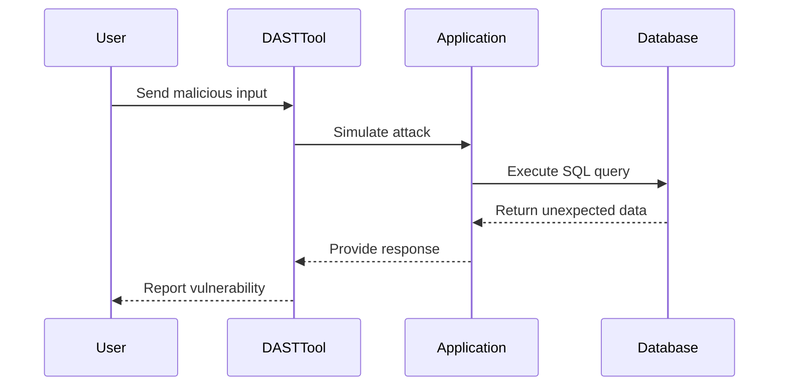

## Understanding Dynamic Application Security Testing (DAST)

Dynamic Application Security Testing (DAST) is a method of assessing the security of an application by interacting with it in a live environment. This approach simulates the behavior of an attacker to identify vulnerabilities and weaknesses in the application. By doing so, DAST helps organizations understand how their running application reacts to different hacking attempts, what information it might leak, and whether it allows unauthorized actions.

### What is DAST?

DAST involves sending various types of inputs to the application and analyzing its responses to determine if the application behaves securely. This method is particularly useful for identifying vulnerabilities that are exposed during runtime, such as SQL injection, cross-site scripting (XSS), and other common web application security issues.

#### Why Use DAST?

The primary reason for using DAST is to ensure that an application is secure against real-world attacks. Traditional static analysis methods, which examine the source code, cannot catch all potential vulnerabilities, especially those that arise due to runtime conditions. DAST complements static analysis by providing a more comprehensive view of the application's security posture.

### How Does DAST Work?

DAST tools simulate various types of attacks on the application and observe the responses. These tools typically have predefined sets of attack patterns and can automatically generate and send malicious input to the application. The tool then analyzes the application's responses to determine if any vulnerabilities are present.

#### Example Attack Scenarios

Let's consider a few common attack scenarios that DAST tools might simulate:

1. **SQL Injection**: Sending specially crafted SQL queries to the application to extract sensitive data.
2. **Cross-Site Scripting (XSS)**: Injecting malicious scripts into web pages viewed by other users.
3. **Command Injection**: Exploiting vulnerabilities in command execution to run arbitrary commands on the server.

### Real-World Examples

To illustrate the importance of DAST, let's look at some recent real-world examples where DAST could have helped identify and mitigate vulnerabilities:

1. **CVE-2021-44228 (Log4Shell)**: This vulnerability in Apache Log4j allowed attackers to execute arbitrary code on affected servers. A DAST tool could have identified this vulnerability by simulating remote code execution attacks.
2. **SolarWinds Supply Chain Attack (CVE-2020-1014)**: This attack involved the compromise of SolarWinds Orion software, which was then used to infiltrate numerous organizations. DAST could have helped identify vulnerabilities in the software that were exploited by the attackers.

### Complete Example: SQL Injection

Let's walk through a complete example of how a DAST tool might identify a SQL injection vulnerability.

#### Vulnerable Code

Consider the following PHP code snippet that interacts with a database:

```php
<?php
$servername = "localhost";
$username = "username";
$password = "password";
$dbname = "myDB";

// Create connection
$conn = new mysqli($servername, $username, $password, $dbname);

// Check connection
if ($conn->connect_error) {
    die("Connection failed: " . $conn->connect_error);
}

// Get user input
$user_input = $_GET['id'];

// Prepare SQL statement
$sql = "SELECT * FROM users WHERE id = '$user_input'";
$result = $conn->query($sql);

if ($result->num_rows > 0) {
    // Output data of each row
    while($row = $result->fetch_assoc()) {
        echo "id: " . $row["id"]. " - Name: " . $row["name"]. "<br>";
    }
} else {
    echo "0 results";
}
$conn->close();
?>
```

#### DAST Tool Simulation

A DAST tool would simulate an attack by sending a malicious input to the `id` parameter. For example, the tool might send the following request:

```http
GET /vulnerable.php?id=1' OR '1'='1
```

This input is designed to bypass the intended logic of the SQL query and return all rows from the `users` table.

#### Raw HTTP Request and Response

Here is the full HTTP request and response:

```http
GET /vulnerable.php?id=1' OR '1'='1 HTTP/1.1
Host: example.com
User-Agent: Mozilla/5.0 (Windows NT 10.0; Win64; x64) AppleWebKit/537.36 (KHTML, like Gecko) Chrome/91.0.4472.124 Safari/537.36
Accept: text/html,application/xhtml+xml,application/xml;q=0.9,image/webp,*/*;q=0.8
Accept-Language: en-US,en;q=0.5
Accept-Encoding: gzip, deflate
Connection: close

HTTP/1.1 200 OK
Date: Tue, 01 Mar 2022 12:00:00 GMT
Server: Apache/2.4.41 (Ubuntu)
Content-Type: text/html; charset=UTF-8
Content-Length: 1024
Connection: close

id: 1 - Name: John Doe<br>
id: 2 - Name: Jane Smith<br>
id: 3 - Name: Alice Johnson<br>
...
```

#### Analysis

The DAST tool would analyze the response and identify that the application returned more data than expected, indicating a potential SQL injection vulnerability.

### How to Prevent / Defend

#### Secure Coding Practices

To prevent SQL injection vulnerabilities, it is essential to use prepared statements and parameterized queries. Here is the corrected version of the code:

```php
<?php
$servername = "localhost";
$username = "username";
$password = "password";
$dbname = "myDB";

// Create connection
$conn = new mysqli($servername, $username, $password, $dbname);

// Check connection
if ($conn->connect_error) {
    die("Connection failed: " . $conn->connect_error);
}

// Get user input
$user_input = $_GET['id'];

// Prepare SQL statement
$stmt = $conn->prepare("SELECT * FROM users WHERE id = ?");
$stmt->bind_param("i", $user_input);
$stmt->execute();
$result = $stmt->get_result();

if ($result->num_rows > 0) {
    // Output data of each row
    while($row = $result->fetch_assoc()) {
        echo "id: " . $row["id"]. " - Name: ". $row["name"]. "<br>";
    }
} else {
    echo "0 results";
}
$stmt->close();
$conn->close();
?>
```

#### Detection and Prevention

To detect and prevent SQL injection vulnerabilities, organizations can implement the following measures:

1. **Use Prepared Statements**: Always use prepared statements and parameterized queries to prevent SQL injection.
2. **Input Validation**: Validate all user inputs to ensure they meet expected formats and constraints.
3. **Error Handling**: Implement proper error handling to avoid leaking sensitive information through error messages.
4. **Regular Security Audits**: Conduct regular security audits and penetration tests to identify and mitigate vulnerabilities.

### Mermaid Diagrams

#### Attack Flow Diagram



### Conclusion

Dynamic Application Security Testing (DAST) is a critical component of ensuring the security of web applications. By simulating real-world attacks, DAST helps identify vulnerabilities that might otherwise go unnoticed. Organizations should integrate DAST into their continuous deployment pipelines to maintain a robust security posture.

### Practice Labs

For hands-on experience with DAST, consider the following real-world labs:

- **PortSwigger Web Security Academy**: Offers a comprehensive set of labs covering various web application security topics, including DAST.
- **OWASP Juice Shop**: An intentionally insecure web application designed for security training and research.
- **DVWA (Damn Vulnerable Web Application)**: A PHP/MySQL web application that is riddled with vulnerabilities for educational purposes.

By leveraging these resources, you can gain practical experience in identifying and mitigating security vulnerabilities using DAST techniques.

---
<!-- nav -->
[[03-Understanding Dynamic Application Security Testing (DAST) Part 2|Understanding Dynamic Application Security Testing (DAST) Part 2]] | [[DevSecOps/DevSecOps Bootcamp/05-Application Security Testing/10-Secure Continuous Deployment & DAST/Understand Dynamic Application Security Testing DAST/00-Overview|Overview]] | [[05-Understanding Static and Dynamic Application Security Testing|Understanding Static and Dynamic Application Security Testing]]
