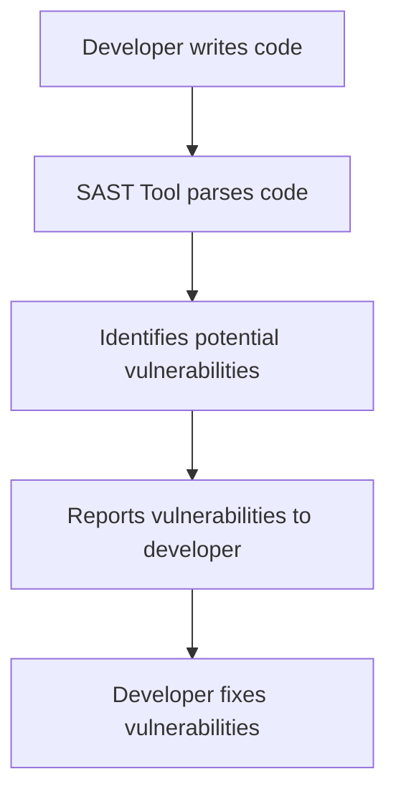
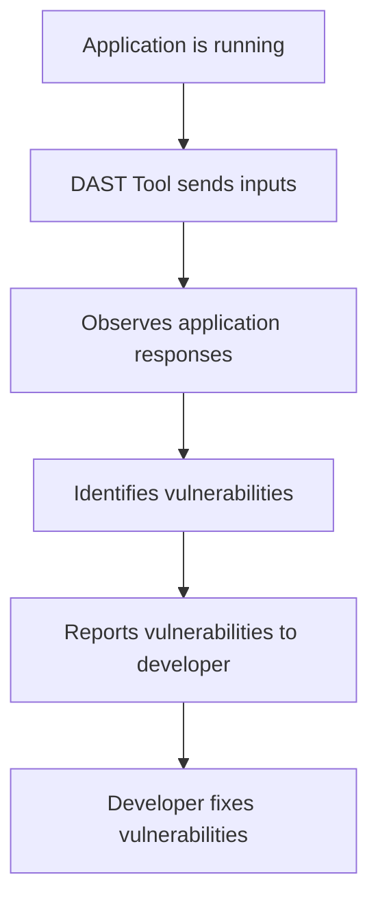

## Understanding Static and Dynamic Application Security Testing

### Background Theory

In the realm of DevSecOps, ensuring the security of applications is paramount. Two primary approaches to achieving this are Static Application Security Testing (SAST) and Dynamic Application Security Testing (DAST). Both methods serve different purposes and complement each other in providing comprehensive security coverage.

#### Static Application Security Testing (SAST)

SAST involves analyzing the source code of an application without executing it. This method is akin to taking apart the code or image layers and looking through them, often referred to as a white-box approach. By examining the code statically, SAST tools can identify potential security vulnerabilities such as SQL injection, cross-site scripting (XSS), and buffer overflows.

**Why SAST Matters:**
- **Early Detection:** SAST can catch issues early in the development lifecycle, reducing the cost and effort required to fix them later.
- **Comprehensive Analysis:** Since SAST examines the entire codebase, it can provide a thorough analysis of potential security weaknesses.

**How SAST Works:**
- **Code Parsing:** SAST tools parse the source code to understand its structure and logic.
- **Rule Matching:** These tools then apply a set of predefined rules to identify patterns that could lead to security vulnerabilities.
- **Reporting:** Once identified, these vulnerabilities are reported back to the developers for remediation.

**Example of SAST Tool:**
One popular SAST tool is SonarQube. Below is an example of how SonarQube might report a potential SQL injection vulnerability:

```plaintext
File: src/main/java/com/example/Application.java
Line: 45
Issue: Potential SQL Injection Vulnerability

Description: The SQL query is constructed using string concatenation, which can be exploited by an attacker to inject malicious SQL code.
```

**Pitfalls of SAST:**
- **False Positives:** SAST tools may generate false positives, where legitimate code is flagged as insecure.
- **Context Dependency:** Some vulnerabilities depend on runtime context, which SAST cannot fully capture.

### Dynamic Application Security Testing (DAST)

DAST, on the other hand, involves testing the application while it is running. This method is often referred to as a black-box approach because it does not require access to the source code or internal structures of the application. Instead, DAST tools interact with the application as an external user would, attempting to exploit vulnerabilities from the outside.

**Why DAST Matters:**
- **Real-World Scenarios:** DAST simulates real-world attacks, providing insights into how an application behaves under actual attack conditions.
- **Runtime Vulnerabilities:** Many security issues can only be detected during runtime, such as race conditions and timing attacks.

**How DAST Works:**
- **Automated Testing:** DAST tools automate the process of sending various inputs to the application and observing the responses.
- **Vulnerability Identification:** These tools look for signs of vulnerabilities such as unexpected behavior, error messages, or successful exploitation attempts.
- **Reporting:** Identified vulnerabilities are reported to the development team for further investigation and mitigation.

**Example of DAST Tool:**
One widely used DAST tool is Burp Suite. Below is an example of how Burp Suite might report a potential XSS vulnerability:

```plaintext
URL: http://example.com/login
Method: POST
Parameter: username
Payload: <script>alert('XSS')</script>
Response: 200 OK

Description: The application reflected the input back in the response, indicating a potential XSS vulnerability.
```

**Pitfalls of DAST:**
- **Limited Coverage:** DAST may miss vulnerabilities that are not exposed through the application's interfaces.
- **Complexity:** Setting up and configuring DAST tools can be complex and time-consuming.

### Real-World Examples

To illustrate the importance of both SAST and DAST, let's consider some recent real-world examples of security breaches.

#### Example 1: Equifax Data Breach (CVE-2017-5638)

The Equifax data breach in 2017 was caused by a vulnerability in Apache Struts, a popular web framework. This vulnerability was initially identified through static code analysis but was ultimately exploited through dynamic testing.

**Static Analysis:**
- **Tool Used:** Fortify
- **Vulnerability Identified:** Improper validation of user-supplied input leading to remote code execution.

**Dynamic Testing:**
- **Tool Used:** Burp Suite
- **Exploitation Attempt:** Sending crafted HTTP requests to trigger the vulnerability.

#### Example 2: Capital One Data Breach (CVE-2019-11510)

The Capital One data breach in 2019 was due to a misconfiguration in their web application firewall (WAF). This issue was not caught by static analysis but was identified through dynamic testing.

**Static Analysis:**
- **Tool Used:** SonarQube
- **No Issues Found:** The static analysis did not flag any issues related to WAF configuration.

**Dynamic Testing:**
- **Tool Used:** ZAP (Zed Attack Proxy)
- **Exploitation Attempt:** Bypassing the WAF to access sensitive data.

### How to Prevent / Defend

#### Detection

To effectively detect security vulnerabilities, a combination of both SAST and DAST is recommended. Here’s how to integrate these tools into your DevSecOps pipeline:

1. **Integrate SAST Tools:**
   - **SonarQube Configuration:**
     ```yaml
     sonar.projectKey=my-project
     sonar.sources=src
     sonar.language=java
     ```
   - **Run SonarQube Analysis:**
     ```bash
     sonar-scanner
     ```

2. **Integrate DAST Tools:**
   - **Burp Suite Setup:**
     - Install Burp Suite and configure it to intercept HTTP traffic.
     - Set up a proxy to route traffic through Burp Suite.
   - **Run Burp Suite Scan:**
     - Use Burp Suite's scanner to automatically test for vulnerabilities.

#### Prevention

To prevent security vulnerabilities, follow these best practices:

1. **Secure Coding Practices:**
   - **Input Validation:**
     ```java
     // Vulnerable Code
     String userInput = request.getParameter("username");
     String query = "SELECT * FROM users WHERE username = '" + userInput + "'";

     // Secure Code
     String userInput = request.getParameter("username");
     PreparedStatement pstmt = connection.prepareStatement("SELECT * FROM users WHERE username = ?");
     pstmt.setString(1, userInput);
     ResultSet rs = pstmt.executeQuery();
     ```
   - **Output Encoding:**
     ```html
     <!-- Vulnerable Code -->
     <div>{{ user_input }}</div>

     <!-- Secure Code -->
     <div>{{ user_input | escape }}</div>
     ```

2. **Configuration Hardening:**
   - **Web Application Firewall (WAF):**
     ```nginx
     server {
         listen 80;
         server_name example.com;

         location / {
             uwsgi_pass unix:/var/run/uwsgi/app.sock;
             include uwsgi_params;

             # WAF Configuration
             include /etc/nginx/waf.conf;
         }
     }
     ```

3. **Regular Security Audits:**
   - Conduct regular security audits using both SAST and DAST tools to ensure ongoing security.

### Mermaid Diagrams

#### SAST Workflow



#### DAST Workflow



### Practice Labs

For hands-on experience with DAST, consider the following labs:

- **PortSwigger Web Security Academy:** Offers interactive labs to practice DAST techniques.
- **OWASP Juice Shop:** A deliberately insecure web application for practicing security testing.
- **DVWA (Damn Vulnerable Web Application):** Another intentionally vulnerable web app for learning security testing.

By combining both SAST and DAST in your DevSecOps pipeline, you can ensure comprehensive security coverage and reduce the risk of vulnerabilities being exploited in production environments.

---
<!-- nav -->
[[04-Understanding Dynamic Application Security Testing (DAST)|Understanding Dynamic Application Security Testing (DAST)]] | [[DevSecOps/DevSecOps Bootcamp/05-Application Security Testing/10-Secure Continuous Deployment & DAST/Understand Dynamic Application Security Testing DAST/00-Overview|Overview]] | [[DevSecOps/DevSecOps Bootcamp/05-Application Security Testing/10-Secure Continuous Deployment & DAST/Understand Dynamic Application Security Testing DAST/06-Practice Questions & Answers|Practice Questions & Answers]]
