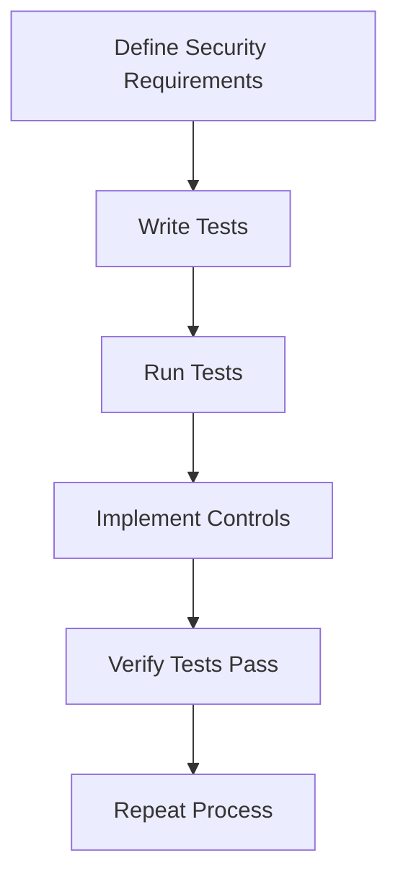

## Introduction to Automated Security Testing

Automated security testing is a critical component of modern software development practices, particularly within the DevSecOps framework. This approach leverages automation tools and techniques to systematically identify and mitigate security vulnerabilities throughout the software development lifecycle (SDLC). To understand automated security testing, it is essential to first grasp the broader concept of security testing.

### Security Testing Overview

Security testing is a process aimed at identifying vulnerabilities, threats, risks, and weaknesses in software applications. It ensures that the application is secure against unauthorized access, data breaches, and other malicious activities. Security testing can be broadly categorized into three main components:

1. **Test Paths**: These are the specific routes or sequences through which an application is tested to ensure that all functionalities are secure.
2. **Testing Methods**: These are the techniques used to perform security testing, such as static analysis, dynamic analysis, and penetration testing.
3. **Security Testing Types**: These include various types of security testing such as authentication testing, authorization testing, input validation testing, and more.

### Test-Driven Security

One of the key methodologies in security testing is test-driven security, which is closely related to test-driven development (TDD). In TDD, developers write tests before writing the actual code, ensuring that the code meets the specified requirements. Similarly, in test-driven security, the focus is on defining security requirements and writing tests to validate these requirements.

#### Steps in Test-Driven Security

1. **Define Security Requirements**:
   - Identify the security requirements that the application must meet. These requirements could include data encryption, user authentication, access controls, and more.
   - Example: A web application might require that all user passwords are hashed using bcrypt and stored securely.

2. **Write Tests for Each Requirement**:
   - Create automated tests that check whether the application complies with the defined security requirements.
   - Example: Write a test to ensure that passwords are hashed using bcrypt.

3. **Run the Tests**:
   - Execute the tests to determine if the application meets the security requirements.
   - Initially, the tests may fail because the required security controls are not yet implemented.

4. **Implement Security Controls**:
   - Develop and integrate the necessary security controls to address the identified requirements.
   - Example: Implement bcrypt hashing for storing passwords.

5. **Verify the Tests Pass**:
   - Re-run the tests to confirm that the security controls are correctly implemented and the application now meets the security requirements.

6. **Repeat the Process**:
   - Continue this cycle of writing tests, implementing controls, and verifying until all security requirements are satisfied.

### Example of Test-Driven Security

Let's consider a real-world example involving a web application that needs to ensure secure password storage. Here’s how the process would unfold:

#### Step 1: Define Security Requirements

- **Requirement**: Passwords must be hashed using bcrypt before being stored in the database.

#### Step 2: Write Tests for Each Requirement

```python
import bcrypt
from unittest.mock import patch
from myapp.models import User

def test_password_is_hashed_with_bcrypt():
    # Mock the bcrypt hash function
    with patch('bcrypt.hashpw') as mock_hashpw:
        # Set up the mock to return a dummy value
        mock_hashpw.return_value = b'dummy_hash'
        
        # Create a new user with a password
        user = User(password='mysecretpassword')
        
        # Check if the password is hashed using bcrypt
        assert user.password == b'dummy_hash'
```

#### Step 3: Run the Tests

Initially, the test will fail because the application does not yet hash passwords using bcrypt.

#### Step 4: Implement Security Controls

```python
import bcrypt
from myapp.models import User

class User(User):
    def set_password(self, password):
        # Hash the password using bcrypt
        self.password = bcrypt.hashpw(password.encode(), bcrypt.gensalt())
```

#### Step 5: Verify the Tests Pass

Re-run the tests to ensure that the password is now correctly hashed using bcrypt.

#### Step 6: Repeat the Process

Continue this process for all security requirements until the application is fully secure.

### Real-World Examples and Breaches

To illustrate the importance of test-driven security, let's examine some recent real-world examples and breaches:

#### Example 1: Equifax Data Breach (CVE-2017-5638)

In 2017, Equifax suffered a massive data breach due to a vulnerability in their Apache Struts web application framework. The breach exposed sensitive personal information of millions of individuals. One of the key issues was the lack of proper security testing and implementation of security controls.

- **Vulnerability**: CVE-2017-5638, a remote code execution vulnerability in Apache Struts.
- **Impact**: Exposure of sensitive data including Social Security numbers, birth dates, and addresses.
- **Prevention**: Regular security testing and timely patch management could have prevented this breach.

#### Example 2: Capital One Data Breach (CVE-2019-11510)

In 2019, Capital One experienced a significant data breach due to a misconfigured web application firewall (WAF). The breach exposed sensitive data of approximately 100 million customers and potential customers.

- **Vulnerability**: CVE-2019-11510, a server-side request forgery (SSRF) vulnerability.
- **Impact**: Exposure of sensitive financial and personal data.
- **Prevention**: Proper security testing and configuration management could have mitigated this risk.

### How to Prevent / Defend

To effectively prevent security breaches and ensure the robustness of security controls, the following steps should be taken:

1. **Regular Security Testing**:
   - Conduct regular security testing using automated tools and manual assessments.
   - Example: Use tools like OWASP ZAP, Burp Suite, and Nessus for automated security testing.

2. **Patch Management**:
   - Keep all software and dependencies up-to-date with the latest security patches.
   - Example: Implement a continuous integration/continuous deployment (CI/CD) pipeline to automate patch management.

3. **Secure Coding Practices**:
   - Follow secure coding guidelines and best practices.
   - Example: Use frameworks like OWASP ESAPI for secure coding.

4. **Configuration Management**:
   - Ensure that all configurations are secure and follow best practices.
   - Example: Use tools like Ansible and Terraform for infrastructure as code (IaC) to manage configurations securely.

5. **Incident Response Plan**:
   - Develop and maintain an incident response plan to quickly respond to security incidents.
   - Example: Use tools like Splunk and ELK Stack for monitoring and incident response.

### Complete Example of Automated Security Testing

Let's walk through a complete example of automated security testing using a web application. We will cover the full process from defining security requirements to implementing and verifying security controls.

#### Step 1: Define Security Requirements

- **Requirement**: Ensure that all user inputs are validated to prevent SQL injection attacks.

#### Step 2: Write Tests for Each Requirement

```python
import unittest
from myapp.models import User

class TestInputValidation(unittest.TestCase):
    def test_sql_injection_prevention(self):
        # Attempt to inject SQL
        user = User(username="admin' OR '1'='1")
        
        # Check if the input is properly sanitized
        self.assertNotEqual(user.username, "admin' OR '1'='1")
```

#### Step 3: Run the Tests

Initially, the test will fail because the application does not yet sanitize user inputs.

#### Step 4: Implement Security Controls

```python
import re
from myapp.models import User

class User(User):
    def __init__(self, username):
        # Sanitize the username to prevent SQL injection
        self.username = re.sub(r'[^\w\s]', '', username)
```

#### Step 5: Verify the Tests Pass

Re-run the tests to ensure that the input is now properly sanitized.

#### Step 6: Repeat the Process

Continue this process for all security requirements until the application is fully secure.

### Mermaid Diagrams

To visualize the process of test-driven security, we can use mermaid diagrams to illustrate the workflow.



### Conclusion

Automated security testing is a crucial aspect of modern software development, especially within the DevSecOps framework. By following a test-driven security approach, organizations can ensure that their applications are secure against various vulnerabilities and threats. Regular security testing, proper configuration management, and secure coding practices are essential to preventing security breaches and ensuring the robustness of security controls.

### Practice Labs

For hands-on experience with automated security testing, consider the following practice labs:

- **PortSwigger Web Security Academy**: Offers interactive labs to learn and practice web security testing.
- **OWASP Juice Shop**: A deliberately insecure web application for practicing security testing.
- **DVWA (Damn Vulnerable Web Application)**: A PHP/MySQL web application that is riddled with vulnerabilities for educational purposes.
- **WebGoat**: An interactive training application designed to teach web application security lessons.

By engaging with these labs, you can gain practical experience in automated security testing and improve your skills in securing software applications.

---
<!-- nav -->
[[DevSecOps/DevSecOps Bootcamp/05-Application Security Testing/11-Understanding Automated Security Testing/01-What Is Automated Security Testing/00-Overview|Overview]] | [[02-Understanding Automated Security Testing|Understanding Automated Security Testing]]
