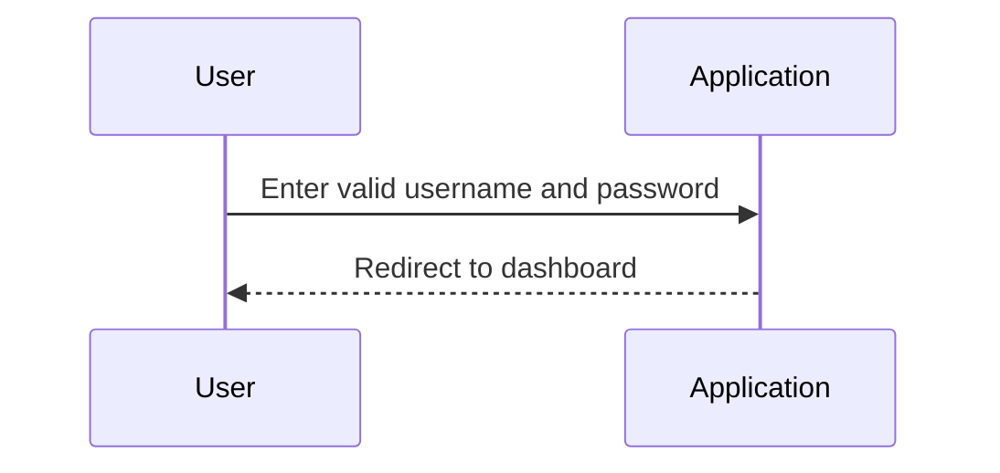
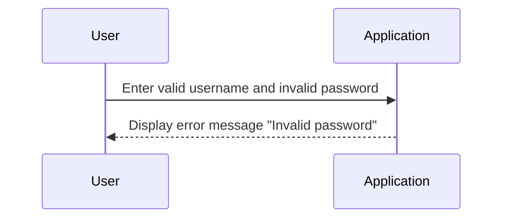

## Understanding Automated Security Testing

### Introduction to Automated Security Testing

Automated security testing is a critical component of modern DevSecOps practices. It involves using tools and frameworks to automatically check applications for security vulnerabilities and compliance issues. The primary goal is to ensure that security is integrated into the development lifecycle, rather than being treated as an afterthought. This approach not only helps in identifying and fixing security issues early but also ensures that the development team is aware of potential security risks from the outset.

### Test-Driven Security

Test-driven security is a methodology that emphasizes defining security requirements and testing them systematically. This approach forces the development team to think about security from the beginning of the project. By having a clear list of security requirements, the team can design and implement features that meet these requirements, thereby reducing the likelihood of introducing security vulnerabilities.

#### Why Test-Driven Security Matters

1. **Proactive Security**: Test-driven security encourages proactive thinking about security, which is crucial in today’s threat landscape.
2. **Early Detection**: Identifying and fixing security issues early in the development cycle is more cost-effective and less disruptive than addressing them later.
3. **Comprehensive Coverage**: Automated testing tools can cover a wide range of scenarios, ensuring that various aspects of security are thoroughly tested.

### Happy Path Testing

Happy path testing, also known as positive testing, focuses on verifying that the system behaves correctly under normal conditions. In this type of testing, both the input and the expected output are known. The goal is to confirm that the system produces the correct results when provided with valid inputs.

#### Example: User Login

Consider a scenario where a user logs into an application. The happy path would involve:

- **Input**: A valid username and password.
- **Expected Output**: Successful login and redirection to the dashboard.



### Negative Testing

Negative testing, also known as sad path or bad path testing, focuses on verifying that the system handles unexpected or invalid inputs gracefully. Unlike happy path testing, negative testing aims to identify and handle errors or exceptions that may occur due to incorrect inputs or unexpected behavior.

#### Example: Invalid Password

In the context of user login, negative testing would involve:

- **Input**: An invalid password.
- **Expected Output**: An error message indicating that the password is incorrect.



### Challenges of Negative Testing

One of the main challenges of negative testing is determining what constitutes an invalid input. Since the number of possible invalid inputs is potentially infinite, it can be difficult to cover all scenarios comprehensively. However, focusing on common types of invalid inputs and boundary conditions can help mitigate this issue.

#### Real-World Example: SQL Injection

SQL injection is a common type of security vulnerability that can be identified through negative testing. Consider a web application that allows users to search for products by name. If the application does not properly validate user input, an attacker could inject malicious SQL code to manipulate the database.

**Vulnerable Code**:

```python
def search_product(product_name):
    query = f"SELECT * FROM products WHERE name LIKE '%{product_name}%'"
    cursor.execute(query)
    return cursor.fetchall()
```

**Attack Scenario**:

An attacker could input `'; DROP TABLE products; --` as the product name, leading to the execution of the following SQL query:

```sql
SELECT * FROM products WHERE name LIKE '%'; DROP TABLE products; --%'
```

This would result in the deletion of the `products` table.

**Secure Code**:

To prevent SQL injection, parameterized queries should be used:

```python
def search_product(product_name):
    query = "SELECT * FROM products WHERE name LIKE %s"
    cursor.execute(query, ('%' + product_name + '%',))
    return cursor.fetchall()
```

### How to Prevent / Defend

#### Detection

1. **Static Analysis Tools**: Use static analysis tools like SonarQube, Fortify, or Veracode to scan code for potential security vulnerabilities.
2. **Dynamic Analysis Tools**: Employ dynamic analysis tools like Burp Suite, OWASP ZAP, or Acunetix to test applications for runtime vulnerabilities.

#### Prevention

1. **Input Validation**: Always validate user input to ensure it meets expected criteria. Use regular expressions or validation libraries to enforce input constraints.
2. **Parameterized Queries**: Use parameterized queries to prevent SQL injection attacks.
3. **Error Handling**: Implement proper error handling to avoid exposing sensitive information through error messages.

#### Secure Coding Practices

1. **Least Privilege Principle**: Ensure that applications run with the least privileges necessary to perform their tasks.
2. **Security Libraries**: Utilize well-maintained security libraries and frameworks to handle common security tasks.
3. **Code Reviews**: Conduct regular code reviews to identify and address security issues.

### Hands-On Labs

For practical experience with automated security testing, consider the following labs:

- **PortSwigger Web Security Academy**: Offers interactive labs to practice web security techniques, including automated testing.
- **OWASP Juice Shop**: A deliberately insecure web application for practicing security testing and penetration testing.
- **DVWA (Damn Vulnerable Web Application)**: Another intentionally vulnerable web application for learning security testing.

By integrating automated security testing into the DevSecOps pipeline, teams can significantly enhance the security posture of their applications while ensuring that security is a core consideration throughout the development process.

---
<!-- nav -->
[[DevSecOps/DevSecOps Bootcamp/05-Application Security Testing/11-Understanding Automated Security Testing/01-What Is Automated Security Testing/01-Introduction to Automated Security Testing|Introduction to Automated Security Testing]] | [[DevSecOps/DevSecOps Bootcamp/05-Application Security Testing/11-Understanding Automated Security Testing/01-What Is Automated Security Testing/00-Overview|Overview]] | [[DevSecOps/DevSecOps Bootcamp/05-Application Security Testing/11-Understanding Automated Security Testing/01-What Is Automated Security Testing/03-Practice Questions & Answers|Practice Questions & Answers]]
