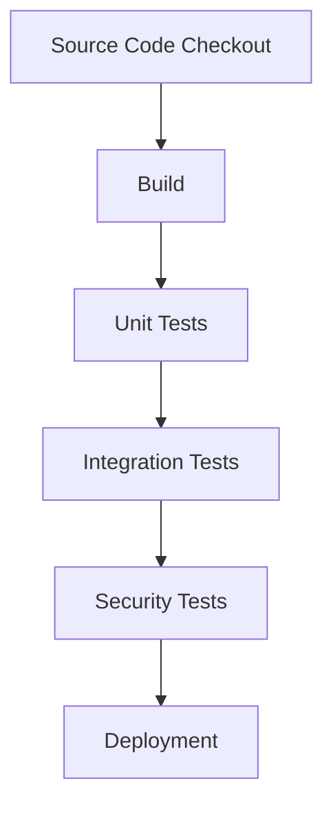

## Understanding Automated Security Testing

### Introduction to Automated Security Testing

Automated security testing is a critical component of modern DevSecOps practices. It refers to the process of using software tools to automatically perform security tests on applications, systems, or networks. Unlike manual testing, which requires human intervention, automated testing runs independently, allowing for continuous and consistent security checks throughout the development lifecycle.

#### What is Automated Security Testing?

Automated security testing encompasses both static and dynamic testing methods:

- **Static Testing**: This involves analyzing the source code or compiled binaries without executing them. Static analysis tools can identify potential vulnerabilities, coding errors, and security weaknesses in the codebase.
  
- **Dynamic Testing**: This involves running the application and monitoring its behavior in real-time. Dynamic analysis tools can detect runtime vulnerabilities, such as buffer overflows, SQL injection, and cross-site scripting (XSS).

Both static and dynamic testing can be performed manually or automatically. Automated testing offers several advantages, including speed, consistency, and scalability. It can be executed locally on a developer's machine or remotely on a centralized server.

### Integration into Build Pipelines

One of the key features of automated security testing is its integration into build pipelines. Build pipelines, also known as CI/CD (Continuous Integration/Continuous Deployment) pipelines, automate the process of building, testing, and deploying software. By integrating automated security testing into these pipelines, organizations can ensure that security checks are performed consistently and automatically with each build.

#### Example of Integration

Consider a typical CI/CD pipeline that includes the following stages:

1. **Source Code Checkout**
2. **Build**
3. **Unit Tests**
4. **Integration Tests**
5. **Security Tests**
6. **Deployment**

In this pipeline, the security tests stage can include various automated security tools, such as static analysis tools, dynamic analysis tools, and vulnerability scanners. These tools can be configured to run automatically whenever changes are pushed to the code repository.



### Negative Testing in Automated Security Testing

Automated security testing primarily focuses on negative testing, which means testing for unexpected behaviors, abuse cases, and errors rather than specific outcomes. This approach helps identify potential security vulnerabilities that might not be apparent through positive testing alone.

#### Traits of Automated Security Testing

- **Unexpected Behaviors**: Automated security testing looks for unexpected behaviors that could indicate security issues. For example, it might check for unauthorized access attempts or unexpected data leaks.
  
- **Abuse Cases**: It tests for scenarios where the system is used in unintended ways, such as exploiting vulnerabilities through malformed input or malicious actions.
  
- **Errors**: It identifies errors that could lead to security breaches, such as null pointer dereferences, buffer overflows, or SQL injection attacks.

### Comparison with Manual Security Testing

While automated security testing offers significant benefits, it is not a replacement for manual testing. Manual security testing involves human intervention and can provide deeper insights into the security posture of an application.

#### Examples of Manual Security Testing

- **Code Review**: One developer reviews the code written by another developer. This process can catch subtle security issues that automated tools might miss.
  
- **Manual Vulnerability Scanning**: A security expert manually scans the application for vulnerabilities, using their expertise to identify complex security issues.

#### Automated Version of Manual Testing

- **Source Code Scanning Tools**: Automated tools like SonarQube, Fortify, and Checkmarx can scan the source code for security vulnerabilities. These tools can identify issues such as insecure coding practices, potential data leaks, and compliance violations.
  
- **Credential Checking**: Automated tools can check for hardcoded passwords, API keys, and other sensitive information in the codebase. For example, tools like TruffleHog can scan repositories for secrets and alert developers to their presence.

### Real-World Examples and Recent Breaches

Recent breaches and vulnerabilities highlight the importance of automated security testing in modern DevSecOps practices.

#### Example: Heartbleed Bug (CVE-2014-0160)

The Heartbleed bug was a serious vulnerability in the OpenSSL cryptographic software library. It allowed attackers to read sensitive information from the memory of systems using OpenSSL, potentially exposing private keys, passwords, and other sensitive data.

- **Impact**: The Heartbleed bug affected millions of websites and services, leading to widespread security concerns and urgent updates.
  
- **Prevention**: Automated security testing tools could have detected the Heartbleed bug by scanning the OpenSSL code for known vulnerabilities and coding errors.

#### Example: Equifax Data Breach (2017)

The Equifax data breach exposed sensitive personal information of approximately 147 million consumers. The breach was caused by a vulnerability in the Apache Struts web application framework.

- **Impact**: The breach led to significant financial losses and reputational damage for Equifax.
  
- **Prevention**: Automated security testing tools could have identified the vulnerability in Apache Struts by performing regular security scans and vulnerability assessments.

### How to Prevent / Defend

To effectively prevent and defend against security vulnerabilities, organizations should implement a combination of automated and manual security testing practices.

#### Detection

- **Automated Security Scanning**: Integrate automated security scanning tools into the CI/CD pipeline to detect vulnerabilities and coding errors.
  
- **Regular Security Audits**: Perform regular security audits and penetration testing to identify and address security weaknesses.

#### Prevention

- **Secure Coding Practices**: Implement secure coding practices, such as input validation, error handling, and proper use of cryptographic functions.
  
- **Configuration Hardening**: Harden system configurations to minimize attack surfaces. For example, disable unnecessary services, configure firewalls, and apply security patches promptly.

#### Secure-Coding Fixes

Here is an example of a vulnerable code snippet and its secure version:

**Vulnerable Code:**
```python
import sqlite3

def get_user_data(user_id):
    conn = sqlite3.connect('database.db')
    cursor = conn.cursor()
    query = f"SELECT * FROM users WHERE id = {user_id}"
    cursor.execute(query)
    result = cursor.fetchone()
    conn.close()
    return result
```

**Secure Code:**
```python
import sqlite3

def get_user_data(user_id):
    conn = sqlite3.connect('database.db')
    cursor = conn.cursor()
    query = "SELECT * FROM users WHERE id = ?"
    cursor.execute(query, (user_id,))
    result = cursor.fetchone()
    conn.close()
    return result
```

In the secure version, parameterized queries are used to prevent SQL injection attacks.

### Complete Example: Full HTTP Request and Response

Consider a scenario where an automated security testing tool detects a potential XSS vulnerability in a web application.

**HTTP Request:**
```http
POST /submit HTTP/1.1
Host: example.com
Content-Type: application/x-www-form-urlencoded
Content-Length: 23

name=<script>alert(1)</script>
```

**HTTP Response:**
```http
HTTP/1.1 200 OK
Date: Mon, 23 Jan 2023 12:00:00 GMT
Server: Apache/2.4.41 (Ubuntu)
Content-Type: text/html; charset=UTF-8
Content-Length: 123

<!DOCTYPE html>
<html>
<head>
<title>Submit Form</title>
</head>
<body>
<h1>Form Submitted</h1>
<p>Name: <script>alert(1)</script></p>
</body>
</html>
```

In this example, the automated security testing tool detects that the application reflects user input without proper sanitization, leading to a potential XSS vulnerability.

### Common Pitfalls and Best Practices

When implementing automated security testing, organizations should be aware of common pitfalls and follow best practices:

- **False Positives**: Automated tools may generate false positives, where legitimate code is flagged as suspicious. It is important to review and validate findings to avoid unnecessary rework.
  
- **Tool Selection**: Choose the right tools based on the specific needs of the organization. Consider factors such as the type of application, the development language, and the security requirements.
  
- **Continuous Improvement**: Regularly update and improve the automated security testing processes to keep up with evolving threats and vulnerabilities.

### Hands-On Labs

For hands-on practice with automated security testing, consider the following well-known labs:

- **PortSwigger Web Security Academy**: Offers interactive labs to learn about web security vulnerabilities and how to test for them.
  
- **OWASP Juice Shop**: A deliberately insecure web application for practicing web security testing and ethical hacking.
  
- **DVWA (Damn Vulnerable Web Application)**: A PHP/MySQL web application that is intentionally vulnerable for educational purposes.

These labs provide practical experience in identifying and mitigating security vulnerabilities using both automated and manual testing techniques.

### Conclusion

Automated security testing is a crucial component of modern DevSecOps practices. By integrating automated security testing into build pipelines and focusing on negative testing, organizations can proactively identify and mitigate security vulnerabilities. While automated testing offers significant benefits, it should be complemented with manual testing to ensure comprehensive security coverage. By following best practices and using the right tools, organizations can enhance their security posture and protect their applications from emerging threats.

---
<!-- nav -->
[[DevSecOps/DevSecOps Bootcamp/05-Application Security Testing/11-Understanding Automated Security Testing/02-Manual vs Automated Testing/00-Overview|Overview]] | [[DevSecOps/DevSecOps Bootcamp/05-Application Security Testing/11-Understanding Automated Security Testing/02-Manual vs Automated Testing/02-Practice Questions & Answers|Practice Questions & Answers]]
