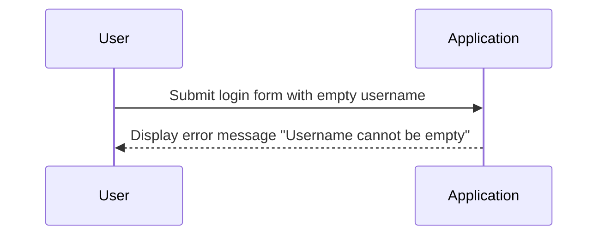

## Understanding Automated Security Testing

### Introduction to Automated Security Testing

Automated security testing is a critical component of modern DevSecOps practices. It involves using tools and processes to automatically identify security vulnerabilities and weaknesses within an application or system. This type of testing is primarily a form of negative testing, which means it focuses on identifying unexpected behaviors or outcomes rather than confirming expected ones.

#### Negative Testing vs Positive Testing

Negative testing is a method where the tester inputs invalid data or behaves in ways that are not intended by the application. The goal is to ensure that the application handles these unexpected scenarios gracefully and securely. In contrast, positive testing confirms that the application functions correctly under normal conditions.

**Why Negative Testing Matters:**
- **Security Vulnerabilities:** Negative testing helps uncover security vulnerabilities that might otherwise go unnoticed during regular testing.
- **Robustness:** Ensures that the application can handle unexpected input or behavior without crashing or exposing sensitive information.
- **Comprehensive Coverage:** Provides a more comprehensive coverage of potential issues compared to positive testing alone.

**Example of Negative Testing:**
Consider a login form where the username and password fields are required. A negative test case might involve submitting the form with an empty username field to see if the application properly handles this scenario.



### Static Application Security Testing (SAST)

Static Application Security Testing (SAST) is a type of automated security testing that analyzes the source code of an application without executing it. SAST tools scan the code for patterns that indicate potential security vulnerabilities such as SQL injection, cross-site scripting (XSS), and buffer overflows.

#### How SAST Works

SAST tools typically work by parsing the source code and applying a set of rules or heuristics to identify potential security issues. These rules are often based on known vulnerabilities and coding best practices.

**Example of SAST:**

Consider a Python application with the following code snippet:

```python
# Vulnerable code
def get_user_data(user_id):
    query = f"SELECT * FROM users WHERE id = {user_id}"
    result = execute_query(query)
    return result
```

A SAST tool would flag this code as potentially vulnerable to SQL injection because the `user_id` parameter is directly concatenated into the SQL query string.

**Secure Code Example:**

To mitigate this vulnerability, the code should use parameterized queries:

```python
# Secure code
def get_user_data(user_id):
    query = "SELECT * FROM users WHERE id = %s"
    result = execute_query(query, (user_id,))
    return result
```

**How to Prevent / Defend:**

- **Use Parameterized Queries:** Always use parameterized queries to prevent SQL injection attacks.
- **Code Reviews:** Regularly review code for security vulnerabilities.
- **Static Analysis Tools:** Integrate SAST tools into the continuous integration (CI) pipeline to automatically detect and report security issues.

### Dynamic Application Security Testing (DAST)

Dynamic Application Security Testing (DAST) involves testing the application while it is running. DAST tools simulate attacks on the live application to identify vulnerabilities such as SQL injection, XSS, and buffer overflows.

#### How DAST Works

DAST tools interact with the application through its user interface or API endpoints. They send various types of malicious input to the application and observe the responses to determine if the application is vulnerable to specific attacks.

**Example of DAST:**

Consider a web application with a search feature that allows users to enter a search term. A DAST tool might send the following malicious input to test for SQL injection:

```http
POST /search HTTP/1.1
Host: example.com
Content-Type: application/x-www-form-urlencoded

search_term=' OR '1'='1
```

If the application returns unexpected results or errors, it may indicate a vulnerability.

**How to Prevent / Defend:**

- **Input Validation:** Ensure that all user input is validated and sanitized.
- **Error Handling:** Implement proper error handling to avoid revealing sensitive information.
- **Security Headers:** Use security headers such as Content-Security-Policy (CSP) to mitigate XSS attacks.

### Vulnerability Scanning

Vulnerability scanning is a process of identifying known vulnerabilities in an application or system. This is typically done by comparing a list of assets (such as IP addresses, URLs, or software versions) against a database of known vulnerabilities.

#### How Vulnerability Scanning Works

Vulnerability scanners use a combination of techniques such as port scanning, service identification, and vulnerability databases to identify potential security issues. They can be configured to scan specific assets or entire networks.

**Example of Vulnerability Scanning:**

Consider a network with several servers running different versions of software. A vulnerability scanner might identify that one of the servers is running an outdated version of Apache HTTP Server that is vulnerable to CVE-2021-41773, a critical vulnerability that allows remote code execution.

**How to Prevent / Defend:**

- **Regular Updates:** Keep all software and systems up to date with the latest security patches.
- **Patch Management:** Implement a robust patch management process to ensure timely updates.
- **Network Segmentation:** Segment the network to limit the spread of vulnerabilities.

### Manual vs Automated Testing

While automated security testing is powerful, it is not a replacement for manual testing. Manual testing involves human testers who can apply their expertise and creativity to find vulnerabilities that automated tools might miss.

#### Why Both Are Needed

- **Coverage:** Automated testing provides broad coverage but may miss complex vulnerabilities that require human insight.
- **Cost and Time:** Automated testing is faster and less expensive than manual testing, making it ideal for continuous integration.
- **Complementary Approaches:** Combining both approaches provides a more comprehensive security assessment.

**Example of Combined Approach:**

Consider a web application that has been thoroughly tested with automated tools. However, a manual tester might discover a vulnerability in the authentication mechanism that was not detected by the automated tools.

**How to Prevent / Defend:**

- **Integrated Testing Strategy:** Combine automated and manual testing to ensure comprehensive coverage.
- **Continuous Improvement:** Regularly update and improve both automated and manual testing processes.

### Real-World Examples

#### Recent CVEs and Breaches

- **CVE-2021-44228 (Log4Shell):** This critical vulnerability in the Log4j library allowed attackers to execute arbitrary code on affected systems. Automated tools could have identified this vulnerability if the system was scanned against known vulnerabilities.
- **SolarWinds Supply Chain Attack:** This sophisticated attack involved the compromise of SolarWinds Orion software, which was then used to infiltrate numerous organizations. Automated testing could have helped detect unusual behavior in the software.

### Practical Labs

For hands-on experience with automated security testing, consider the following labs:

- **PortSwigger Web Security Academy:** Offers a wide range of challenges and labs focused on web application security.
- **OWASP Juice Shop:** An intentionally insecure web application designed for learning and practicing security testing.
- **DVWA (Damn Vulnerable Web Application):** Another intentionally vulnerable web application for security testing practice.

These labs provide practical experience with both automated and manual security testing techniques.

### Conclusion

Automated security testing is a crucial component of modern DevSecOps practices. By combining automated and manual testing methods, organizations can ensure comprehensive security coverage and reduce the risk of vulnerabilities. Understanding the principles and techniques of automated security testing is essential for developing secure applications and systems.

By integrating SAST, DAST, and vulnerability scanning into your development process, you can proactively identify and mitigate security risks. Remember to combine automated testing with manual testing for the most effective security assessment.

---
<!-- nav -->
[[DevSecOps/DevSecOps Bootcamp/05-Application Security Testing/11-Understanding Automated Security Testing/04-Summary/00-Overview|Overview]] | [[DevSecOps/DevSecOps Bootcamp/05-Application Security Testing/11-Understanding Automated Security Testing/04-Summary/02-Practice Questions & Answers|Practice Questions & Answers]]
