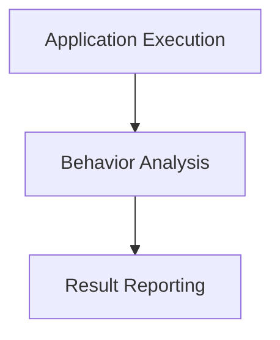
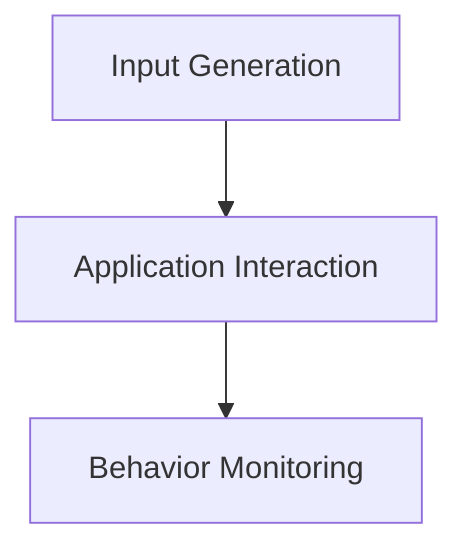
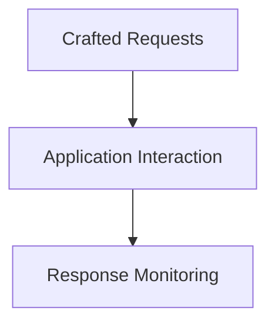

## Dynamic Application Security Testing (DAST)

### Introduction to Dynamic Application Security Testing (DAST)

Dynamic Application Security Testing (DAST) is a type of security testing that involves executing the application and interacting with it to identify security vulnerabilities. Unlike SAST, which analyzes the code statically, DAST focuses on the runtime behavior of the application. The primary goal of DAST is to identify security issues that may arise during the execution of the application.

### Dynamic Source Code Analysis

#### What is Dynamic Source Code Analysis?

Dynamic source code analysis involves executing the application and analyzing its behavior to identify security vulnerabilities. This type of analysis is performed by tools that interact with the application in real-time, simulating various user actions and inputs.

#### Why is Dynamic Source Code Analysis Important?

Dynamic source code analysis is important because it allows testers to identify security issues that may not be apparent through static analysis alone. By executing the application and interacting with it, testers can uncover vulnerabilities that arise due to runtime conditions, such as input validation errors, session management issues, and more.

#### How Does Dynamic Source Code Analysis Work?

The process of dynamic source code analysis involves several steps:

1. **Application Execution**: The tool executes the application and interacts with it to simulate various user actions.
2. **Behavior Analysis**: The tool analyzes the application's behavior to identify potential security vulnerabilities.
3. **Result Reporting**: The tool generates a report highlighting the identified issues along with their severity and potential impact.

#### Real-World Example: Heartbleed Bug (CVE-2014-0160)

One of the most significant real-world examples of the importance of dynamic source code analysis is the Heartbleed bug (CVE-2014-0160). This vulnerability in OpenSSL allowed attackers to read sensitive information from the memory of affected servers. Had dynamic analysis tools been used, the vulnerability might have been detected earlier, allowing for timely patches and mitigations.

### Fuzzers

#### What are Fuzzers?

Fuzzers are tools that generate random or semi-random inputs to test the robustness of an application. The primary goal of fuzzers is to identify unexpected behaviors and security vulnerabilities that may arise due to invalid or unexpected inputs.

#### Why are Fuzzers Important?

Fuzzers are important because they help in identifying security issues that may arise due to improper input validation. By generating a wide range of inputs, fuzzers can uncover vulnerabilities that may not be apparent through manual testing.

#### How Do Fuzzers Work?

Fuzzers work by generating random or semi-random inputs and feeding them to the application. The tool then monitors the application's behavior to identify any unexpected behaviors or crashes. Based on the results, the fuzzer can refine its inputs to further test the application.

#### Real-World Example: AFL (American Fuzzy Lop)

AFL is a popular fuzzer that has been used to discover numerous security vulnerabilities in various applications. For example, AFL was used to discover a vulnerability in the widely-used PNG image processing library, libpng (CVE-2016-1000079).

#### How to Prevent / Defend

To prevent issues related to fuzzers, ensure that your application has proper input validation mechanisms in place. Regularly test your application using fuzzers to identify and address any potential vulnerabilities. Additionally, integrate fuzzers into your CI pipeline to automate the testing process.

### Attack Proxies

#### What are Attack Proxies?

Attack proxies are tools that simulate attacks on the application to identify security vulnerabilities. These tools typically interact with the application through its interfaces, such as APIs, web forms, and more, to test its security posture.

#### Why are Attack Proxies Important?

Attack proxies are important because they allow testers to simulate real-world attacks on the application. By testing the application's response to various attack scenarios, testers can identify vulnerabilities that may be exploited by attackers.

#### How Do Attack Proxies Work?

Attack proxies work by sending crafted requests to the application and monitoring its response. The tool can simulate various attack scenarios, such. as SQL injection, XSS, CSRF, and more. Based on the results, the tool can generate a report highlighting the identified issues.

#### Real-World Example: OWASP ZAP

OWASP ZAP is a popular attack proxy that has been used to discover numerous security vulnerabilities in various applications. For example, ZAP was used to discover a vulnerability in the widely-used WordPress CMS (CVE-2021-29440).

#### How to Prevent / Defend

To prevent issues related to attack proxies, ensure that your application has proper security controls in place, such as input validation, output encoding, and secure session management. Regularly test your application using attack proxies to identify and address any potential vulnerabilities. Additionally, integrate attack proxies into your CI pipeline to automate the testing process.

---
<!-- nav -->
[[DevSecOps/DevSecOps Bootcamp/05-Application Security Testing/11-Understanding Automated Security Testing/Types of Security Testing/00-Overview|Overview]] | [[DevSecOps/DevSecOps Bootcamp/05-Application Security Testing/11-Understanding Automated Security Testing/Types of Security Testing/02-Static Application Security Testing (SAST)|Static Application Security Testing (SAST)]]
