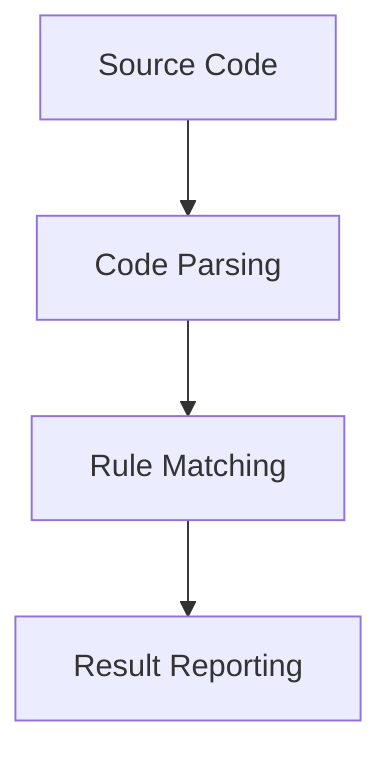
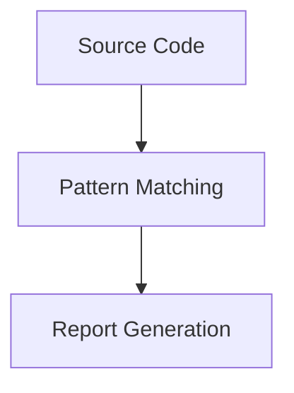

## Static Application Security Testing (SAST)

### Introduction to Static Application Security Testing (SAST)

Static Application Security Testing (SAST) is a type of security testing that analyzes the source code of an application without executing it. The primary goal of SAST is to identify potential security vulnerabilities and coding errors that could lead to security breaches. By analyzing the code statically, developers can catch issues early in the development lifecycle, which is crucial for maintaining the security posture of the application.

### Static Source Code Analysis

#### What is Static Source Code Analysis?

Static source code analysis involves using automated tools to scan the source code for potential security vulnerabilities and coding errors. These tools typically look for patterns in the code that are indicative of known security issues, such as SQL injection, cross-site scripting (XSS), buffer overflows, and more.

#### Why is Static Source Code Analysis Important?

Static source code analysis is important because it allows developers to identify and fix security issues before the code is deployed. This proactive approach helps in reducing the risk of security breaches and ensures that the application is secure from the outset. Additionally, it helps in adhering to security standards and regulations, such as GDPR, HIPAA, and PCI-DSS.

#### How Does Static Source Code Analysis Work?

The process of static source code analysis involves several steps:

1. **Code Parsing**: The tool parses the source code to understand its structure and logic.
2. **Rule Matching**: The tool matches the parsed code against a set of predefined rules and patterns that represent known security vulnerabilities.
3. **Result Reporting**: The tool generates a report highlighting the identified issues along with their severity and potential impact.

#### Real-World Example: CVE-2021-44228 (Log4j Vulnerability)

One of the most significant real-world examples of the importance of static source code analysis is the Log4j vulnerability (CVE-2021-44228). This vulnerability allowed attackers to execute arbitrary code on affected systems, leading to widespread exploitation. Had static analysis tools been used, the vulnerability might have been detected earlier, allowing for timely patches and mitigations.



### Linters

#### What are Linters?

Linters are tools that analyze the source code to check for formatting, readability, and consistency issues. While linters are primarily used for improving code quality, they can also help in identifying potential security issues, especially when integrated with security-focused rules.

#### Why are Linters Important?

Linters are important because they ensure that the codebase is consistent and readable, which makes it easier to maintain and review. Additionally, by catching common coding errors early, linters can help prevent security vulnerabilities that might arise from poor coding practices.

#### How Do Linters Work?

Linters work by scanning the source code and comparing it against a set of predefined rules. These rules can be customized to include security-focused checks. The tool then reports any violations of these rules, allowing developers to address them.

#### Real-World Example: ESLint for JavaScript

ESLint is a popular linter for JavaScript that can be configured to include security-focused rules. For example, the `no-console` rule can prevent the accidental logging of sensitive information to the console, which could be exploited by attackers.

```javascript
// Vulnerable code
console.log("Sensitive data:", secretData);

// Secure code
if (process.env.NODE_ENV !== 'production') {
    console.log("Sensitive data:", secretData);
}
```

#### How to Prevent / Defend

To prevent issues related to linters, ensure that your linter is configured with security-focused rules. Regularly review the linter reports and address any reported issues promptly. Additionally, integrate linters into your continuous integration (CI) pipeline to enforce code quality and security standards.

### Checks on Secrets in Code

#### What are Checks on Secrets in Code?

Checks on secrets in code involve analyzing the source code to identify instances where sensitive information, such as API keys, passwords, and other secrets, are hardcoded or improperly managed. This is a critical aspect of SAST as exposing secrets in the code can lead to serious security breaches.

#### Why are Checks on Secrets Important?

Checks on secrets are important because they help prevent sensitive information from being exposed in the codebase. Hardcoding secrets in the code can lead to unauthorized access if the code is compromised. By identifying and addressing these issues early, developers can ensure that sensitive information is properly protected.

#### How Do Checks on Secrets Work?

Tools that perform checks on secrets in code typically look for patterns that indicate the presence of sensitive information. They may also check for the use of environment variables or secure storage mechanisms to manage secrets.

#### Real-World Example: Hardcoded Secrets in GitHub Repositories

In 2021, several high-profile incidents were reported where sensitive information was found in public GitHub repositories. One such incident involved the exposure of AWS access keys, which led to unauthorized access to cloud resources. Had static analysis tools been used, these issues might have been caught and addressed before the code was committed.



#### How to Prevent / Defend

To prevent issues related to hardcoded secrets, ensure that sensitive information is stored securely using environment variables or secure storage mechanisms. Integrate static analysis tools into your CI pipeline to automatically detect and report on the presence of hardcoded secrets. Additionally, educate developers about the risks associated with hardcoding secrets and the importance of proper secret management.

---
<!-- nav -->
[[DevSecOps/DevSecOps Bootcamp/05-Application Security Testing/11-Understanding Automated Security Testing/Types of Security Testing/01-Dynamic Application Security Testing (DAST)|Dynamic Application Security Testing (DAST)]] | [[DevSecOps/DevSecOps Bootcamp/05-Application Security Testing/11-Understanding Automated Security Testing/Types of Security Testing/00-Overview|Overview]] | [[DevSecOps/DevSecOps Bootcamp/05-Application Security Testing/11-Understanding Automated Security Testing/Types of Security Testing/03-Understanding Automated Security Testing Third-Party Library Scanners|Understanding Automated Security Testing Third-Party Library Scanners]]
