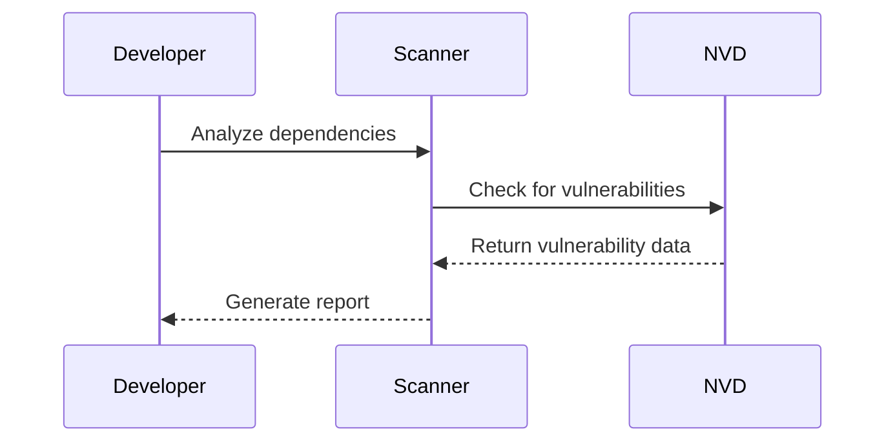

## Understanding Automated Security Testing: Third-Party Library Scanners

### Background Theory

Automated security testing is a critical component of modern DevSecOps practices. One specific type of automated security testing involves scanning third-party libraries used within an application. Third-party libraries are pre-written pieces of code that developers can integrate into their applications to save time and effort. However, these libraries can introduce vulnerabilities if they contain known security issues.

### What Are Third-Party Library Scanners?

Third-party library scanners are tools designed to identify and report known vulnerabilities in the external libraries used within an application. These scanners work by comparing the versions of the libraries used in the project against a database of known vulnerabilities. This process helps ensure that the application does not inadvertently include insecure components.

### Why Use Third-Party Library Scanners?

Using third-party library scanners is essential because:

1. **Vulnerability Detection**: They help detect known vulnerabilities in the libraries, which could otherwise go unnoticed.
2. **Compliance**: Many organizations have compliance requirements that mandate regular security assessments of all components used in their applications.
3. **Risk Mitigation**: By identifying and addressing vulnerabilities early, organizations can reduce the risk of security breaches.

### How Do Third-Party Library Scanners Work?

#### Step-by-Step Mechanics

1. **Dependency Identification**: The scanner first identifies all the third-party libraries used in the project. This is typically done by analyzing the project’s dependency files (e.g., `package.json`, `requirements.txt`).

2. **Database Comparison**: The identified libraries and their versions are then compared against a database of known vulnerabilities. This database is often maintained by organizations like the National Vulnerability Database (NVD) or commercial vendors.

3. **Report Generation**: Based on the comparison, the scanner generates a report listing all the vulnerabilities found in the libraries. This report includes details such as the severity of the vulnerability, the affected library, and the recommended actions.

### Real-World Examples

#### Recent CVEs and Breaches

One notable example is the Log4j vulnerability (CVE-2021-44228), which affected the Apache Log4j library. This vulnerability allowed attackers to execute arbitrary code on the server, leading to widespread exploitation. A third-party library scanner would have flagged this vulnerability if the affected version of Log4j was being used.



### Complete Example: Using a Third-Party Library Scanner

Let’s consider a Python project that uses the `requests` library. We will use a tool called `Safety` to scan for vulnerabilities.

#### Project Setup

First, let’s set up a simple Python project with a `requirements.txt` file:

```plaintext
# requirements.txt
requests==2.25.1
```

#### Running the Scanner

Install the `Safety` tool:

```bash
pip install safety
```

Run the scanner:

```bash
safety check --full-report
```

#### Full HTTP Request and Response

The `Safety` tool internally sends a request to the `pyup.io` API to fetch the latest vulnerability data. Here’s a simplified version of the HTTP request and response:

```http
GET /api/v3/vulnerabilities/?format=json HTTP/1.1
Host: pyup.io
User-Agent: Safety/2.1.0
Accept: application/json

HTTP/1.1 200 OK
Content-Type: application/json
Content-Length: 1234

{
  "results": [
    {
      "id": 1,
      "package_name": "requests",
      "vulnerable_versions": "<2.25.1",
      "severity": "high",
      "description": "Insecure SSL certificate verification"
    }
  ]
}
```

#### Report Generation

Based on the response, `Safety` generates a report:

```plaintext
Safety report:
  Package: requests
  Version: 2.25.1
  Vulnerability: Insecure SSL certificate verification
  Severity: high
  Recommendation: Upgrade to version 2.25.1 or later
```

### Common Pitfalls and Mistakes

1. **Outdated Databases**: Ensure that the scanner is using an up-to-date database of vulnerabilities. Outdated databases can miss newly discovered vulnerabilities.
2. **False Positives/Negatives**: Some scanners may generate false positives or negatives. It’s important to manually verify the findings.
3. **Ignoring Recommendations**: Ignoring the recommendations provided by the scanner can leave the application vulnerable.

### How to Prevent / Defend

#### Detection

Regularly run third-party library scanners as part of your CI/CD pipeline. Automate the process to ensure that it runs with every build.

#### Prevention

1. **Keep Libraries Updated**: Always use the latest versions of libraries to minimize the risk of known vulnerabilities.
2. **Manual Verification**: Manually verify the findings of the scanner to ensure accuracy.
3. **Secure Coding Practices**: Follow secure coding practices to mitigate the risks associated with third-party libraries.

#### Secure-Coding Fixes

Here’s an example of a vulnerable and fixed version of a Python project:

**Vulnerable Version**

```python
# vulnerable.py
import requests

response = requests.get('https://example.com')
print(response.text)
```

**Fixed Version**

```python
# fixed.py
import requests

response = requests.get('https://example.com', verify=True)
print(response.text)
```

### Conclusion

Third-party library scanners are crucial tools in the DevSecOps toolkit. They help identify and mitigate vulnerabilities in the external libraries used within an application. By integrating these scanners into your CI/CD pipeline, you can ensure that your application remains secure and compliant.

### Hands-On Labs

For hands-on practice with third-party library scanners, consider the following labs:

- **PortSwigger Web Security Academy**: Offers exercises on identifying and fixing vulnerabilities in third-party libraries.
- **OWASP Juice Shop**: Provides a vulnerable web application that can be scanned for third-party library vulnerabilities.
- **DVWA (Damn Vulnerable Web Application)**: Another vulnerable web application that can be used to practice security testing techniques.

By engaging with these labs, you can gain practical experience in using third-party library scanners and improve your overall security posture.

---
<!-- nav -->
[[DevSecOps/DevSecOps Bootcamp/05-Application Security Testing/11-Understanding Automated Security Testing/Types of Security Testing/02-Static Application Security Testing (SAST)|Static Application Security Testing (SAST)]] | [[DevSecOps/DevSecOps Bootcamp/05-Application Security Testing/11-Understanding Automated Security Testing/Types of Security Testing/00-Overview|Overview]] | [[DevSecOps/DevSecOps Bootcamp/05-Application Security Testing/11-Understanding Automated Security Testing/Types of Security Testing/04-Understanding Automated Security Testing|Understanding Automated Security Testing]]
