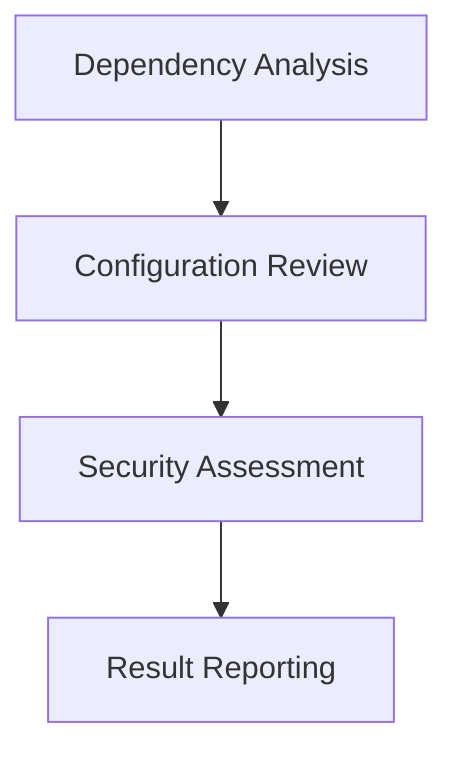

## Vulnerability Scanners

### Introduction to Vulnerability Scanners

Vulnerability scanners are tools that scan the application and its environment to identify known vulnerabilities and misconfigurations. The primary goal of vulnerability scanners is to provide a comprehensive overview of the security posture of the application and its dependencies.

### What is a Vulnerability?

A vulnerability is a flaw or weakness in the application or its dependencies that can be exploited by attackers to gain unauthorized access or cause harm. Vulnerabilities can arise due to various factors, such as coding errors, misconfigurations, outdated dependencies, and more.

### Why are Vulnerability Scanners Important?

Vulnerability scanners are important because they help in identifying known vulnerabilities and misconfigurations that may be present in the application or its dependencies. By scanning the application and its environment, vulnerability scanners can provide a comprehensive overview of the security posture, allowing developers to address any issues proactively.

### How Do Vulnerability Scanners Work?

The process of vulnerability scanning involves several steps:

1. **Dependency Analysis**: The tool analyzes the dependencies of the application to identify any known vulnerabilities.
2. **Configuration Review**: The tool reviews the configuration of the application and its environment to identify any misconfigurations.
3. **Security Assessment**: The tool performs a security assessment of the application and its dependencies to identify any known vulnerabilities.
4. **Result Reporting**: The tool generates a report highlighting the identified issues along with their severity and potential impact.

### Real-World Example: CVE-2021-3427 (Apache Log4j Vulnerability)

One of the most significant real-world examples of the importance of vulnerability scanners is the Apache Log4j vulnerability (CVE-2021-3427). This vulnerability allowed attackers to execute arbitrary code on affected systems, leading to widespread exploitation. Had vulnerability scanners been used, the vulnerability might have been detected earlier, allowing for timely patches and mitigations.

### How to Prevent / Defend

To prevent issues related to vulnerabilities, ensure that your application and its dependencies are up-to-date with the latest security patches. Regularly scan your application and its environment using vulnerability scanners to identify and address any potential issues. Additionally, integrate vulnerability scanners into your CI pipeline to automate the scanning process.

---
<!-- nav -->
[[DevSecOps/DevSecOps Bootcamp/05-Application Security Testing/11-Understanding Automated Security Testing/Types of Security Testing/04-Understanding Automated Security Testing|Understanding Automated Security Testing]] | [[DevSecOps/DevSecOps Bootcamp/05-Application Security Testing/11-Understanding Automated Security Testing/Types of Security Testing/00-Overview|Overview]] | [[DevSecOps/DevSecOps Bootcamp/05-Application Security Testing/11-Understanding Automated Security Testing/Types of Security Testing/06-Conclusion|Conclusion]]
