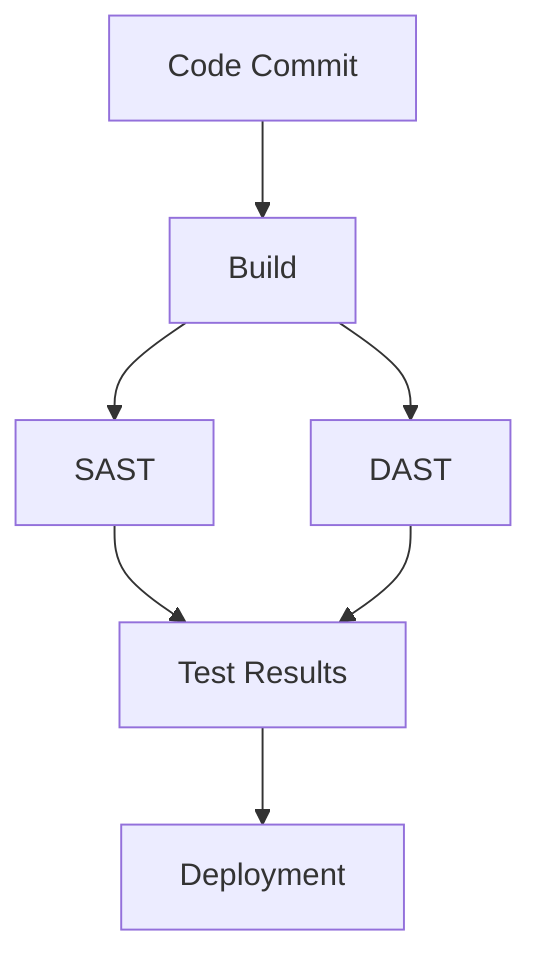

## Introduction to Automated Security Testing in DevSecOps

Welcome to the module on understanding what and where to test during automated security testing in DevSecOps. This module aims to provide a comprehensive overview of the key aspects of automated security testing, including what can be tested, where it can be tested in the software development lifecycle, and how to approach the implementation of these tests.

### What Can Be Tested?

Automated security testing encompasses a wide range of security checks that can be performed on software systems. These checks can be broadly categorized into several types:

1. **Static Application Security Testing (SAST)**: This type of testing involves analyzing the source code of an application to identify potential security vulnerabilities. SAST tools can detect issues such as SQL injection, cross-site scripting (XSS), and buffer overflows.

2. **Dynamic Application Security Testing (DAST)**: DAST involves testing the application while it is running to identify security vulnerabilities. This type of testing can detect issues such as authentication bypass, session management flaws, and insecure configurations.

3. **Interactive Application Security Testing (IAST)**: IAST combines elements of both SAST and DAST. It involves instrumenting the application during runtime to detect security vulnerabilities. IAST can provide more accurate results compared to SAST and DAST alone.

4. **Dependency Check**: This type of testing involves scanning the dependencies used by the application to identify known vulnerabilities. Tools like `OWASP Dependency-Check` and `Snyk` can be used to perform dependency checks.

5. **Configuration Management**: This involves ensuring that the application's configuration files are secure. Tools like `InSpec` and `Chef InSpec` can be used to validate configuration settings.

6. **Security Policy Enforcement**: This involves enforcing security policies across the entire software development lifecycle. Tools like `SonarQube` and `Fortify` can be used to enforce security policies.

### Real-World Examples

Let's consider some recent real-world examples to understand the importance of automated security testing:

- **CVE-2021-44228 (Log4Shell)**: This vulnerability was found in the Apache Log4j library, which is widely used in Java applications. The vulnerability allowed attackers to execute arbitrary code on the server. Automated security testing tools could have detected this vulnerability by scanning the dependencies used by the application.

- **SolarWinds Supply Chain Attack (CVE-2020-1014)**: This attack involved the compromise of SolarWinds' software supply chain, leading to the distribution of malicious updates to customers. Automated security testing could have helped detect the presence of malicious code in the updates.

### How to Implement Automated Security Testing

Implementing automated security testing involves several steps:

1. **Identify the Types of Tests to Perform**: Determine which types of security tests are most relevant to your application. Consider the types of data processed by the application, the environment in which it runs, and the potential risks.

2. **Select the Right Tools**: Choose the appropriate tools for performing the identified types of tests. Some popular tools include:
    - **SAST Tools**: SonarQube, Fortify, Veracode
    - **DAST Tools**: Burp Suite, OWASP ZAP, Acunetix
    - **IAST Tools**: Contrast Security, Hdiv
    - **Dependency Check Tools**: OWASP Dependency-Check, Snyk
    - **Configuration Management Tools**: InSpec, Chef InSpec

3. **Integrate the Tools into the CI/CD Pipeline**: Integrate the selected tools into the continuous integration and continuous deployment (CI/CD) pipeline. This ensures that security tests are performed automatically whenever changes are made to the codebase.

4. **Configure the Tools**: Configure the tools to meet the specific requirements of the application. This may involve setting up rules, defining policies, and configuring scan parameters.

5. **Monitor and Analyze Results**: Monitor the results of the security tests and analyze them to identify potential vulnerabilities. Address any identified vulnerabilities promptly to ensure the security of the application.

### Example Configuration

Here is an example configuration for integrating SAST and DAST tools into a CI/CD pipeline using `Jenkins`:

```yaml
pipeline {
    agent any
    stages {
        stage('Build') {
            steps {
                sh 'mvn clean package'
            }
        }
        stage('SAST') {
            steps {
                sh 'sonar-scanner'
            }
        }
        stage('DAST') {
            steps {
                sh 'zap-baseline.py -t http://localhost:8080'
            }
        }
    }
}
```

### Mermaid Diagrams

#### Software Development Lifecycle with Automated Security Testing



### Common Pitfalls and How to Avoid Them

#### Pitfall 1: Overlooking Configuration Management

**Explanation**: Many security vulnerabilities arise due to misconfigured systems. Failing to properly manage configurations can lead to security breaches.

**Example**: An application might be configured to use an insecure protocol, such as HTTP instead of HTTPS, leading to data exposure.

**How to Prevent / Defend**:
- **Detection**: Use configuration management tools like `InSpec` to validate configuration settings.
- **Prevention**: Ensure that all configuration settings are reviewed and validated before deployment.
- **Secure Coding Fix**:
    ```yaml
    # Vulnerable Configuration
    server:
      port: 80
      contextPath: /
    
    # Secure Configuration
    server:
      port: 443
      contextPath: /
      ssl:
        enabled: true
        keyStore: classpath:keystore.jks
        keyStorePassword: changeit
    ```

#### Pitfall 2: Ignoring Dependency Checks

**Explanation**: Many applications rely on third-party libraries and frameworks. Failing to check these dependencies for known vulnerabilities can expose the application to attacks.

**Example**: The Log4j library was found to contain a critical vulnerability (CVE-2021-44228), which could have been detected through dependency checks.

**How to Prevent / Defend**:
- **Detection**: Use dependency check tools like `OWASP Dependency-Check` to scan dependencies for known vulnerabilities.
- **Prevention**: Regularly update dependencies to the latest versions and ensure that they are free from known vulnerabilities.
- **Secure Coding Fix**:
    ```bash
    # Vulnerable Dependency
    <dependency>
        <groupId>org.apache.logging.log4j</groupId>
        <artifactId>log4j-core</artifactId>
        <version>2.14.1</version>
    </dependency>
    
    # Secure Dependency
    <dependency>
        <groupId>org.apache.logging.log4j</groupId>
        <artifactId>log4j-core</artifactId>
        <version>2.17.1</version>
    </dependency>
    ```

### Summary

This module has provided a comprehensive overview of what can be tested during automated security testing, where it can be tested in the software development lifecycle, and how to approach the implementation of these tests. By understanding these concepts and implementing the appropriate tools and practices, organizations can significantly improve the security of their applications.

### Practice Labs

For hands-on practice, consider the following labs:

- **PortSwigger Web Security Academy**: Offers a variety of labs focused on web application security, including automated security testing.
- **OWASP Juice Shop**: A deliberately insecure web application for practicing security testing techniques.
- **DVWA (Damn Vulnerable Web Application)**: Another intentionally vulnerable web application for learning security testing.
- **WebGoat**: A deliberately insecure web application designed to teach web application security lessons.

These labs will provide practical experience in implementing automated security testing in a real-world environment.

---

This completes the detailed explanation of automated security testing in DevSecOps. By following the steps outlined in this module, you can ensure that your applications are secure and resilient against potential threats.

---
<!-- nav -->
[[DevSecOps/DevSecOps Bootcamp/05-Application Security Testing/12-Understanding What and Where to Test during Automated Security Testing/01-Introduction/00-Overview|Overview]] | [[DevSecOps/DevSecOps Bootcamp/05-Application Security Testing/12-Understanding What and Where to Test during Automated Security Testing/01-Introduction/02-Practice Questions & Answers|Practice Questions & Answers]]
