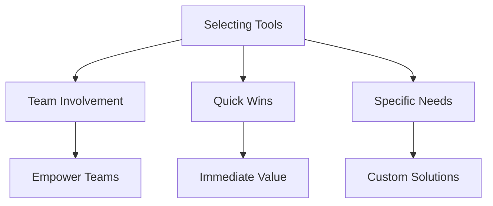

## Introduction to Automated Security Testing

Automated security testing is a critical component of modern DevSecOps practices. It allows organizations to identify and mitigate security vulnerabilities early in the development lifecycle, thereby reducing the risk of security breaches and ensuring the integrity of applications. This chapter aims to provide a comprehensive guide on how to approach implementing automated security testing within an organization. We will cover the selection of appropriate tools, the importance of setting a baseline, and the gradual integration of security checks into the continuous integration/continuous deployment (CI/CD) pipeline.

### Why Automated Security Testing?

Security is a multifaceted challenge that requires a proactive approach. Traditional manual testing methods can be time-consuming and may miss subtle vulnerabilities. Automated security testing leverages tools and scripts to systematically scan codebases, configurations, and environments for potential security issues. This approach ensures that security is integrated into the development process, rather than being an afterthought.

#### Trade-offs in Security

Security is inherently a trade-off between usability, performance, and protection. Organizations must balance these factors to achieve a secure environment without compromising productivity. Automated security testing helps strike this balance by providing efficient and effective means to identify and address security weaknesses.

### Selecting Tools for Automated Security Testing

One of the first steps in implementing automated security testing is selecting the right tools. The choice of tools should align with the specific needs and priorities of the organization. Here are some key considerations:

1. **Team Involvement**: Allow the development and security teams to select their own tools. This empowers them to choose solutions that best fit their workflows and expertise.
2. **Quick Wins**: Start with tools that offer immediate value and a high return on investment. These "quick wins" can help build momentum and demonstrate the benefits of automated security testing.
3. **Tooling for Specific Needs**: Different organizations have different security requirements. Some may benefit from simple secret scanning tools, while others may require more advanced attack proxies or vulnerability scanners.

#### Example Tools

- **Secret Scanning Tools**: Tools like `git-secrets` or `truffleHog` can help identify hard-coded secrets in source code repositories.
- **Attack Proxies**: Tools like `OWASP ZAP` or `Burp Suite` can simulate attacks and identify vulnerabilities in web applications.
- **Vulnerability Scanners**: Tools like `Nessus` or `OpenVAS` can scan third-party libraries and dependencies for known vulnerabilities.



### Setting a Baseline

Before integrating automated security testing into the CI/CD pipeline, it is crucial to establish a baseline. This involves understanding the current state of security within the organization and setting expectations for the results.

#### Steps to Set a Baseline

1. **Initial Scan**: Perform an initial scan using the selected tools to identify existing vulnerabilities.
2. **Discuss Results**: Engage with the team to discuss the initial results. Define what constitutes a "good" result and what indicates an insecure state.
3. **Set Expectations**: Establish clear expectations for the outcomes of automated security testing. This includes defining thresholds for acceptable levels of risk.

#### Example Initial Scan

Consider a scenario where a team uses `git-secrets` to scan for hard-coded secrets in a repository. The initial scan might reveal several instances of hard-coded API keys and passwords.

```bash
# Install git-secrets
brew install git-secrets

# Initialize git-secrets in the repository
git secrets --register-aws
git secrets --install .git

# Scan the repository
git secrets --scan
```

The output might look like this:

```plaintext
Found secret in file.txt: api_key=1234567890
Found secret in config.json: password=abcdefg
```

#### Discussing Initial Results

After identifying these issues, the team should discuss the implications and decide on the next steps. For instance, they might agree that any hard-coded secrets are unacceptable and must be removed or replaced with secure alternatives.

### Gradual Integration into CI/CD Pipeline

Once a baseline is established, the next step is to integrate automated security testing into the CI/CD pipeline. This process should be gradual to avoid overwhelming the team and to ensure that the security checks are meaningful and actionable.

#### Phased Approach

1. **Generate Reports**: Initially, configure the tools to generate reports without blocking the build process. This allows the team to review the results and make necessary adjustments.
2. **Quality Gating**: Gradually introduce quality gates based on security checks. For example, a build might fail if certain types of vulnerabilities are detected.
3. **Continuous Improvement**: Continuously refine the security checks and update the tools as new threats emerge.

#### Example Configuration

Consider integrating `OWASP ZAP` into a CI/CD pipeline using a Jenkins job. The following configuration demonstrates how to set up a basic scan and generate a report.

```yaml
pipeline {
    agent any
    stages {
        stage('Build') {
            steps {
                sh 'mvn clean package'
            }
        }
        stage('Security Scan') {
            steps {
                script {
                    def zap = load 'path/to/zap-script.groovy'
                    def report = zap.scan('http://localhost:8080')
                    echo "ZAP Report: ${report}"
                }
            }
        }
    }
}
```

In this example, the `zap-script.groovy` script would handle the interaction with `OWASP ZAP`, including starting the scanner, performing the scan, and generating the report.

### Common Pitfalls and Best Practices

Implementing automated security testing is not without challenges. Here are some common pitfalls and best practices to consider:

#### Common Pitfalls

1. **Over-reliance on Automated Tools**: While automated tools are valuable, they should not replace human judgment and expertise. Manual reviews and penetration testing remain essential.
2. **Ignoring False Positives**: Automated tools can generate false positives, which can lead to unnecessary work and frustration. It is important to validate findings and adjust the tools accordingly.
3. **Neglecting Regular Updates**: Security threats evolve rapidly. Regularly updating tools and configurations is crucial to stay ahead of new vulnerabilities.

#### Best Practices

1. **Regular Training**: Provide regular training and resources to the team to keep them updated on the latest security practices and tool capabilities.
2. **Collaborative Environment**: Foster a collaborative environment where security is everyone's responsibility. Encourage open communication and knowledge sharing.
3. **Continuous Monitoring**: Implement continuous monitoring to detect and respond to security incidents promptly. This includes logging, alerting, and incident response protocols.

### Real-World Examples and Case Studies

To illustrate the practical application of automated security testing, let's examine a few real-world examples and case studies.

#### Example: Hard-Coded Secrets in Source Code

In 2021, a major cloud service provider exposed sensitive credentials due to hard-coded secrets in their source code. This incident highlights the importance of using tools like `git-secrets` to identify and remove such secrets.

**Vulnerable Code:**

```python
# config.py
API_KEY = '1234567890'
PASSWORD = 'abcdefg'
```

**Secure Code:**

```python
# config.py
import os

API_KEY = os.getenv('API_KEY', '')
PASSWORD = os.getenv('PASSWORD', '')
```

By using environment variables, the secrets are kept outside the source code, reducing the risk of exposure.

#### Example: Vulnerable Third-Party Libraries

In 2022, a widely used third-party library was found to contain a critical vulnerability that allowed remote code execution. This incident underscores the importance of using vulnerability scanners like `Nessus` to identify and mitigate such risks.

**Vulnerable Library:**

```json
{
  "dependencies": {
    "vulnerable-lib": "^1.0.0"
  }
}
```

**Secure Library:**

```json
{
  "dependencies": {
    "vulnerable-lib": "^2.0.0"
  }
}
```

By keeping dependencies up-to-date and regularly scanning for vulnerabilities, organizations can minimize the risk of exploitation.

### How to Prevent / Defend

#### Detection

1. **Regular Scans**: Schedule regular scans using automated tools to detect new vulnerabilities.
2. **Logging and Monitoring**: Implement logging and monitoring to detect and respond to security incidents promptly.

#### Prevention

1. **Secure Coding Practices**: Follow secure coding practices, such as avoiding hard-coded secrets and using environment variables.
2. **Dependency Management**: Keep dependencies up-to-date and use tools to scan for vulnerabilities in third-party libraries.

#### Secure-Coding Fixes

**Vulnerable Pattern:**

```python
# config.py
API_KEY = '1234567890'
PASSWORD = 'abcdefg'
```

**Secure Pattern:**

```python
# config.py
import os

API_KEY = os.getenv('API_KEY', '')
PASSWORD = os.getenv('PASSWORD', '')
```

**Vulnerable Dependency:**

```json
{
  "dependencies": {
    "vulnerable-lib": "^1.0.0"
  }
}
```

**Secure Dependency:**

```json
{
  "dependencies": {
    "vulnerable-lib": "^2.0.0"
  }
}
```

### Hands-On Labs

To gain practical experience with automated security testing, consider the following hands-on labs:

- **PortSwigger Web Security Academy**: Offers interactive labs to practice web application security testing.
- **OWASP Juice Shop**: A deliberately insecure web application for practicing security testing.
- **DVWA (Damn Vulnerable Web Application)**: Another intentionally vulnerable web application for learning security testing techniques.

These labs provide real-world scenarios and challenges to help you apply the concepts learned in this chapter.

### Conclusion

Automated security testing is a vital component of modern DevSecOps practices. By allowing teams to select their own tools, focusing on quick wins, setting a baseline, and gradually integrating security checks into the CI/CD pipeline, organizations can effectively identify and mitigate security vulnerabilities. Through continuous improvement and collaboration, teams can build a robust security posture that protects against emerging threats.

This chapter has provided a comprehensive guide to implementing automated security testing, covering the theoretical foundations, practical examples, and best practices. By following these guidelines, organizations can enhance their security posture and reduce the risk of security breaches.

---
<!-- nav -->
[[DevSecOps/DevSecOps Bootcamp/05-Application Security Testing/12-Understanding What and Where to Test during Automated Security Testing/02-How to Approach Implementing Automated Security Testing/00-Overview|Overview]] | [[DevSecOps/DevSecOps Bootcamp/05-Application Security Testing/12-Understanding What and Where to Test during Automated Security Testing/02-How to Approach Implementing Automated Security Testing/02-Practice Questions & Answers|Practice Questions & Answers]]
