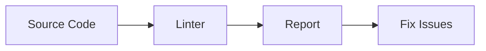
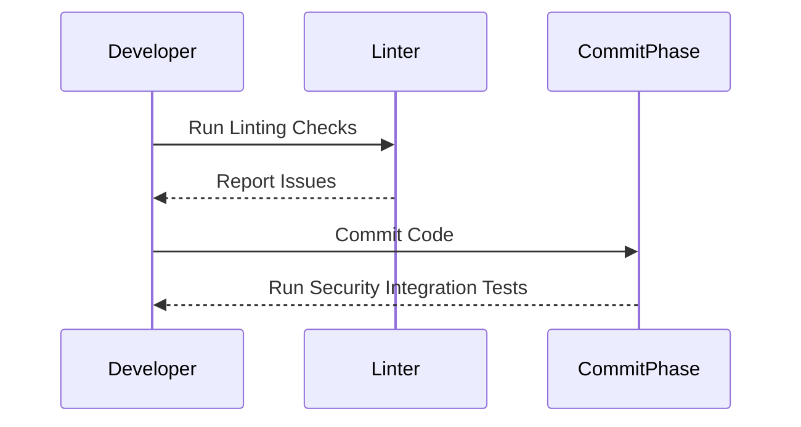
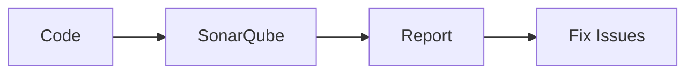
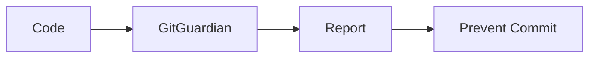
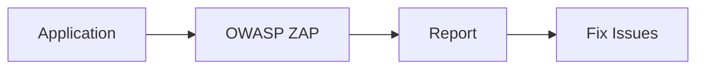
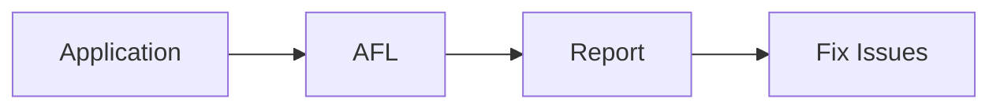
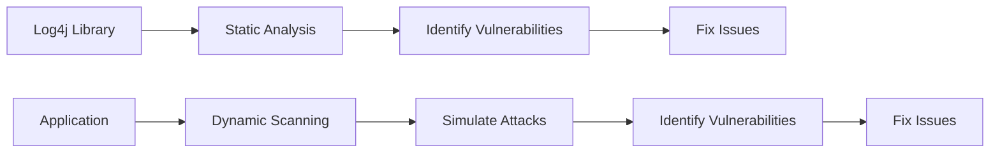

## Local Workstation Checks

### Introduction to Local Workstation Checks

When performing automated security testing, one of the first places to start is on your local workstation. This phase is crucial because it allows you to catch issues early in the development cycle, reducing the likelihood of introducing vulnerabilities into your codebase. The primary tools used at this stage are linters and pre-commit hooks.

#### Linters

A **linter** is a tool that analyzes source code to flag programming errors, bugs, stylistic errors, and suspicious constructs. Linters are essential for maintaining code quality and ensuring that the code adheres to established coding standards. They help improve the readability and clarity of the code, which is critical for maintainability and collaboration among developers.

##### Why Use Linters?

- **Readability and Clarity**: Linters ensure that the code is consistent and follows a set of predefined rules, making it easier for other developers to read and understand.
- **Formatting**: Linters can automatically format the code according to a specific style guide, reducing the need for manual formatting.
- **Security**: Some linters can identify potential security issues, such as hard-coded secrets or insecure coding patterns.

##### How Linters Work

Linters work by parsing the source code and checking it against a set of rules. These rules can be customized based on the project requirements. For example, a linter might check for unused variables, missing semicolons, or incorrect indentation.



#### Pre-Commit Hooks

Pre-commit hooks are scripts that run automatically before a commit is made. They can be used to enforce various checks, such as linting, formatting, and detecting hard-coded secrets. Pre-commit hooks are particularly useful because they prevent developers from committing code that does not meet the required standards.

##### Why Use Pre-Commit Hooks?

- **Prevent Bad Commits**: Pre-commit hooks ensure that only code that meets the specified criteria is committed, reducing the likelihood of introducing bugs or security issues.
- **Automate Checks**: Pre-commit hooks automate the process of running checks, saving developers time and effort.

##### How Pre-Commit Hooks Work

Pre-commit hooks are typically configured using a `.pre-commit-config.yaml` file. This file specifies the hooks to be run and the conditions under which they should be executed.

```yaml
repos:
  - repo: https://github.com/pre-commit/pre-commit-hooks
    rev: v4.0.0
    hooks:
      - id: trailing-whitespace
      - id: end-of-file-fixer
      - id: check-yaml
      - id: check-added-large-files
```

### Commit Phase Checks

The commit phase is the next stage in the automated security testing process. At this stage, you can perform more comprehensive checks to ensure that the code being committed is secure and maintainable.

#### Linters in the Commit Phase

In addition to the basic linting checks performed on the local workstation, you can also run more advanced linters during the commit phase. These linters can perform deeper analysis, such as checking for maintainability and security issues.

##### Maintainability Checks

Maintainability checks ensure that the code is easy to understand and modify. This includes checking for code complexity, adherence to coding standards, and the presence of comments and documentation.

##### Security Integration Tests

Security integration tests are designed to identify security vulnerabilities in the code. These tests can be run during the commit phase to ensure that the code being committed does not introduce new security issues.



#### Static Source Code Analysis Tools

Static source code analysis tools are used to analyze the code without executing it. These tools can identify insecure patterns in the code, such as SQL injection vulnerabilities, buffer overflows, and other security issues.

##### Example: SonarQube

SonarQube is a popular static code analysis tool that can be integrated into the commit phase. It provides detailed reports on code quality and security issues.



#### Hard-Coded Secrets Detection

Hard-coded secrets, such as API keys and passwords, are a significant security risk. During the commit phase, you can use tools to detect and prevent the inclusion of hard-coded secrets in the code.

##### Example: GitGuardian

GitGuardian is a tool that can be used to detect hard-coded secrets in the code. It integrates with the commit phase to ensure that secrets are not committed.



### Build Phase Checks

The build phase is the final stage in the automated security testing process. At this stage, you can run dynamic scanning tools and fuzzing tools to ensure that the code is secure and robust.

#### Dynamic Scanning Tools

Dynamic scanning tools, such as attack proxies, are used to simulate attacks on the application to identify vulnerabilities. These tools can be run during the build phase to ensure that the application is secure.

##### Example: OWASP ZAP

OWASP ZAP is a popular attack proxy that can be used to scan the application for vulnerabilities. It can be integrated into the build phase to ensure that the application is secure.



#### Fuzzing Tools

Fuzzing tools are used to test the application by providing it with random inputs to identify vulnerabilities. These tools can be run during the build phase to ensure that the application is robust and secure.

##### Example: AFL

AFL (American Fuzzy Lop) is a popular fuzzing tool that can be used to test the application. It can be integrated into the build phase to ensure that the application is secure.



### Real-World Examples

#### CVE-2021-44228 (Log4Shell)

CVE-2021-44228, also known as Log4Shell, is a critical vulnerability in the Apache Log4j library. This vulnerability allows attackers to execute arbitrary code on the server, leading to remote code execution (RCE).

##### How It Happened

The vulnerability was caused by a flaw in the Log4j library that allowed attackers to inject malicious code into log messages. This code could then be executed by the server, leading to RCE.

##### Prevention

To prevent this vulnerability, you can use static source code analysis tools to identify and fix insecure patterns in the code. Additionally, you can use dynamic scanning tools to simulate attacks and identify vulnerabilities.



### How to Prevent / Defend

#### Detection

To detect vulnerabilities, you can use static source code analysis tools and dynamic scanning tools. These tools can identify insecure patterns in the code and simulate attacks to identify vulnerabilities.

#### Prevention

To prevent vulnerabilities, you can follow these steps:

1. **Use Static Source Code Analysis Tools**: Integrate static source code analysis tools into your development workflow to identify and fix insecure patterns in the code.
2. **Use Dynamic Scanning Tools**: Integrate dynamic scanning tools into your build process to simulate attacks and identify vulnerabilities.
3. **Use Pre-Commit Hooks**: Use pre-commit hooks to enforce coding standards and prevent the inclusion of hard-coded secrets in the code.
4. **Use Fuzzing Tools**: Use fuzzing tools to test the application and ensure that it is robust and secure.

#### Secure Coding Fixes

Here is an example of a vulnerable code snippet and its secure counterpart:

**Vulnerable Code**

```python
import logging

logging.basicConfig(filename='app.log', level=logging.DEBUG)
logging.debug('User %s logged in', username)
```

**Secure Code**

```python
import logging

logging.basicConfig(filename='app.log', level=logging.DEBUG)
logging.debug('User {} logged in', username)
```

In the secure code, the `username` variable is properly formatted to prevent injection attacks.

### Hands-On Labs

For hands-on practice, you can use the following labs:

- **PortSwigger Web Security Academy**: This lab provides a comprehensive set of exercises to learn about web security and automated security testing.
- **OWASP Juice Shop**: This lab provides a vulnerable web application to practice security testing and vulnerability identification.
- **DVWA**: This lab provides a vulnerable web application to practice security testing and vulnerability identification.
- **WebGoat**: This lab provides a vulnerable web application to practice security testing and vulnerability identification.

By following these steps and using the recommended tools and labs, you can ensure that your code is secure and robust.

---
<!-- nav -->
[[DevSecOps/DevSecOps Bootcamp/05-Application Security Testing/12-Understanding What and Where to Test during Automated Security Testing/04-Where to Perform Automated Security Testing/00-Overview|Overview]] | [[02-Understanding What and Where to Test During Automated Security Testing|Understanding What and Where to Test During Automated Security Testing]]
