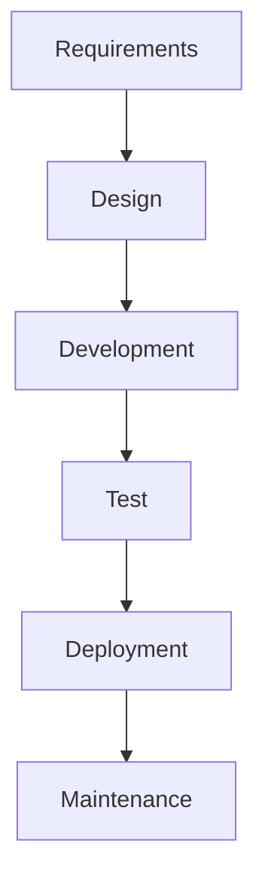

## Understanding What and Where to Test During Automated Security Testing

### Introduction to Automated Security Testing

Automated security testing is a critical component of modern software development practices, especially within the DevSecOps framework. It involves using tools and scripts to automatically scan and test applications for vulnerabilities and security weaknesses. The goal is to identify potential security issues as early as possible in the development lifecycle, thereby reducing the cost and complexity of fixing these issues later.

#### Pros and Cons of Automated Security Testing

**Pros:**
- **Efficiency:** Automated tools can quickly scan large volumes of code and configurations, identifying issues faster than manual methods.
- **Consistency:** Automated testing ensures that the same set of checks is applied consistently across different environments and projects.
- **Coverage:** Automated tools can cover a wide range of security issues, including those that might be overlooked in manual testing.

**Cons:**
- **False Positives:** Automated tools may generate false positives, which require manual verification and can be time-consuming.
- **Complexity:** Setting up and configuring automated security testing tools can be complex and requires expertise.
- **Dependency on Tool Quality:** The effectiveness of automated security testing heavily depends on the quality and capabilities of the tools used.

### Where to Perform Automated Security Testing

The next critical question is where in the software development lifecycle (SDLC) should automated security testing be performed. Traditionally, security testing was often deferred to the end of the SDLC, typically during the maintenance and production phases. However, this approach has several drawbacks, including increased costs and delays in addressing security issues.

#### Traditional Software Development Lifecycle

Let's first understand the traditional SDLC:



In this model, security testing is often performed during the maintenance phase, which includes penetration testing in a production environment. This approach has several limitations:

- **Delayed Feedback:** Issues identified late in the SDLC can be costly to fix, as they may require significant changes to the codebase.
- **Increased Risk:** Delaying security testing increases the risk of vulnerabilities being exploited before they are discovered and addressed.

### Shift Left Paradigm

To address these limitations, the "Shift Left" paradigm has gained significant traction in the DevSecOps community. Shift Left advocates for performing security testing earlier in the SDLC, ideally during the development and deployment phases.

#### What is Shift Left?

Shift Left is a methodology that emphasizes integrating security testing into the early stages of the software development process. By doing so, teams can identify and mitigate security risks before they become deeply embedded in the codebase.

```mermaid
graph TD
    A[Requirements] --> B[Design]
    B --> C[Development]
    C -->|Static Application Security Testing (SAST)| D[Test]
    D --> E[Deployment]
    E -->|Dynamic Application Security Testing (DAST)| F[Maintenance]
```

#### Benefits of Shift Left

The advantages of shifting security testing left are numerous:

- **Better Accountability:** Early identification of security issues allows developers to take responsibility for fixing them, leading to a culture of security awareness.
- **Reduced Costs:** Addressing security issues early in the development process is generally less expensive than fixing them in production.
- **Improved Quality:** Regular security testing throughout the SDLC helps ensure that the final product meets high security standards.

### Types of Automated Security Testing

There are two primary types of automated security testing that are commonly used in the Shift Left paradigm:

#### Static Application Security Testing (SAST)

SAST involves analyzing the source code of an application to identify potential security vulnerabilities. This type of testing is typically performed during the development phase.

**Example:**

Consider a simple Python application that reads user input and writes it to a file:

```python
# Vulnerable code
def write_to_file(user_input):
    with open('output.txt', 'w') as f:
        f.write(user_input)

write_to_file(input("Enter some text: "))
```

Using a SAST tool like Bandit, we can analyze this code to identify potential security issues:

```bash
bandit -r .
```

**Output:**

```
>> Issue: [B377:print_statements] Potential info exposure through print statement.
   Severity: Medium   Confidence: High
   Location: ./vulnerable_code.py:4
5       f.write(user_input)
6   }
```

**Secure Code Fix:**

```python
# Secure code
import os

def write_to_file(user_input):
    sanitized_input = os.path.basename(user_input)
    with open('output.txt', 'w') as f:
        f.write(sanitized_input)

write_to_file(input("Enter some text: "))
```

**How to Prevent / Defend:**

- **Sanitize User Input:** Always sanitize user input to prevent injection attacks.
- **Use Secure Libraries:** Utilize libraries that provide built-in security features.
- **Regular Code Reviews:** Conduct regular code reviews to catch potential security issues.

#### Dynamic Application Security Testing (DAST)

DAST involves testing the application while it is running to identify security vulnerabilities. This type of testing is typically performed during the deployment phase.

**Example:**

Consider a web application that uses a vulnerable version of a library:

```http
GET /vulnerable-library HTTP/1.1
Host: example.com
User-Agent: Mozilla/5.0
Accept: */*
```

Using a DAST tool like OWASP ZAP, we can scan the application to identify potential security issues:

```bash
zap-cli --spider --target http://example.com
zap-cli --ajax spider --target http://example.com
zap-cli --report --format html --output report.html
```

**Output:**

```
[+] Spidering http://example.com/
[+] Found 10 URLs
[+] Scanning http://example.com/
[+] Found 5 vulnerabilities
```

**Secure Code Fix:**

Update the vulnerable library to the latest version:

```bash
pip install --upgrade vulnerable-library
```

**How to Prevent / Defend:**

- **Keep Dependencies Updated:** Regularly update dependencies to the latest versions.
- **Use Dependency Checkers:** Utilize tools like `npm audit` or `pip-audit` to check for vulnerable dependencies.
- **Implement Security Policies:** Enforce security policies that mandate the use of secure libraries and frameworks.

### Real-World Examples

#### Recent CVEs and Breaches

Several recent CVEs and breaches highlight the importance of early security testing:

- **CVE-2021-44228 (Log4Shell):** This vulnerability in Apache Log4j allowed attackers to execute arbitrary code on affected systems. Early detection and mitigation could have prevented widespread exploitation.
- **SolarWinds Supply Chain Attack:** This attack involved the compromise of SolarWinds Orion software, which was then used to infiltrate numerous organizations. Early security testing of third-party software could have helped detect such vulnerabilities.

### Hands-On Labs

To gain practical experience with automated security testing, consider the following hands-on labs:

- **PortSwigger Web Security Academy:** Offers interactive labs for learning web security concepts, including automated security testing.
- **OWASP Juice Shop:** A deliberately insecure web application for practicing security testing techniques.
- **DVWA (Damn Vulnerable Web Application):** Another intentionally vulnerable web application for learning security testing.

### Conclusion

Shifting security testing left is a crucial practice in modern DevSecOps environments. By integrating security testing into the early stages of the SDLC, teams can identify and mitigate security risks more effectively, ultimately producing higher-quality and more secure software. Utilizing both SAST and DAST tools, along with regular code reviews and dependency updates, can help ensure that applications are secure from the outset.

By following the principles outlined in this chapter, you can implement a robust automated security testing strategy that enhances the overall security posture of your software projects.

---
<!-- nav -->
[[01-Local Workstation Checks|Local Workstation Checks]] | [[DevSecOps/DevSecOps Bootcamp/05-Application Security Testing/12-Understanding What and Where to Test during Automated Security Testing/04-Where to Perform Automated Security Testing/00-Overview|Overview]] | [[03-Understanding What and Where to Test during Automated Security Testing|Understanding What and Where to Test during Automated Security Testing]]
