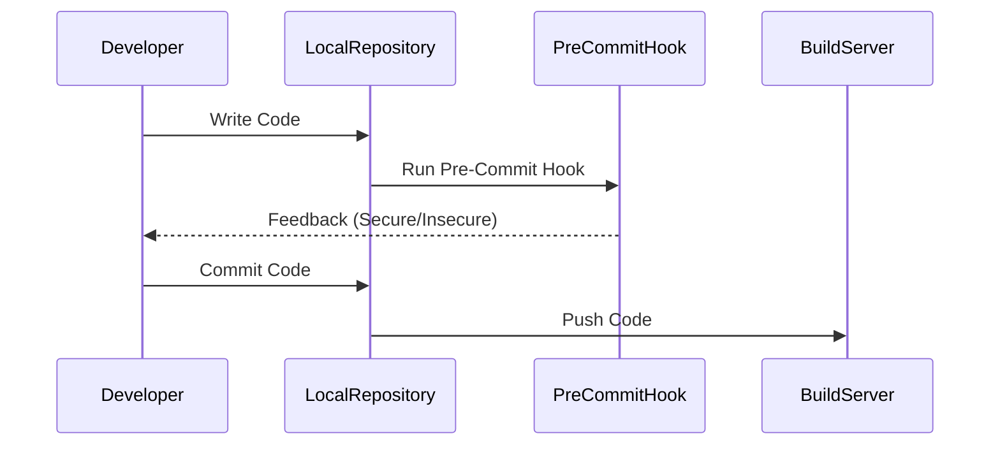
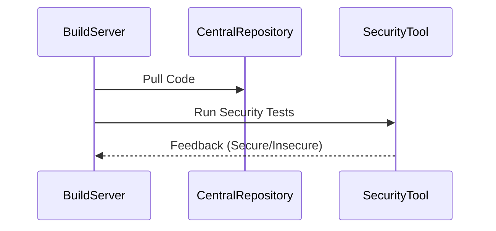
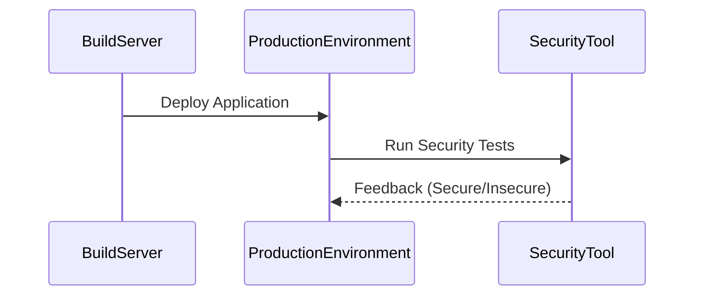

## Understanding What and Where to Test during Automated Security Testing

### Introduction to Shifting Security Left

Shifting security left in the software development lifecycle (SDLC) is a fundamental practice in DevSecOps. This approach emphasizes integrating security practices as early as possible in the development process, ideally starting at the code commit stage. By doing so, developers receive immediate feedback on the security posture of their code, which helps in identifying and fixing vulnerabilities early in the development cycle.

#### Why Shift Security Left?

1. **Cost Efficiency**: Finding and fixing vulnerabilities early in the development process is significantly cheaper than addressing them after deployment. According to the National Institute of Standards and Technology (NIST), the cost of fixing a vulnerability increases tenfold with each phase of the SDLC.
   
2. **Accountability**: Developers are more accountable for the security of their code when they receive immediate feedback. This fosters a culture of security responsibility within the development team.

3. **Security Requirements Codification**: By defining and implementing security tests early in the development process, security requirements are codified. This ensures that the code meets specific security criteria before it progresses further in the SDLC.

### Phases of Automated Security Testing

Automated security testing can be performed at various stages of the SDLC. Each phase offers unique opportunities to identify and mitigate security risks. Below, we will explore the different phases where automated security testing can be implemented:

#### Pre-Commit Phase

The pre-commit phase occurs on the developer's local workstation before the code is committed to the central repository. This phase is crucial because it allows developers to catch potential security issues before the code is even shared with others.

##### Pre-Commit Hooks

Pre-commit hooks are scripts that run automatically before a commit is made. These hooks can be used to perform various checks, including security tests. For example, a pre-commit hook can run static application security testing (SAST) tools to analyze the code for potential vulnerabilities.



**Example of a Pre-Commit Hook**

Here’s an example of a pre-commit hook using `pre-commit` framework, which is widely used for automating code checks:

```yaml
repos:
- repo: https://github.com/pre-commit/pre-commit-hooks
  rev: v4.0.0
  hooks:
  - id: check-yaml
  - id: end-of-file-fixer
  - id: trailing-whitespace
- repo: https://gitlab.com/pycqa/flake8
  rev: 3.9.2
  hooks:
  - id: flake8
- repo: https://github.com/PyCQA/bandit
  rev: 1.7.4
  hooks:
  - id: bandit
```

This configuration includes `bandit`, a popular SAST tool for Python code, which can detect common security issues such as SQL injection, cross-site scripting (XSS), and hard-coded secrets.

**Real-World Example: CVE-2021-3427**

CVE-2021-3427 is a critical vulnerability in the Jenkins Pipeline plugin. This vulnerability could allow attackers to execute arbitrary code on the Jenkins server. By performing security tests during the pre-commit phase, developers can catch such issues early, preventing them from being pushed to the central repository.

**How to Prevent / Defend**

1. **Detection**: Use tools like `bandit` to detect security issues in the code.
2. **Prevention**: Ensure that all code changes are reviewed and tested before committing.
3. **Secure Coding Fix**: Compare the vulnerable code with the fixed code.

**Vulnerable Code**
```python
import os
os.system("rm -rf /")
```

**Fixed Code**
```python
import subprocess
subprocess.run(["ls", "-l"])
```

#### Commit Phase

The commit phase occurs when the code is pushed to the central repository. However, this phase is not typically used for automated security testing because the code has already been committed and shared with other developers.

#### Build Phase

The build phase occurs when the code is pulled from the central repository and built on a build server. This phase is ideal for performing automated security testing because it allows for comprehensive analysis of the entire codebase.

##### Build Server Security Testing

During the build phase, various security tests can be performed, including SAST, dynamic application security testing (DAST), and dependency scanning.



**Example of a Build Phase Security Test**

Here’s an example of a build phase security test using `Travis CI` and `OWASP Dependency-Check`:

```yaml
language: java
script:
  - mvn clean install
  - mvn dependency-check:check
```

This configuration uses `OWASP Dependency-Check` to scan the project dependencies for known vulnerabilities.

**Real-World Example: CVE-2021-44228 (Log4j)**

CVE-2021-44228, commonly known as Log4Shell, is a critical vulnerability in the Apache Log4j library. By performing dependency scanning during the build phase, developers can detect and mitigate such vulnerabilities before the code is deployed.

**How to Prevent / Defend**

1. **Detection**: Use tools like `OWASP Dependency-Check` to scan for known vulnerabilities in dependencies.
2. **Prevention**: Keep all dependencies up-to-date and avoid using vulnerable libraries.
3. **Secure Coding Fix**: Update the vulnerable dependency to a secure version.

**Vulnerable Dependency**
```xml
<dependency>
    <groupId>org.apache.logging.log4j</groupId>
    <artifactId>log4j-core</artifactId>
    <version>2.14.1</version>
</dependency>
```

**Fixed Dependency**
```xml
<dependency>
    <groupId>org.apache.logging.log4j</groupId>
    2.15.0
</dependency>
```

#### Deploy Phase

The deploy phase occurs when the code is moved from the build server to the production environment. This phase is also suitable for performing automated security testing, particularly DAST and runtime security testing.

##### Deployment Security Testing

During the deploy phase, tools like `ZAP` (Zed Attack Proxy) can be used to perform DAST on the deployed application.



**Example of a Deploy Phase Security Test**

Here’s an example of a deploy phase security test using `ZAP`:

```bash
zap-cli open-url http://localhost:8080
zap-cli spider http://localhost:8080
zap-cli active-scan http://localhost:8080
zap-cli report --template "json:report.json"
```

This script uses `ZAP` to perform a spider scan and active scan on the deployed application, generating a JSON report of the findings.

**Real-World Example: CVE-2021-39142 (Drupal)**

CVE-2021-39142 is a critical vulnerability in Drupal core. By performing DAST during the deploy phase, developers can detect such vulnerabilities before the application is exposed to users.

**How to Prevent / Defend**

1. **Detection**: Use tools like `ZAP` to perform DAST on the deployed application.
2. **Prevention**: Ensure that all security patches are applied before deploying the application.
3. **Secure Coding Fix**: Apply the necessary security patches to the application.

**Vulnerable Code**
```php
function user_login($username, $password) {
    // Vulnerable code
}
```

**Fixed Code**
```php
function user_login($username, $password) {
    // Secure code
}
```

### Conclusion

Shifting security left in the SDLC is a critical practice in DevSecOps. By performing automated security testing at various stages of the development process, developers can catch and fix vulnerabilities early, reducing the overall cost and risk associated with security issues. Tools like `pre-commit`, `OWASP Dependency-Check`, and `ZAP` can be used to perform comprehensive security testing throughout the SDLC.

### Hands-On Labs

To gain practical experience with automated security testing, consider the following labs:

- **PortSwigger Web Security Academy**: Offers a wide range of labs focused on web application security, including automated security testing.
- **OWASP Juice Shop**: A deliberately insecure web application for practicing security testing.
- **DVWA (Damn Vulnerable Web Application)**: A PHP/MySQL web application that is riddled with vulnerabilities for educational purposes.
- **WebGoat**: An interactive training application designed to teach web application security lessons.

These labs provide real-world scenarios and challenges to help you master the concepts of automated security testing in DevSecOps.

---
<!-- nav -->
[[02-Understanding What and Where to Test During Automated Security Testing|Understanding What and Where to Test During Automated Security Testing]] | [[DevSecOps/DevSecOps Bootcamp/05-Application Security Testing/12-Understanding What and Where to Test during Automated Security Testing/04-Where to Perform Automated Security Testing/00-Overview|Overview]] | [[DevSecOps/DevSecOps Bootcamp/05-Application Security Testing/12-Understanding What and Where to Test during Automated Security Testing/04-Where to Perform Automated Security Testing/04-Practice Questions & Answers|Practice Questions & Answers]]
