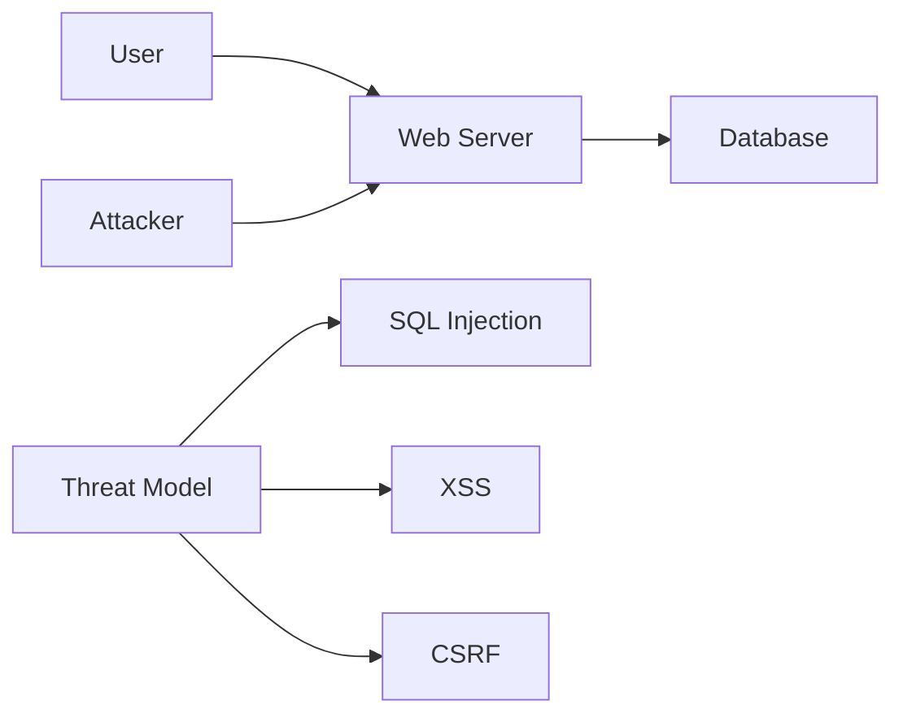

## Case-by-Case Approach

### Evaluating Projects Individually

A case-by-case approach involves evaluating each project individually to determine where automated security testing can be most effective. This involves assessing the specific risks and requirements of each project.

#### Steps to Evaluate Projects

1. **Identify Risks**: Identify the specific security risks associated with each project. This may involve conducting a threat modeling exercise.
2. **Assess Requirements**: Assess the specific requirements of each project. This may involve considering factors such as the project's size, complexity, and criticality.
3. **Select Appropriate Tools**: Select the appropriate automated security testing tools based on the identified risks and requirements.

### Case Study: Threat Modeling

#### Background Theory

Threat modeling is a process used to identify potential threats and vulnerabilities in a system. It involves analyzing the system's architecture and identifying potential attack vectors.

#### Implementation Steps

1. **Define the System**: Define the system boundaries and components. This may involve creating a system architecture diagram.
2. **Identify Threats**: Identify potential threats and vulnerabilities. This may involve considering factors such as attacker capabilities and motivations.
3. **Prioritize Threats**: Prioritize the identified threats based on their likelihood and impact.
4. **Develop Mitigations**: Develop mitigations for the prioritized threats. This may involve implementing security controls or modifying the system architecture.

#### Diagram Example

### How to Prevent / Defend

1. **Implement Security Controls**: Implement security controls to mitigate identified threats. This may involve using security frameworks such as OWASP ASVS.
2. **Regular Reviews**: Conduct regular reviews to ensure that the threat model remains up to date.
3. **Training and Awareness**: Train team members on threat modeling techniques to ensure that they are aware of potential threats and vulnerabilities.

---
<!-- nav -->
[[DevSecOps/DevSecOps Bootcamp/05-Application Security Testing/12-Understanding What and Where to Test during Automated Security Testing/Course Summary/02-Introduction to Automated Security Testing|Introduction to Automated Security Testing]] | [[DevSecOps/DevSecOps Bootcamp/05-Application Security Testing/12-Understanding What and Where to Test during Automated Security Testing/Course Summary/00-Overview|Overview]] | [[DevSecOps/DevSecOps Bootcamp/05-Application Security Testing/12-Understanding What and Where to Test during Automated Security Testing/Course Summary/04-Facilitating Automated Security Testing|Facilitating Automated Security Testing]]
