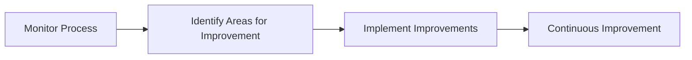

## Process vs. Product

### Viewing Automated Security Testing as a Process

Automated security testing should be viewed as a process rather than a product. This means that the focus should be on the ongoing improvement and adaptation of security testing practices rather than simply purchasing and deploying a set of tools.

#### Steps to View as a Process

1. **Define the Process**: Define the specific process for implementing automated security testing. This may include factors such as the tools used and the workflow followed.
2. **Implement the Process**: Implement the defined process to ensure that automated security testing is integrated into the development workflow.
3. **Monitor and Improve**: Monitor the process to ensure that it is effective and sustainable. Continuously improve the process to ensure that it remains effective over time.

### Case Study: Continuous Improvement

#### Background Theory

Continuous improvement involves continuously monitoring and improving the process for implementing automated security testing. This ensures that the process remains effective and sustainable over time.

#### Implementation Steps

1. **Monitor the Process**: Monitor the process to ensure that it is effective and sustainable. This may involve tracking metrics such as the number of vulnerabilities detected and the time required to fix them.
2. **Identify Areas for Improvement**: Identify areas for improvement based on the monitored data. This may involve identifying inefficiencies or areas where the process could be improved.
3. **Implement Improvements**: Implement the identified improvements to ensure that the process remains effective and sustainable.

#### Diagram Example

### How to Prevent / Defend

1. **Regular Monitoring**: Regularly monitor the process to ensure that it remains effective and sustainable.
2. **Data-Driven Decisions**: Make data-driven decisions to ensure that the process is continuously improved.
3. **Feedback Loops**: Establish feedback loops to ensure that the process is continuously improved based on feedback from team members.

---
<!-- nav -->
[[DevSecOps/DevSecOps Bootcamp/05-Application Security Testing/12-Understanding What and Where to Test during Automated Security Testing/Course Summary/04-Facilitating Automated Security Testing|Facilitating Automated Security Testing]] | [[DevSecOps/DevSecOps Bootcamp/05-Application Security Testing/12-Understanding What and Where to Test during Automated Security Testing/Course Summary/00-Overview|Overview]] | [[DevSecOps/DevSecOps Bootcamp/05-Application Security Testing/12-Understanding What and Where to Test during Automated Security Testing/Course Summary/06-Quick Wins in Automated Security Testing|Quick Wins in Automated Security Testing]]
