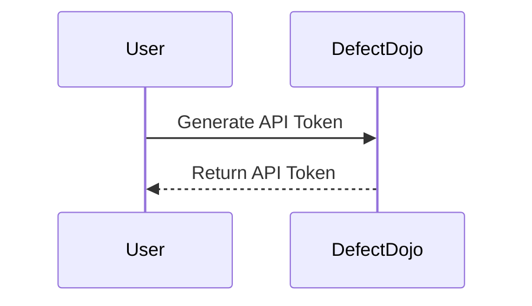
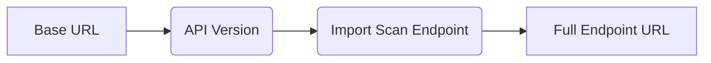
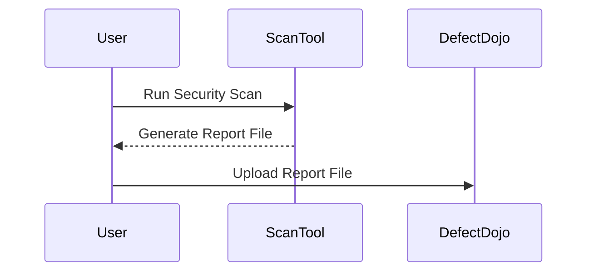
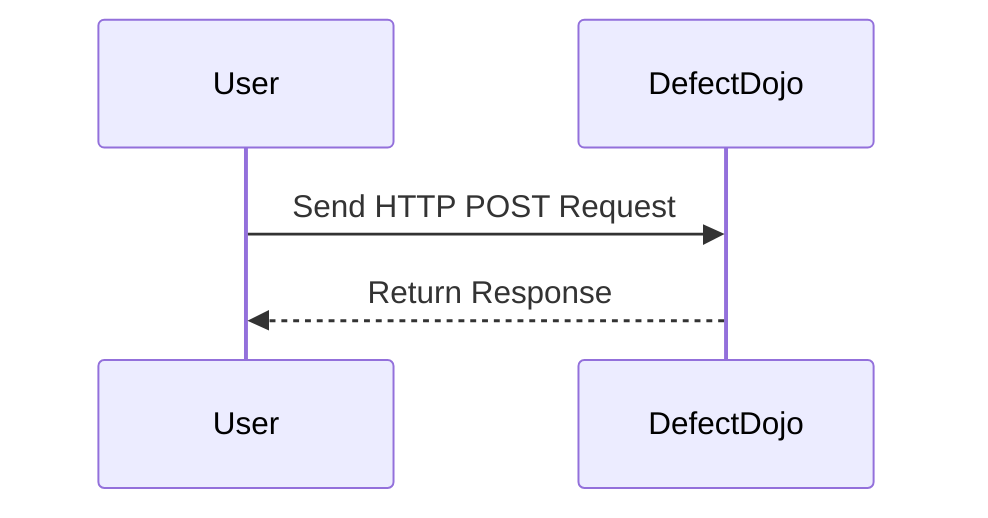

## Introduction to Vulnerability Management and Remediation

Vulnerability management and remediation are critical components of DevSecOps, ensuring that security vulnerabilities are identified, assessed, and addressed efficiently throughout the software development lifecycle. One key aspect of this process is automating the uploading of security scan results to a centralized platform like DefectDojo. This chapter will delve into the details of how to automate this process, covering the necessary steps, potential pitfalls, and best practices for securing your application.

### What is DefectDojo?

DefectDojo is an open-source platform designed to manage and track security vulnerabilities across various applications and systems. It provides a comprehensive framework for aggregating, analyzing, and reporting on security findings from different sources, such as static analysis tools, dynamic analysis tools, and manual assessments. By centralizing these findings, DefectDojo helps organizations prioritize and address vulnerabilities effectively.

### Why Automate Uploading Security Scan Results?

Automating the upload of security scan results to DefectDojo offers several benefits:

1. **Efficiency**: Manual processes are prone to errors and delays. Automation ensures that scan results are uploaded promptly and accurately.
2. **Consistency**: Automated processes follow a consistent set of rules, reducing variability and ensuring that all scan results are handled uniformly.
3. **Integration**: Automation allows seamless integration with continuous integration/continuous deployment (CI/CD) pipelines, enabling real-time tracking of security vulnerabilities.
4. **Scalability**: As the number of applications and systems grows, manual processes become increasingly cumbersome. Automation scales more easily to handle larger volumes of data.

### How Does the Process Work?

The process of automating the upload of security scan results to DefectDojo involves several key steps:

1. **Authentication**: Securely authenticate the request using an API token.
2. **Endpoint Configuration**: Define the API endpoint to which the request will be sent.
3. **Data Preparation**: Prepare the data (report file) to be sent in the HTTP request.
4. **HTTP Request Execution**: Execute the HTTP request to upload the scan results.

### Step-by-Step Guide

#### Authentication

To securely authenticate the request, an API token is used. This token is typically generated within the DefectDojo platform and should be kept confidential to prevent unauthorized access.



**Example API Token Generation:**

1. Log in to your DefectDojo account.
2. Navigate to the settings or profile section.
3. Locate the option to generate an API token.
4. Copy the generated token for use in your automation script.

#### Endpoint Configuration

The API endpoint is the URL to which the HTTP request will be sent. This endpoint includes the base URL of the DefectDojo instance, the API version, and the specific endpoint for importing scan results.



**Example Full Endpoint URL:**

```plaintext
https://demo.defectdojo.com/api/v2/import-scan/
```

#### Data Preparation

The data to be sent in the HTTP request includes the report file generated by the security scan tool. This file contains the details of the vulnerabilities detected during the scan.



**Example Report File:**

```json
{
    "scan_type": "Static Code Analysis",
    "engagement_name": "My Application",
    "test_type_name": "Manual Penetration Test",
    "file": "path/to/report/file.json"
}
```

#### HTTP Request Execution

The final step is to execute the HTTP request to upload the scan results to DefectDojo. This involves constructing the HTTP request with the appropriate headers and data.



**Example HTTP Request:**

```http
POST /api/v2/import-scan/ HTTP/1.1
Host: demo.defectdojo.com
Authorization: Token <your_api_token>
Content-Type: multipart/form-data; boundary=----WebKitFormBoundary7MA4YWxkTrZu0gW

------WebKitFormBoundary7MA4YWxkTrZu0gW
Content-Disposition: form-data; name="scan_type"

Static Code Analysis
------WebKitFormBoundary7MA4YWxkTrZu0gW
Content-Disposition: form-data; name="engagement_name"

My Application
------WebKitFormBoundary7MA4YWxkTrZu0gW
Content-Disposition: form-data; name="test_type_name"

Manual Penetration Test
------WebKitFormBoundary7MA4YWxkTrZu0gW
Content-Disposition: form-data; name="file"; filename="report.json"
Content-Type: application/json

<contents of report.json>
------WebKitFormBoundary7MA4YWx
```

**Example HTTP Response:**

```http
HTTP/1.1 201 Created
Date: Mon, 01 Jan 2024 12:00:00 GMT
Server: Apache/2.4.41 (Ubuntu)
Content-Length: 0
Content-Type: application/json
Location: /api/v2/import-scan/<id>/
```

### Common Pitfalls and Best Practices

#### Common Pitfalls

1. **Incorrect API Token**: Ensure that the API token is correctly generated and used in the request.
2. **Invalid Endpoint URL**: Double-check the endpoint URL to ensure it matches the correct API version and endpoint.
3. **Missing Required Fields**: Verify that all required fields (such as `scan_type`, `engagement_name`, and `test_type_name`) are included in the request.
4. **File Format Issues**: Ensure that the report file is in the correct format and contains all necessary information.

#### Best Practices

1. **Use HTTPS**: Always use HTTPS to encrypt the communication between your automation script and DefectDojo.
2. **Secure API Tokens**: Store API tokens securely and rotate them regularly to minimize the risk of unauthorized access.
3. **Validate Responses**: Check the HTTP response to ensure that the request was successful and handle any errors appropriately.
4. **Automate with CI/CD**: Integrate the automation script into your CI/CD pipeline to ensure that security scan results are uploaded automatically after each build.

### Real-World Examples

#### Recent CVEs and Breaches

One notable example is the Equifax breach in 2017, where a vulnerability in the Apache Struts framework was exploited. Automating the upload of security scan results could have helped identify and address this vulnerability earlier, potentially preventing the breach.

#### Example Integration with CI/CD Pipeline

Here’s an example of how you might integrate the automation script into a CI/CD pipeline using Jenkins:

```groovy
pipeline {
    agent any
    stages {
        stage('Build') {
            steps {
                sh 'mvn clean package'
            }
        }
        stage('Security Scan') {
            steps {
                sh 'dependency-check --project MyApplication --out reports/'
            }
        }
        stage('Upload Scan Results') {
            steps {
                script {
                    def apiToken = 'your_api_token'
                    def baseUrl = 'https://demo.defectdojo.com/api/v2/'
                    def endpoint = 'import-scan/'
                    def reportPath = 'reports/dependency-check-report.json'

                    def response = sh(script: """
                        curl -X POST \\
                             -H "Authorization: Token ${apiToken}" \\
                             -F "scan_type=Dependency Check" \\
                             -F "engagement_name=My Application" \\
                             -F "test_type_name=Dependency Check" \\
                             -F "file=@${reportPath}" \\
                             ${baseUrl}${endpoint}
                    """, returnStdout: true).trim()
                    echo "Response: ${response}"
                }
            }
        }
    }
}
```

### How to Prevent / Defend

#### Detection

Regularly monitor the DefectDojo dashboard for new vulnerabilities and ensure that all scan results are uploaded promptly.

#### Prevention

1. **Secure API Tokens**: Store API tokens securely and rotate them regularly.
2. **Validate Inputs**: Ensure that all inputs to the API are validated to prevent injection attacks.
3. **Use HTTPS**: Always use HTTPS to encrypt the communication between your automation script and DefectDojo.

#### Secure Coding Fixes

Compare the vulnerable and secure versions of the code to understand the differences:

**Vulnerable Code:**

```python
import requests

def upload_scan_results(api_token, base_url, endpoint, report_path):
    url = f"{base_url}{endpoint}"
    files = {'file': open(report_path, 'rb')}
    headers = {'Authorization': f'Token {api_token}'}
    response = requests.post(url, files=files, headers=headers)
    print(response.text)

upload_scan_results('your_api_token', 'https://demo.defectdojo.com/api/v2/', 'import-scan/', 'reports/dependency-check-report.json')
```

**Secure Code:**

```python
import requests

def upload_scan_results(api_token, base_url, endpoint, report_path):
    url = f"{base_url}{endpoint}"
    files = {'file': ('report.json', open(report_path, 'rb'), 'application/json')}
    headers = {'Authorization': f'Token {api_token}'}
    response = requests.post(url, files=files, headers=headers)
    print(response.text)

upload_scan_results('your_api_token', 'https://demo.defectdojo.com/api/v2/', 'import-scan/', 'reports/dependency-check-report.json')
```

### Conclusion

Automating the upload of security scan results to DefectDojo is a crucial step in managing and remediating vulnerabilities effectively. By following the steps outlined in this chapter, you can ensure that your security scan results are uploaded promptly and accurately, helping you to maintain a secure and robust application.

### Practice Labs

For hands-on practice, consider using the following labs:

- **PortSwigger Web Security Academy**: Offers a variety of labs focused on web application security.
- **OWASP Juice Shop**: A deliberately insecure web application for practicing security testing.
- **DVWA (Damn Vulnerable Web Application)**: Another popular web application for learning web security.

These labs provide practical experience in identifying and addressing security vulnerabilities, complementing the theoretical knowledge gained from this chapter.

---
<!-- nav -->
[[01-Introduction to Vulnerability Management and Remediation Part 1|Introduction to Vulnerability Management and Remediation Part 1]] | [[DevSecOps/DevSecOps Bootcamp/05-Application Security Testing/13-Vulnerability Management and Remediation/Automate Uploading Security Scan Results to DefectDojo/00-Overview|Overview]] | [[03-Introduction to Vulnerability Management and Remediation Part 3|Introduction to Vulnerability Management and Remediation Part 3]]
