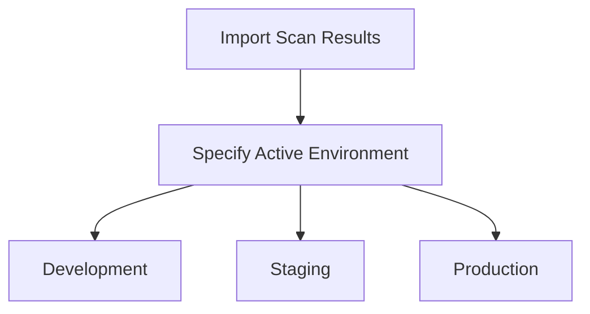
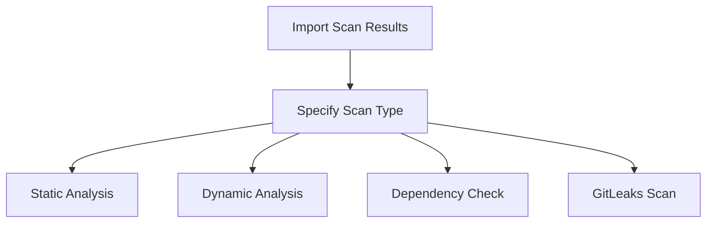
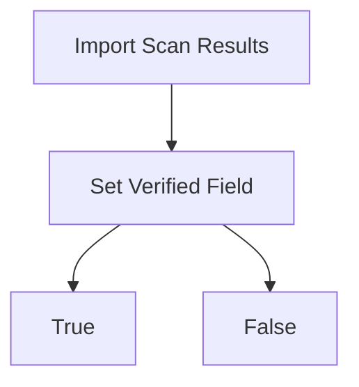
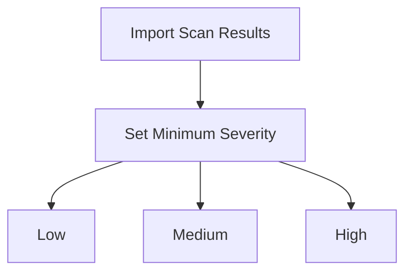
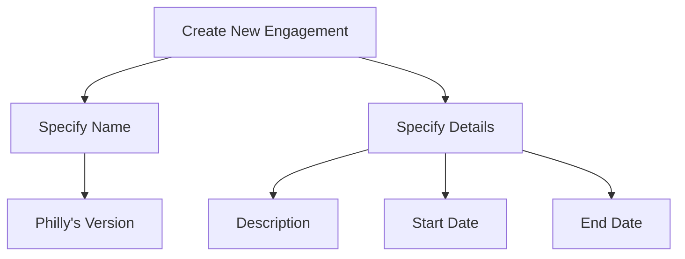
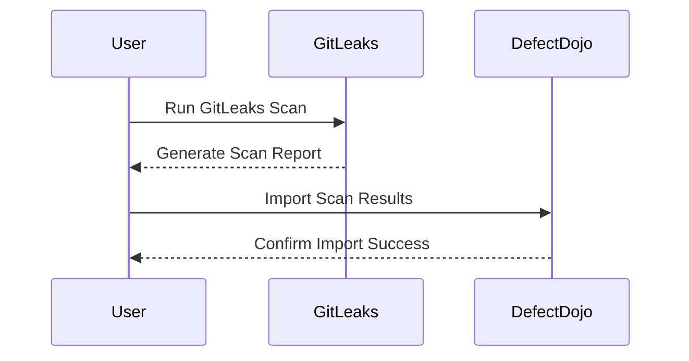

## Introduction to Vulnerability Management and Remediation

Vulnerability management and remediation are critical components of DevSecOps, ensuring that software systems remain secure throughout their lifecycle. One key aspect of this process is automating the uploading of security scan results to a centralized platform such as DefectDojo. This chapter will delve into the details of how to configure and automate the upload of security scan results to DefectDojo, covering all necessary fields and configurations.

### What is DefectDojo?

DefectDojo is an open-source application designed to manage and track vulnerabilities across different applications and environments. It provides a centralized platform for aggregating and managing security findings from various sources, including static analysis tools, dynamic analysis tools, and manual testing.

#### Why Use DefectDojo?

Using DefectDojo offers several benefits:

- **Centralized Management**: All security findings are stored in one place, making it easier to track and manage vulnerabilities.
- **Automation**: Integration with CI/CD pipelines allows for automated scanning and reporting.
- **Compliance**: DefectDojo helps organizations meet compliance requirements by providing detailed reports and tracking the status of vulnerabilities.
- **Collaboration**: Multiple teams can access and update the same findings, improving communication and coordination.

### Required Fields for Importing Scan Results

When importing scan results into DefectDojo, several fields must be provided to ensure the findings are correctly categorized and managed. These fields include:

- **Active Environment**
- **Scan Type**
- **Verified**
- **Minimum Severity**
- **Engagement**

Each of these fields plays a crucial role in the import process. Let's explore them in detail.

#### Active Environment

The active environment field specifies the environment in which the findings were discovered. This could be a development environment, staging environment, or production environment. By specifying the active environment, DefectDojo can better categorize and prioritize the findings based on their impact.



#### Scan Type

The scan type field identifies the type of scan that generated the findings. Different types of scans include static analysis, dynamic analysis, dependency checks, and more. Specifying the scan type ensures that DefectDojo can apply the appropriate rules and settings for processing the findings.

For example, if using GitLeaks for detecting secrets in code repositories, the scan type would be "GitLeaks scan."



#### Verified

The verified field indicates whether the findings have been manually reviewed and confirmed. Setting this field to `true` marks the findings as verified, which can help prioritize them for remediation.



#### Minimum Severity

The minimum severity field determines the lowest severity level of findings that should be imported. This can be useful for filtering out low-severity findings that may not require immediate attention.

For example, setting the minimum severity to `low` means that all findings with a severity level of `low`, `medium`, or `high` will be imported.



#### Engagement

The engagement field associates the findings with a specific project or engagement. This helps in organizing and tracking findings across different projects.

Creating a new engagement involves specifying a name and other details. For example, creating an engagement named "Philly's Version" would involve the following steps:



### Configuring Data for Import Scan

To configure the data for importing scan results, we need to set the required fields as described above. Here is a step-by-step guide to configuring these fields:

1. **Set Active Environment**:
   - Set the active environment to `true` to mark the findings as active.

2. **Set Verified**:
   - Set the verified field to `true` to mark the findings as verified.

3. **Set Scan Type**:
   - Set the scan type to the appropriate value, such as "GitLeaks scan".

4. **Set Minimum Severity**:
   - Set the minimum severity to the desired level, such as `low`.

5. **Set Engagement**:
   - Create a new engagement and specify the engagement ID.

Here is an example of how to configure these fields using Python and the DefectDojo API:

```python
import requests

# Define the API endpoint
api_url = "https://your-defectdojo-instance/api/v2/import-scan/"

# Define the API key
api_key = "your-api-key"

# Define the headers
headers = {
    "Authorization": f"Token {api_key}",
    "Content-Type": "application/json"
}

# Define the data to be sent
data = {
    "active": True,
    "verified": True,
    "scan_type": "GitLeaks Scan",
    "minimum_severity": "Low",
    "engagement": 123  # Replace with the actual engagement ID
}

# Send the POST request
response = requests.post(api_url, json=data, headers=headers)

# Print the response
print(response.json())
```

### Full Example of Importing Scan Results

Let's walk through a complete example of importing scan results into DefectDojo. This includes creating a new engagement, setting the required fields, and sending the import request.

#### Step 1: Create a New Engagement

First, we need to create a new engagement. This involves sending a POST request to the DefectDojo API to create a new engagement.

```python
import requests

# Define the API endpoint for creating an engagement
create_engagement_url = "https://your-defectdojo-instance/api/v2/engagement/"

# Define the API key
api_key = "your-api-key"

# Define the headers
headers = {
    "Authorization": f"Token {api_key}",
    "Content-Type": "application/json"
}

# Define the data for the new engagement
engagement_data = {
    "name": "Philly's Version",
    "description": "Engagement for testing purposes",
    "product": 1,  # Replace with the actual product ID
    "target_start": "2023-10-01",
    "target_end": "2023-10-31"
}

# Send the POST request to create the engagement
response = requests.post(create_engagement_url, json=engagement_data, headers=headers)

# Extract the engagement ID from the response
engagement_id = response.json()["id"]

# Print the engagement ID
print(f"Created engagement with ID: {engagement_id}")
```

#### Step 2: Import Scan Results

Once the engagement is created, we can proceed to import the scan results. This involves sending a POST request to the import scan endpoint with the required fields set.

```python
import requests

# Define the API endpoint for importing scan results
import_scan_url = "https://your-defectdojo-instance/api/v2/import-scan/"

# Define the API key
api_key = "your-api-key"

# Define the headers
headers = {
    "Authorization": f"Token {api_key}",
    "Content-Type": "application/json"
}

# Define the data for importing scan results
import_scan_data = {
    "active": True,
    "verified": True,
    "scan_type": "GitLeaks Scan",
    "minimum_severity": "Low",
    "engagement": engagement_id  # Use the engagement ID obtained earlier
}

# Send the POST request to import the scan results
response = requests.post(import_scan_url, json=import_scan_data, headers=headers)

# Print the response
print(response.json())
```

### Common Pitfalls and How to Avoid Them

When configuring and importing scan results into DefectDojo, there are several common pitfalls to be aware of:

1. **Incorrect API Key**: Ensure that the API key used is correct and has the necessary permissions to perform the actions.
2. **Missing Fields**: Make sure all required fields are provided. Missing fields can result in errors or incomplete imports.
3. **Incorrect Engagement ID**: Double-check that the engagement ID is correct and exists in DefectDojo.
4. **Invalid Scan Type**: Ensure that the scan type specified is valid and supported by DefectDoDOjo.

### How to Prevent / Defend

To prevent issues during the import process, follow these best practices:

1. **Validate API Key**: Always validate the API key before using it to ensure it has the necessary permissions.
2. **Check Required Fields**: Before sending the import request, verify that all required fields are present and correctly formatted.
3. **Verify Engagement ID**: Ensure that the engagement ID is correct and exists in DefectDojo.
4. **Use Supported Scan Types**: Only use scan types that are supported by DefectDojo to avoid compatibility issues.

### Real-World Examples

#### Recent CVEs and Breaches

Recent CVEs and breaches highlight the importance of effective vulnerability management and remediation. For example, the Log4j vulnerability (CVE-2021-44228) affected numerous systems worldwide. Proper vulnerability management practices, including regular scanning and timely remediation, can help mitigate such risks.

#### Real-World Example: GitLeaks Scan

Consider a scenario where a company uses GitLeaks to scan their code repositories for secrets. The scan results are then imported into DefectDojo for centralized management and tracking.



### Conclusion

Automating the uploading of security scan results to DefectDojo is a crucial step in effective vulnerability management and remediation. By configuring the required fields and following best practices, organizations can ensure that their security findings are properly managed and tracked. This chapter has provided a comprehensive guide to the process, including background theory, recent real-world examples, complete code, and diagrams to aid understanding.

### Practice Labs

For hands-on practice with vulnerability management and remediation using DefectDojo, consider the following labs:

- **PortSwigger Web Security Academy**: Offers a variety of labs focused on web application security, including vulnerability management.
- **OWASP Juice Shop**: A deliberately insecure web application for practicing security testing and vulnerability management.
- **DVWA (Damn Vulnerable Web Application)**: Another popular web application for practicing security testing and vulnerability management.

These labs provide practical experience in applying the concepts covered in this chapter.

---
<!-- nav -->
[[02-Introduction to Vulnerability Management and Remediation Part 2|Introduction to Vulnerability Management and Remediation Part 2]] | [[DevSecOps/DevSecOps Bootcamp/05-Application Security Testing/13-Vulnerability Management and Remediation/Automate Uploading Security Scan Results to DefectDojo/00-Overview|Overview]] | [[04-Introduction to Vulnerability Management and Remediation Part 4|Introduction to Vulnerability Management and Remediation Part 4]]
