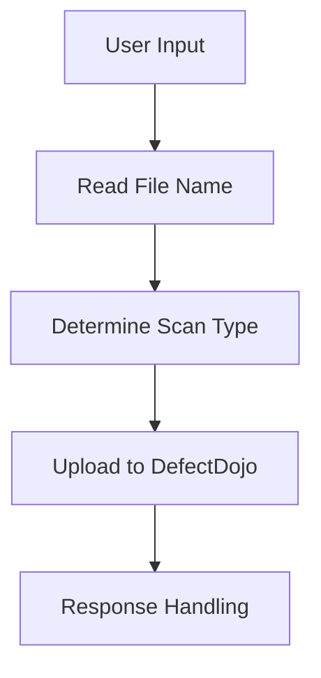
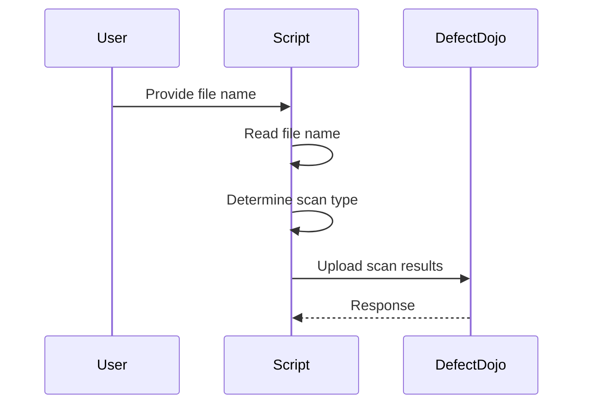

## Introduction to Vulnerability Management and Remediation

Vulnerability management and remediation are critical components of a robust DevSecOps strategy. They involve identifying, assessing, prioritizing, and remediating vulnerabilities within software systems to ensure the security and integrity of applications. This chapter focuses on automating the process of uploading security scan results to a vulnerability management platform like DefectDojo. We will cover the entire workflow, including reading user input, handling different types of scan files, and integrating these processes into a continuous integration/continuous deployment (CI/CD) pipeline.

### Background Theory

#### What is Vulnerability Management?

Vulnerability management is the process of identifying, evaluating, prioritizing, and addressing vulnerabilities in software systems. It involves:

1. **Identification**: Discovering potential vulnerabilities through automated scans, manual reviews, and other methods.
2. **Evaluation**: Assessing the severity and potential impact of identified vulnerabilities.
3. **Prioritization**: Ranking vulnerabilities based on their severity and likelihood of exploitation.
4. **Remediation**: Addressing vulnerabilities by applying patches, updating configurations, or implementing other security measures.

#### Why is Vulnerability Management Important?

Effective vulnerability management helps organizations:

- **Reduce Risk**: By identifying and addressing vulnerabilities, organizations can reduce the risk of security breaches.
- **Compliance**: Many regulatory frameworks require regular vulnerability assessments and remediation.
- **Cost Efficiency**: Early identification and remediation of vulnerabilities can prevent costly incidents and data breaches.

### Automating Upload of Security Scan Results to DefectDojo

DefectDojo is an open-source vulnerability management platform that helps organizations manage and track vulnerabilities across their software assets. Automating the upload of security scan results to DefectDojo ensures that vulnerabilities are promptly identified and addressed.

#### Step-by-Step Process

1. **Reading User Input**
2. **Handling Different Scan Files**
3. **Uploading Results to DefectDojo**

### Reading User Input

To make the script flexible and reusable, we need to allow users to specify the scan file and the type of scan. This can be achieved by reading user input and using it to parameterize the script.

#### Using `sys` Module

The `sys` module in Python provides access to some variables used or maintained by the interpreter and to functions that interact strongly with the interpreter. One of the key functionalities of `sys` is accessing command-line arguments passed to the script.

```python
import sys

# Read the script arguments
args = sys.argv

# The first argument (index 0) is the script name itself
script_name = args[0]

# The second argument (index 1) is the file name provided by the user
file_name = args[1]

print(f"Script name: {script_name}")
print(f"File name: {file_name}")
```

#### Handling Multiple Parameters

While the script currently reads only one parameter (the file name), it can be extended to handle multiple parameters. For example, you might want to pass additional parameters such as the scan type or the API endpoint for DefectDojo.

```python
import sys

# Read the script arguments
args = sys.argv

# The first argument (index 0) is the script name itself
script_name = args[0]

# The second argument (index 1) is the file name provided by the user
file_name = args[1]

# The third argument (index 2) could be the scan type
scan_type = args[2] if len(args) > 2 else None

print(f"Script name: {script_name}")
print(f"File name: {file_name}")
print(f"Scan type: {scan_type}")
```

### Handling Different Scan Files

Different security tools generate scan results in various formats. To handle these different formats, we need to determine the scan type based on the file name and set the appropriate scan type variable.

#### Setting the Scan Type

We can use conditional statements (`if-else`) to set the scan type based on the file name.

```python
import sys

# Read the script arguments
args = sys.argv

# The first argument (index 0) is the script name itself
script_name = args[0]

# The second argument (index 1) is the file name provided by the user
file_name = args[1]

# Initialize the scan type variable
scan_type = ""

# Determine the scan type based on the file name
if "GitLeaks" in file_name:
    scan_type = "GitLeaks"
elif "NGScan" in file_name:
    scan_type = "NGScan"
elif "Semgrep" in file_name:
    scan_type = "Semgrep"

print(f"Script name: {script_name}")
print(f"File name: {file_name}")
print(f"Scan type: {scan_type}")
```

### Uploading Results to DefectDojo

Once we have the file name and the scan type, we can proceed to upload the scan results to DefectDojo. This involves making HTTP requests to the DefectDojo API.

#### DefectDojo API Overview

DefectDojo provides a RESTful API for interacting with the platform. To upload scan results, we need to make a POST request to the appropriate endpoint.

##### Example HTTP Request

Here is an example of an HTTP request to upload scan results to DefectDojo:

```http
POST /api/v2/import-scan/ HTTP/1.1
Host: defectdojo.example.com
Authorization: Token <your_api_token>
Content-Type: application/json

{
  "scan": {
    "file": "<base64_encoded_scan_file>",
    "scan_type": "<scan_type>",
    "engagement": "<engagement_id>"
  }
}
```

#### Implementing the Upload Functionality

We can use the `requests` library in Python to make HTTP requests to the DefectDojo API.

```python
import sys
import base64
import requests

# Read the script arguments
args = sys.argv

# The first argument (index 0) is the script name itself
script_name = args[0]

# The second argument (index 1) is the file name provided by the user
file_name = args[1]

# Initialize the scan type variable
scan_type = ""

# Determine the scan type based on the file name
if "GitLeaks" in file_name:
    scan_type = "GitLeaks"
elif "NGScan" in file_name:
    scan_type = "NGScan"
elif "Semgrep" in file_name:
    scan_type = "Semgrep"

# Read the scan file
with open(file_name, 'rb') as file:
    encoded_file = base64.b64encode(file.read()).decode('utf-8')

# Define the API endpoint and token
api_url = "https://defectdojo.example.com/api/v2/import-scan/"
api_token = "<your_api_token>"

# Define the engagement ID
engagement_id = "<engagement_id>"

# Make the POST request
response = requests.post(
    api_url,
    headers={
        "Authorization": f"Token {api_token}",
        "Content-Type": "application/json"
    },
    json={
        "scan": {
            "file": encoded_file,
            "scan_type": scan_type,
            "engagement": engagement_id
        }
    }
)

# Print the response
print(response.status_code)
print(response.json())
```

### Pitfalls and Common Mistakes

1. **Hard-Coded Values**: Avoid hard-coding values like file names, scan types, and API tokens. Use user input and environment variables instead.
2. **Error Handling**: Ensure proper error handling for file operations and HTTP requests.
3. **Security**: Securely handle sensitive information like API tokens and scan files.

### How to Prevent / Defend

#### Detection

- **Regular Scans**: Schedule regular security scans to identify new vulnerabilities.
- **Automated Alerts**: Set up automated alerts for new vulnerabilities detected by scans.

#### Prevention

- **Secure Coding Practices**: Follow secure coding practices to minimize the introduction of vulnerabilities.
- **Patch Management**: Regularly update and patch software to address known vulnerabilities.

#### Secure Code Fix

**Vulnerable Code**

```python
import sys

# Hard-coded file name
file_name = "GitLeaks.Json"

# Hard-coded scan type
scan_type = "GitLeaks"

# Hard-coded API token
api_token = "your_api_token"

# Hard-coded engagement ID
engagement_id = "12345"

# Make the POST request
response = requests.post(
    "https://defectdojo.example.com/api/v2/import-scan/",
    headers={
        "Authorization": f"Token {api_token}",
        "Content-Type": "application/json"
    },
    json={
        "scan": {
            "file": file_name,
            "scan_type": scan_type,
            "engagement": engagement_id
        }
    }
)
```

**Fixed Code**

```python
import sys
import base64
import requests

# Read the script arguments
args = sys.argv

# The first argument (index 0) is the script name itself
script_name = args[0]

# The second argument (index 1) is the file name provided by the user
file_name = args[1]

# Initialize the scan type variable
scan_type = ""

# Determine the scan type based on the file name
if "GitLeaks" in file_name:
    scan_type = "GitLeaks"
elif "NGScan" in file_name:
    scan_type = "NGScan"
elif "Semgrep" in file_name:
    scan_type = "Semgrep"

# Read the scan file
with open(file_name, 'rb') as file:
    encoded_file = base64.b64encode(file.read()).decode('utf-8')

# Define the API endpoint and token
api_url = "https://defectdojo.example.com/api/v2/import-scan/"
api_token = os.getenv("DEFECTDOJO_API_TOKEN")

# Define the engagement ID
engagement_id = os.getenv("ENGAGEMENT_ID")

# Make the POST request
response = requests.post(
    api_url,
    headers={
        "Authorization": f"Token {api_token}",
        "Content-Type": "application/json"
    },
    json={
        "scan": {
            "file": encoded_file,
            "scan_type": scan_type,
            "engagement": engagement_id
        }
    }
)

# Print the response
print(response.status_code)
print(response.json())
```

### Real-World Examples

#### Recent CVEs and Breaches

- **CVE-2021-44228 (Log4Shell)**: This vulnerability in Apache Log4j allowed attackers to execute arbitrary code on affected servers. Proper vulnerability management would have helped identify and mitigate this issue.
- **SolarWinds Supply Chain Attack**: This attack involved the compromise of SolarWinds Orion software, leading to widespread breaches. Effective vulnerability management and regular security scans could have helped detect and respond to such attacks.

### Mermaid Diagrams

#### Workflow Diagram



#### Sequence Diagram



### Practice Labs

For hands-on practice with vulnerability management and remediation, consider the following labs:

- **PortSwigger Web Security Academy**: Offers interactive labs for web application security.
- **OWASP Juice Shop**: A deliberately insecure web application for practicing security testing.
- **DVWA (Damn Vulnerable Web Application)**: Another intentionally vulnerable web application for security training.
- **WebGoat**: An interactive web application security training tool.

These labs provide practical experience in identifying and managing vulnerabilities, which is essential for mastering DevSecOps principles.

### Conclusion

Automating the upload of security scan results to DefectDojo is a crucial step in effective vulnerability management. By parameterizing the script to accept user input, handling different scan files, and securely uploading results, organizations can streamline their vulnerability management processes and enhance their overall security posture.

---
<!-- nav -->
[[05-Introduction to Vulnerability Management and Remediation Part 5|Introduction to Vulnerability Management and Remediation Part 5]] | [[DevSecOps/DevSecOps Bootcamp/05-Application Security Testing/13-Vulnerability Management and Remediation/Automate Uploading Security Scan Results to DefectDojo/00-Overview|Overview]] | [[07-Introduction to Vulnerability Management and Remediation Part 7|Introduction to Vulnerability Management and Remediation Part 7]]
