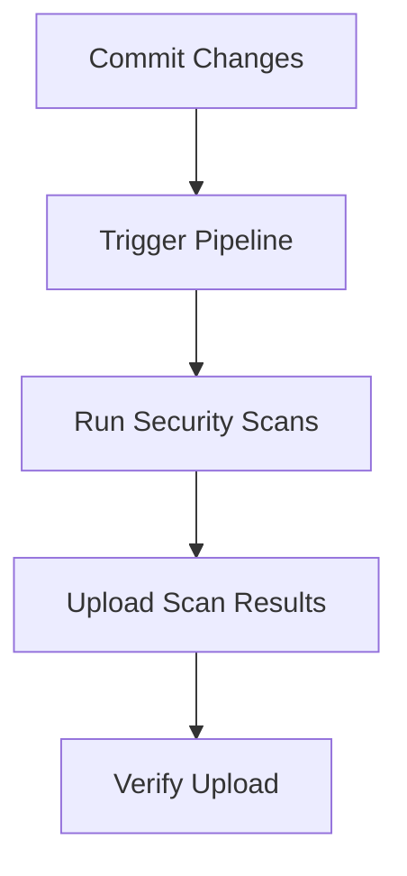

## Introduction to Vulnerability Management and Remediation

Vulnerability management and remediation are crucial components of a robust DevSecOps strategy. They involve identifying, assessing, prioritizing, and addressing security vulnerabilities within an organization’s systems and applications. This process ensures that security weaknesses are identified and resolved before they can be exploited by malicious actors. In this chapter, we will delve into automating the uploading of security scan results to a tool called DefectDojo, which is a popular open-source platform for managing application security testing data.

### What is DefectDojo?

DefectDojo is an open-source application security testing (AST) data aggregation and management tool. It provides a centralized platform for tracking and managing security vulnerabilities across various applications and environments. DefectDojo supports integration with numerous security scanning tools, allowing organizations to aggregate and manage their security findings in one place.

#### Key Features of DefectDojo

- **Centralized Management**: DefectDojo allows you to manage all your security findings in one place, providing a comprehensive view of your application’s security posture.
- **Integration Support**: It integrates with a wide range of security scanning tools, such as Static Application Security Testing (SAST), Dynamic Application Security Testing (DAST), and Dependency Checkers.
- **Customizable Workflows**: You can customize workflows to suit your organization’s specific needs, including defining roles, permissions, and notification settings.
- **Reporting and Analytics**: DefectDojo offers detailed reporting and analytics capabilities, enabling you to track the progress of vulnerability remediation efforts and identify trends in security issues.

### Why Automate Uploading Security Scan Results?

Automating the uploading of security scan results to DefectDojo offers several benefits:

- **Efficiency**: Manual processes are time-consuming and prone to errors. Automation ensures that scan results are uploaded promptly and accurately.
- **Consistency**: Automated processes ensure that scan results are handled consistently, reducing the risk of human error.
- **Scalability**: As your organization grows and the number of applications increases, manual processes become impractical. Automation scales more effectively.
- **Real-time Monitoring**: Automated uploads allow for real-time monitoring of security findings, enabling quicker identification and resolution of vulnerabilities.

### Setting Up the Pipeline

To automate the uploading of security scan results to DefectDojo, you need to set up a continuous integration/continuous deployment (CI/CD) pipeline. This pipeline will trigger security scans and upload the results to DefectDojo whenever changes are committed to the repository.

#### Step-by-Step Setup

1. **Commit Changes to Repository**:
    - Commit the necessary file changes to the main branch of your repository. This will trigger the pipeline.
    - Example:
      ```bash
      git add .
      git commit -m "Add security scan configurations"
      git push origin main
      ```

2. **Trigger the Pipeline**:
    - Once the changes are pushed, the CI/CD pipeline will be triggered. This pipeline will execute the security scans and upload the results to DefectDojo.

3. **Check Pipeline Execution**:
    - Monitor the pipeline execution to ensure that the security scans are completed successfully.
    - Example:
      ```bash
      # Check pipeline status
      gitlab-ci-status
      ```

4. **Upload Scan Results**:
    - After the pipeline completes, the scan results will be uploaded to DefectDojo.
    - Example:
      ```bash
      # Upload scan results to DefectDojo
      curl -X POST -H "Authorization: Token <your_api_token>" -F "file=@<path_to_scan_results_file>" -F "engagement=1" -F "test_type=1" https://<defectdojo_instance>/api/v2/import-scan/
      ```

### Verifying the Upload

Once the pipeline completes, you need to verify that the scan results have been uploaded successfully to DefectDojo.

#### Checking the Engagement

1. **Refresh the Engagement**:
    - Navigate to the engagement in DefectDojo and refresh the page to ensure that the latest scan results are displayed.
    - Example:
      ```bash
      # Refresh the engagement page
      curl -X GET -H "Authorization: Token <your_api_token>" https://<defectdojo_instance>/api/v2/engagements/<engagement_id>/
      ```

2. **Verify the Reports**:
    - Ensure that all the required reports (e.g., GitLeakscan, NodeJS scan, SemGrup report) are present in the engagement.
    - Example:
      ```bash
      # List all reports in the engagement
      curl -X GET -H "Authorization: Token <your_api_token>" https://<defectdojo_instance>/api/v2/reports/?engagement=<engagement_id>
      ```

### Handling Duplicate Reports

In the given scenario, GitLeakscan was uploaded twice. This can happen due to misconfigurations or duplicate triggers in the pipeline. To handle this, you need to ensure that the pipeline is configured correctly to avoid duplicate uploads.

#### How to Prevent Duplicate Reports

1. **Unique Identifiers**:
    - Use unique identifiers for each scan report to ensure that duplicates are not uploaded.
    - Example:
      ```bash
      # Add unique identifier to the report name
      mv <report_name>.json <report_name>-$(date +%Y%m%d%H%M%S).json
      ```

2. **Conditional Uploads**:
    - Implement conditional logic in the pipeline to check if a report already exists before uploading.
    - Example:
      ```bash
      # Check if report already exists
      if ! curl -s -o /dev/null -w "%{http_code}" -H "Authorization: Token <your_api_token>" https://<defectdojo_instance>/api/v2/reports/?name=<report_name>; then
        curl -X POST -H "Authorization: Token <your_api_token>" -F "file=@<path_to_report_file>" -F "engagement=1" -F "test_type=1" https://<defectdojo_instance>/api/v2/import-scan/
      fi
      ```

### Real-World Examples

#### Recent CVEs and Breaches

Recent CVEs and breaches highlight the importance of effective vulnerability management and remediation. For example, the Log4j vulnerability (CVE-2021-44228) affected numerous applications and systems worldwide. Organizations that had robust vulnerability management practices in place were able to identify and mitigate the vulnerability more quickly.

#### Example: Log4j Vulnerability

- **Impact**: The Log4j vulnerability allowed attackers to execute arbitrary code on affected systems.
- **Mitigation**: Organizations used vulnerability management tools like DefectDojo to identify and patch the vulnerability.
- **Code Example**:
  ```bash
  # Example of checking for Log4j vulnerability
  curl -X GET -H "Authorization: Token <your_api_token>" https://<defectdojo_instance>/api/v2/findings/?title__icontains=log4j
  ```

### Complete Code Examples

#### Full HTTP Request and Response

Here is an example of a full HTTP request and response for uploading a scan report to DefectDojo:

```http
POST /api/v2/import-scan/ HTTP/1.1
Host: <defectdojo_instance>
Authorization: Token <your_api_token>
Content-Type: multipart/form-data; boundary=----WebKitFormBoundary7MA4YWxkTrZu0gW

------WebKitFormBoundary7MA4YWxkTrZu0gW
Content-Disposition: form-data; name="file"; filename="scan_results.json"
Content-Type: application/json

<scan_results_content>

------WebKitFormBoundary7MA4YWxkTrZu0gW
Content-Disposition: form-data; name="engagement"

1
------WebKitFormBoundary7MA4YWxkTrZu0gW
Content-Disposition: form-data; name="test_type"

1
------WebKitFormBoundary7MA4YWxkTrZu0gW--
```

#### Response

```http
HTTP/1.1 201 Created
Date: Tue, 01 Aug 2023 12:00:00 GMT
Server: Apache/2.4.41 (Ubuntu)
Content-Length: 0
Content-Type: application/json
Location: /api/v2/findings/123/
```

### Mermaid Diagrams

#### Pipeline Flow Diagram

A mermaid diagram can help visualize the flow of the pipeline:



### Common Pitfalls and How to Avoid Them

#### Misconfigured Pipelines

Misconfigured pipelines can lead to issues such as duplicate uploads or failed uploads. To avoid these pitfalls:

1. **Review Configuration Files**:
    - Regularly review and test your pipeline configuration files to ensure they are correctly set up.
    - Example:
      ```yaml
      # Example of a pipeline configuration file
      stages:
        - build
        - test
        - deploy

      build:
        stage: build
        script:
          - echo "Building the application..."

      test:
        stage: test
        script:
          - echo "Running security scans..."
          - curl -X POST -H "Authorization: Token <your_api_token>" -F "file=@<path_to_scan_results_file>" -F "engagement=1" -F "test_type=1" https://<defectdojo_instance>/api/v2/import-scan/

      deploy:
        stage: deploy
        script:
          - echo "Deploying the application..."
      ```

2. **Use Version Control**:
    - Use version control to manage your pipeline configuration files and ensure that changes are reviewed and tested before being deployed.

### How to Prevent / Defend

#### Detection

To detect vulnerabilities effectively:

1. **Regular Scanning**:
    - Schedule regular security scans to identify new vulnerabilities.
    - Example:
      ```bash
      # Schedule daily security scans
      0 0 * * * /path/to/security_scan_script.sh
      ```

2. **Monitor Logs**:
    - Monitor logs for any signs of suspicious activity that could indicate a vulnerability has been exploited.
    - Example:
      ```bash
      # Monitor logs for suspicious activity
      tail -f /var/log/syslog | grep -i "error"
      ```

#### Prevention

To prevent vulnerabilities from being exploited:

1. **Patch Management**:
    - Implement a robust patch management process to ensure that all systems are up to date with the latest security patches.
    - Example:
      ```bash
      # Update system packages
      sudo apt update && sudo apt upgrade -y
      ```

2. **Secure Coding Practices**:
    - Follow secure coding practices to minimize the introduction of vulnerabilities during development.
    - Example:
      ```python
      # Secure coding example
      import hashlib

      def hash_password(password):
          return hashlib.sha256(password.encode()).hexdigest()
      ```

#### Secure-Coding Fixes

Compare the vulnerable code with the secure code:

```python
# Vulnerable code
import hashlib

def hash_password(password):
    return hashlib.md5(password.encode()).hexdigest()

# Secure code
import hashlib

def hash_password(password):
    return hashlib.sha256(password.encode()).hexdigest()
```

### Configuration Hardening

#### Secure Configuration Examples

1. **Disable Unnecessary Services**:
    - Disable unnecessary services to reduce the attack surface.
    - Example:
      ```bash
      # Disable unnecessary services
      sudo systemctl disable sshd
      ```

2. **Enable Security Modules**:
    - Enable security modules such as SELinux or AppArmor to enhance system security.
    - Example:
      ```bash
      # Enable SELinux
      sudo setenforce 1
      ```

### Hands-On Labs

For hands-on practice, consider the following labs:

- **PortSwigger Web Security Academy**: Offers interactive labs for web application security.
- **OWASP Juice Shop**: A deliberately insecure web application for practicing web security skills.
- **DVWA (Damn Vulnerable Web Application)**: A PHP/MySQL web application that is riddled with vulnerabilities for educational purposes.
- **WebGoat**: An interactive, gamified training application for learning about web application security.

### Conclusion

Automating the uploading of security scan results to DefectDojo is a critical step in effective vulnerability management and remediation. By setting up a robust CI/CD pipeline, you can ensure that security findings are identified and addressed promptly. This chapter has provided a comprehensive guide to automating this process, including background theory, recent real-world examples, complete code examples, and practical tips for preventing and detecting vulnerabilities.

---
<!-- nav -->
[[07-Introduction to Vulnerability Management and Remediation Part 7|Introduction to Vulnerability Management and Remediation Part 7]] | [[DevSecOps/DevSecOps Bootcamp/05-Application Security Testing/13-Vulnerability Management and Remediation/Automate Uploading Security Scan Results to DefectDojo/00-Overview|Overview]] | [[09-Introduction to Vulnerability Management and Remediation|Introduction to Vulnerability Management and Remediation]]
