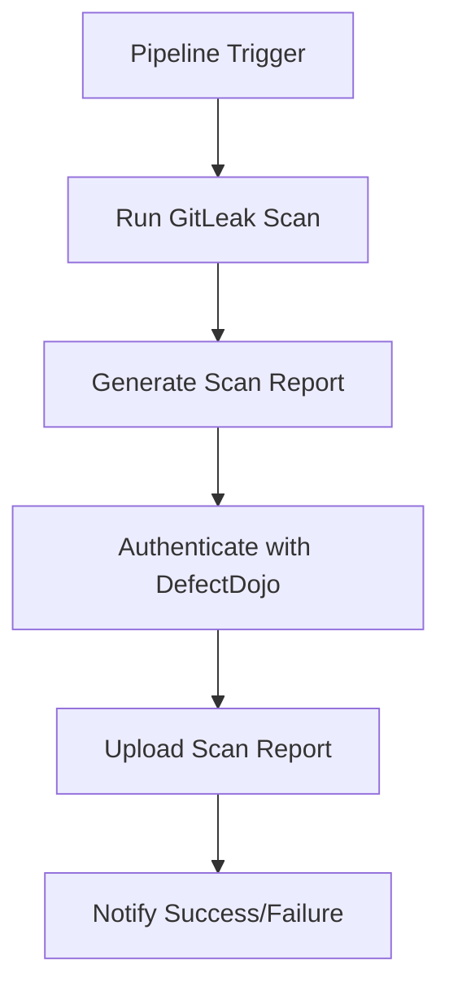
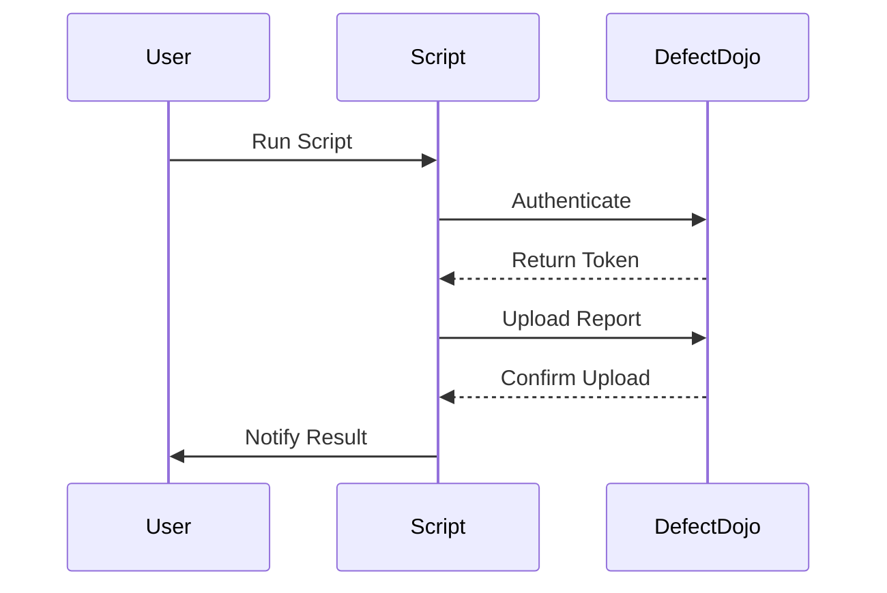

## Step-by-Step Implementation

### Setting Up the Environment

Before we start coding, ensure that you have the necessary environment set up:

1. **Python Installation**: Ensure Python is installed on your system. You can check this by running `python --version` or `python3 --version`.
2. **DefectDojo API Key**: Obtain an API key from your DefectDojo instance. This key is required to authenticate API requests.
3. **GitLeak Scan Reports**: Ensure you have access to the GitLeak scan reports that need to be uploaded.

### Writing the Python Script

We will create a Python script that reads GitLeak scan reports and uploads them to DefectDojo using its API.

#### Import Required Libraries

First, import the necessary libraries:

```python
import requests
import json
```

#### Define Constants

Define constants for the API endpoint and authentication details:

```python
BASE_URL = "https://your-defectdojo-instance.com"
API_KEY = "your-api-key"
USERNAME = "your-username"
SCAN_REPORT_PATH = "path/to/gitleak/report.json"
```

#### Authenticate with DefectDojo

Authenticate with DefectDojo using the API key:

```python
def authenticate():
    url = f"{BASE_URL}/api/v2/auth/token/"
    data = {
        "username": USERNAME,
        "password": API_KEY
    }
    response = requests.post(url, data=data)
    return response.json().get("token")
```

#### Read Scan Report

Read the GitLeak scan report from the specified path:

```python
def read_scan_report(path):
    with open(path, 'r') as file:
        return json.load(file)
```

#### Upload Scan Report to DefectDojo

Upload the scan report to DefectDojo:

```python
def upload_scan_report(token, report):
    url = f"{BASE_URL}/api/v2/import-scan/"
    headers = {
        "Authorization": f"Token {token}",
        "Content-Type": "application/json"
    }
    data = {
        "scan_type": "GitLeak",
        "engagement": 1,  # Replace with actual engagement ID
        "test": 1,  # Replace with actual test ID
        "verified": True,
        "report": report
    }
    response = requests.post(url, headers=headers, data=json.dumps(data))
    return response.status_code == 201
```

#### Main Function

Combine all the functions into a main function:

```python
def main():
    token = authenticate()
    report = read_scan_report(SCAN_REPORT_PATH)
    success = upload_scan_report(token, report)
    if success:
        print("Scan report successfully uploaded to DefectDojo.")
    else:
        print("Failed to upload scan report to DefectDojo.")

if __name__ == "__main__":
    main()
```

### Full Example Code

Here is the complete Python script:

```python
import requests
import json

BASE_URL = "https://your-defectdojo-instance.com"
API_KEY = "your-api-key"
USERNAME = "your-username"
SCAN_REPORT_PATH = "path/to/gitleak/report.json"

def authenticate():
    url = f"{BASE_URL}/api/v2/auth/token/"
    data = {
        "username": USERNAME,
        "password": API_KEY
    }
    response = requests.post(url, data=data)
    return response.json().get("token")

def read_scan_report(path):
    with open(path, 'r') as file:
        return json.load(file)

def upload_scan_report(token, report):
    url = f"{BASE_URL}/api/v2/import-scan/"
    headers = {
        "Authorization": f"Token {token}",
        "Content-Type": "application/json"
    }
    data = {
        "scan_type": "GitLeak",
        "engagement": 1,  # Replace with actual engagement ID
        "test": 1,  # Replace with actual test ID
        "verified": True,
        "report": report
    }
    response = requests.post(url, headers=headers, data=json.dumps(data))
    return response.status_code == 201

def main():
    token = authenticate()
    report = read_scan_report(SCAN_REPORT_PATH)
    success = upload_scan_report(token, report)
    if success:
        print("Scan report successfully uploaded to DefectDojo.")
    else:
        print("Failed to upload scan report to DefectDojo.")

if __name__ == "__main__":
    main()
```

### Explanation of Each Component

1. **Authentication**:
   - The `authenticate` function sends a POST request to the DefectDojo API to obtain an authentication token.
   - This token is used to authenticate subsequent API requests.

2. **Reading the Scan Report**:
   - The `read_scan_report` function reads the GitLeak scan report from the specified path.
   - The report is assumed to be in JSON format.

3. **Uploading the Scan Report**:
   - The `upload_scan_report` function sends a POST request to the DefectDojo API to upload the scan report.
   - The `headers` dictionary includes the authentication token and the content type.
   - The `data` dictionary contains the necessary parameters for the API call, including the scan type, engagement ID, test ID, and the report itself.

### Handling Errors and Edge Cases

It is crucial to handle potential errors and edge cases to ensure the script's robustness. For example:

- **Network Issues**: Handle exceptions related to network connectivity.
- **Invalid Credentials**: Check if the authentication token is valid.
- **File Not Found**: Ensure the scan report file exists at the specified path.
- **API Response Errors**: Check the status code of the API response to determine if the upload was successful.

### How to Prevent / Defend

#### Detection

- **Regular Audits**: Regularly audit the pipeline to ensure that the automation script is functioning correctly.
- **Logging**: Implement logging to capture any errors or issues during the execution of the script.

#### Prevention

- **Secure Authentication**: Ensure that the API key is stored securely and not exposed in the script or version control.
- **Validation**: Validate the scan report before uploading to ensure it meets the expected format and content requirements.

#### Secure Coding Fixes

Below is an example of a vulnerable script and its secure counterpart:

**Vulnerable Script**:
```python
import requests
import json

BASE_URL = "https://your-defectdojo-instance.com"
API_KEY = "your-api-key"
USERNAME = "your-username"
SCAN_REPORT_PATH = "path/to/gitleak/report.json"

def authenticate():
    url = f"{BASE_URL}/api/v2/auth/token/"
    data = {
        "username": USERNAME,
        "password": API_KEY
    }
    response = requests.post(url, data=data)
    return response.json().get("token")

def read_scan_report(path):
    with open(path, 'r') as file:
        return json.load(file)

def upload_scan_report(token, report):
    url = f"{BASE_URL}/api/v2/import-scan/"
    headers = {
        "Authorization": f"Token {token}",
        "Content-Type": "application/json"
    }
    data = {
        "scan_type": "GitLeak",
        "engagement": 1,  # Replace with actual engagement ID
        "test": 1,  # Replace with actual test ID
        "verified": True,
        "report": report
    }
    response = requests.post(url, headers=headers, data=json.dumps(data))
    return response.status_code == 201

def main():
    token = authenticate()
    report = read_scan_report(SCAN_REPORT_PATH)
    success = upload_scan_report(token, report)
    if success:
        print("Scan report successfully uploaded to DefectDojo.")
    else:
        print("Failed to upload scan report to DefectDojo.")

if __name__ == "__main__":
    main()
```

**Secure Script**:
```python
import requests
import json

BASE_URL = "https://your-defectdojo-instance.com"
API_KEY = "your-api-key"
USERNAME = "your-username"
SCAN_REPORT_PATH = "path/to/gitleak/report.json"

def authenticate():
    url = f"{BASE_URL}/api/v2/auth/token/"
    data = {
        "username": USERNAME,
        "password": API_KEY
    }
    try:
        response = requests.post(url, data=data)
        response.raise_for_status()
        return response.json().get("token")
    except requests.exceptions.RequestException as e:
        print(f"Error authenticating: {e}")
        return None

def read_scan_report(path):
    try:
        with open(path, 'r') as file:
            return json.load(file)
    except FileNotFoundError:
        print(f"File not found: {path}")
        return None
    except json.JSONDecodeError:
        print(f"Invalid JSON format in file: {path}")
        return None

def upload_scan_report(token, report):
    if not token or not report:
        return False
    url = f"{BASE_URL}/api/v2/import-scan/"
    headers = {
        "Authorization": f"Token {token}",
        "Content-Type": "application/json"
    }
    data = {
        "scan_type": "GitLeak",
        "engagement": 1,  # Replace with actual engagement ID
        "test": 1,  # Replace with actual test ID
        "verified": True,
        "report": report
    }
    try:
        response = requests.post(url, headers=headers, data=json.dumps(data))
        response.raise_for_status()
        return response.status_code == 201
    except requests.exceptions.RequestException as e:
        print(f"Error uploading report: {e}")
        return False

def main():
    token = authenticate()
    report = read_scan_report(SCAN_REPORT_PATH)
    success = upload_scan_report(token, report)
    if success:
        print("Scan report successfully uploaded to DefectDojo.")
    else:
        print("Failed to upload scan report to DefectDojo.")

if __name__ == "__main__":
    main()
```

### Real-World Examples

#### Recent Breaches and CVEs

- **CVE-2021-44228 (Log4Shell)**: This vulnerability in Apache Log4j led to widespread exploitation. Automating the upload of scan results to DefectDojo could have helped in quickly identifying and mitigating this vulnerability.
- **SolarWinds Supply Chain Attack**: This attack involved the compromise of SolarWinds software, leading to widespread breaches. Automating the upload of scan results could have helped in detecting and responding to such attacks more effectively.

### Mermaid Diagrams

#### Pipeline Flow



#### API Request/Response Flow



### Practice Labs

For hands-on practice with this topic, consider the following labs:

- **PortSwigger Web Security Academy**: Offers a variety of labs focused on web application security, including automated scanning and reporting.
- **OWASP Juice Shop**: Provides a vulnerable web application for practicing security testing and automation.
- **DVWA (Damn Vulnerable Web Application)**: Another resource for practicing web application security testing and automation.

By integrating these practices into your DevSecOps workflow, you can significantly enhance your ability to manage and remediate vulnerabilities efficiently and effectively.

---
<!-- nav -->
[[10-Background Theory|Background Theory]] | [[DevSecOps/DevSecOps Bootcamp/05-Application Security Testing/13-Vulnerability Management and Remediation/Automate Uploading Security Scan Results to DefectDojo/00-Overview|Overview]] | [[12-Vulnerability Management and Remediation Automating Upload of Security Scan Results to DefectDojo Part 1|Vulnerability Management and Remediation Automating Upload of Security Scan Results to DefectDojo Part 1]]
