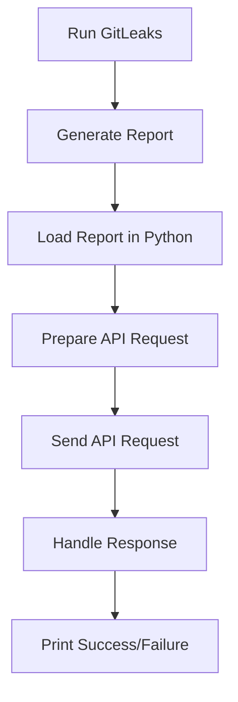

## Vulnerability Management and Remediation: Automating Upload of Security Scan Results to DefectDojo

### Introduction to Vulnerability Management and Remediation

Vulnerability management and remediation are critical components of a robust cybersecurity strategy. They involve identifying, assessing, prioritizing, and addressing vulnerabilities within an organization’s systems and applications. This process helps organizations stay ahead of potential threats and minimize the risk of security breaches.

In modern DevSecOps practices, automation plays a pivotal role in streamlining vulnerability management. One such automation task is uploading security scan results to a centralized platform like DefectDojo. DefectDojo is an open-source application designed to manage and track vulnerabilities across various systems and applications. By automating the upload of scan results, organizations can ensure timely and accurate tracking of vulnerabilities, thereby enhancing their overall security posture.

### Background Theory: Security Scanning and DefectDojo

#### Security Scanning

Security scanning involves using automated tools to identify vulnerabilities in software applications and systems. These tools can range from static analysis tools that examine the source code to dynamic analysis tools that test the application during runtime. Common security scanning tools include:

- **GitLeaks**: A tool that scans repositories for secrets and sensitive data.
- **OWASP ZAP**: An open-source web application security scanner.
- **Nessus**: A vulnerability scanner for networks and systems.

These tools generate reports that contain detailed information about identified vulnerabilities. These reports are typically in formats such as JSON, XML, or CSV.

#### DefectDojo

DefectDojo is a web-based application that serves as a central repository for managing and tracking vulnerabilities. It supports various types of security scans and integrates with numerous security tools. Key features of DefectDojo include:

- **Centralized Reporting**: Aggregates scan results from multiple sources.
- **Vulnerability Tracking**: Tracks the status of vulnerabilities over time.
- **Integration Support**: Integrates with popular security tools via APIs.
- **Customizable Dashboards**: Provides customizable dashboards for different stakeholders.

### Automating Upload of Security Scan Results to DefectDojo

To automate the upload of security scan results to DefectDojo, we will use a Python script. This script will interact with the DefectDojo API to upload the scan results generated by a tool like GitLeaks.

#### Step-by-Step Mechanics

1. **Generate Scan Report**: Run the security scan tool (e.g., GitLeaks) to generate a report.
2. **Access Report Data**: Ensure the Python script has access to the generated report.
3. **API Interaction**: Use the DefectDojo API to upload the report.
4. **Handle Response**: Process the API response to determine if the upload was successful.

### Detailed Example: Uploading GitLeaks Report to DefectDojo

Let's walk through a detailed example of how to automate the upload of a GitLeaks report to DefectDojo using a Python script.

#### Prerequisites

Before proceeding, ensure you have the following:

- **Python Environment**: A working Python environment.
- **DefectDojo API Access**: Credentials and API endpoint URL.
- **GitLeaks Installed**: GitLeaks installed and configured to generate JSON reports.

#### Step 1: Generate GitLeaks Report

First, run GitLeaks to scan your repository and generate a JSON report.

```bash
gitleaks --report-format json --report-path ./gitleaks_report.json
```

This command generates a JSON report named `gitleaks_report.json`.

#### Step 2: Access Report Data

Next, create a Python script to read the generated report.

```python
import json

# Load the GitLeaks report
with open('gitleaks_report.json', 'r') as file:
    report_data = json.load(file)

print("Report loaded successfully.")
```

#### Step 3: API Interaction

Now, use the DefectDojo API to upload the report. First, install the necessary libraries.

```bash
pip install requests
```

Then, create the API interaction logic.

```python
import requests

defectdojo_api_url = "https://your-defectdojo-instance.com/api/v2/import-scan/"
api_key = "your-api-key"
headers = {
    "Authorization": f"Token {api_key}",
    "Content-Type": "application/json",
}

# Prepare the data for the API request
data = {
    "scan_type": "GitLeaks Scan",
    "engagement": 1,  # Replace with the appropriate engagement ID
    "product": 1,     # Replace with the appropriate product ID
    "verified": True,
    "file": report_data,
}

response = requests.post(defectdojo_api_url, headers=headers, json=data)
print(f"Response Status Code: {response.status_code}")
print(f"Response Content: {response.content}")
```

#### Step 4: Handle Response

Finally, handle the API response to determine if the upload was successful.

```python
if response.status_code == 201:
    print("Scan results imported successfully.")
else:
    print(f"Failed to import scan results. Response: {response.content}")
```

### Full Example Script

Combining all the steps, the complete Python script looks like this:

```python
import json
import requests

# Load the GitLeaks report
with open('gitleaks_report.json', 'r') as file:
    report_data = json.load(file)

defectdojo_api_url = "https://your-defectdojo-instance.com/api/v2/import-scan/"
api_key = "your-api-key"
headers = {
    "Authorization": f"Token {api_key}",
    "Content-Type": "application/json",
}

# Prepare the data for the API request
data = {
    "scan_type": "GitLeaks Scan",
    "engagement": 1,  # Replace with the appropriate engagement ID
    "product": 1,     # Replace with the appropriate product ID
    "verified": True,
    "file": report_data,
}

response = requests.post(defectdojo_api_url, headers=headers, json=data)
print(f"Response Status Code: {response.status_code}")
print(f"Response Content: {response.content}")

if response.status_code == 201:
    print("Scan results imported successfully.")
else:
    print(f"Failed to import scan results. Response: {response.content}")
```

### HTTP Details

The full HTTP request and response look like this:

#### HTTP Request

```http
POST /api/v2/import-scan/ HTTP/1.1
Host: your-defectdojo-instance.com
Authorization: Token your-api-key
Content-Type: application/json

{
    "scan_type": "GitLeaks Scan",
    "engagement": 1,
    "product": 1,
    "verified": true,
    "file": {
        "results": [
            {
                "line": "secret=1234567890",
                "filename": "secrets.txt",
                "commit": "abc123def456ghi789jk"
            }
        ]
    }
}
```

#### HTTP Response

```http
HTTP/1.1 201 Created
Content-Type: application/json

{
    "id": 123,
    "title": "GitLeaks Scan",
    "date": "2023-10-01T12:00:00Z",
    "status": "Pending",
    "scan_type": "GitLeaks Scan",
    "engagement": 1,
    "product": 1,
    "verified": true,
    "file": {
        "results": [
            {
                "line": "secret=1234567890",
                "filename": "secrets.txt",
                "commit": "abc123def456ghi789jk"
            }
        ]
    }
}
```

### Mermaid Diagram: Workflow

A mermaid diagram illustrating the workflow:



### Pitfalls and Common Mistakes

1. **Incorrect API Endpoint**: Ensure the API endpoint URL is correct.
2. **Missing API Key**: Verify that the API key is correctly set.
3. **Invalid Engagement/Product IDs**: Ensure the engagement and product IDs are valid.
4. **Incorrect Report Format**: Ensure the report is in the correct format expected by DefectDojo.

### How to Prevent / Defend

#### Detection

- **Regular Audits**: Regularly audit the DefectDojo instance to ensure all scan results are uploaded correctly.
- **Logging**: Enable logging for the Python script to capture any errors or issues during execution.

#### Prevention

- **Validation**: Validate the report data before sending it to the API.
- **Error Handling**: Implement robust error handling in the Python script to catch and log any issues.

#### Secure Coding Fixes

**Vulnerable Code**

```python
response = requests.post(defectdojo_api_url, headers=headers, json=data)
print(f"Response Status Code: {response.status_code}")
print(f"Response Content: {response.content}")
```

**Secure Code**

```python
try:
    response = requests.post(defectdojo_api_url, headers=headers, json=data)
    print(f"Response Status Code: {response.status_code}")
    print(f"Response Content: {response.content}")
except requests.exceptions.RequestException as e:
    print(f"Request Exception: {e}")
```

### Configuration Hardening

- **API Key Rotation**: Rotate API keys regularly to minimize exposure.
- **Rate Limiting**: Configure rate limiting on the DefectDojo API to prevent abuse.

### Real-World Examples

#### Recent Breaches

- **CVE-2021-44228 (Log4Shell)**: Organizations that had automated vulnerability management in place were able to quickly identify and patch affected systems.
- **SolarWinds Supply Chain Attack**: Automated security scanning helped identify malicious code in third-party software.

### Practice Labs

For hands-on practice, consider the following labs:

- **PortSwigger Web Security Academy**: Offers practical exercises on web application security.
- **OWASP Juice Shop**: A deliberately insecure web application for practicing security testing.
- **DVWA (Damn Vulnerable Web Application)**: Another intentionally vulnerable web application for learning security concepts.

By automating the upload of security scan results to DefectDojo, organizations can enhance their vulnerability management processes and improve their overall security posture.

---
<!-- nav -->
[[11-Step-by-Step Implementation|Step-by-Step Implementation]] | [[DevSecOps/DevSecOps Bootcamp/05-Application Security Testing/13-Vulnerability Management and Remediation/Automate Uploading Security Scan Results to DefectDojo/00-Overview|Overview]] | [[13-Vulnerability Management and Remediation Automating Upload of Security Scan Results to DefectDojo Part 2|Vulnerability Management and Remediation Automating Upload of Security Scan Results to DefectDojo Part 2]]
