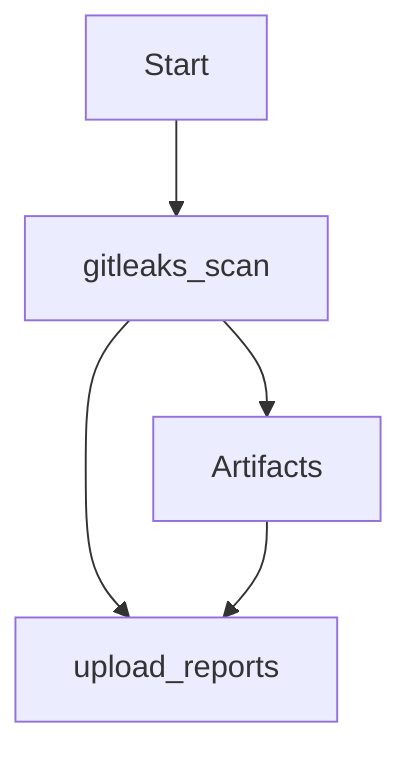

## Vulnerability Management and Remediation: Automating Upload of Security Scan Results to DefectDojo

### Introduction to Vulnerability Management and Remediation

Vulnerability management and remediation are critical components of a robust DevSecOps strategy. They involve identifying, assessing, prioritizing, and addressing vulnerabilities within an organization’s software and infrastructure. Effective vulnerability management ensures that security issues are identified early and addressed promptly, reducing the risk of exploitation by malicious actors.

### Automating Security Scans and Reporting

One of the key practices in DevSecOps is automating security scans and reporting. This involves integrating security tools into the continuous integration/continuous deployment (CI/CD) pipeline to ensure that security checks are performed automatically as part of the development process. One such tool is **DefectDojo**, which is an open-source application designed to manage and track security vulnerabilities across different systems and applications.

### Using DefectDojo for Vulnerability Management

**DefectDojo** provides a centralized platform for managing security findings from various sources, including static analysis tools, dynamic analysis tools, and manual assessments. By integrating DefectDojo into your CI/CD pipeline, you can automate the process of uploading security scan results, ensuring that all findings are tracked and managed effectively.

#### Setting Up the Python Script for Uploading Scan Results

To automate the upload of security scan results to DefectDojo, you can use a Python script. This script will make an API request to DefectDojo, using an API key to authenticate the request and upload the scan results.

```python
import requests
import json

def upload_scan_results(api_key, scan_file_path):
    url = "https://your-defectdojo-instance/api/v2/import-scan/"
    headers = {
        "Authorization": f"Token {api_key}",
        "Content-Type": "application/json"
    }
    
    with open(scan_file_path, 'r') as file:
        scan_data = json.load(file)
    
    data = {
        "scan_type": "GitLeaks Scan",
        "engagement": 1,
        "test": 1,
        "file": scan_data
    }
    
    response = requests.post(url, headers=headers, data=json.dumps(data))
    
    if response.status_code == 201:
        print("Scan results uploaded successfully.")
    else:
        print(f"Failed to upload scan results. Status code: {response.status_code}")
        print(response.text)

# Example usage
upload_scan_results("your-api-key", "/path/to/GitLeaks.json")
```

### Integrating the Python Script into the CI/CD Pipeline

To ensure that the Python script runs automatically as part of the CI/CD pipeline, you need to integrate it into the pipeline configuration file. This typically involves creating a new job in the pipeline that executes the Python script after all the scanning jobs have completed.

#### Example Pipeline Configuration (GitLab CI/CD)

Here is an example of how you might configure a GitLab CI/CD pipeline to include the Python script for uploading scan results:

```yaml
stages:
  - scan
  - upload_reports

gitleaks_scan:
  stage: scan
  script:
    - gitleaks --path . --report-path ./reports/GitLeaks.json
  artifacts:
    paths:
      - ./reports/GitLeaks.json

upload_reports:
  stage: upload_reports
  script:
    - python3 /path/to/upload_report.py --api-key your-api-key --scan-file-path ./reports/GitLeaks.json
  dependencies:
    - gitleaks_scan
```

### Understanding Artifacts in GitLab CI/CD

In GitLab CI/CD, artifacts are files that are produced by a job and can be used by subsequent jobs. When you define artifacts in a job, GitLab automatically uploads these files to the server and makes them available to other jobs in the pipeline.

For example, in the `gitleaks_scan` job above, the `./reports/GitLeaks.json` file is defined as an artifact. This means that the file will be automatically downloaded and made available to the `upload_reports` job.

### How GitLab Handles Artifacts

When you define artifacts in a job, GitLab handles the following steps automatically:

1. **Upload**: After the job completes, GitLab uploads the specified artifacts to the server.
2. **Download**: In subsequent jobs, GitLab automatically downloads the artifacts from previous jobs and makes them available in the job's working directory.

This ensures that the `upload_reports` job has access to the `GitLeaks.json` file produced by the `gitleaks_scan` job.

### Diagramming the Pipeline Flow

To better understand the flow of the pipeline, we can use a mermaid diagram to visualize the process:



### Common Pitfalls and Best Practices

#### Common Pitfalls

1. **Incorrect API Key**: Ensure that the API key provided to the script is correct and has the necessary permissions to upload scan results.
2. **Missing Dependencies**: Make sure that all required dependencies (e.g., Python, GitLeaks) are installed and configured correctly.
3. **Artifact Path Errors**: Double-check the paths specified for artifacts to ensure that the files are being uploaded and downloaded correctly.

#### Best Practices

1. **Use Secure Storage for API Keys**: Store API keys securely using environment variables or secret management tools like HashiCorp Vault.
2. **Automate Testing**: Regularly test the pipeline to ensure that all jobs run as expected and that scan results are uploaded correctly.
3. **Monitor Pipeline Logs**: Monitor the logs generated by the pipeline to quickly identify and resolve any issues that arise.

### Real-World Examples and Case Studies

#### Recent CVEs and Breaches

One recent example of a vulnerability that could have been detected and managed through automated security scans is the **CVE-2021-44228** (Log4Shell). This vulnerability affected the Apache Log4j library and allowed attackers to execute arbitrary code on affected systems. By integrating automated security scans into the CI/CD pipeline, organizations could have detected and addressed this vulnerability earlier, reducing the risk of exploitation.

#### Case Study: Automating Security Scans at a Large Enterprise

A large enterprise implemented automated security scans and reporting using DefectDojo and GitLab CI/CD. By integrating the Python script into their pipeline, they were able to automatically upload scan results from various tools, including GitLeaks, to DefectDojo. This allowed them to centralize and manage all security findings in one place, improving their overall security posture.

### How to Prevent / Defend

#### Detection

To detect issues with the pipeline and script, regularly review the pipeline logs and monitor the status of the jobs. Use monitoring tools to alert you to any failures or errors.

#### Prevention

1. **Secure API Key Management**: Use environment variables or secret management tools to store and manage API keys securely.
2. **Regular Testing**: Regularly test the pipeline to ensure that all jobs run as expected and that scan results are uploaded correctly.
3. **Code Review**: Perform regular code reviews to ensure that the script and pipeline configuration are secure and follow best practices.

#### Secure Coding Fixes

Here is an example of how to securely manage API keys in the Python script:

```python
import os
import requests
import json

def upload_scan_results(scan_file_path):
    api_key = os.getenv('DEFECTDOJO_API_KEY')
    url = "https://your-defectdojo-instance/api/v2/import-scan/"
    headers = {
        "Authorization": f"Token {api_key}",
        "Content-Type": "application/json"
    }
    
    with open(scan_file_path, 'r') as file:
        scan_data = json.load(file)
    
    data = {
        "scan_type": "GitLeaks Scan",
        "engagement": 1,
        "test": 1,
        "file": scan_data
    }
    
    response = requests.post(url, headers=headers, data=json.dumps(data))
    
    if response.status_code == 201:
        print("Scan results uploaded successfully.")
    else:
        print(f"Failed to upload scan results. Status code: {response.status_code}")
        print(response.text)

# Example usage
upload_scan_results("/path/to/GitLeaks.json")
```

### Conclusion

By automating the upload of security scan results to DefectDojo, you can improve your organization's vulnerability management and remediation processes. This involves setting up a Python script to upload scan results, integrating the script into your CI/CD pipeline, and ensuring that artifacts are handled correctly. By following best practices and regularly testing the pipeline, you can ensure that your security findings are managed effectively, reducing the risk of exploitation by malicious actors.

### Hands-On Labs

To practice and reinforce the concepts covered in this chapter, consider the following hands-on labs:

- **PortSwigger Web Security Academy**: Offers a variety of labs related to web application security, including automated security scans.
- **OWASP Juice Shop**: A deliberately insecure web application that can be used to practice security testing and vulnerability management.
- **DVWA (Damn Vulnerable Web Application)**: Another intentionally vulnerable web application that can be used to practice security testing and vulnerability management.

These labs provide practical experience in integrating security scans into a CI/CD pipeline and managing vulnerabilities using tools like DefectDojo.

---
<!-- nav -->
[[12-Vulnerability Management and Remediation Automating Upload of Security Scan Results to DefectDojo Part 1|Vulnerability Management and Remediation Automating Upload of Security Scan Results to DefectDojo Part 1]] | [[DevSecOps/DevSecOps Bootcamp/05-Application Security Testing/13-Vulnerability Management and Remediation/Automate Uploading Security Scan Results to DefectDojo/00-Overview|Overview]] | [[14-Vulnerability Management and Remediation Automating Upload of Security Scan Results to DefectDojo|Vulnerability Management and Remediation Automating Upload of Security Scan Results to DefectDojo]]
