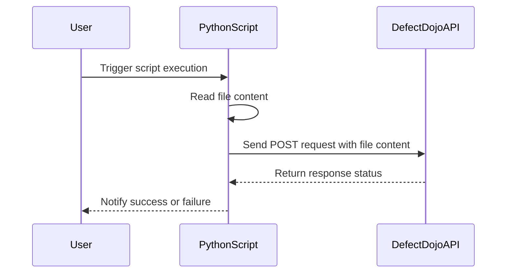

## Vulnerability Management and Remediation: Automating Upload of Security Scan Results to DefectDojo

### Introduction to Vulnerability Management and Remediation

Vulnerability management and remediation are critical components of any robust cybersecurity strategy. They involve identifying, assessing, prioritizing, and remediating vulnerabilities within an organization’s systems and applications. This process helps organizations stay ahead of potential threats and ensures that their infrastructure remains secure.

### Overview of DefectDojo

DefectDojo is an open-source platform designed to manage and track software vulnerabilities throughout the development lifecycle. It provides a centralized repository for storing and managing security scan results, making it easier to identify and prioritize vulnerabilities. DefectDojo supports various types of security scans, including static application security testing (SAST), dynamic application security testing (DAST), and dependency-checking tools.

### Automating Upload of Security Scan Results

Automating the upload of security scan results to DefectDojo is essential for maintaining an up-to-date and accurate record of vulnerabilities. This automation can be achieved through scripting, typically using languages like Python, which offers powerful libraries for handling HTTP requests and file operations.

#### Preparing the File for Upload

Before uploading the file to DefectDojo, it is necessary to read the file programmatically. This can be done using Python’s built-in `open` function, which allows you to read and manipulate files in various formats.

```python
# Open the file in binary read mode
with open('GitLeaks.json', 'rb') as file:
    file_content = file.read()
```

The `open` function takes two parameters: the filename and the mode. In this case, `'rb'` stands for "read binary," which is used to read the file in binary format. This is important because DefectDojo expects the file content in binary form for proper processing.

#### Constructing the HTTP Request

Once the file content is read, the next step is to construct the HTTP request to upload the file to DefectDojo. This involves setting the appropriate headers and including the file content in the request body.

```python
import requests

# Define the URL for the DefectDojo API endpoint
url = 'https://defectdojo.example.com/api/v2/import-scan/'

# Define the headers for the request
headers = {
    'Authorization': 'Token your_api_token_here',
    'Content-Type': 'multipart/form-data'
}

# Define the data to be sent in the request
data = {
    'scan_type': 'GitLeaks Scan',
    'engagement': 1,
    'product': 1,
    'verified': True
}

# Define the files to be uploaded
files = {'file': ('GitLeaks.json', file_content)}

# Make the POST request to upload the file
response = requests.post(url, headers=headers, data=data, files=files)

# Check the response status
if response.status_code == 201:
    print("File uploaded successfully")
else:
    print(f"Failed to upload file: {response.status_code}")
```

### Detailed Explanation of Each Component

#### Reading the File

The `open` function is used to read the file in binary mode. This is crucial because the file content needs to be sent in binary format to ensure that the file is correctly interpreted by DefectDojo.

- **Filename**: The name of the file to be read, in this case, `'GitLeaks.json'`.
- **Mode**: The mode in which the file is opened. `'rb'` stands for "read binary."

```python
with open('GitLeaks.json', 'rb') as file:
    file_content = file.read()
```

#### Constructing the HTTP Request

The `requests.post` method is used to send a POST request to the DefectDojo API endpoint. This method requires several parameters:

- **URL**: The URL of the DefectDojo API endpoint where the file will be uploaded.
- **Headers**: The headers for the request, including the authorization token and content type.
- **Data**: The data to be sent in the request body, including metadata about the scan.
- **Files**: The files to be uploaded, specified as a dictionary where the key is the field name and the value is a tuple containing the filename and file content.

```python
import requests

# Define the URL for the DefectDojo API endpoint
url = 'https://defectdojo.example.com/api/v2/import-scan/'

# Define the headers for the request
headers = {
    'Authorization': 'Token your_api_token_here',
    'Content-Type': 'multipart/form-data'
}

# Define the data to be sent in the request
data = {
    'scan_type': 'GitLeaks Scan',
    'engagement': 1,
    'product': 1,
    'verified': True
}

# Define the files to be uploaded
files = {'file': ('GitLeaks.json', file_content)}

# Make the POST request to upload the file
response = requests.post(url, headers=headers, data=data, files=files)
```

#### Handling the Response

After sending the request, it is important to handle the response to determine whether the upload was successful. The response object contains the status code and other information about the request.

```python
if response.status_code == 201:
    print("File uploaded successfully")
else:
    print(f"Failed to upload file: {response.status_code}")
```

### Common Pitfalls and How to Avoid Them

#### Incorrect File Mode

Using the wrong file mode can result in errors when reading the file. Always ensure that the file is opened in binary mode (`'rb'`) when reading the content for upload.

#### Missing Authorization Token

Forcing the request to fail due to missing or incorrect authorization tokens is a common mistake. Ensure that the authorization token is correctly set in the headers.

#### Incorrect Data Format

Incorrectly formatting the data sent in the request can lead to errors. Ensure that the data dictionary includes all required fields and that the values are correctly formatted.

### Real-World Examples and Recent Breaches

#### Example: CVE-2021-44228 (Log4Shell)

The Log4Shell vulnerability (CVE-2021-44228) is a critical vulnerability in the Apache Log4j logging framework. This vulnerability allowed attackers to execute arbitrary code on affected systems, leading to widespread exploitation.

By automating the upload of security scan results to DefectDojo, organizations can quickly identify and prioritize vulnerabilities like Log4Shell, ensuring that they are addressed promptly.

### How to Prevent / Defend

#### Secure Coding Practices

Implementing secure coding practices is essential for preventing vulnerabilities. This includes:

- **Input Validation**: Ensuring that all input is validated and sanitized to prevent injection attacks.
- **Least Privilege Principle**: Running applications with the least privileges necessary to perform their tasks.
- **Regular Updates and Patching**: Keeping all software and dependencies up to date with the latest security patches.

#### Configuration Hardening

Hardening configurations can help prevent vulnerabilities from being exploited. This includes:

- **Disabling Unnecessary Services**: Disabling services that are not required reduces the attack surface.
- **Enforcing Strong Authentication**: Using strong authentication mechanisms, such as multi-factor authentication (MFA), can help prevent unauthorized access.

#### Detection and Monitoring

Regular monitoring and detection are crucial for identifying and responding to vulnerabilities. This includes:

- **Continuous Scanning**: Regularly scanning systems and applications for vulnerabilities using tools like GitLeaks, SAST, and DAST.
- **Logging and Auditing**: Maintaining detailed logs and audit trails to detect and investigate suspicious activities.

### Complete Code Example

Here is a complete example of how to automate the upload of security scan results to DefectDojo using Python:

```python
import requests

# Open the file in binary read mode
with open('GitLeaks.json', 'rb') as file:
    file_content = file.read()

# Define the URL for the DefectDojo API endpoint
url = 'https://defectdojo.example.com/api/v2/import-scan/'

# Define the headers for the request
headers = {
    'Authorization': 'Token your_api_token_here',
    'Content-Type': 'multipart/form-data'
}

# Define the data to be sent in the request
data = {
    'scan_type': 'GitLeaks Scan',
    'engagement': 1,
    'product': 1,
    'verified': True
}

# Define the files to be uploaded
files = {'file': ('GitLeaks.json', file_content)}

# Make the POST request to upload the file
response = requests.post(url, headers=headers, data=data, files=files)

# Check the response status
if response.status_code == 201:
    print("File uploaded successfully")
else:
    print(f"Failed to upload file: {response.status_code}")
```

### Mermaid Diagrams

#### Sequence Diagram for File Upload Process



### Hands-On Labs

To practice and gain hands-on experience with automating the upload of security scan results to DefectDojo, consider the following labs:

- **PortSwigger Web Security Academy**: Offers a comprehensive set of labs covering various aspects of web security, including automated vulnerability management.
- **OWASP Juice Shop**: A deliberately insecure web application that can be used to practice vulnerability management and remediation techniques.
- **DVWA (Damn Vulnerable Web Application)**: Another intentionally vulnerable web application that can be used to practice security scanning and vulnerability management.

These labs provide a practical environment to apply the concepts learned and gain confidence in automating the upload of security scan results to DefectDojo.

### Conclusion

Automating the upload of security scan results to DefectDojo is a critical step in maintaining a robust vulnerability management and remediation process. By following the steps outlined in this chapter, you can effectively integrate automated uploads into your workflow, ensuring that your organization stays ahead of potential threats and maintains a secure infrastructure.

---
<!-- nav -->
[[13-Vulnerability Management and Remediation Automating Upload of Security Scan Results to DefectDojo Part 2|Vulnerability Management and Remediation Automating Upload of Security Scan Results to DefectDojo Part 2]] | [[DevSecOps/DevSecOps Bootcamp/05-Application Security Testing/13-Vulnerability Management and Remediation/Automate Uploading Security Scan Results to DefectDojo/00-Overview|Overview]] | [[15-Vulnerability Management and Remediation in DevSecOps|Vulnerability Management and Remediation in DevSecOps]]
