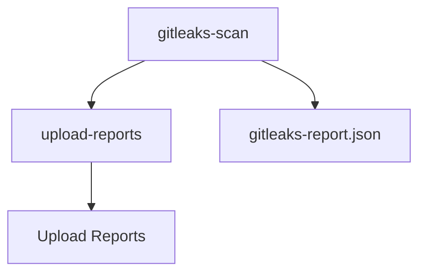

## Vulnerability Management and Remediation in DevSecOps

### Introduction to Vulnerability Management and Remediation

Vulnerability management and remediation are critical components of a robust DevSecOps strategy. They involve identifying, assessing, prioritizing, and addressing vulnerabilities in software systems to mitigate risks and ensure the security of applications and infrastructure. This process is essential for maintaining the integrity, confidentiality, and availability of systems.

### Automating Security Scans and Reporting

One of the key practices in DevSecOps is automating security scans and reporting. This ensures that security checks are integrated into the continuous integration and continuous deployment (CI/CD) pipeline, allowing teams to identify and address vulnerabilities early in the development lifecycle.

#### GitLeaks and Security Scans

GitLeaks is a popular tool used to scan repositories for secrets and sensitive data. It helps identify potential security issues such as hardcoded API keys, passwords, and other sensitive information that could be exposed in the codebase. By integrating GitLeaks into the CI/CD pipeline, teams can automatically detect and report such vulnerabilities.

### Integrating GitLeaks with GitLab CI/CD

To integrate GitLeaks with GitLab CI/CD, we need to configure a job that runs GitLeaks and generates a JSON report containing the findings. This report is then used as an artifact that subsequent jobs can access.

#### Example GitLab CI/CD Configuration

Here is an example of how to configure a GitLab CI/CD pipeline to run GitLeaks and generate a JSON report:

```yaml
stages:
  - test
  - report

gitleaks-scan:
  stage: test
  script:
    - gitleaks --path . --report-json > gitleaks-report.json
  artifacts:
    paths:
      - gitleaks-report.json

upload-reports:
  stage: report
  script:
    - echo "Uploading reports..."
  needs:
    - job: gitleaks-scan
      artifacts: true
```

In this configuration:
- `gitleaks-scan` is a job that runs GitLeaks and generates a JSON report named `gitleaks-report.json`.
- The `artifacts` section specifies that the generated report should be stored as an artifact.
- The `upload-reports` job depends on the `gitleaks-scan` job through the `needs` attribute, ensuring that the report is available before the upload process begins.

### Understanding Job Dependencies in GitLab CI/CD

In GitLab CI/CD, jobs within the same stage typically run in parallel to optimize build times. However, some jobs may have dependencies on others, meaning they need to wait for certain conditions to be met before they can start executing.

#### Using the `needs` Attribute

The `needs` attribute in GitLab CI/CD allows you to specify dependencies between jobs. This ensures that a job waits for the completion of another job before it starts. In our example, the `upload-reports` job needs the `gitleaks-scan` job to complete and produce the `gitleaks-report.json` file.

#### Example with `needs` Attribute

Let's revisit the example with the `needs` attribute:

```yaml
upload-reports:
  stage: report
  script:
    - echo "Uploading reports..."
  needs:
    - job: gitleaks-scan
      artifacts: true
```

In this configuration:
- The `upload-reports` job is set to depend on the `gitle-aks-scan` job.
- The `artifacts: true` option ensures that the `upload-reports` job can access the artifacts produced by the `gitleaks-scan` job.

### Handling Job Success and Failure

It is important to consider scenarios where the dependent job might fail. In such cases, you may want the dependent job to still proceed, regardless of the success or failure of the previous job.

#### Using `when: always`

The `when: always` option ensures that the dependent job runs regardless of the status of the previous job. This is useful when you want to ensure that the reporting process continues even if the scanning job fails.

#### Example with `when: always`

Here is an updated example with the `when: always` option:

```yaml
upload-reports:
  stage: report
  script:
    - echo "Uploading reports..."
  needs:
    - job: gitleaks-scan
      artifacts: true
      when: always
```

In this configuration:
- The `upload-reports` job will run regardless of whether the `gitleaks-scan` job succeeds or fails.
- The `when: always` option ensures that the reporting process continues even if the scanning job encounters an error.

### Complete Example Pipeline

Here is the complete example of a GitLab CI/CD pipeline that integrates GitLeaks and uploads reports:

```yaml
stages:
  - test
  - report

gitleaks-scan:
  stage: test
  script:
    - gitleaks --path . --report-json > gitleaks-report.json
  artifacts:
    paths:
      - gitleaks-report.json

upload-reports:
  stage: report
  script:
    - echo "Uploading reports..."
  needs:
    - job: gitleaks-scan
      artifacts: true
      when: always
```

### Mermaid Diagram of the Pipeline

A visual representation of the pipeline can help understand the flow of jobs and their dependencies:



### Real-World Examples and Recent Breaches

Integrating security scans and reporting into the CI/CD pipeline is crucial for preventing security breaches. Here are some recent examples where automated security scans could have helped prevent breaches:

#### Example 1: Capital One Data Breach (CVE-2019-11510)

In 2019, Capital One suffered a data breach due to a misconfigured web application firewall. Automated security scans could have identified the misconfiguration and alerted the team to take corrective action.

#### Example 2: Twitter Hack (CVE-2020-14720)

In July 2020, Twitter experienced a high-profile hack where several high-profile accounts were compromised. Automated security scans could have detected and reported potential vulnerabilities in the system, helping to prevent the breach.

### Common Pitfalls and Best Practices

When integrating security scans and reporting into the CI/CD pipeline, there are several common pitfalls to avoid:

1. **Ignoring Scan Results**: Teams should not ignore scan results. All findings should be reviewed and addressed promptly.
2. **Incomplete Coverage**: Ensure that all parts of the codebase are scanned. Missing areas can lead to undetected vulnerabilities.
3. **False Positives**: Automated scans can sometimes produce false positives. Teams should validate findings to avoid unnecessary work.

### How to Prevent / Defend

#### Detection

- **Automated Scanning Tools**: Use tools like GitLeaks, TruffleHog, and Bandit to automatically scan for sensitive data and vulnerabilities.
- **Continuous Monitoring**: Implement continuous monitoring to detect and respond to security incidents in real-time.

#### Prevention

- **Secure Coding Practices**: Follow secure coding guidelines to minimize the introduction of vulnerabilities.
- **Regular Audits**: Conduct regular security audits to identify and address potential weaknesses.

#### Secure-Coding Fixes

Here is an example of a vulnerable code snippet and its secure counterpart:

**Vulnerable Code:**
```python
import os
import json

def read_secrets():
    with open('secrets.json', 'r') as f:
        secrets = json.load(f)
    return secrets
```

**Secure Code:**
```python
import os
import json

def read_secrets():
    if os.getenv('SECRETS_FILE'):
        with open(os.getenv('SECRETS_FILE'), 'r') as f:
            secrets = json.load(f)
        return secrets
    else:
        raise Exception("SECRETS_FILE environment variable not set")
```

In the secure version, the secrets file path is read from an environment variable, reducing the risk of exposing sensitive data in the codebase.

### Conclusion

Automating security scans and reporting is a critical aspect of DevSecOps. By integrating tools like GitLeaks into the CI/CD pipeline and properly managing job dependencies, teams can effectively identify and address vulnerabilities early in the development lifecycle. This helps ensure the security and integrity of applications and infrastructure.

### Practice Labs

For hands-on practice with vulnerability management and remediation in DevSecOps, consider the following labs:

- **PortSwigger Web Security Academy**: Offers interactive labs to learn about web application security.
- **OWASP Juice Shop**: A deliberately insecure web application for practicing security testing.
- **DVWA (Damn Vulnerable Web Application)**: A PHP/MySQL web application that demonstrates web application vulnerabilities.
- **WebGoat**: An interactive training application designed to teach web application security lessons.

These labs provide practical experience in identifying and remediating vulnerabilities, reinforcing the concepts learned in this chapter.

---
<!-- nav -->
[[14-Vulnerability Management and Remediation Automating Upload of Security Scan Results to DefectDojo|Vulnerability Management and Remediation Automating Upload of Security Scan Results to DefectDojo]] | [[DevSecOps/DevSecOps Bootcamp/05-Application Security Testing/13-Vulnerability Management and Remediation/Automate Uploading Security Scan Results to DefectDojo/00-Overview|Overview]] | [[DevSecOps/DevSecOps Bootcamp/05-Application Security Testing/13-Vulnerability Management and Remediation/Automate Uploading Security Scan Results to DefectDojo/16-Practice Questions & Answers|Practice Questions & Answers]]
