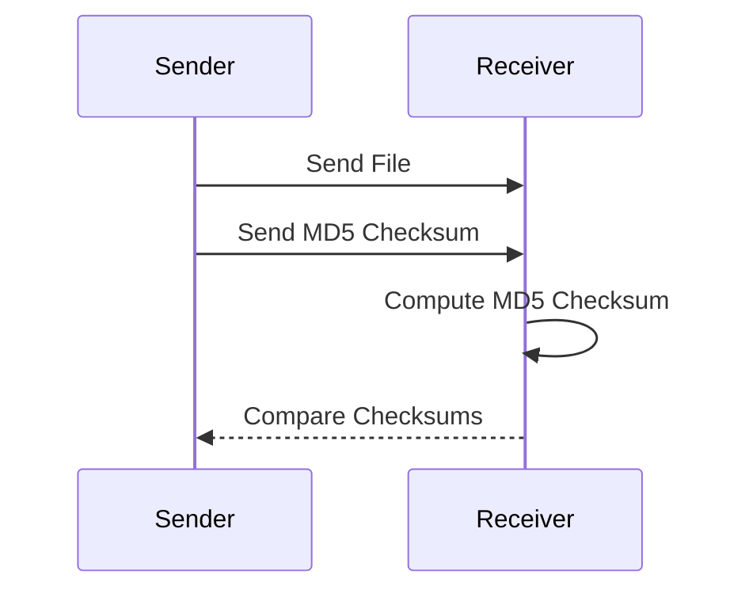

## Introduction to Checksums and Hash Functions

Checksums and hash functions are fundamental concepts in computer science and cybersecurity. They are used to verify the integrity of data by generating a unique identifier based on the contents of a file or data set. A checksum is a small-sized datum derived from a block of digital data for the purpose of detecting errors that may have been introduced during its transmission or storage. In contrast, a hash function is a mathematical function that maps data of arbitrary size to a fixed-size value, typically a string of characters. This output is called a hash value or simply a hash.

### What is a Checksum?

A checksum is a form of redundancy check that is used to ensure data integrity. It is a small piece of data derived from a larger set of data through a specific algorithm. The primary purpose of a checksum is to detect accidental changes to raw data. For example, if a file is transmitted over a network, the receiver can compute the checksum of the received file and compare it with the checksum sent by the sender. If the two checksums match, it is highly likely that the file was transmitted without errors.

#### How Checksums Work

The process of computing a checksum involves the following steps:

1. **Data Input**: The original data is input into the checksum algorithm.
2. **Algorithm Execution**: The algorithm processes the data and generates a checksum value.
3. **Comparison**: The generated checksum is compared with the expected checksum. If they match, the data is considered valid; otherwise, it is flagged as potentially corrupted.

### What is a Hash Function?

A hash function is a deterministic procedure that takes an input (or 'message') and returns a fixed-size string of bytes, which is typically a hexadecimal number. The output is called a hash value or simply a hash. Hash functions are designed to be fast and to produce a unique output for each unique input. However, due to the finite size of the output, collisions (where two different inputs produce the same output) are possible.

#### Types of Hash Functions

There are several types of hash functions, each with different properties and applications:

1. **MD5 (Message-Digest Algorithm 5)**: Developed by Ronald Rivest in 1991, MD5 produces a 128-bit (16-byte) hash value. Although widely used in the past, MD5 is now considered insecure due to vulnerabilities that allow for collision attacks.
   
2. **SHA (Secure Hash Algorithm)**: Developed by the National Security Agency (NSA), SHA includes several versions such as SHA-1, SHA-2, and SHA-3. SHA-1 produces a 160-bit (20-byte) hash value, while SHA-2 includes several variants (SHA-224, SHA-256, SHA-384, SHA-512) that produce varying lengths of hash values. SHA-3, also known as Keccak, is the latest version and is designed to be more resistant to attacks.

### Why Use Stronger Algorithms?

Using stronger algorithms like SHA-256 instead of MD5 is crucial for maintaining data integrity and security. MD5 has known vulnerabilities that make it unsuitable for cryptographic purposes. For instance, MD5 is susceptible to collision attacks, where two different inputs can produce the same hash value. This can lead to serious security issues, such as the ability to forge digital signatures or manipulate data without detection.

#### Real-World Example: MD5 Collision Attack

One notable example of the weaknesses of MD5 is the MD5 collision attack demonstrated by researchers in 2004. They showed that it was possible to create two different PDF files with the same MD5 hash value. This attack highlighted the vulnerabilities of MD5 and led to its deprecation in many security contexts.



### Vulnerability Management and Remediation

In the context of DevSecOps, managing and remediating security vulnerabilities is a critical task. One common issue is the use of weak hash functions like MD5. Detecting and fixing such vulnerabilities is essential to maintain the security and integrity of systems.

#### Detection of Weak Hash Functions

Detecting the use of weak hash functions can be done through static code analysis tools and security scanning tools. These tools can identify instances where MD5 is being used and flag them as potential security risks.

##### Example Code with MD5

Consider the following Python code snippet that uses MD5 to generate a hash:

```python
import hashlib

def generate_md5_hash(data):
    md5_hash = hashlib.md5()
    md5_hash.update(data.encode('utf-8'))
    return md5_hash.hexdigest()

data = "This is some sample data"
print(generate_md5_hash(data))
```

#### Remediation Steps

To remediate the use of MD5, the code should be updated to use a stronger hash function like SHA-256. Here is the corrected version of the code:

```python
import hashlib

def generate_sha256_hash(data):
    sha256_hash = hashlib.sha256()
    sha256_hash.update(data.encode('utf-8'))
    return sha256_hash.hexdigest()

data = "This is some sample data"
print(generate_sha256_hash(data))
```

### How to Prevent / Defend

#### Detection

To detect the use of weak hash functions, organizations can implement automated security scanning tools that analyze codebases for known vulnerabilities. Tools like SonarQube, Fortify, and Veracode can help identify instances where MD5 is being used.

#### Prevention

Preventing the use of weak hash functions involves educating developers about the risks associated with MD5 and other weak algorithms. Organizations should enforce coding standards that mandate the use of strong hash functions like SHA-256. Additionally, continuous integration (CI) pipelines can be configured to fail builds if weak hash functions are detected.

#### Secure Coding Fixes

Here is a comparison of the vulnerable and secure code snippets:

**Vulnerable Code:**

```python
import hashlib

def generate_md5_hash(data):
    md5_hash = hashlib.md5()
    md5_hash.update(data.encode('utf-8'))
    return md5_hash.hexdigest()

data = "This is some sample data"
print(generate_md5_hash(data))
```

**Secure Code:**

```python
import hashlib

def generate_sha256_hash(data):
    sha256_hash = hashlib.sha256()
    sha256_hash.update(data.encode('utf-8'))
    return sha256_hash.hexdigest()

data = "This is some sample data"
print(generate_sha256_hash(data))
```

### Conclusion

Managing and remediating security vulnerabilities is a critical aspect of DevSecOps. By understanding the importance of strong hash functions and implementing secure coding practices, organizations can significantly enhance their data integrity and security. Regularly updating and auditing codebases for the use of weak hash functions is essential to maintaining robust security measures.

### Practice Labs

For hands-on practice with vulnerability management and remediation in the DevSecOps pipeline, consider the following labs:

- **PortSwigger Web Security Academy**: Offers interactive labs to learn about various web security topics, including hash functions and their vulnerabilities.
- **OWASP Juice Shop**: A deliberately insecure web application for security training. It includes scenarios where weak hash functions can be exploited.
- **DVWA (Damn Vulnerable Web Application)**: Another intentionally vulnerable web application for learning web security. It includes exercises related to hash functions and their weaknesses.

These labs provide practical experience in identifying and fixing security vulnerabilities, reinforcing the theoretical knowledge gained from this chapter.

---
<!-- nav -->
[[DevSecOps/DevSecOps Bootcamp/05-Application Security Testing/13-Vulnerability Management and Remediation/Fix Security Issues Discovered in the DevSecOps Pipeline/00-Overview|Overview]] | [[DevSecOps/DevSecOps Bootcamp/05-Application Security Testing/13-Vulnerability Management and Remediation/Fix Security Issues Discovered in the DevSecOps Pipeline/02-Introduction to SQL Injection and Parameterized Queries|Introduction to SQL Injection and Parameterized Queries]]
