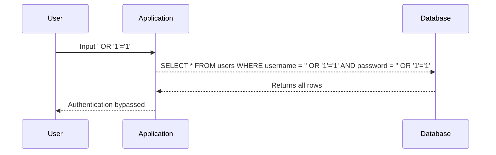
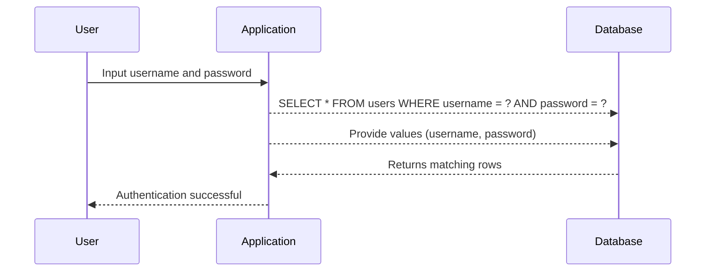

## Introduction to SQL Injection and Parameterized Queries

SQL Injection is one of the most common and dangerous vulnerabilities in web applications. It occurs when an attacker manipulates input data to execute arbitrary SQL commands against a database. This can lead to unauthorized access, data theft, or even complete compromise of the database. To understand SQL Injection, we need to delve into the basics of SQL and how it interacts with web applications.

### What is SQL?

Structured Query Language (SQL) is a programming language used to manage and manipulate relational databases. It allows users to perform operations such as querying, inserting, updating, and deleting data. SQL is widely used in web applications to interact with databases, making it a critical component of many systems.

### How Does SQL Injection Work?

SQL Injection happens when an application takes user input and uses it directly in a SQL query without proper validation or sanitization. This allows an attacker to inject malicious SQL code into the query, potentially altering its behavior.

#### Example of SQL Injection

Consider a simple login form where a user enters their username and password. The application might construct a SQL query like this:

```sql
SELECT * FROM users WHERE username = 'username' AND password = 'password';
```

If an attacker inputs `username` as `' OR '1'='1` and `password` as `' OR '1'='1`, the query becomes:

```sql
SELECT * FROM users WHERE username = '' OR '1'='1' AND password = '' OR '1'='1';
```

This query will return all rows from the `users` table because the condition `'1'='1'` is always true. This allows the attacker to bypass authentication.

### Real-World Examples of SQL Injection

One of the most notable real-world examples of SQL Injection is the breach of the Heartland Payment Systems in 2008. Hackers exploited SQL Injection vulnerabilities to steal sensitive data from millions of credit card transactions. Another example is the breach of the T-Mobile customer database in 2018, where SQL Injection was used to steal personal information from 2 million customers.

### Why Use Parameterized Queries?

Parameterized queries are a technique that helps prevent SQL Injection by separating the SQL logic from the user input. In a parameterized query, placeholders are used in the SQL statement, and the actual values are passed separately. This ensures that the input is treated as data rather than executable code.

### How Parameterized Queries Work

In a parameterized query, placeholders (such as `?` or `:placeholder`) are used in the SQL statement, and the actual values are provided separately. This separation ensures that the input is treated as data, not executable code, thus preventing SQL Injection.

#### Example of Parameterized Query

Let's consider the same login form example. Using a parameterized query, the SQL statement would look like this:

```sql
SELECT * FROM users WHERE username = ? AND password = ?;
```

The actual values for `username` and `password` are provided separately, ensuring that they are treated as data.

### Implementation in Different Languages

Different programming languages and frameworks support parameterized queries differently. Here are some examples:

#### Python with SQLite

```python
import sqlite3

conn = sqlite3.connect('example.db')
cursor = conn.cursor()

# Define the SQL query with placeholders
query = "SELECT * FROM users WHERE username = ? AND password = ?"

# Provide the values separately
values = ('username', 'password')

# Execute the query with the values
cursor.execute(query, values)

# Fetch the results
results = cursor.fetchall()
```

#### Java with JDBC

```java
import java.sql.Connection;
import java.sql.DriverManager;
import java.sql.PreparedStatement;
import java.sql.ResultSet;

public class Main {
    public static void main(String[] args) {
        try {
            Connection conn = DriverManager.getConnection("jdbc:mysql://localhost:3306/example", "user", "password");
            String query = "SELECT * FROM users WHERE username = ? AND password = ?";
            PreparedStatement stmt = conn.prepareStatement(query);
            stmt.setString(1, "username");
            stmt.setString(2, "password");

            ResultSet rs = stmt.executeQuery();
            while (rs.next()) {
                System.out.println(rs.getString("username"));
            }
        } catch (Exception e) {
            e.printStackTrace();
        }
    }
}
```

### Mermaid Diagrams for Understanding SQL Injection and Parameterized Queries

#### SQL Injection Attack Flow



#### Parameterized Query Flow



### Common Pitfalls and Best Practices

#### Common Pitfalls

1. **Not Using Parameterized Queries**: One of the most common mistakes is not using parameterized queries, leading to SQL Injection vulnerabilities.
2. **Hardcoding SQL Statements**: Hardcoding SQL statements in the application code can make it difficult to maintain and secure.
3. **Improper Validation**: Not validating user input can lead to SQL Injection attacks.

#### Best Practices

1. **Always Use Parameterized Queries**: Ensure that all SQL statements use parameterized queries to separate the SQL logic from the user input.
2. **Validate User Input**: Validate all user input to ensure it meets the expected format and does not contain malicious code.
3. **Use Prepared Statements**: Use prepared statements in your application to further enhance security.

### How to Prevent / Defend Against SQL Injection

#### Detection

To detect SQL Injection vulnerabilities, you can use automated tools such as SQLMap, Burp Suite, or OWASP ZAP. These tools can help identify potential SQL Injection points in your application.

#### Prevention

1. **Use Parameterized Queries**: Always use parameterized queries to separate the SQL logic from the user input.
2. **Input Validation**: Validate all user input to ensure it meets the expected format and does not contain malicious code.
3. **Least Privilege Principle**: Ensure that the database user has the least privilege necessary to perform its tasks.

#### Secure Coding Fixes

Here is an example of a vulnerable code and its secure counterpart:

**Vulnerable Code**

```python
import sqlite3

conn = sqlite3.connect('example.db')
cursor = conn.cursor()

username = input("Enter username: ")
password = input("Enter password: ")

query = f"SELECT * FROM users WHERE username = '{username}' AND password = '{password}'"
cursor.execute(query)

results = cursor.fetchall()
```

**Secure Code**

```python
import sqlite3

conn = sqlite3.connect('example.db')
cursor = conn.cursor()

username = input("Enter username: ")
password = input("Enter password: ")

query = "SELECT * FROM users WHERE username = ? AND password = ?"
values = (username, password)
cursor.execute(query, values)

results = cursor.fetchall()
```

### Complete Example with Full HTTP Request and Response

#### Vulnerable Scenario

**HTTP Request**

```http
POST /login HTTP/1.1
Host: example.com
Content-Type: application/x-www-form-urlencoded

username=admin' OR '1'='1&password=anything
```

**HTTP Response**

```http
HTTP/1.1 200 OK
Content-Type: text/html

<!DOCTYPE html>
<html>
<head>
    <title>Login</title>
</head>
<body>
    <h1>Welcome, admin!</h1>
</body>
</html>
```

#### Secure Scenario

**HTTP Request**

```http
POST /login HTTP/1.1
Host: example.com
Content-Type: application/x-www-form-urlencoded

username=admin&password=correct_password
```

**HTTP Response**

```http
HTTP/1.1 200 OK
Content-Type: text/html

<!DOCTYPE html>
<html>
<head>
    <title>Login</title>
</head>
<body>
    <h1>Welcome, admin!</h1>
</body>
</html>
```

### Hands-On Labs for Practice

For hands-on practice with SQL Injection and parameterized queries, consider the following labs:

- **PortSwigger Web Security Academy**: Offers interactive labs to learn about SQL Injection and how to defend against it.
- **OWASP Juice Shop**: A deliberately insecure web application for practicing web security skills, including SQL Injection.
- **DVWA (Damn Vulnerable Web Application)**: A PHP/MySQL web application that is riddled with vulnerabilities, including SQL Injection.

These labs provide a controlled environment to practice and understand the concepts in depth.

### Conclusion

SQL Injection is a serious threat to web applications, but it can be effectively prevented by using parameterized queries and following best practices. By understanding the mechanics of SQL Injection and implementing secure coding techniques, developers can significantly reduce the risk of such vulnerabilities. Regularly testing and validating user input, along with using automated tools for detection, can help ensure the security of web applications.

---
<!-- nav -->
[[DevSecOps/DevSecOps Bootcamp/05-Application Security Testing/13-Vulnerability Management and Remediation/Fix Security Issues Discovered in the DevSecOps Pipeline/01-Introduction to Checksums and Hash Functions|Introduction to Checksums and Hash Functions]] | [[DevSecOps/DevSecOps Bootcamp/05-Application Security Testing/13-Vulnerability Management and Remediation/Fix Security Issues Discovered in the DevSecOps Pipeline/00-Overview|Overview]] | [[DevSecOps/DevSecOps Bootcamp/05-Application Security Testing/13-Vulnerability Management and Remediation/Fix Security Issues Discovered in the DevSecOps Pipeline/03-Introduction to SQL Injection|Introduction to SQL Injection]]
