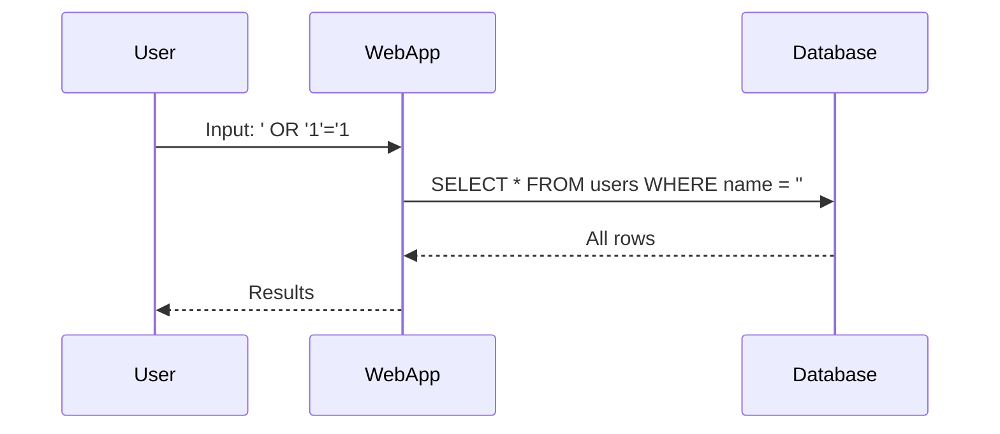
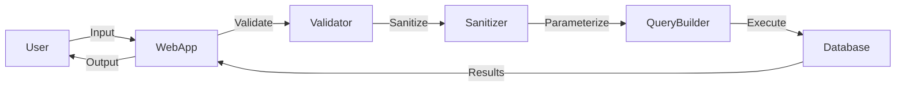

## Introduction to SQL Injection

SQL Injection is one of the most prevalent and dangerous types of vulnerabilities in web applications. It occurs when an attacker manipulates the input data to inject malicious SQL commands into a query, thereby altering the intended behavior of the application. This can lead to unauthorized access to sensitive data, data corruption, or even complete compromise of the database.

### What is SQL Injection?

SQL Injection is a code injection technique used to exploit vulnerabilities in web applications that use SQL databases. An attacker can insert malicious SQL statements into an entry field for execution by the backend database. This can result in unauthorized access to sensitive data, data manipulation, or even complete control over the database.

#### Why Does SQL Injection Matter?

SQL Injection is critical because it can lead to severe consequences such as:

- **Data Theft**: Attackers can extract sensitive information like passwords, credit card numbers, and personal data.
- **Data Manipulation**: Attackers can modify or delete data within the database.
- **Unauthorized Access**: Attackers can gain administrative privileges and perform actions that should be restricted.

### How Does SQL Injection Work?

To understand SQL Injection, let's consider a simple example. Suppose we have a login form where users enter their username and password. The application might construct an SQL query like this:

```sql
SELECT * FROM users WHERE username = 'user_input' AND password = 'password_input';
```

If the application does not properly sanitize the user input, an attacker could inject malicious SQL code. For instance, if the attacker inputs `username` as `' OR '1'='1` and `password` as `' OR '1'='1`, the query becomes:

```sql
SELECT * FROM users WHERE username = '' OR '1'='1' AND password = '' OR '1'='1';
```

This query will return all rows from the `users` table because the condition `'1'='1'` is always true. Thus, the attacker bypasses authentication.

### Real-World Examples of SQL Injection

#### Recent CVEs and Breaches

One notable example is the 2017 Equifax breach, where attackers exploited a vulnerability in Apache Struts, leading to the exposure of sensitive data of over 143 million individuals. The vulnerability was due to improper input validation, allowing SQL Injection attacks.

Another example is the 2019 Capital One breach, where an attacker exploited a misconfigured server to access sensitive customer data. Although not primarily an SQL Injection attack, the breach highlights the importance of proper input validation and secure coding practices.

### General Principle of SQL Injection

The fundamental principle behind SQL Injection is the lack of proper input validation and sanitization. When user input is directly included in SQL queries without being sanitized, it can be manipulated to alter the query's logic.

#### Example Code Without Sanitization

Consider the following TypeScript code snippet that constructs an SQL query based on user input:

```typescript
const userInput = req.body.criteria;
const sqlQuery = `SELECT * FROM users WHERE name = '${userInput}'`;
```

Here, `userInput` is directly inserted into the SQL query. If an attacker inputs `name = ' OR '1'='1`, the query becomes:

```sql
SELECT * FROM users WHERE name = '' OR '1'='1';
```

This query will return all rows from the `users` table, bypassing any intended restrictions.

### How to Prevent SQL Injection

Preventing SQL Injection requires a combination of proper input validation, parameterized queries, and secure coding practices.

#### Parameterized Queries

Parameterized queries ensure that user input is treated as data rather than executable code. This prevents attackers from injecting malicious SQL commands.

##### Example with Parameterized Query

Let's rewrite the previous TypeScript code using parameterized queries:

```typescript
const userInput = req.body.criteria;
const sqlQuery = `SELECT * FROM users WHERE name = ?`;
const params = [userInput];
```

In this example, `?` acts as a placeholder for the user input, and the `params` array contains the actual value. The database driver ensures that the input is properly escaped and treated as data.

#### Input Validation

Input validation ensures that user input conforms to expected formats and constraints. This can help prevent SQL Injection by rejecting invalid input.

##### Example with Input Validation

```typescript
const userInput = req.body.criteria;

if (!isValidInput(userInput)) {
    throw new Error('Invalid input');
}

function isValidInput(input: string): boolean {
    // Implement validation logic
    return /^[a-zA-Z0-9]+$/.test(input);
}
```

In this example, `isValidInput` function checks if the input matches a regular expression that allows only alphanumeric characters.

### Secure Coding Practices

Secure coding practices involve writing code that is resilient to attacks and follows best practices for security.

#### Example of Secure Code

```typescript
const userInput = req.body.criteria;

// Validate input
if (!isValidInput(userInput)) {
    throw new Error('Invalid input');
}

// Use parameterized query
const sqlQuery = `SELECT * FROM users WHERE name = ?`;
const params = [userInput];

// Execute query
db.query(sqlQuery, params, (err, results) => {
    if (err) {
        console.error(err);
        return;
    }
    console.log(results);
});
```

In this example, the code first validates the input and then uses a parameterized query to execute the SQL statement.

### Detection and Prevention

Detecting and preventing SQL Injection involves both proactive measures and reactive techniques.

#### Detection

Detection involves monitoring and analyzing logs for suspicious activity. Tools like intrusion detection systems (IDS) can help identify potential SQL Injection attempts.

##### Example of IDS Configuration

```json
{
    "rules": [
        {
            "id": "sql-injection",
            "description": "Detects SQL Injection attempts",
            "pattern": "' OR '1'='1",
            "action": "alert"
        }
    ]
}
```

In this example, the IDS rule detects the pattern `' OR '1'='1` and triggers an alert.

#### Prevention

Prevention involves implementing secure coding practices, using parameterized queries, and validating user input.

##### Example of Secure Configuration

```json
{
    "security": {
        "inputValidation": true,
        "parameterizedQueries": true
    }
}
```

In this example, the configuration ensures that input validation and parameterized queries are enabled.

### Conclusion

SQL Injection is a serious vulnerability that can lead to significant security risks. By understanding the principles behind SQL Injection and implementing proper input validation, parameterized queries, and secure coding practices, developers can effectively prevent such attacks.

### Practice Labs

For hands-on practice with SQL Injection, consider the following labs:

- **PortSwigger Web Security Academy**: Offers interactive labs to learn about various web security vulnerabilities, including SQL Injection.
- **OWASP Juice Shop**: A deliberately insecure web application for practicing web security skills.
- **DVWA (Damn Vulnerable Web Application)**: A PHP/MySQL web application that demonstrates common web application vulnerabilities.

These labs provide practical experience in identifying and fixing SQL Injection vulnerabilities.

### Diagrams

#### Sequence Diagram for SQL Injection



This sequence diagram illustrates the flow of a SQL Injection attack, where the user input is directly included in the SQL query, resulting in unauthorized access to all rows in the database.

#### Architecture Diagram for Secure Application



This architecture diagram shows the flow of a secure application, where user input is validated, sanitized, and parameterized before being executed against the database.

### Summary

SQL Injection is a critical vulnerability that can lead to severe consequences. By understanding the principles behind SQL Injection and implementing proper input validation, parameterized queries, and secure coding practices, developers can effectively prevent such attacks. Hands-on practice through labs and tools can further enhance understanding and proficiency in securing web applications.

---
<!-- nav -->
[[DevSecOps/DevSecOps Bootcamp/05-Application Security Testing/13-Vulnerability Management and Remediation/Fix Security Issues Discovered in the DevSecOps Pipeline/02-Introduction to SQL Injection and Parameterized Queries|Introduction to SQL Injection and Parameterized Queries]] | [[DevSecOps/DevSecOps Bootcamp/05-Application Security Testing/13-Vulnerability Management and Remediation/Fix Security Issues Discovered in the DevSecOps Pipeline/00-Overview|Overview]] | [[04-Introduction to Vulnerability Management and Remediation in DevSecOps Part 1|Introduction to Vulnerability Management and Remediation in DevSecOps Part 1]]
