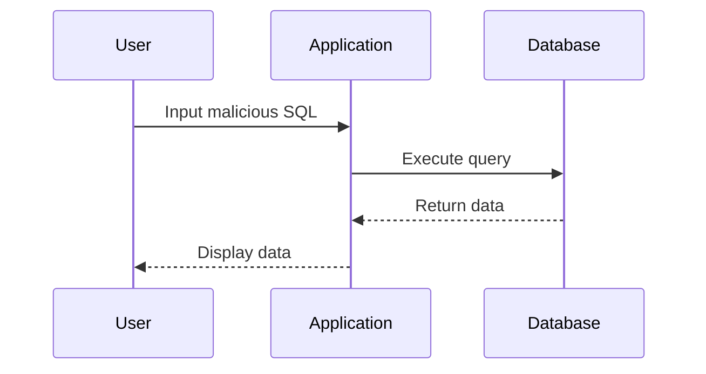

## Introduction to Vulnerability Management and Remediation in DevSecOps

Vulnerability management and remediation are critical components of the DevSecOps pipeline. This process involves identifying, analyzing, prioritizing, and fixing security vulnerabilities within an application. The goal is to ensure that the application remains secure throughout its lifecycle, from development to deployment and maintenance.

### Key Concepts

#### DevSecOps Pipeline
The DevSecOps pipeline integrates security practices into the continuous integration and continuous delivery (CI/CD) processes. This ensures that security is not an afterthought but is embedded at every stage of the software development lifecycle (SDLC).

#### Scanning Steps
Scanning steps are automated checks performed during the build and test phases of the pipeline. These scans identify potential security vulnerabilities such as code weaknesses, misconfigurations, and dependencies with known vulnerabilities.

#### Defect Dojo
Defect Dojo is an open-source platform designed to manage and track security vulnerabilities. It allows teams to import scan results, create dashboards, and provide visibility into security issues for developers.

### Visualizing and Analyzing Findings

Once the pipeline has identified security issues, the next step is to visualize and analyze these findings. This involves:

- **Importing Reports**: Automatically importing scan results into Defect Dojo.
- **Creating Dashboards**: Making dashboards available for developers to view and analyze the issues.
- **Analyzing Findings**: Helping developers understand the nature and severity of the vulnerabilities.

### Fixing Security Issues

The responsibility of fixing security issues lies primarily with the developers. However, as a DevSecOps engineer, you play a crucial role in guiding and supporting them. Here’s how you can assist:

1. **Explain Vulnerabilities**: Provide detailed explanations of Common Weakness Enumerations (CWEs) and how they manifest in the code.
2. **Guide Analysis**: Help developers understand the reports and dig deeper into each finding.
3. **Provide Solutions**: Offer guidance on how to fix the issues and improve the application's security posture.

### Hands-On Example: Fixing a SQL Injection Vulnerability

Let's walk through a practical example of fixing a SQL injection vulnerability using a real-world scenario.

#### Background Theory

SQL injection is a common vulnerability where an attacker injects malicious SQL statements into an input field to manipulate the database. This can lead to unauthorized access, data theft, or even complete system compromise.

#### Real-World Example

Consider a recent breach where a SQL injection vulnerability was exploited to steal sensitive user data. The vulnerability was present in a login form where user inputs were not properly sanitized.

#### Vulnerable Code

```python
# Vulnerable code snippet
def login(username, password):
    conn = sqlite3.connect('database.db')
    cursor = conn.cursor()
    query = f"SELECT * FROM users WHERE username='{username}' AND password='{password}'"
    cursor.execute(query)
    result = cursor.fetchone()
    if result:
        return True
    else:
        return False
```

#### Explanation of the Vulnerability

In the above code, the `username` and `password` variables are directly concatenated into the SQL query string. An attacker could input something like `'; DROP TABLE users; --` to execute arbitrary SQL commands.

#### Secure Code

To prevent SQL injection, parameterized queries should be used. This ensures that user inputs are treated as data rather than executable code.

```python
# Secure code snippet
def login(username, password):
    conn = sqlite3.connect('database.db')
    cursor = conn.cursor()
    query = "SELECT * FROM users WHERE username=? AND password=?"
    cursor.execute(query, (username, password))
    result = cursor.fetchone()
    if result:
        return True
    else:
        return False
```

#### How to Prevent / Defend

1. **Use Parameterized Queries**: Always use parameterized queries to separate SQL logic from user inputs.
2. **Input Validation**: Validate and sanitize all user inputs to ensure they meet expected formats.
3. **Least Privilege Principle**: Ensure that database connections are made with the least privileges necessary to perform the required operations.
4. **Regular Audits**: Conduct regular security audits and penetration testing to identify and mitigate vulnerabilities.

### Mermaid Diagram: SQL Injection Attack Chain



### Complete Example: Full HTTP Request and Response

#### HTTP Request

```http
POST /login HTTP/1.1
Host: example.com
Content-Type: application/x-www-form-urlencoded

username=admin&password=' OR '1'='1
```

#### HTTP Response

```http
HTTP/1.1 200 OK
Content-Type: text/html

<!DOCTYPE html>
<html>
<head>
    <title>Login</title>
</head>
<body>
    <h1>Welcome, admin!</h1>
</body>
</html>
```

### Common Mistakes and Pitfalls

1. **Ignoring Low-Priority Vulnerabilities**: Even low-priority vulnerabilities can be chained together to create significant risks.
2. **Overlooking Third-Party Dependencies**: Many vulnerabilities arise from outdated or insecure third-party libraries.
3. **Manual Fixes Only**: Relying solely on manual fixes without automating the process can lead to inconsistencies and missed vulnerabilities.

### Detection and Prevention Strategies

1. **Automated Scanning Tools**: Use tools like OWASP ZAP, Burp Suite, and static analysis tools like SonarQube.
2. **Continuous Monitoring**: Implement continuous monitoring to detect and respond to security incidents in real-time.
3. **Security Training**: Regularly train developers on secure coding practices and the latest security threats.

### Hands-On Labs

For hands-on practice, consider the following labs:

- **PortSwigger Web Security Academy**: Offers interactive labs to practice identifying and fixing various web application vulnerabilities.
- **OWASP Juice Shop**: A deliberately insecure web application for practicing web security skills.
- **DVWA (Damn Vulnerable Web Application)**: Another intentionally vulnerable web app for learning and testing security measures.

By integrating these practices into your DevSecOps pipeline, you can significantly enhance the security of your applications and reduce the risk of vulnerabilities being exploited.

---
<!-- nav -->
[[05-Introduction to Vulnerability Management and Remediation in DevSecOps Part 2|Introduction to Vulnerability Management and Remediation in DevSecOps Part 2]] | [[DevSecOps/DevSecOps Bootcamp/05-Application Security Testing/13-Vulnerability Management and Remediation/Fix Security Issues Discovered in the DevSecOps Pipeline/00-Overview|Overview]] | [[07-Understanding the Context of Vulnerability Management and Remediation|Understanding the Context of Vulnerability Management and Remediation]]
