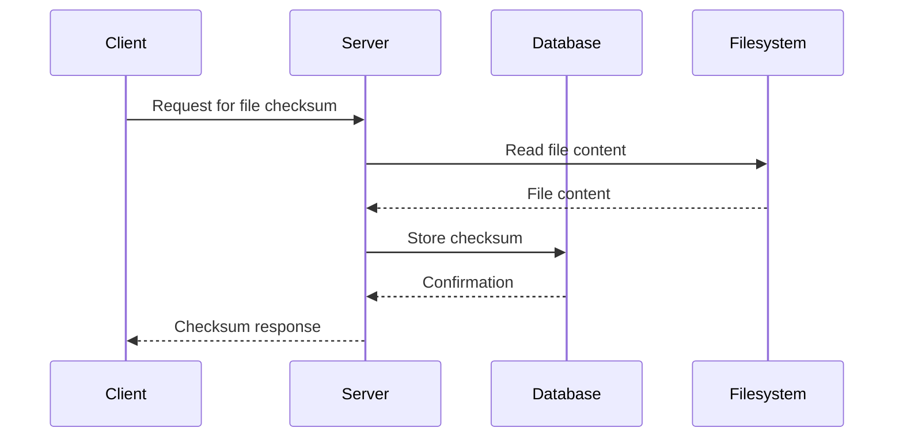

## Understanding the Context of Vulnerability Management and Remediation

In the realm of DevSecOps, vulnerability management and remediation are critical components that ensure the security and integrity of software applications throughout their lifecycle. This chapter delves into the process of identifying and fixing security issues discovered during the DevSecOps pipeline, focusing on a specific example involving weak cryptography.

### Identifying Security Issues

Security tools like NGS (Networked Global Services) scans help identify vulnerabilities within an application. These scans typically provide detailed findings, including the location of the issue within the codebase and a description of the problem. In this case, the finding points to a specific line in the `grantfile.js` file, where weak cryptography is being used.

#### Code Snippet Analysis

Let's examine the code snippet in question:

```javascript
function createChecksums() {
    const files = fs.readdirSync('dist');
    files.forEach(file => {
        const filePath = path.join('dist', file);
        const fileContent = fs.readFileSync(filePath);
        const checksum = crypto.createHash('md5').update(fileContent).digest('hex');
        fs.writeFileSync(`${filePath}.checksum`, checksum);
    });
}
```

This function reads files from the `dist` directory, computes their MD5 checksums, and writes these checksums to corresponding `.checksum` files. The critical issue here is the use of MD5, which is known to be a weak hash algorithm.

### Weak Cryptography: MD5

MD5 (Message-Digest Algorithm 5) is a widely used cryptographic hash function that produces a 128-bit (16-byte) hash value. However, MD5 is considered cryptographically broken and unsuitable for further use due to its vulnerability to collision attacks.

#### Collision Attacks

A collision attack occurs when two different inputs produce the same hash output. For MD5, researchers have demonstrated that it is possible to generate collisions, meaning that two distinct files can have the same MD5 checksum. This makes MD5 unreliable for ensuring data integrity and security.

#### Real-World Examples

Several high-profile breaches and vulnerabilities have been linked to the use of weak cryptographic algorithms like MD5. For instance:

- **CVE-2017-7465**: A vulnerability in the Apache Struts framework allowed attackers to exploit a deserialization flaw due to the use of weak cryptography.
- **CVE-2019-14882**: A vulnerability in the Jenkins Continuous Integration server allowed attackers to bypass authentication due to the use of weak cryptographic hashes.

These examples highlight the importance of using strong cryptographic algorithms to prevent such vulnerabilities.

### Stronger Alternatives

To address the vulnerability, we need to replace MD5 with a stronger hash algorithm. Common alternatives include SHA-256 and SHA-512, which are more resistant to collision attacks.

#### SHA-256 Example

Here’s how we can modify the code to use SHA-256 instead of MD5:

```javascript
function createChecksums() {
    const files = fs.readdirSync('dist');
    files.forEach(file => {
        const filePath = path.join('dist', file);
        const fileContent = fs.readFileSync(filePath);
        const checksum = crypto.createHash('sha256').update(fileContent).digest('hex');
        fs.writeFileSync(`${filePath}.checksum`, checksum);
    });
}
```

By switching to SHA-256, we significantly enhance the security of the checksum generation process.

### How to Prevent / Defend

#### Detection

To detect the use of weak cryptographic algorithms, static code analysis tools can be employed. These tools scan the codebase for instances where weak algorithms are used and flag them for review.

#### Prevention

Preventing the use of weak cryptographic algorithms involves several steps:

1. **Code Review**: Regularly review code changes to ensure that strong cryptographic algorithms are used.
2. **Security Policies**: Implement security policies that mandate the use of strong cryptographic algorithms.
3. **Automated Scanning**: Use automated scanning tools to detect and alert on the use of weak cryptographic algorithms.

#### Secure Coding Practices

Secure coding practices involve using strong cryptographic algorithms and ensuring that the code is free from known vulnerabilities. Here’s a comparison of the vulnerable and secure versions of the code:

**Vulnerable Version:**

```javascript
function createChecksums() {
    const files = fs.readdirSync('dist');
    files.forEach(file => {
        const filePath = path.join('dist', file);
        const fileContent = fs.readFileSync(filePath);
        const checksum = crypto.createHash('md5').update(fileContent).digest('hex');
        fs.writeFileSync(`${filePath}.checksum`, checksum);
    });
}
```

**Secure Version:**

```javascript
function createChecksums() {
    const files = fs.readdirSync('dist');
    files.forEach(file => {
        const filePath = path.join('dist', file);
        const fileContent = fs.readFileSync(filePath);
        const checksum = crypto.createHash('sha256').update(fileContent).digest('hex');
        fs.writeFileSync(`${filePath}.checksum`, checksum);
    });
}
```

### Network Topology and Request/Response Flow

To visualize the flow of requests and responses in this context, consider the following mermaid diagram:



This diagram illustrates the sequence of events when a client requests a file checksum, and the server processes the request by reading the file content, computing the checksum, and storing it in the database.

### Hands-On Labs

For practical experience in vulnerability management and remediation, consider the following labs:

- **PortSwigger Web Security Academy**: Offers interactive labs to practice identifying and fixing security vulnerabilities.
- **OWASP Juice Shop**: A deliberately insecure web application for practicing web security skills.
- **DVWA (Damn Vulnerable Web Application)**: A PHP/MySQL web application that is riddled with vulnerabilities for educational purposes.

These labs provide real-world scenarios to apply the concepts learned in this chapter.

### Conclusion

Understanding and addressing vulnerabilities in the DevSecOps pipeline is crucial for maintaining the security and integrity of software applications. By identifying and fixing issues related to weak cryptography, developers can significantly enhance the security posture of their applications. Through detailed analysis, code examples, and practical labs, this chapter aims to provide a comprehensive guide to vulnerability management and remediation.

---
<!-- nav -->
[[06-Introduction to Vulnerability Management and Remediation in DevSecOps|Introduction to Vulnerability Management and Remediation in DevSecOps]] | [[DevSecOps/DevSecOps Bootcamp/05-Application Security Testing/13-Vulnerability Management and Remediation/Fix Security Issues Discovered in the DevSecOps Pipeline/00-Overview|Overview]] | [[08-Vulnerability Management and Remediation in the DevSecOps Pipeline Part 1|Vulnerability Management and Remediation in the DevSecOps Pipeline Part 1]]
