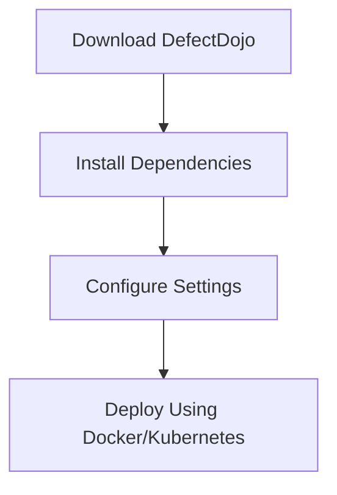
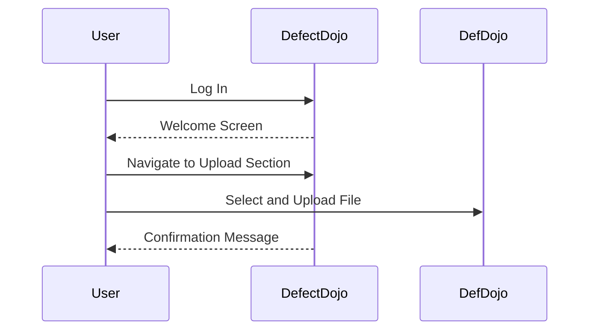

## Introduction to Vulnerability Management and Remediation

Vulnerability management and remediation are critical components of DevSecOps, ensuring that software applications are secure throughout their lifecycle. One key aspect of this process is generating and interpreting security scanning reports. These reports provide detailed information about potential vulnerabilities within an application, allowing teams to take corrective actions promptly.

### Security Scanning Reports

Security scanning reports are generated by various tools that analyze codebases, configurations, and runtime environments for security weaknesses. These tools can identify issues such as SQL injection, cross-site scripting (XSS), buffer overflows, and more. The reports typically contain details about the vulnerabilities found, including their severity, location, and recommended remediation steps.

### DefectDojo: A Centralized Platform for Security Scanning Reports

DefectDojo is a popular open-source platform designed to manage and visualize security scanning reports. It acts as a central repository for storing and displaying findings from various security tools. To effectively use DefectDojo, you need to ensure that it is properly set up and accessible via a web browser.

#### Setting Up DefectDojo

To set up DefectDojo, follow these steps:

1. **Installation**: Download and install DefectDojo from its official repository. Ensure that your system meets the minimum requirements for running the platform.
2. **Configuration**: Configure the necessary settings, such as database connections, user authentication, and API keys.
3. **Deployment**: Deploy DefectDojo using a container orchestration tool like Docker or Kubernetes. This ensures that the platform is scalable and easily manageable.



### Generating Report Files

Once DefectDojo is set up, the next step is to generate report files from various security scanning tools. These tools can include static application security testing (SAST) tools, dynamic application security testing (DAST) tools, and infrastructure as code (IaC) scanners.

#### Example Tools and Their Report Formats

- **SonarQube**: Generates reports in XML or JSON formats.
- **OWASP ZAP**: Produces reports in HTML, XML, or JSON formats.
- **Trivy**: Generates reports in JSON or SARIF formats.

Each tool has its own specific report format, which must be compatible with DefectDojo. DefectDojo supports a wide range of report types, making it versatile for integrating with different security tools.

### Feeding Report Files to DefectDojo

To feed report files to DefectDojo, you need to upload them through the platform’s user interface or via API calls. DefectDojo will then parse the reports and display the findings in a structured manner.

#### Uploading Reports via User Interface

1. **Log In**: Access DefectDojo via a web browser and log in with your credentials.
2. **Navigate to Upload Section**: Go to the section where you can upload report files.
3. **Select and Upload File**: Choose the report file from your local machine and upload it.



#### Uploading Reports via API

Alternatively, you can automate the process by using DefectDojo’s API to programmatically upload report files. This is particularly useful in continuous integration/continuous deployment (CI/CD) pipelines.

```bash
curl -X POST -H "Authorization: Token <your_api_token>" -F "file=@path/to/report/file.json" http://defectdojo/api/v2/import-scan/
```

### Interpreting Scan Results in DefectDojo

Once the report files are uploaded, DefectDojo will display the scan results in a user-friendly interface. Each finding includes details such as the vulnerability type, severity, affected code, and recommended remediation steps.

#### Example of a Scan Result

Consider a scan result from SonarQube indicating a high-severity SQL injection vulnerability:

```json
{
  "issue": {
    "key": "SQ123",
    "type": "BUG",
    "severity": "MAJOR",
    "component": "com.example.app",
    "line": 42,
    "message": "SQL Injection vulnerability detected",
    "remediation": "Use parameterized queries"
  }
}
```

### Integrating with CI/CD Pipelines

To streamline the process of generating and uploading report files, you can integrate DefectDojo with CI/CD pipelines using tools like GitLab CI/CD.

#### Using Artifacts in GitLab CI/CD

GitLab CI/CD allows jobs to produce artifacts, which are files or directories that are made available after the build is completed. These artifacts can be used to store and upload security report files.

```yaml
stages:
  - build
  - test
  - report

build_job:
  stage: build
  script:
    - echo "Building the application..."
  artifacts:
    paths:
      - build/

test_job:
  stage: test
  script:
    - echo "Running security tests..."
    - sonar-scanner
  artifacts:
    paths:
      - sonar-report.xml

report_job:
  stage: report
  script:
    - curl -X POST -H "Authorization: Token <your_api_token>" -F "file=@sonar-report.xml" http://defectdojo/api/v2/import-scan/
```

### Real-World Examples and Recent Breaches

Recent breaches have highlighted the importance of effective vulnerability management. For instance, the SolarWinds breach (CVE-2020-1014) involved a supply chain attack where malicious code was injected into the SolarWinds Orion software. This underscores the need for comprehensive security scanning and timely remediation.

### How to Prevent / Defend

#### Detection

Regularly run security scans using tools like SonarQube, OWASP ZAP, and Trivy. Integrate these scans into your CI/CD pipelines to ensure that vulnerabilities are identified early in the development cycle.

#### Prevention

Implement secure coding practices and follow the principle of least privilege. Use automated tools to enforce coding standards and detect vulnerabilities.

#### Secure Coding Fixes

Compare the vulnerable code with the secure version:

**Vulnerable Code:**
```python
import sqlite3

def get_user_data(user_id):
    conn = sqlite3.connect('database.db')
    cursor = conn.cursor()
    query = f"SELECT * FROM users WHERE id = {user_id}"
    cursor.execute(query)
    return cursor.fetchall()
```

**Secure Code:**
```python
import sqlite3

def get_user_data(user_id):
    conn = sqlite3.connect('database.db')
    cursor = conn.cursor()
    query = "SELECT * FROM users WHERE id = ?"
    cursor.execute(query, (user_id,))
    return cursor.fetchall()
```

### Conclusion

Effective vulnerability management and remediation are essential for maintaining the security of software applications. By leveraging tools like DefectDojo and integrating them with CI/CD pipelines, teams can ensure that vulnerabilities are identified and addressed promptly. Regular security scans, secure coding practices, and timely remediation are key to preventing breaches and ensuring the integrity of applications.

### Practice Labs

For hands-on practice with vulnerability management and remediation, consider the following labs:

- **PortSwigger Web Security Academy**: Offers interactive labs for learning web security concepts and techniques.
- **OWASP Juice Shop**: A deliberately insecure web application for practicing web security skills.
- **GitLab CI/CD**: Use GitLab’s CI/CD features to integrate security scanning into your pipelines.

By combining theoretical knowledge with practical experience, you can become proficient in managing and remediating vulnerabilities in software applications.

---
<!-- nav -->
[[DevSecOps/DevSecOps Bootcamp/05-Application Security Testing/13-Vulnerability Management and Remediation/Generate Security Scanning Reports/01-Introduction to Security Scanning Reports in DevSecOps|Introduction to Security Scanning Reports in DevSecOps]] | [[DevSecOps/DevSecOps Bootcamp/05-Application Security Testing/13-Vulnerability Management and Remediation/Generate Security Scanning Reports/00-Overview|Overview]] | [[03-Introduction to Vulnerability Management and Remediation Part 2|Introduction to Vulnerability Management and Remediation Part 2]]
